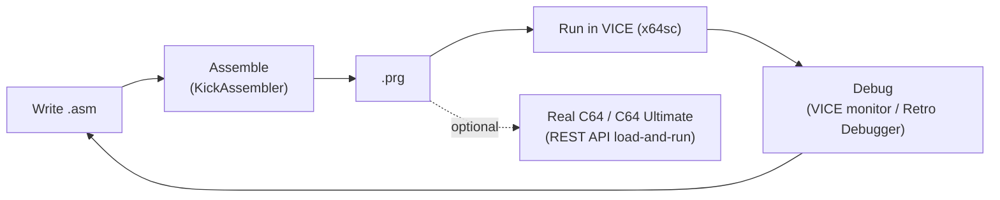
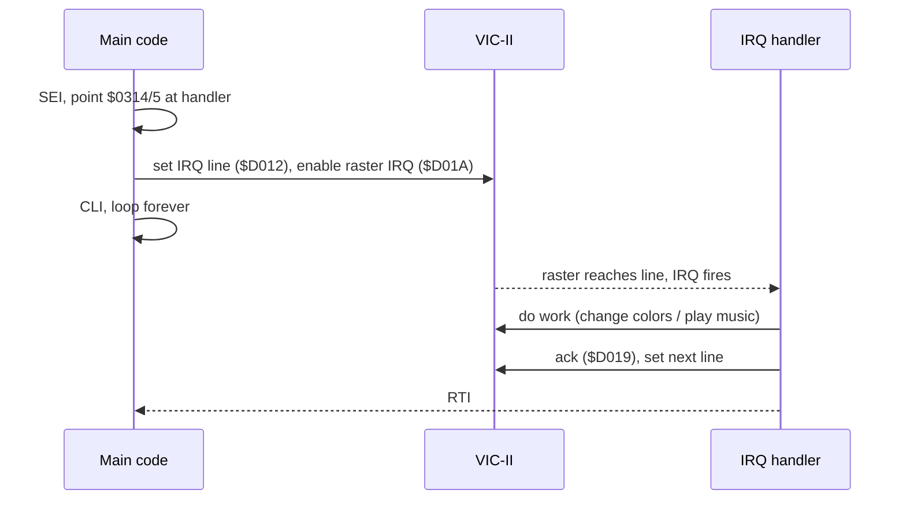

# Getting Started

Goal: go from nothing to **"my code runs on a (emulated) C64"** in one sitting,
then know where to go next. This assumes assembly (the demoscene/game path); if
you'd rather start in BASIC, jump to [Part V](part-5-basic.md) and just type into
an emulator.

## The development loop



## 1. Install the essentials

| Need | Pick | Get it |
|------|------|--------|
| Emulator | **VICE** (use `x64sc` for accuracy) | https://vice-emu.sourceforge.io/ |
| Assembler | **KickAssembler** (Java) — used throughout this curriculum | https://theweb.dk/KickAssembler/Main.html |
| Editor | VS Code + a KickAss/C64 extension | marketplace |

(Full tool rundown and alternatives — cc65/llvm-mos/oscar64, debuggers, graphics
and music tools — are in [Toolchain](toolchain.md).)

## 2. Your first program

A classic: change the border/background colors and print a message. All examples
in this curriculum use **KickAssembler** (`//` comments, `*=` segments, built-in
macros) so the syntax is consistent from here on:

```asm
// hello.asm  —  assemble:  java -jar KickAss.jar hello.asm
        BasicUpstart2(start)      // emits a "10 SYS <start>" stub at $0801

start:  lda #$00
        sta $d020                 // border     -> black
        sta $d021                 // background  -> black

        ldx #$00
loop:   lda message,x
        beq done
        jsr $ffd2                 // KERNAL CHROUT: print char in A
        inx
        bne loop
done:   rts

         .encoding "petscii_mixed" // .text defaults to SCREEN CODES; CHROUT wants PETSCII
message: .text "hello c64"
         .byte 13, 0              // 13 = carriage return, 0 = terminator
```

Build and run:

```sh
java -jar KickAss.jar hello.asm   # produces hello.prg
x64sc hello.prg
```

> Why the stub? A `.prg` loads at the address in its first two bytes
> (`$0801` = start of BASIC). `BasicUpstart2(start)` emits a one-line BASIC
> program — `10 SYS <addr>` — so when the C64 autostarts/`RUN`s it, BASIC hands
> control to your machine code. This is the standard way every C64 program
> launches, and KickAss assembles the stub for you instead of hand-poking bytes.
> The `.prg` layout itself — that 2-byte load address and what follows — is
> dissected in [Appendix J](appendix-j-prg-format.md).

KickAssembler is far more than an assembler — it has a full scripting language
inside it (loops, functions, math, importing & converting graphics/SID at
assemble time) and emits VICE debug symbols. That power is why it's the
demoscene standard; the later parts lean on it heavily.

## 3. Add a raster interrupt (the gateway to everything)

Once color-poking works, the next milestone is a **raster interrupt** — the
foundation of nearly every effect and every game loop. The flow:



Don't write this from scratch yet — follow **Dustlayer's interrupt episode**
(linked below); it walks each line. Then read [Part III](part-3-vic.md) for *why*
stable timing matters.

## 4. Where to go next

| You want to… | Read |
|--------------|------|
| Understand the CPU you're coding | [Part I](part-1-foundations.md) |
| Make graphics, sprites, raster effects | [Part III · VIC-II](part-3-vic.md) |
| Make sound/music | [Part IV](part-4-sid.md) |
| Build a game | [Part VI](part-6-game.md) |
| Set up a serious toolchain | [Toolchain](toolchain.md) |
| Deploy to real hardware | [C64 Ultimate](c64-ultimate.md) |

## Recommended tutorial series (the best on-ramps)

- **[Dustlayer](https://dustlayer.com/)** — the gentlest beginner series:
  screen setup, sprites, **interrupts**, and a complete "first intro." Start here.
- **[ChibiAkumas — 6510 for the C64](https://www.chibiakumas.com/6502/c64.php)** —
  structured lesson series with videos; broad 6502 coverage across many machines.
- **[nurpax — BINTRIS on the C64](https://nurpax.github.io/posts/2018-05-19-bintris-on-c64-part-1.html)**
  — building a real, polished game in assembly with a modern toolchain.
- **[Linus Åkesson — Programming C-64 Demos](https://www.antimon.org/code/Linus/)**
  — when you're ready to think like a demo coder.
- **[Codebase64](https://codebase64.c64.org/)** — not a course, but the reference
  you'll have open forever.
