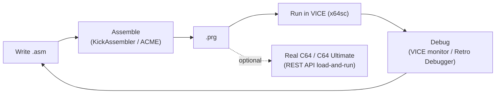

# Getting Started

Goal: go from nothing to **"my code runs on a (emulated) C64"** in one sitting,
then know where to go next. This assumes assembly (the demoscene/game path); if
you'd rather start in BASIC, jump to [basic-v2.md](basic-v2.md) and just type into
an emulator.

## The development loop



## 1. Install the essentials

| Need | Pick | Get it |
|------|------|--------|
| Emulator | **VICE** (use `x64sc` for accuracy) | https://vice-emu.sourceforge.io/ |
| Assembler | **KickAssembler** (Java) or **ACME** | https://theweb.dk/KickAssembler/Main.html · https://sourceforge.net/projects/acme-crossass/ |
| Editor | VS Code + a KickAss/C64 extension | marketplace |

(Full tool rundown and alternatives — cc65/llvm-mos/oscar64, debuggers, graphics
and music tools — are in [toolchain.md](toolchain.md).)

## 2. Your first program

A classic: change the border/background colors and print a message. **ACME**
syntax (smallest to get running):

```asm
; hello.asm  —  assemble:  acme -f cbm -o hello.prg hello.asm
        * = $0801                 ; BASIC start address (PRG load addr)

        ; --- a one-line BASIC stub: "10 SYS 2064" ---
        !byte $0c,$08,$0a,$00,$9e,$32,$30,$36,$34,$00,$00,$00

        * = $0810                 ; 2064 — where SYS jumps
start:  lda #$00
        sta $d020                 ; border  -> black
        sta $d021                 ; background -> black

        ldx #$00
loop:   lda message,x
        beq done
        jsr $ffd2                 ; KERNAL CHROUT: print char in A
        inx
        bne loop
done:   rts

message: !scr "hello c64",13,0    ; !scr = screen codes; 13 = newline
```

Build and run:

```sh
acme -f cbm -o hello.prg hello.asm
x64sc hello.prg
```

> Why the BASIC stub? A `.prg` loads at the address in its first two bytes
> (`$0801` = start of BASIC). The 12 bytes encode `10 SYS 2064`, so when the C64
> autostarts/`RUN`s it, BASIC hands control to your machine code at `$0810`
> (2064). This is the standard way every C64 program launches.

With **KickAssembler** the same idea, but it has a built-in `BasicUpstart2` macro
so you don't hand-assemble the stub:

```asm
        :BasicUpstart2(start)     // emits the SYS stub automatically
        * = $0810
start:  lda #$00
        sta $d020
        sta $d021
        rts
```

## 3. Add a raster interrupt (the gateway to everything)

Once color-poking works, the next milestone is a **raster interrupt** — the
foundation of nearly every effect and every game loop. The flow:

```mermaid
sequenceDiagram
    participant Main as Main code
    participant VIC as VIC-II
    participant IRQ as IRQ handler
    Main->>Main: SEI; point $0314/5 at handler
    Main->>VIC: set IRQ line ($D012), enable raster IRQ ($D01A)
    Main->>Main: CLI; loop forever
    VIC-->>IRQ: raster reaches line → IRQ fires
    IRQ->>VIC: do work (change colors / play music)
    IRQ->>VIC: ack ($D019), set next line
    IRQ-->>Main: RTI
```

Don't write this from scratch yet — follow **Dustlayer's interrupt episode**
(linked below); it walks each line. Then read [vic-ii.md](vic-ii.md) for *why*
stable timing matters.

## 4. Where to go next

| You want to… | Read |
|--------------|------|
| Understand the CPU you're coding | [cpu-6510.md](cpu-6510.md) |
| Make graphics, sprites, raster effects | [vic-ii.md](vic-ii.md) → [demoscene-effects.md](demoscene-effects.md) |
| Make sound/music | [sid.md](sid.md) |
| Build a game | [game-dev-patterns.md](game-dev-patterns.md) |
| Set up a serious toolchain | [toolchain.md](toolchain.md) |
| Deploy to real hardware | [c64-ultimate.md](c64-ultimate.md) |

## Recommended tutorial series (the best on-ramps)

- **[Dustlayer](https://dustlayer.com/)** — the gentlest beginner series:
  screen setup, sprites, **interrupts**, and a complete "first intro." Start here.
- **[ChibiAkumas — 6510 for the C64](https://www.chibiakumas.com/6502/c64.php)** —
  structured lesson series with videos; broad 6502 coverage across many machines.
- **[nurpax — BINTRIS on the C64](https://nurpax.github.io/posts/2018-05-19-bintris-on-c64-part-1.html)**
  — building a real, polished game in assembly with a modern toolchain.
- **[Linus Åkesson — Programming C-64 Demos](https://www.antimon.org/code/Linus/)**
  — when you're ready to think like a demo coder.
- **[Codebase64](https://codebase64.c64.org/)** — not a course, but the reference
  you'll have open forever.
