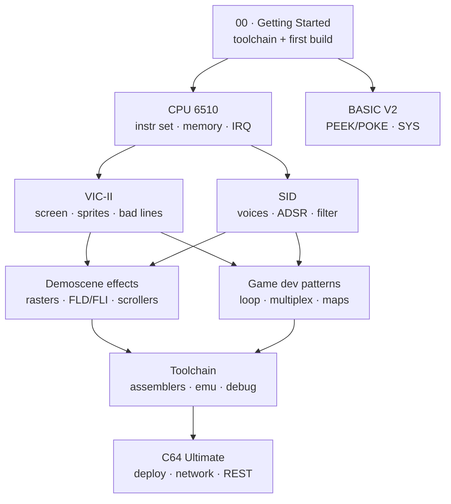

# C64 Programming Resource Library

A curated reference library for Commodore 64 development with a **demoscene and
game-development** focus, covering both the **classic C64** and the modern
**C64 Ultimate / Ultimate-64**. Each topic file pairs short *starter notes*
(synthesized so you can get oriented fast) with an *annotated list of the best
sources* (so you know where to dig deeper and why).

> Scope: assembly **and** BASIC; the 6510 CPU, the VIC-II video chip, and the
> SID sound chip; classic demoscene effects; game architecture; the modern
> cross-development toolchain; and what's new on the C64 Ultimate.

## How to use this library

1. **New to the machine?** Start with [`00-getting-started.md`](00-getting-started.md)
   — it gets a cross-assembler + emulator running and walks the first build.
2. **Learning the hardware?** Read the three chip files in order:
   [CPU](cpu-6510.md) → [VIC-II](vic-ii.md) → [SID](sid.md). The C64 *is* its
   chips; understanding the bus timing between CPU and VIC-II is the key that
   unlocks the demoscene.
3. **Building something?** Jump to [game-dev-patterns.md](game-dev-patterns.md)
   or [demoscene-effects.md](demoscene-effects.md).
4. **Targeting modern hardware?** See [c64-ultimate.md](c64-ultimate.md).

## Contents

| File | What it covers |
|------|----------------|
| [00-getting-started.md](00-getting-started.md) | Toolchain setup, your first assembled program, the iteration loop |
| [cpu-6510.md](cpu-6510.md) | 6510/6502 instruction set, addressing, cycle timing, illegal opcodes, memory map, zero page, KERNAL/BASIC ROM, interrupts (IRQ/NMI/raster) |
| [vic-ii.md](vic-ii.md) | VIC-II registers, screen/char/bitmap modes, sprites & multiplexing, bad lines, raster effects, border opening, scrolling |
| [sid.md](sid.md) | SID 6581/8580 registers, voices, waveforms, ADSR, filter, digi playback, trackers, game SFX |
| [basic-v2.md](basic-v2.md) | BASIC V2 limitations, PEEK/POKE, SYS/USR, calling machine code, useful tricks |
| [demoscene-effects.md](demoscene-effects.md) | Catalog of classic effects (rasters, plasma, FLD/FLI, sprite stretch, scrollers, tunnels…) and how they work |
| [game-dev-patterns.md](game-dev-patterns.md) | Main loop, frameskip/interpolation, collision, memory layout, map data, double buffering |
| [toolchain.md](toolchain.md) | Cross-assemblers, C compilers, emulators/debuggers, trackers, graphics/charset editors, build workflows |
| [c64-ultimate.md](c64-ultimate.md) | C64 Ultimate / Ultimate-64 / Ultimate-II+: new dev features, network/streaming, REU, socket & REST APIs |

## The "if you only bookmark five things" shortlist

- **[Codebase64](https://codebase64.c64.org/)** — the community wiki; routines,
  tutorials, effect write-ups, illegal opcodes. Your first stop for "how do I do X".
- **[C64 Programmer's Reference Guide](https://archive.org/details/c64-programmer-ref)**
  — the official 1982/83 manual (BASIC, KERNAL, VIC-II, SID). A local,
  text-searchable copy is in [`reference/`](reference/c64-programmers-reference-guide.pdf).
- **[Mapping the Commodore 64](https://www.zimmers.net/anonftp/pub/cbm/c64/manuals/mapping-c64.txt)**
  — annotated `$0000–$FFFF` memory map.
- **[C64-Wiki](https://www.c64-wiki.com/)** — fast lookups for any register,
  command, or chip.
- **[Christian Bauer's VIC-II article](https://www.cebix.net/VIC-Article.txt)**
  — the canonical reverse-engineering of VIC-II timing; the demoscene bible.

## Provenance / confidence

This library was assembled from a multi-source research pass with adversarial
fact-checking. Hardware facts (CPU/VIC-II/SID/memory-map) rest on primary
sources — manufacturer datasheets, the official Programmer's Reference Guide,
and Christian Bauer's canonical VIC-II reverse-engineering article — and were
verified with high confidence. Tool/version details and the C64 Ultimate
feature set change over time; **link-check and re-verify those before relying on
them**. Where a claim comes from a single (if credible) source, the topic file
notes it.

*Last assembled: 2026-05-29.*
