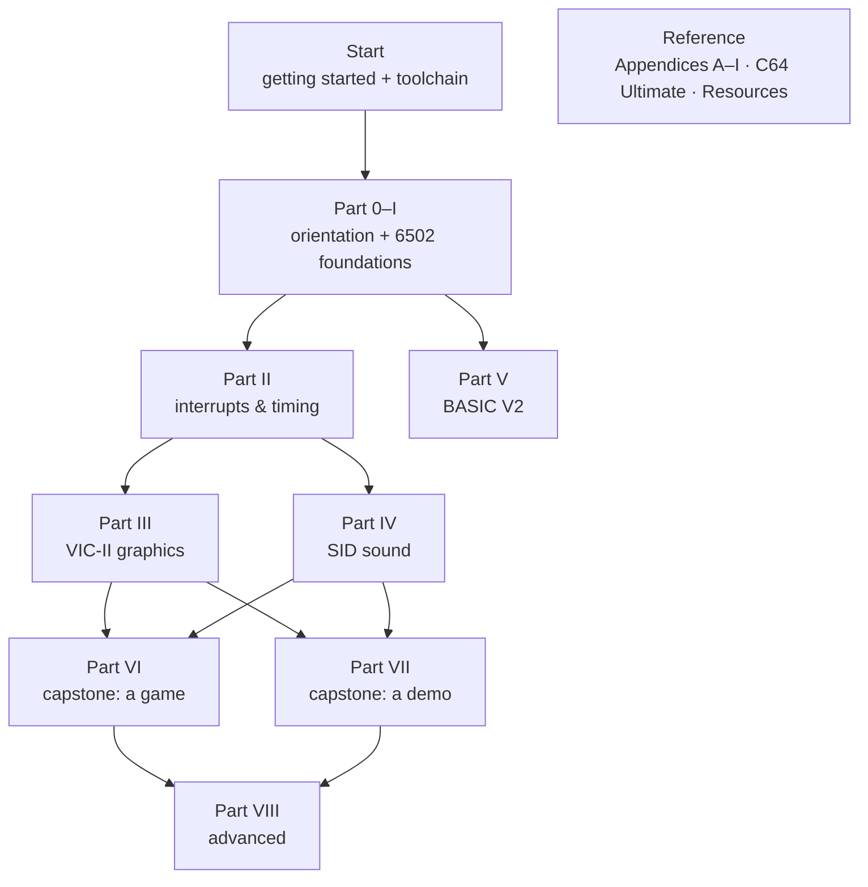

# C64 Dev Library

A self-contained course and reference for **Commodore 64** development with a
**demoscene + game** focus — assembly (KickAssembler) and BASIC, the 6510 CPU,
the VIC-II and SID chips, and the modern **C64 Ultimate**. Every code example is
assembled and run-verified in VICE.

> Read this in the bundled web viewer (`python3 viewer/serve.py`) for navigation,
> Mermaid diagrams, syntax highlighting, and the embedded emulator screenshots.

## How to use it

- **The course** is [`CURRICULUM.md`](CURRICULUM.md) → Parts 0–VIII, read in order.
  New to the machine? Begin at [Getting Started](00-getting-started.md).
- **The reference** is the Appendices (opcodes, registers, memory map, KERNAL,
  PETSCII, timing, glossary) — exhaustive tables the lessons cite.
- **The links** to every external source (Codebase64, datasheets, tools,
  tutorials) live on [Resources & Further Reading](resources.md).

## Contents

**Start** — [Getting Started](00-getting-started.md) · [Toolchain](toolchain.md) · [Curriculum / syllabus](CURRICULUM.md)

**Course** (each Part = lessons with verified KickAssembler code)

| Part | Covers |
|------|--------|
| [0 · Orientation](part-0-orientation.md) | the machine, the dev loop, number systems |
| [I · 6502/6510 Foundations](part-1-foundations.md) | instruction set, addressing, memory/banking, math, tables, optimization, KERNAL |
| [II · Interrupts & Timing](part-2-interrupts.md) | the bus, IRQ/NMI, raster & stable raster, CIA timers, input |
| [III · VIC-II Graphics](part-3-vic.md) | text/bitmap modes, scrolling, sprites, multiplexing, bad lines, raster effects |
| [IV · SID Sound](part-4-sid.md) | registers, waveforms, ADSR, filter, players, GoatTracker, SFX, digi |
| [V · BASIC V2](part-5-basic.md) | the language, PEEK/POKE/SYS/USR, BASIC+ML hybrids, tricks |
| [VI · Capstone: a Game](part-6-game.md) | *Gem Catcher* — a complete playable game, start to finish |
| [VII · Capstone: a Demo](part-7-demo.md) | a complete intro — raster bars, logo, sprites, scroller, music |
| [VIII · Advanced](part-8-advanced.md) | LUT math, RAM under ROMs, loaders, PAL/NTSC, the C64 Ultimate |

**Reference**

| Page | What |
|------|------|
| [Appendix A](appendix-a-opcodes.md)–[I](appendix-i-glossary.md) | opcodes · memory map · VIC-II / SID / CIA registers · KERNAL & BASIC · PETSCII · timing · glossary |
| [C64 Ultimate](c64-ultimate.md) | the modern FPGA C64 — features, expansions, UCI & REST APIs |
| [Resources & Further Reading](resources.md) | the annotated external link directory |

## Provenance / confidence

The reference rests on primary sources — manufacturer datasheets, the official
Programmer's Reference Guide (local copy in [`reference/`](reference/c64-programmers-reference-guide.pdf)),
and Christian Bauer's canonical VIC-II article — adversarially fact-checked.
**Every code example was assembled and run in VICE** (screenshot- or
register-asserted), not just eyeballed. Tool versions and the C64 Ultimate
feature set change over time — re-verify those before relying on them.

*Built 2026-05-29.*
