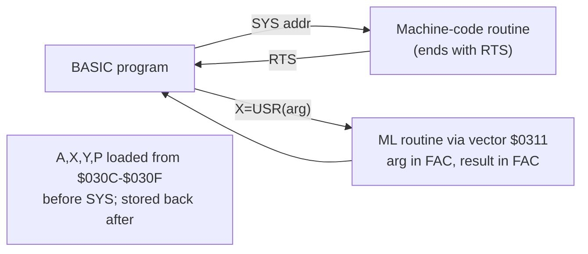

# BASIC V2 Programming

The C64 shipped with **Commodore BASIC V2.0** in ROM (`$A000–$BFFF`). It's
famously bare — no sound or graphics commands at all — so C64 BASIC programming
is largely about **PEEK/POKE** into the hardware and **SYS/USR** into machine
code. It's still the fastest way to poke the chips interactively and a fine glue
language.

## Starter notes

### What BASIC V2 gives you (and doesn't)

- Has: `PRINT`, `INPUT`, `GOTO/GOSUB`, `FOR/NEXT`, `IF/THEN`, string & float math,
  `READ/DATA`, `PEEK/POKE`, `SYS`, `USR`, `WAIT`, file I/O (`OPEN/CLOSE/GET#`...).
- **Lacks:** `SOUND`, `SPRITE`, `CIRCLE`, `ELSE`, `WHILE`, named procedures,
  structured loops beyond FOR/NEXT. (The VIC-20/C128's BASIC 3.5/7.0 added these;
  on the C64 you add them via extensions like **Simons' BASIC**.)
- **Floats are slow**; integer vars (`A%`) exist but BASIC converts to float for
  most math anyway. Tight loops belong in machine code.

### PEEK / POKE — talking to the hardware

`POKE addr, value` writes a byte (addr 0–65535, value 0–255); `PEEK(addr)` reads
one. This is how BASIC reaches every chip register:

```basic
10 POKE 53280,0 : POKE 53281,0   : REM border & background black ($D020/$D021)
20 POKE 646,1                    : REM current text colour = white
30 V=53248                       : REM VIC base $D000
40 POKE V+21,1                   : REM enable sprite 0 ($D015)
50 POKE 2040,13                  : REM sprite0 pointer -> 13*64 = $0340
60 POKE V+0,160 : POKE V+1,100   : REM sprite0 X,Y
```

Decimal is required in BASIC, so keep a hex↔decimal table handy
(`$D000`=53248, `$D400`=54272, `$D800`=55296, `$DC00`=56320).

### Calling machine code: SYS and USR



- **`SYS addr`** jumps to machine code at `addr` (like `JSR`); the routine returns
  with `RTS`. Before jumping, BASIC loads `A/X/Y/status` from **`$030C–$030F`**
  (780–783) and stores them back on return — so BASIC can pass/receive register
  values. The classic "launch my program" line is `SYS 2064` (`$0810`) or
  `SYS 49152` (`$C000`).
- **`USR(x)`** calls the routine whose address you put in the vector at
  **`$0311/$0312`** (785/786); the float argument arrives in the floating-point
  accumulator and the result is read back from it. Less common than `SYS`.

A common idiom is a small BASIC stub that POKEs a machine-code blob from `DATA`
statements into RAM, then `SYS`es it.

### Useful locations & tricks

| POKE/PEEK | Effect |
|-----------|--------|
| `53280` / `53281` | border / background color |
| `646` | current character color |
| `198` / `631..` | keyboard buffer count / contents (auto-type) |
| `788/789` | IRQ vector lo/hi (`$0314/5`) — redirect IRQ from BASIC |
| `56334` | CIA1 control — disable IRQ (bit0) before touching the IRQ vector |
| `1` (`$01`) | banking — `POKE 1, PEEK(1) AND 254` maps RAM under BASIC ROM |
| `808` | "list/stop protect" location (anti-break trick) |
| `53265,53272` | `$D011`, `$D018` — screen mode / memory pointers |

Other tricks: `PRINT CHR$(147)` clears the screen; PETSCII control codes in
strings set colors/cursor; `WAIT 53265,128` waits for the raster past line 256.

### Speed reality

BASIC executes a few thousand statements/sec. Use it for setup, menus, level
scripting, and prototyping; drop to ML (via `SYS`) for anything per-frame. Many
classic type-in games were BASIC + a machine-code `SYS` core.

## Writing & running BASIC on Linux

You don't type into the emulator — write `.bas` text in any editor and let
**`petcat`** (ships with **VICE**) tokenize it to a `.prg`, then autostart it in
`x64sc`. A ready-made build/run loop lives in the repo's **`basic/`** folder
(`make run`, `make warp`, `make list`, `make mon`). Two rules: keep the source
**ASCII**, and write control codes as `{clr}`/`{down}`/`{rvon}`/`{wht}`… escapes.
Debugging is interactive (`STOP`/`CONT`, `PRINT`, `?FRE(0)`) plus VICE's
machine-level monitor. See `basic/README.md` for the full guide.

## Annotated resources

- **[C64 Programmer's Reference Guide](https://archive.org/details/c64-programmer-ref)**
  *(primary)*. The official BASIC V2 language reference (every command,
  abbreviations, error messages) plus the hardware chapters BASIC pokes into.
- **[C64-Wiki: POKE](https://www.c64-wiki.com/wiki/POKE)** /
  **[SYS](https://www.c64-wiki.com/wiki/SYS)** /
  **[BASIC](https://www.c64-wiki.com/wiki/BASIC)** *(quick lookup)*. Precise
  semantics, including the `$030C–$030F` register passing for `SYS`.
- **[Commodore BASIC V2 command list (C64 Playground)](https://www.c64playground.com/cms/page/basic-v2-commands/)**
  and **[C64 BASIC V2 cheat sheet](https://cheatsheets.one/tech/c64-basic-v2)**
  *(handy references)*. One-page command/syntax summaries.
- **[Retro Game Coders — "The Magic of POKE"](https://retrogamecoders.com/c64-poke-peek/)**
  *(tutorial)*. Approachable walk-through of PEEK/POKE for graphics and sound.
- **["Peeks & Pokes for the Commodore 64" (archive.org)](https://archive.org/stream/peeks-and-pokes-for-the-commodore-64/PeeksAndPokesForTheCommodore64_djvu.txt)**
  *(reference book)*. A catalog of useful memory locations and what poking them
  does — the BASIC programmer's companion to *Mapping the C64*.
- **[Calling machine code from BASIC (Medium walkthrough)](https://medium.com/@alexey.medvecky/embarking-on-an-80s-time-travel-adventure-commodore-64-machine-code-programming-with-basic-6493caad13b4)**
  *(tutorial)*. End-to-end example of POKEing ML and `SYS`-ing it.
