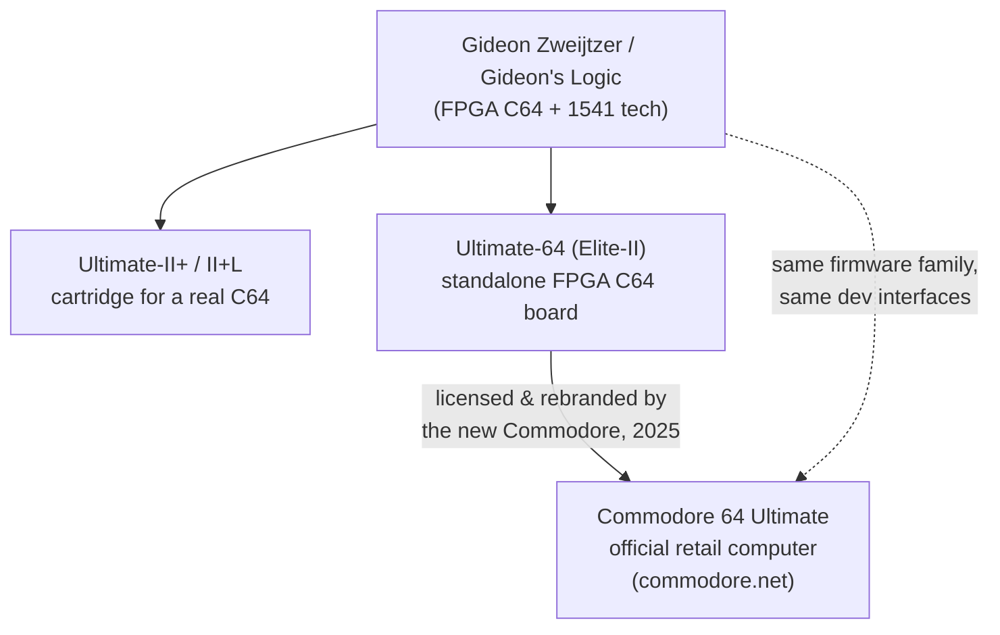

# The Commodore 64 Ultimate (and the Ultimate-64 / Ultimate-II+ lineage)

The **Commodore 64 Ultimate** ([commodore.net](https://commodore.net/computer/))
is a brand-new, **officially Commodore-branded** C64 — the revived Commodore's
**first official hardware in over 30 years**. It's a full FPGA re-creation of the
C64 in a new case, and under the hood it **licenses/rebrands Gideon Zweijtzer's
Ultimate 64 board**. That shared core is why everything in the demoscene/game
sections of this library runs on it, and why its developer interfaces are the
same ones documented for the Ultimate-64 / Ultimate-II+.

- **Commodore 64 Ultimate (commodore.net):** the retail computer you linked — new
  Commodore brand, Gideon's FPGA inside, new breadbin case + mechanical keyboard.
- **Ultimate-64 (Elite-II):** Gideon's standalone FPGA C64 mainboard (what the
  retail machine is built on).
- **Ultimate-II+ (cartridge):** Gideon's cartridge that adds the same drive
  emulation, networking, REU and command interfaces to a *real* vintage C64.

For a developer, **all three are effectively one target** — same firmware family,
same Ultimate Command Interface, same REST API.

## The retail machine — what's in the box

New Commodore is led by YouTuber **Christian "Perifractic" Simpson**, who acquired
the Commodore brand in 2025. The machine is a faithful re-creation, modernized:

| Area | Detail |
|------|--------|
| **Core** | AMD/Xilinx **Artix-7 FPGA**, **16 MB NOR flash** — chip-level re-creation of the C64 (CPU, VIC-II, CIAs) |
| **Memory** | **128 MB DDR2**, partitioned by firmware: **16 MB system · 16 MB REU · 16 MB GeoRAM · remainder = RAM Disk** |
| **Compatibility** | **>99.9%** cartridge-port compatibility; thousands of legacy titles, drives, and joysticks |
| **Video** | **1080p HDMI** (PAL 50 Hz / NTSC 60 Hz, DVI-compatible) near-zero lag, **plus** 8-pin DIN analog: **CVBS / S-Video / RGB** |
| **Audio** | **2× SID sockets (6581/8580)** with auto voltage + filter detection; **8 FPGA SIDs (24-channel)**; 3.5 mm + optical S/PDIF; SID-TAP header; piezo disk-sound speaker |
| **Networking** | **Ethernet (100 Mbps)** + built-in **Wi-Fi**, **FTP server**, modem emulation (no browser/social by design) |
| **Keyboard** | **66-key mechanical**, original layout; **Gateron Pro 3.0 55 g** switches; NKRO + macros |
| **Ports** | **cartridge**, **Datasette** (6-pin), **IEC** (6-pin DIN), **2× DB-9** joystick/paddle + USB mouse; 3× USB-A 2.0, 1× USB-C; internal microSD |
| **CPU** | **turbo mode** on the recreated 6510 (run far above the stock ~1 MHz) |

### Editions (functionally identical; cosmetic/collectible differences)

| Edition | Price (preorder) | Look |
|---------|------------------|------|
| **BASIC Beige** | **$299** | closest match to the original breadbin |
| **Starlight Edition** | **$349.99** | translucent, color-changing LED lighting |
| **Founders Edition** | **$499.99** | gold finish + limited-run memorabilia |

Preorders for **Batch 1 opened July 2025**. A **slimline "C64C" Ultimate**
(wedge-case) follow-up has since been announced. *Prices/availability change —
check commodore.net.*

> **Note on the FPGA:** the Commodore 64 Ultimate's FPGA core is **closed/
> protected** (see Commodore's "Why We're Protective Of Your … FPGA" post). You
> develop *for* the machine with normal C64 tools; you don't get the bitstream.

## What's different for developers (inherited from the Ultimate-64 platform)

Beyond "it's a faster, connected C64," these are the capabilities a developer can
actually use. They come from the Ultimate-64 firmware, so they apply to the
retail C64 Ultimate, the Ultimate-64 board, and (mostly) the Ultimate-II+ cart.

### Which expansions ship enabled on the retail unit

Confirmed from the official commodore.net spec and a hands-on review. The machine
bundles **integrated Ultimate-II+ functionality**, so these are on out of the box
(toggle/configure them via the freeze menu — flick the multi-function power switch):

| Expansion | Status on retail unit |
|-----------|------------------------|
| **REU (RAM Expansion Unit), 16 MB** | ✅ Enabled — 16 MB of the DDR2 is allocated to it |
| **GeoRAM, 16 MB** | ⚠️ **Memory reserved, emulation pending** — listed in the memory map, but reported *not yet active*, slated for a firmware update tied to the bundled **GEOS** |
| **RAM Disk** | ✅ Enabled — uses the remaining DDR2 |
| **Disk-drive emulation** (1541/1571/1581) | ✅ Cycle-accurate, from USB/microSD; mounts **.D64/.D71/.D81/.G64** |
| **Datasette / tape emulation** | ✅ Image emulation (**.TAP/.T64**) *and* a physical 6-pin Datasette connector |
| **Cartridge + freezer** | ✅ Freeze via the power switch; runs commercial carts, **Action Replay VI** (freeze + fastload), **Epyx FastLoad Reloaded**, **EasyFlash**; KERNAL/cart injection; **.ROM/.CRT** images |
| **Stereo / multi-SID** | ✅ **8 FPGA SIDs (24-channel)** + **2 real SID sockets**; SID player |
| **Networking** | ✅ Ethernet + Wi-Fi, **FTP server**, **modem emulation** (BBS), web/REST control interface |
| **DMA loader / print-to-PNG** | ✅ Part of the integrated Ultimate-II+ feature set |
| **Real-time clock** | ❓ Not listed on the retail spec sheet or noted in the review — treat as **unconfirmed** for the retail unit (present on some Ultimate hardware) |

- **Turbo mode:** configurable CPU speed well above 1 MHz for CPU-bound code that
  uses the stock 6510 instruction set. **Don't rely on it for cycle-exact demos**
  meant for stock hardware — test those at 1 MHz.

### The Ultimate Command Interface (UCI) — talk to the firmware from 6502 code

A memory-mapped command channel your running C64 program uses to reach the
firmware. Organized into "targets":

| UCI target | What it does |
|------------|--------------|
| **Ultimate DOS** | open/read/write files on SD/USB/disk images from C64 code |
| **Network** | open **TCP/UDP sockets** — your C64 program becomes a real network client |
| **Control** | reset, load & run PRGs, configure the machine |
| **Software IEC** | talk to the emulated IEC bus |
| **HTTP** | make HTTP requests from the C64 |

The big leap over a stock C64: **a program on the machine can open sockets and
HTTP connections** with no extra hardware.

### The host-side REST API — drive the machine from your PC

Over the network the Ultimate exposes an **HTTP REST API**, so your dev PC can
control it remotely:

- **Run a program:** `POST` a `.prg` (binary octet-stream or base64) to the
  runners endpoint to **load-and-run instantly on real hardware** — the tightest
  edit→deploy loop (no SD-card shuffling).
- Routes for: info, **Runners** (run prg/crt), **Configuration**, **Machine**
  (reset/reboot/peek/poke), **Floppy drives** (mount images), **Data streams**,
  and **File manipulation**.
- **Auth:** from firmware 3.12+, an `X-Password` header (configurable network
  password).

### Audio/video data streams

The machine can **stream its video and audio over the LAN**, controllable via the
API — capture/record/remote-view without a capture card.

### Compatibility considerations

- Validate **cycle-exact VIC-II timing** and **analog SID behavior** on stock
  silicon and in `x64sc` too; the FPGA is extremely close, but turbo mode and SID
  model selection change behavior. Fitting two real SID chips sidesteps the
  6581-vs-8580 emulation question for audio (see [Part IV](part-4-sid.md)).
- Demos that abuse undocumented edge cases are the usual compatibility frontier;
  firmware is actively updated, so check the changelog.

## Annotated resources

### The official product (the machine you linked)

- **[Commodore 64 Ultimate — product page](https://commodore.net/computer/)**
  *(official)*. The retail machine: editions, specs, ordering. Start here.
- **[Commodore store / Starlight Edition](https://www.commodore.net/product-page/commodore-64-ultimate-starlight-edition-batch1)**
  *(official store)*. Edition/pricing/batch details.
- **[Commodore: "Why We're Protective Of Your … FPGA"](https://commodore.net/why-we-re-protecting-your-commodore-64-ultimate-fpga/)**
  *(official blog)*. Context on the closed FPGA core.
- **[Time Extension — new ownership unveils the C64 Ultimate](https://www.timeextension.com/news/2025/07/commodores-new-ownership-unveils-the-commodore-64-ultimate-edition)**
  and **[Hackster — FPGA-powered C64 Ultimate](https://www.hackster.io/news/the-commodore-64-returns-as-the-fpga-powered-commodore-64-ultimate-4a8ea04e9dab)**
  *(press)*. Confirm the Gideon/Ultimate-64 lineage, specs, leadership, and ports.
- **[Hackster — hands-on review of the C64 Ultimate](https://www.hackster.io/news/keeping-up-with-the-commodore-a-hands-on-review-of-the-commodore-64-ultimate-235da0c5e23a)**
  *(review)*. Confirms which expansions are actually enabled out of the box
  (REU active, GeoRAM pending GEOS firmware, freezer, cart compatibility, FTP/modem).

### Developer documentation (the Ultimate platform underneath)

- **[Ultimate Documentation (ReadTheDocs)](https://1541u-documentation.readthedocs.io/)**
  *(primary, official)*. The dev docs for Ultimate-II+ **and** Ultimate-64:
  hardware, firmware, networking, DMA loading — applies to the retail machine.
- **[ReST API reference](https://1541u-documentation.readthedocs.io/en/latest/api/api_calls.html)**
  *(primary)*. Every host-side REST route — for PC-side automation/deploy.
- **[Ultimate Command Interface (UCI) docs](https://1541u-documentation.readthedocs.io/en/uci/index.html)**
  *(primary)*. On-machine command interface (DOS / Network / Control / IEC / HTTP)
  callable from 6502 code.
- **[Gideon's documentation repo (GitHub)](https://github.com/GideonZ/1541u-documentation)**
  *(primary)*. RST sources — useful when a rendered page 404s.

### Developer libraries & tooling

- **[ultimateii-dos-lib (xlar54)](https://github.com/xlar54/ultimateii-dos-lib)**
  *(primary)*. C/asm library for the **UCI DOS + network** functions from programs
  running on the C64 — the practical way to do on-device file/socket access.
- **[ultimate64 Rust library + CLI (mlund)](https://github.com/mlund/ultimate64)**
  *(primary)*. Clean host-side REST client (`run`, `reset`, `peek/poke`, mount) —
  scriptable into your build pipeline. (crates.io / docs.rs.)
- **[Ultimate64 tools (Leif Bloomquist)](https://github.com/LeifBloomquist/Ultimate64)**
  *(primary)*. Examples around the network/streaming features.
- **[Ultimate64MCP (Martijn-DevRev)](https://github.com/Martijn-DevRev/Ultimate64MCP)**
  *(secondary)*. MCP server wrapping the REST API (upload/run PRGs, control the
  machine) — niche, but shows what the API enables.

> **Time-sensitivity:** this is the fastest-moving part of the library. Editions,
> pricing, batches, the slimline C64C model, firmware versions, and turbo ceilings
> change — **re-check [commodore.net](https://commodore.net/) and the official
> ReadTheDocs / firmware changelog before depending on a specific detail.**
