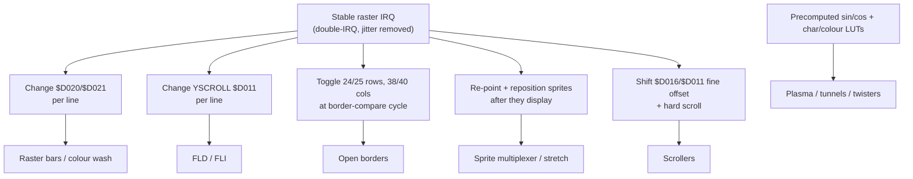

# Demoscene Effects Catalog

A field guide to the classic C64 effects: what each one *is*, the trick that
makes it work, and where it's documented. Almost all of them come down to one
principle:

> **Change a VIC-II (or SID) register at an exact cycle, every scanline, using a
> cycle-stable raster interrupt.** The art is doing it within the bad-line cycle
> budget. (Background: [vic-ii.md](vic-ii.md), [cpu-6510.md](cpu-6510.md).)

## Raster / color effects

- **Raster bars** — change border `$D020` and/or background `$D021` on chosen
  scanlines to paint horizontal color bands; animate the line positions for
  moving bars. The "hello world" of raster coding. *Must* hit the register at the
  right cycle or the bar edges flicker.
- **Colorwash / gradient backgrounds** — the same, but a full per-line color
  table sweeping smoothly.

## Border opening

- **Bottom/top border** — switch `$D011` to 24-row mode exactly when VIC tests the
  bottom border, then back to 25 — VIC never closes it; sprites become visible in
  the lower/upper border.
- **Side borders** — toggle `$D016` 38/40 columns at the right cycle each line to
  keep the left/right borders open. Combine for **full-screen / "all-border"**
  effects (sprites everywhere, including the classic *all-border scroller*).

## FLD and FLI

- **FLD (Flexible Line Distance)** — *suppress* bad lines by keeping YSCROLL
  (`$D011` bits 0–2) ≠ the current raster's low bits, so VIC never fetches new
  char data and the screen content can be pushed down arbitrarily — used for
  bouncing/opening the screen and vertical scroll tricks.
- **FLI (Flexible Line Interpretation)** — the opposite: *force a bad line on
  every scanline* by re-writing YSCROLL each line, so you can change the
  video-matrix/color pointer (`$D018`) per line. Result: per-scanline color in
  bitmap mode (escaping the "one color per 8×8 cell" limit) → near-photographic
  FLI pictures. Costs almost the whole line's CPU; has a left-edge "FLI bug"
  artifact. The canonical implementation uses a **double-IRQ stabilizer**.

## Sprite tricks

- **Sprite multiplexing** — reuse the 8 sprites down the screen (sort by Y,
  reposition in raster IRQs). The basis of sprite-heavy games and "100 sprites"
  demos. (See [game-dev-patterns.md](game-dev-patterns.md).)
- **Sprite stretching** — by *not* letting the sprite's internal line counter
  advance (re-triggering the same sprite line via well-timed register writes /
  forced conditions), a 21-pixel sprite is stretched to fill much of the screen —
  used for big logos and "sprite-stretch" bars.
- **Sprite crunch / "MISC" (Massively Interleaved Sprite Crunch)** — exploiting a
  VIC bug to mess with the sprite data pointer offset mid-fetch, skipping inside
  sprite graphics. Notoriously fiddly; documented by Linus Åkesson. Most coders
  consider it too hairy to use casually.

## Scrollers

- **Hardware smooth scroll** — animate `$D016` (X, 0–7px) / `$D011` (Y), then do a
  hard character scroll on wrap; hide the seam with 38-col/24-row mode. Add a sine
  table to the Y of each column for a **sine scroller**.
- **DYxP / DYPP** ("different y-position per pixel/char") — per-column or
  per-character vertical offset from a sine table, giving the wavy/bouncing text
  ubiquitous in intros. **All-border DYPP** combines this with opened borders.

## "Math" effects (precomputed tables)

- **Plasma** — apply summed sine/cosine functions across the screen and map the
  result to colors that animate over time; cheap and hypnotic. On the C64 it's
  usually done in **char mode with a custom charset** + color cycling, driven by
  precomputed sine tables.
- **Tunnels & rotozoomers** — precompute, per screen position, which texture
  pixel it maps to (distance/angle tables); animate by offsetting into the table.
  Heavy; often char-mode or small bitmap.
- **Twisters / "tech-tech"** — per-line horizontal offset of a bitmap/charset from
  a sine table, making a vertical band appear to twist; "tech-tech" wobbles the
  whole screen horizontally via `$D016` per line.
- **Bobs / vector / dot effects** — software-rendered points/3D, usually into a
  char or bitmap buffer with heavy use of unrolled "speedcode."

## How to learn these

Don't start with FLI. The sane ladder:

1. Stable raster IRQ + raster bars.
2. Open the borders (sprites in border).
3. A simple smooth scroller with a custom charset.
4. FLD, then sprite multiplexing.
5. FLI and the math effects.

## Annotated resources

### Tutorials (read these)

- **[Linus Åkesson — "An Introduction to Programming C-64 Demos"](https://www.antimon.org/code/Linus/)**
  *(tutorial, excellent)*. Concise, conceptual intro to raster effects, borders,
  scrollers, FLD/FLI from a top scener. Best single overview of *demo* coding.
- **[Codebase64 — demo programming index](https://codebase64.c64.org/doku.php?id=base:demo_programming)**
  *(community hub)*. Per-effect articles: stable rasters, FLD/FLI, border opening,
  sprite stretching, scroll routines. Cross-linked code you can lift.
- **[Codebase64 — tech-tech / FLI write-up](https://codebase64.c64.org/doku.php?id=base:techtech_fli)**
  *(reference)*. Worked example of the double-IRQ stabilizer used for FLI.
- **[Dustlayer "First Intro" tutorial](https://dustlayer.com/intro-to-coding)**
  *(beginner tutorial)*. Builds a complete classic intro (logo + scroller +
  music) step by step — the friendliest entry into demo coding.

### Effect-specific & advanced

- **[Linus Åkesson — Massively Interleaved Sprite Crunch](https://www.linusakesson.net/scene/lunatico/misc.php)**
  *(advanced)*. The sprite-crunch bug explained by the person who pushed it furthest.
- **[The Raistlin Papers (c64demo.com)](https://c64demo.com/)** *(blog series)*.
  A modern demo coder narrating real productions — all-border DYPPs, stable
  rasters, effect design decisions. Great for seeing how effects combine.
- **[Plasma effect (Rosetta Code)](https://rosettacode.org/wiki/Plasma_effect)**
  *(reference)*. The math behind plasma (portable, but the sine-table approach
  maps directly to C64).
- **[CSDb (Commodore Scene Database)](https://csdb.dk/)** *(archive)*. Every
  release, group, and coder; download demos and study their effects (many ship
  with notes/sources). The scene's collective memory.
