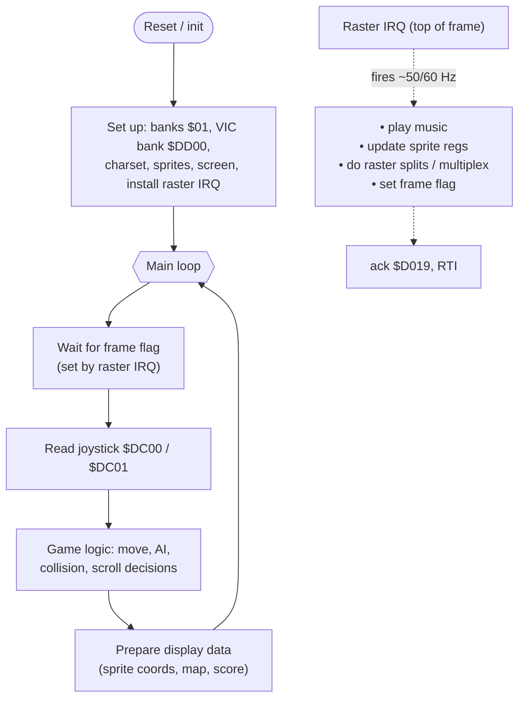
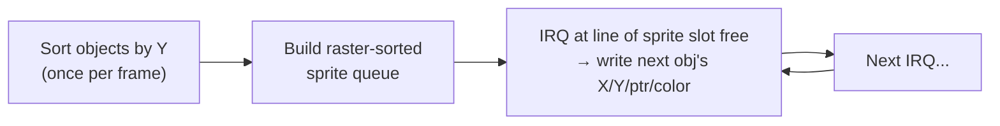

# Game Development Patterns on the C64

Writing a game means living inside the **~19,656-cycle PAL frame budget** and the
**8 hardware sprites**, while reading joystick, updating logic, moving objects,
and playing music — every frame, deterministically. This file collects the
architectural patterns that make that fit.

## The main loop

C64 games are built around the **vertical blank** (raster IRQ). Music and the
time-critical display updates run *in* the IRQ; game logic runs in the
"foreground" and is paced to the IRQ.



Key idea: the IRQ is the **clock**. The foreground does as much as it can and then
*waits* for the next frame flag, so the game runs at a fixed, smooth rate
regardless of how fast the logic finished.

## Frame pacing: when logic doesn't fit

Lasse "Cadaver" Oorni (author of *Metal Warrior*, *Hessian*, GoatTracker, and the
**c64gameframework**) documents the two standard responses when your update can't
finish in one frame ([cadaver.github.io/rants/interp.html](https://cadaver.github.io/rants/interp.html)):

- **Frameskipping** — call the movement/logic code *N times* (e.g. 3×) before each
  render. Apparent speed is preserved; motion gets jerkier because not every step
  is drawn. Simple; good when logic is cheap but rendering is expensive.
- **Interpolation** — run the *full* logic only every 2nd/4th frame, and on the
  in-between frames **linearly interpolate** sprite positions with a line
  equation. Frees CPU for heavier logic while keeping motion smooth. More code,
  smoother result.

Both are forms of decoupling logic-rate from display-rate — the C64 version of a
fixed-timestep loop.

## Sprites & multiplexing

8 hardware sprites is rarely enough. A **multiplexer** reuses them down the
screen: sort active objects by Y, and in raster IRQs *reposition + re-point* a
sprite once it has finished displaying, so one hardware sprite shows several
objects per frame.



Practical limits: you can show ~16–24+ objects with care; the constraint is how
many you can reposition between two objects' scanlines. Use the VIC's hardware
**collision registers** (`$D01E` sprite-sprite, `$D01F` sprite-background) but
read them once per frame and beware they latch — most games do **software
bounding-box** collision for reliability and per-pair control.

## Memory layout

A typical game memory plan (BASIC & often KERNAL banked out via `$01`):

```
$0000-$01FF  zero page + stack (your fast pointers/vars in free ZP)
$0200-$03FF  system work area (keep a few KERNAL bits if you use it)
$0400-$07FF  screen RAM (or double-buffer pair, see below)
$0800-$0FFF  code start / variables
$1000-$1FFF  music + SFX driver and data
$2000-$3FFF  bitmap (if using hires/multicolor graphics)
$4000-$7FFF  level/map data, sprite frames, charset(s)
$8000-$BFFF  more data / code (RAM under BASIC)
$C000-$CFFF  small ML routines (never banked)
$D000-$DFFF  I/O (or charset RAM if banked)
$E000-$FFFF  code/data (RAM under KERNAL)
```

VIC sees a 16K bank (`$DD00`); arrange screen/charset/bitmap *within* the bank and
keep it consistent. Color RAM is always `$D800`.

## Map / level data

- **Char-based tiles:** the screen is a grid of characters; define tiles as 2×2 or
  larger **char blocks** ("super-chars") and store maps as block indices to save
  RAM. A 40×25 screen of raw chars is 1000 bytes; block maps cut that hugely.
- **Compression:** RLE for repetitive maps; or store the map as columns and
  generate the visible screen on the fly when scrolling.
- **Lookup tables over math:** precompute sine/cosine, multiply, screen-row
  address (`$0400 + row*40`) tables. Multiplication by repeated addition is slow;
  a 40-entry row-address table is instant.

## Double buffering & flicker-free updates

The VIC can switch screen base via `$D018` (bits 4–7) instantly. Keep **two screen
buffers** in the same VIC bank, draw into the hidden one, then flip `$D018` during
vblank — no tearing. The same idea applies to swapping between two bitmaps. For
char-mode games, often you simply do all screen writes inside the raster IRQ
*after* the visible area, so they never tear.

## Reading input

- **Joystick:** CIA1 `$DC00` (port 2) / `$DC01` (port 1). Low 5 bits = up/down/
  left/right/fire, **active-low**. (Port 1 shares lines with the keyboard matrix,
  so reading it can be noisy.)
- **Keyboard:** scan the matrix via `$DC00`/`$DC01`, or use KERNAL `GETIN`
  (`$FFE4`) if KERNAL is banked in.

## Annotated resources

- **[Lasse "Cadaver" Oorni — game-loop / interpolation rants](https://cadaver.github.io/rants/interp.html)**
  *(primary, practitioner)*. Frameskip vs interpolation from a shipping-game
  author. Also see his other rants on game structure and his
  **[c64gameframework](https://github.com/cadaver/c64gameframework)** *(working
  reference codebase)* — a real, reusable game engine in assembly.
- **[Codebase64 — game programming](https://codebase64.c64.org/doku.php?id=base:game_programming)**
  *(community)*. Sprite multiplexers, collision, scrollers, input, map handling.
- **[nurpax — BINTRIS on the C64 (series)](https://nurpax.github.io/posts/2018-05-19-bintris-on-c64-part-1.html)**
  *(tutorial)*. A modern, well-written walk-through of building a real game in
  assembly with a cross-toolchain (KickAssembler), including charset/sprite
  pipeline and music integration.
- **[Dustlayer](https://dustlayer.com/)** *(tutorial)*. Foundational beginner
  series — sprites, interrupts, screen setup — that the patterns here build on.
- **[Making Games for the C64 / various Lemon64 & forum threads](https://www.lemon64.com/forum/)**
  *(community Q&A)*. Searchable archive of practical "how did they do X" answers.
