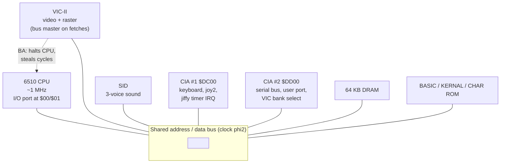
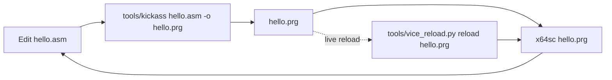

# Part 0 — Orientation & Toolchain

Orientation before any 6502: what the machine is made of, the tools and the build/run loop, and the binary/hex/signed number sense the rest of the course assumes. Three short lessons — read in order.

**In this part:** 0.1 · 0.2 · 0.3

## 0.1 The machine at a glance

**Objectives**
- Identify the C64's main chips (6510, VIC-II, SID, two 6526 CIAs) and what each one does.
- Understand the shared bus and why the VIC-II can "steal" cycles from the CPU.
- Explain the 64K RAM / overlapping ROM-and-I/O layout and the PAL vs NTSC differences, and why both shape how you write C64 code.

### Why this lesson is conceptual

You will not poke a single register here. The point is to build a correct mental model of the hardware so the later chip-specific parts (the VIC-II, SID, and CIA lessons) slot into place. Everything that makes the C64 distinctive — writing directly to hardware registers, cycle-exact timing tricks, and chips contending for memory — follows from the architecture sketched below.

### The chips

The C64 is a handful of MOS chips wired to 64 KB of dynamic RAM and three ROMs.

- **6510 CPU.** A 6502 core with one extra feature: an on-chip 8-bit I/O port wired to memory locations `$00` (data-direction register) and `$01` (the port itself). The low three bits of `$01` select which ROM/RAM/I/O is visible in the upper address space (the *banking* you will meet in Part 0.3). It runs at roughly **0.985 MHz on PAL** and **1.023 MHz on NTSC** — about a million cycles per second. The 6510 also understands a set of *undocumented* ("illegal") opcodes that demos rely on.
- **VIC-II video chip.** Generates the entire display: 40×25 text, bitmap modes, 8 hardware sprites, smooth scrolling, and the raster beam. It is *the* master clock of the system — all timing is measured in VIC raster lines and cycles. Its registers live at `$D000–$D02E` (mirrored up to `$D3FF`). See [Appendix C](appendix-c-vic-registers.md).
- **SID sound chip (6581/8580).** Three voices, four waveforms, envelopes, ring modulation, and a multimode analog filter. Registers at `$D400–$D41C`. See [Appendix D](appendix-d-sid-registers.md).
- **Two 6526 CIAs (Complex Interface Adapters).** General-purpose I/O and timers. **CIA #1** (`$DC00`) scans the keyboard and reads control-port 0 / joystick 2, and its Timer A normally drives the 60-times-a-second (jiffy) IRQ. **CIA #2** (`$DD00`) handles the serial bus (disk/printer), the user port, and — importantly — selects which 16 KB *VIC bank* the video chip can see. See [Appendix E](appendix-e-cia-registers.md).
- **Memory: 64 KB RAM + three ROMs.** All 64 KB of RAM is physically present. Overlaid on top of it are the **BASIC ROM** (8 KB at `$A000–$BFFF`), the **KERNAL ROM** (8 KB at `$E000–$FFFF`), the **Character ROM** (4 KB, normally hidden, that can appear at `$D000–$DFFF`), and the **I/O block** (the chip registers above, also at `$D000–$DFFF`). What you actually see at those addresses depends on the banking bits in `$01`. See [Appendix B](appendix-b-memory-map.md).

### The shared bus

There is one address/data bus, clocked at the system clock ϕ2. The 6510 and the VIC-II take turns on it: conceptually the CPU uses one phase of the clock and the VIC the other. But the VIC needs *more* than its half whenever it has to fetch character pointers or sprite data, and when that happens it pulls a signal (BA) that halts the CPU and **takes the bus for itself**. The CPU literally stops executing for those cycles.



Two consequences you will live with constantly:

- **The CPU's cycle budget per raster line is not constant.** On a normal PAL line the CPU gets roughly all 63 cycles. On a *bad line* (the first pixel-row of each text row, where the VIC fetches the 40 character pointers) the VIC steals about 40 cycles, leaving the CPU only ~23. Each displayed sprite costs about 2 more cycles on the lines it covers. The exact numbers are in [Appendix H](appendix-h-timing.md) (sections H.2 and H.3) — do not memorize them yet, just know the budget *varies*.
- **The VIC can only see 16 KB at a time.** The 6510 addresses all 64 KB, but the VIC-II has only 14 address lines, so it sees one of four 16 KB *banks* selected by CIA #2. Screen, charset, and sprite data must all live inside the bank the VIC is currently looking at.

### PAL vs NTSC

The C64 shipped in two TV standards, and the difference is baked into the silicon (a 6569 VIC for PAL, a 6567 for NTSC). The whole machine's clock is derived from the video dot clock, so the standards differ in clock speed *and* in the size and shape of every frame.

| System | CPU clock | Cycles/line | Lines/frame | Cycles/frame | Refresh |
|---|---|---:|---:|---:|---:|
| PAL (6569) | ~0.985 MHz | 63 | 312 | 19656 | ~50.1 Hz |
| NTSC (6567R8) | ~1.023 MHz | 65 | 263 | 17095 | ~59.8 Hz |

(See [Appendix H](appendix-h-timing.md) H.1.)

Why it matters:

- **Timing-critical code is tied to one standard.** A raster split or stable-raster routine that pads exactly the right number of cycles for PAL's 63-cycle line will land in the wrong place on NTSC's 65-cycle line. Cross-standard demos either detect the machine at runtime or ship two code paths.
- **Music tempo and game speed change with the frame rate.** Code that runs "once per frame" runs ~50 times a second on PAL and ~60 on NTSC, so a naive game runs ~20% faster on NTSC and tunes play sharp.
- **Vertical space differs.** PAL has 312 raster lines per frame, NTSC only 263, so effects that use the borders or pack the screen tightly have less room on NTSC.

Most European C64 software targets PAL; this course assumes PAL unless stated otherwise.

### What makes C64 programming distinctive

- **You poke hardware directly.** There is no driver layer between you and the chips: setting the border color is one store to `$D020`, and starting a note is a handful of stores into the SID register file. The hardware *is* the API.
- **Timing is a first-class tool.** Because the VIC is predictable cycle by cycle, you can synchronize the CPU to the raster beam and change registers mid-screen — splitting the screen into regions, opening the borders, multiplexing more than 8 sprites. This is why instruction cycle counts (in [Appendix A](appendix-a-opcodes.md)) matter so much.
- **Resources are shared and finite.** One bus, one 16 KB VIC window, 64 KB of RAM you must share with ROM and I/O. Good C64 code is largely about laying out memory and budgeting cycles.

### A first runnable program

This program does nothing exotic — it just proves the toolchain works and that you can write straight to a VIC-II register. It is included so the architecture above has something concrete attached to it; the *why* of each register comes in later parts.

```asm
// the-machine-at-a-glance.asm  (KickAssembler v5.x)
*=$0801
        BasicUpstart2(start)    // emits the "10 SYS 2061" BASIC stub

*=$0810
start:
        lda #$00                // black
        sta $d020               // VIC-II border color register
        sta $d021               // VIC-II background color register

        lda #$05                // green
        sta $d020               // poke the border again, directly

loop:
        jmp loop                // hang forever; nothing else is running
```

Assemble and run it with the tooling from Part 0.0; you should see a green border on a black screen. That single `sta $d020` is the essence of C64 programming: no API call, just a byte written to a chip.

**Pitfalls**
- Assuming a fixed CPU speed or a constant per-line cycle count. The clock differs PAL vs NTSC, and the VIC steals cycles on bad lines and sprite lines — the CPU's per-line budget is variable. Confirm details in [Appendix H](appendix-h-timing.md).
- Forgetting the VIC's 16 KB horizon: the CPU can address data that the VIC simply cannot see in its current bank.
- Treating `$D000–$DFFF` as "just I/O." The same addresses can be I/O, Character ROM, or plain RAM depending on `$01`; banking is covered next.
- Hard-coding PAL timing (63 cycles/line, 312 lines) into an effect and expecting it to run identically on NTSC.

**Go deeper**: read the VIC-II timing model in [Appendix H](appendix-h-timing.md) (frame timing H.1, bad lines H.2, sprite DMA H.3) and the full address space in [Appendix B](appendix-b-memory-map.md); for the chip ranges and ROM/KERNAL overview see [Appendix F](appendix-f-kernal-basic.md).

## 0.2 The dev environment & the build loop

**Objectives**
- Set up the repo's toolchain: KickAssembler (via `tools/kickass`), VICE `x64sc`, and petcat.
- Write, assemble, and run a complete C64 program with `BasicUpstart2` and a `$0801` load address.
- Drive a *running* emulator with `tools/vice_reload.py` for a live edit -> reload loop.

### The tools in this repo

You develop on your PC and cross-assemble to a C64 `.prg`, then run it in an emulator. Four tools cover everything in this course:

| Tool | Role | How you invoke it |
|------|------|-------------------|
| **KickAssembler v5.x** | The assembler. A Java app with a full scripting language (loops, functions, build-time graphics/SID import). | `tools/kickass` — a wrapper that runs the vendored `vendor/KickAss.jar` with your system JVM. |
| **VICE `x64sc`** | The emulator/debugger. `x64sc` is the single-cycle-accurate build; use it (not `x64`) so timing matches real hardware. | `x64sc prog.prg` |
| **petcat** | Tokenizes BASIC V2 text into a `.prg` (and detokenizes back). Ships with VICE. | `petcat -w2 -o prog.prg -- prog.bas` |
| **`tools/vice_reload.py`** | Drives a running `x64sc` over its **binary monitor** (TCP) to autostart a new build or poke memory in place. Pure stdlib, no deps. | `tools/vice_reload.py reload prog.prg` |

`tools/kickass` is just:

```sh
exec java -jar "$here/vendor/KickAss.jar" "$@"
```

so anything you'd pass to `KickAss.jar` you pass to `tools/kickass`. You do not need a separate KickAssembler install.

### The canonical loop: edit -> assemble -> run



The whole reason a `.prg` "just runs" is its first two bytes: a `.prg`'s load address. For programs that BASIC autostarts, that address is **`$0801`** — the start of BASIC program memory. A tiny BASIC stub there (`10 SYS <addr>`) hands control to your machine code. KickAssembler writes that stub for you with the `BasicUpstart2(label)` macro, so you never hand-assemble it.

### A complete runnable program

This sets the border and background colours (writing to `$D020` and `$D021`) and prints a message via the KERNAL `CHROUT` routine. Save it as `hello.asm`.

```asm
// hello.asm — set screen colours and print a message.
// Assemble: tools/kickass hello.asm -o hello.prg
// Run:      x64sc hello.prg

*=$0801                       // .prg load address = start of BASIC
:BasicUpstart2(start)         // emits "10 SYS <start>" so RUN/autostart jumps here

.const CHROUT = $ffd2         // KERNAL: output PETSCII char in A (Appendix F)
.const BORDER = $d020         // VIC-II border colour, low nibble (Appendix C)
.const SCREEN = $d021         // VIC-II background 0, low nibble (Appendix C)

start:
        lda #$00              // 0 = black
        sta BORDER            // border  -> black
        sta SCREEN            // background -> black

        ldx #$00              // index into message
print:
        lda message,x         // load next byte
        beq done              // 0 terminator -> finished
        jsr CHROUT            // print the char in A
        inx
        bne print             // loop (message is well under 256 bytes)
done:
        rts                   // return to BASIC

message:
        .encoding "petscii_mixed" // .text defaults to SCREEN CODES; CHROUT wants PETSCII
        .text "hello c64"
        .byte $0d, $00        // $0d = carriage return, $00 = terminator
```

Notes on the syntax:
- `//` is a line comment; `.const` defines an assemble-time constant; `.text`/`.byte` lay down data.
- `:BasicUpstart2(start)` is a macro call — the leading `:` is how KickAssembler invokes macros.
- Colour registers use only the low nibble (0-15); the high nibble reads back as 1s, so don't rely on it. See [Appendix C](appendix-c-vic-registers.md).
- `CHROUT` ($FFD2) prints the PETSCII char in `A` and interprets control codes such as `$0D` (carriage return). Per [Appendix F](appendix-f-kernal-basic.md).
- `.text` defaults to **screen codes** in KickAssembler, but `CHROUT` expects **PETSCII** — so `.encoding "petscii_mixed"` precedes the `.text` to switch encodings. Screen codes are what you'd POKE directly into screen RAM; feeding them to `CHROUT` prints garbage (the letters land on invisible PETSCII control codes).

Assemble and run:

```sh
tools/kickass hello.asm -o hello.prg
x64sc hello.prg
```

KickAssembler also emits a VICE symbol file (`.vs`) alongside the `.prg`, which you can hand to `x64sc` for source-level breakpoints once you start debugging.

### Live reload via the binary monitor

Restarting `x64sc` on every change is slow. Instead, launch the emulator once with its **binary monitor** enabled, then push new builds into the *already-open* window. The binary monitor listens on TCP (this repo defaults to port 6502):

```sh
# 1) launch once, with the binary monitor on 127.0.0.1:6502
x64sc -binarymonitor -binarymonitoraddress ip4://127.0.0.1:6502 -autostart hello.prg

# 2) after each rebuild, autostart the fresh build into the running emulator
tools/kickass hello.asm -o hello.prg
tools/vice_reload.py reload hello.prg
```

`reload` autostarts the new `.prg`, which **resets the machine** (a fresh RUN). For a state-preserving hot-swap — drop a new charset/sprite/level into the *running* program's memory with no reset — use `poke`:

```sh
tools/vice_reload.py poke '$d020' --data 02   # poke border to red, live
tools/vice_reload.py poke 0x3000 font.bin      # load a file into memory at $3000
tools/vice_reload.py ping                       # is an emulator listening?
```

This is the nearest C64 equivalent to web hot-module-reload. Full code-HMR with state preserved isn't possible: a C64 program is one blob at a fixed load address, so changing code means a reset.

### The `make watch` save-triggered loop

The repo wires the reload step into a file-watcher so a save triggers rebuild + reload automatically. The BASIC side ships it ready to use in `basic/`:

```sh
make watch          # in basic/: tokenize + reload on every save (uses watch.sh)
make reload         # reload the current build into a running VICE
make run            # tokenize and autostart in x64sc
```

`basic/watch.sh` launches `x64sc -binarymonitor ...` if one isn't already running, then on each saved `.bas` re-tokenizes with `petcat` and calls `vice_reload.py reload`. The exact same mechanism works for assembly builds — swap the `petcat` step for `tools/kickass`. See [`basic/`](../basic/) for the working BASIC version (`Makefile`, `watch.sh`, `hello.bas`).

**Pitfalls**
- Use `x64sc`, not `x64`. `x64` is faster but not cycle-accurate; raster/timing effects will misbehave on it.
- `BasicUpstart2` assumes the program loads at `$0801`. Pair it with `*=$0801`. Without the stub, BASIC has nothing to `SYS` to and the program won't autostart.
- The `$0801` load address only applies to BASIC-launchable programs. Other targets (e.g. cartridges, code loaded elsewhere) use different addresses.
- `CHROUT` prints PETSCII, not screen codes. Use `.text` for `CHROUT` strings; reserve raw screen codes for direct writes to screen RAM.
- `vice_reload.py reload` resets the machine — you lose live state. Use `poke` when you need to mutate a running program without restarting.
- The binary monitor must be enabled at launch (`-binarymonitor`); you can't attach to a plain `x64sc` afterwards. The default port here is 6502 (override with `VICE_BINMON_PORT`).
- End your machine code with `rts` to return cleanly to BASIC, not an endless loop, unless you intend to take over the machine.

**Go deeper** — full tool rundown and the live-reload design in [Toolchain](toolchain.md); the from-zero on-ramp in [Getting Started](00-getting-started.md); the working build/watch scripts in [basic/](../basic/); KERNAL `CHROUT` in [Appendix F](appendix-f-kernal-basic.md) and the colour registers `$D020`/`$D021` in [Appendix C](appendix-c-vic-registers.md).

## 0.3 Numbers: binary, hex, bytes, signed

**Objectives**
- Read and write C64 quantities fluently in hexadecimal (`$`) and binary (`%`), and map every digit to specific bits.
- Understand bytes, nibbles, words, and two's-complement signed bytes (-128..127).
- Use `AND`/`ORA`/`EOR` and `ASL`/`LSR`/`ROL`/`ROR` for masking, bit-flipping, and fast multiply/divide by 2.
- Remember that the 6502 stores 16-bit values **little-endian** (low byte first).

### Bits, nibbles, bytes, words

The 6502/6510 is an 8-bit CPU. Its fundamental unit is the **byte**: 8 bits, holding values 0–255 (`$00`–`$FF`). Bits are numbered 7 (most significant) down to 0 (least significant):

```
 bit:   7   6   5   4   3   2   1   0
value: 128  64  32  16   8   4   2   1
```

A **nibble** is 4 bits (one hex digit, 0–15 / `$0`–`$F`). A byte is exactly two nibbles, which is why hex is so convenient: the high nibble is the top hex digit, the low nibble the bottom one. `$D5` = high nibble `$D`(=13) and low nibble `$5`. A **word** is 16 bits (two bytes), holding 0–65535 (`$0000`–`$FFFF`) — the size of an address on this machine.

### Hexadecimal and binary in KickAssembler

KickAssembler uses these literal prefixes:

- `$` = hexadecimal, e.g. `$D011`, `$FF`
- `%` = binary, e.g. `%00011011`
- no prefix = decimal, e.g. `53265`

These are just different notations for the same number. The following all load the same value into A:

```asm
    lda #$1b            // hex
    lda #%00011011      // binary, bit-for-bit
    lda #27             // decimal
```

Hex maps to bits four at a time (one digit per nibble); binary maps one digit per bit. Use binary when you care about individual bits (register flags, masks) and hex when you care about whole-byte/address values. The mapping for `$1B`:

```
   $1     $B          (hex digits)
  0001   1011         (4 bits each)
= %0001 1011 = $1B = 27
```

### Two's-complement signed bytes

The same 8 bits can be read as **unsigned** (0..255) or **signed** (-128..127). The hardware does not "know" which you mean — it is purely your interpretation. The signed convention is **two's complement**: bit 7 is the sign bit, and a negative value `-n` is stored as `256 - n`.

| Bits | Hex | Unsigned | Signed |
|------|-----|----------|--------|
| `%00000000` | `$00` | 0 | 0 |
| `%00000001` | `$01` | 1 | 1 |
| `%01111111` | `$7F` | 127 | 127 |
| `%10000000` | `$80` | 128 | -128 |
| `%11111111` | `$FF` | 255 | -1 |

To negate a value in two's complement: invert all bits and add 1. So `-1` is `$00` inverted (`$FF`) + ... no add needed conceptually, `$01` -> invert `$FE` -> +1 = `$FF`. This matters because the branch instructions `BPL`/`BMI` test bit 7 (the N flag), and signed deltas (e.g. a sprite moving up/down by a small negative amount) wrap exactly this way — adding `$FF` is the same as subtracting 1.

```asm
    lda #$00
    clc
    adc #$ff            // A = $FF; as signed that is 0 + (-1) = -1
```

### Little-endian byte order

16-bit values (addresses, counters) are stored **low byte first, high byte second**. The address `$D011` is stored in memory as `$11` then `$D0`. KickAssembler's `.word` directive does this for you:

```asm
target: .word $d011     // emits two bytes: $11, $D0  (lo, hi)
```

When you split an address by hand, take the low byte with `<` and the high byte with `>`:

```asm
    lda #<$d011         // A = $11 (low byte)
    sta $fb
    lda #>$d011         // A = $D0 (high byte)
    sta $fc             // $fb/$fc now hold a little-endian pointer to $D011
```

This is also why reading the raster line uses two registers: `$D012` is the low 8 bits and bit 8 lives in `$D011` bit 7 — a 9-bit value spread little-endian-style across two registers (see Appendix C).

### Bitwise logic: AND / ORA / EOR

These operate bit-by-bit between A and a value, leaving the result in A. They set the N and Z flags from the result (see Appendix A).

- **`AND`** — keeps bits where the mask is 1, clears the rest. Use it to **mask off** (isolate or remove) bits.
- **`ORA`** — sets bits where the mask is 1, leaves the rest. Use it to **turn bits on**.
- **`EOR`** — flips bits where the mask is 1. Use it to **toggle** bits.

```asm
    lda #%11001010
    and #%00000011      // keep low 2 bits  -> %00000010
    lda #%11001010
    ora #%00000001      // force bit 0 on   -> %11001011
    lda #%11001010
    eor #%10000000      // flip bit 7       -> %01001010
```

Two extremely common C64 idioms:

`$D011` packs the vertical fine-scroll value (YSCROLL) into its low 3 bits, with other control bits above. To set YSCROLL without disturbing the rest, read, clear the low 3 bits with `AND`, then merge your value with `ORA`:

```asm
    lda $d011
    and #%11111000      // clear low 3 bits (YSCROLL), keep bits 3-7
    ora #%00000101      // set YSCROLL = 5
    sta $d011
```

`$D011` bit 7 (RST8) is the 9th bit of the raster compare value. Clearing it for raster lines below 256 is also an `AND`:

```asm
    lda $d011
    and #%01111111      // clear RST8 (bit 7) -> raster MSB = 0
    sta $d011
```

Toggling the border colour each frame is a one-liner with `EOR` (here flipping between two arbitrary colours by XORing the differing bits):

```asm
    lda $d020
    eor #%00000001      // flip bit 0 of border colour
    sta $d020
```

### Shifts and rotates: ASL / LSR / ROL / ROR

These move bits sideways. They work on A or directly on memory/zero page (see Appendix A for modes and cycle counts). All four set N, Z, and C.

- **`ASL`** — shift left, 0 into bit 0, old bit 7 -> Carry. This **multiplies by 2**.
- **`LSR`** — shift right, 0 into bit 7, old bit 0 -> Carry. This **divides by 2** (unsigned).
- **`ROL`** — rotate left **through carry**: Carry -> bit 0, old bit 7 -> Carry.
- **`ROR`** — rotate right **through carry**: Carry -> bit 7, old bit 0 -> Carry.

The rotates thread the Carry flag in and out, which is exactly what you need to shift a 16-bit value across two bytes:

```asm
    lda #5
    asl                 // A = 10  (x2)
    asl                 // A = 20  (x4)

    lda #20
    lsr                 // A = 10  (/2)

    // 16-bit shift left of value at $fb (lo) / $fc (hi):
    asl $fb             // low byte <<1, top bit -> Carry
    rol $fc             // high byte <<1, Carry -> its bit 0
```

`ASL`/`LSR` are the cheapest multiply/divide you have; combine shifts and adds for other small constants (e.g. x10 = (x<<3)+(x<<1)). Note `LSR` shifts in a 0, so it only divides **unsigned** values correctly; right-shifting a signed negative byte does not give signed division.

**Pitfalls**
- A leading `0x` is C, not KickAssembler — use `$` for hex. `%` is binary; without a prefix the literal is **decimal** (`10` is ten, not `$10`).
- `#` means "immediate" (the literal value); without it you get a memory access. `lda #$d0` loads the number `$D0`; `lda $d0` loads whatever is in zero-page address `$D0`. This is unrelated to hex vs decimal.
- The CPU does not track "signed vs unsigned" — `$FF` is both 255 and -1. Choose your interpretation and stay consistent; use `BPL`/`BMI`/`BCC`/`BCS` deliberately.
- Don't write a whole register when you only mean some bits. Blindly `sta $d011` can wipe DEN/RSEL/RST8; read-modify-write with `AND`/`ORA` instead.
- `ROL`/`ROR` rotate **through Carry**, so a stale Carry leaks into the result. Do `clc`/`sec` first when the incoming Carry matters.
- Little-endian trips up newcomers: a memory dump of address `$D011` shows `11 D0`, not `D0 11`. `<` is low byte, `>` is high byte.

**Go deeper:** logic and shift instructions with opcodes, lengths and cycle counts are in [Appendix A](appendix-a-opcodes.md); the `$D011` bit layout (RST8 / YSCROLL) and the raster registers are in [Appendix B](appendix-b-memory-map.md) and the VIC register reference [Appendix C](appendix-c-vic-registers.md).


---

*Next: [Part I — 6502/6510 Foundations](part-1-foundations.md)*
