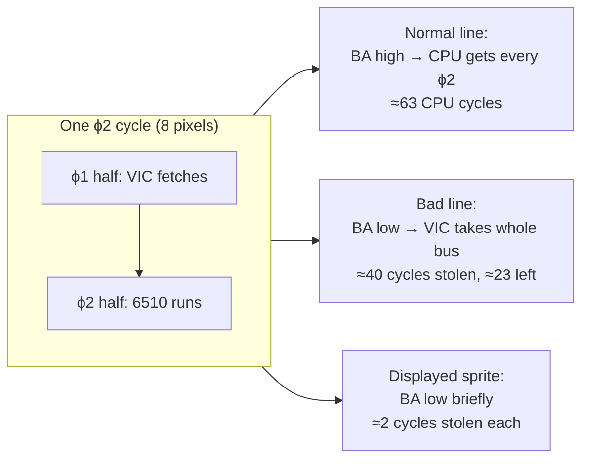
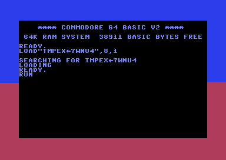
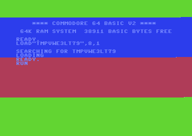
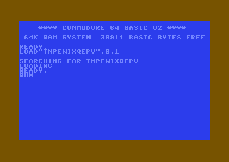

# Part II — Interrupts & Timing

Interrupts and cycle timing — how to take over the machine's heartbeat and synchronise code to the raster beam. Five lessons from the shared bus through raster interrupts and the stable raster to CIA timers and reading input. This is the gateway to every screen-splitting effect in [Part III](part-3-vic.md).

**In this part:** 2.1 · 2.2 · 2.3 · 2.4 · 2.5

## 2.1 How the CPU and VIC-II share the bus

**Objectives**
- Understand that the 6510 and the VIC-II share a single bus, divided by the system clock into two phases.
- Explain how the BA signal halts the CPU for bad lines and sprite DMA, and quantify the cost in cycles.
- Read the raster register `$D012` from code and use it to synchronise the CPU with the beam.

### One bus, two masters

The C64 has exactly one address/data bus, and two devices that want it: the 6510 CPU and the VIC-II video chip. They do not arbitrate politely on a request basis — instead they take turns according to the system clock, called ϕ2 (phi-two). The clock is split into two half-cycles:

- During the **ϕ1 (low) phase** the VIC-II owns the bus. It uses this slot to fetch the data it needs to build the picture: character pointers, pixel data, sprite data.
- During the **ϕ2 (high) phase** the 6510 owns the bus. This is when your instructions actually read and write memory.

Because each device has its own half of every cycle, on a "quiet" raster line the VIC fetches what it needs in ϕ1 and never disturbs the CPU at all — the CPU gets the full per-line cycle budget. The trouble starts when the VIC needs **more** than its ϕ1 half can supply.

### The BA signal: stunning the CPU

When the VIC must do heavy fetching (character matrix on a bad line, or sprite data), one ϕ1 half-cycle per cycle is not enough bandwidth. The VIC then asserts a signal called **BA** (Bus Available) low. BA low is a request to the 6510 to get off the bus entirely so the VIC can use *both* phases.

The 6510 cannot stop mid-write, so the hardware is conservative: BA goes low **3 cycles before** the VIC actually seizes the bus. Three is the maximum number of consecutive write cycles any 6510 instruction can perform, so by the time the VIC takes over, the CPU is guaranteed to be doing only reads — and reads can be safely paused. The CPU is then "stunned": it freezes until BA returns high. It does not lose state; it simply makes no progress for those cycles. This is why we say the VIC *steals* cycles from the CPU.

Two things trigger BA going low:

1. **Bad lines** — the VIC fetches the 40 character/colour cells for a new text row.
2. **Sprite DMA** — the VIC fetches data for each displayed sprite.

### Cycles per line and per frame (PAL)

All C64 timing is derived from the raster scan. On a PAL machine (the 6569 chip):

- A raster line is **63 CPU cycles** long.
- A frame is **312 raster lines**.
- A whole frame is therefore 63 × 312 = **19656 cycles** (about 50.12 frames per second).

The crucial point for cycle-counting code: **19656 cycles per frame is the maximum**, available only on lines that are neither bad lines nor carry sprites. The CPU's budget *per line varies*:

| Line type (PAL, 63 cyc/line) | VIC steals | CPU cycles left |
|---|---:|---:|
| Normal line, no sprites | 0 | ~63 |
| Bad line, no sprites | ~40 | ~23 |
| +1 displayed sprite | ~2 each | subtract ~2 per sprite |
| Bad line + 8 sprites | ~40 + ~16 | a handful |

A **bad line** occurs on the first pixel-row of each text row, where the VIC must read 40 character pointers plus video-matrix data; it steals roughly **40–43 cycles**, leaving the CPU only about 23. Each **displayed sprite** costs roughly **2 more cycles** on the lines it overlaps (1 pointer fetch plus 3 data bytes). See [Appendix H](appendix-h-timing.md) §H.2 and §H.3 for the exact accounting; NTSC uses 65 cycles/line over 263 lines.

This variation is why a busy-wait timed for a normal line drifts on a bad line, and why stable-raster and sprite-multiplexing techniques (later lessons) exist: they all revolve around predicting exactly when BA will steal the bus.

### A timing sketch



### Reading the raster register

The VIC continuously updates a 9-bit counter with the line the beam is currently drawing. You read it from two registers (see [Appendix C](appendix-c-vic-registers.md)):

- `$D012` (53266) — the low 8 bits of the current raster line.
- `$D011` (53265) **bit 7** (RST8) — bit 8 of the raster line.

For the visible play area (lines 0–255) the low 8 bits are enough. The simplest synchronisation is a polling busy-wait: spin until `$D012` reaches a chosen line. Because the CPU just sits and re-reads the register, this is rock-steady for coarse effects (it has jitter of a few cycles, fine for a non-flickering colour split).

The following complete, runnable program polls `$D012` and changes the border colour at one raster line, producing a horizontal colour split:

```asm
//----------------------------------------------------------------------
// 2.1  Polling the raster register to make a border split
//----------------------------------------------------------------------
        BasicUpstart2(main)         // SYS 2064 stub generated by KickAss

*=$0801 "Basic"                     // (BasicUpstart2 lives here)

*=$0810 "Main"
main:
        sei                         // we busy-wait, so silence KERNAL IRQ jitter
        lda #$00
        sta $d020                   // border = black to start
        sta $d021                   // background = black

splitLine:
        .const TOP = 156            // raster line where the split happens (PAL centre: 312/2)

loop:
        // --- wait until the beam reaches the TOP line, then go red below it ---
wait1:  lda $d012                   // read current raster line (low 8 bits)
        cmp #TOP                    // reached our target?
        bne wait1                   // no -> keep polling

        lda #$02                    // 2 = red (Appendix C palette)
        sta $d020                   // border red from line TOP downward

        // --- restore blue only once the beam is past the BOTTOM border and has
        //     wrapped back to the top, so the bottom border stays red. $D012 alone
        //     can't see lines >= 256 (it would match #TOP twice per frame); RST8 =
        //     $D011 bit 7 is the 9th raster bit, so we watch it instead. ---
wait2:  lda $d011                   // bit 7 (RST8) = raster line bit 8
        bpl wait2                   // spin until line >= 256 (below the screen)
wait3:  lda $d011
        bmi wait3                   // spin until RST8 clears -> beam wrapped to top

        lda #$06                    // 6 = blue
        sta $d020                   // border blue for the top part

        jmp loop                    // do it again every frame
```




What you should see: the screen interior is black, and the **border is split horizontally** — the upper part of the border is blue, and from the vertical middle (raster line 156, the PAL centre) downward the border is red. The split holds steady and does not flicker.

### Storing the raster value

`$D012` is also useful as a quick, free-running source of a changing byte, or to record where the beam was when something happened. This snippet stores the current line into a variable so later code can act on it:

```asm
        lda $d012        // capture current raster line
        sta lineSnap     // remember it
        // ... do other work ...
        lda lineSnap     // use it later (e.g. branch on screen region)

lineSnap: .byte 0
```

Polling like this wastes all the cycles spent spinning. For real effects you raise a **raster interrupt** instead (the VIC fires an IRQ exactly when the beam hits a compare line), which frees the CPU to do other work between splits. That is the subject of the next lessons; here the goal is only to see, concretely, that `$D012` is the CPU's window onto where the beam is, and that the bus underneath is shared cycle by cycle.

**Pitfalls**
- `$D012` is only the low 8 bits. To compare against a line above 255 you must also check/set RST8 (`$D011` bit 7); a bare `cmp $d012` will match the same low byte twice per frame.
- A busy-wait that lands on a **bad line** runs slower than you expect (only ~23 CPU cycles that line). Never count cycles assuming a flat 63/line across a text row.
- Each displayed sprite removes ~2 cycles **only on the lines it covers**, not the whole frame — budget per line, not per frame.
- `sei` here only stops CPU interrupts so the KERNAL timer IRQ does not perturb our spin loop; it does **not** stop the VIC from stealing the bus. BA is hardware and ignores the I flag.
- The "split" appears in the border, not the text area, because we only change `$D020`. Changing `$D021` would recolour the screen interior instead.

**Go deeper**: Christian Bauer's [VIC-II article](https://www.cebix.net/VIC-Article.txt) (ϕ1/ϕ2 bus sharing, BA, bad lines); see [Appendix C](appendix-c-vic-registers.md) for the registers and [Appendix H](appendix-h-timing.md) for the cycle budgets.

## 2.2 IRQ & NMI mechanics

**Objectives**
- Understand how the 6510 responds to an interrupt: the I flag, the stack push, the hardware vectors, and `RTI`.
- Distinguish a maskable **IRQ** from a non-maskable **NMI**, and know the four vectors involved ($FFFE/$FFFF, $FFFA/$FFFB, and the KERNAL RAM vectors CINV $0314/$0315 and NMINV $0318/$0319).
- Learn the non-negotiable rule: **acknowledge the interrupt source** (write $D019 for a VIC raster IRQ, read $DC0D for a CIA timer IRQ) or it re-fires forever.
- Install your own IRQ handler through $0314/$0315 and produce a visible per-frame effect.

### What an interrupt is

An interrupt is the hardware's way of saying "stop what you're doing and run this code now." Instead of polling a register in a loop, you let a chip (the VIC-II or a CIA) yank the CPU away from the main program the instant something happens — a raster line is reached, a timer underflows, the RESTORE key is pressed.

The 6510 has two physical interrupt input pins:

- **IRQ** (Interrupt Request) — *maskable*. The CPU only honours it when the **I flag** (Interrupt-disable) in the processor status register is **clear**. `SEI` (set I) blocks IRQs; `CLI` (clear I) allows them.
- **NMI** (Non-Maskable Interrupt) — *cannot be masked* by the I flag. An NMI is triggered by a falling edge on the NMI line and will be serviced regardless of `SEI`.

On the C64, **CIA #1 ($DC00) drives the IRQ line** (keyboard scan, jiffy clock, timers) and the **VIC-II also drives IRQ** (raster, sprite collisions, light pen). **CIA #2 ($DD00) drives the NMI line** (RESTORE key, RS-232, user-port FLAG). See [Appendix E](appendix-e-cia-registers.md).

### What the CPU does on an interrupt

When the CPU accepts an interrupt (IRQ with I=0, or any NMI, or a `BRK` instruction), it performs a fixed sequence in hardware:

1. Finishes the current instruction.
2. Pushes the **program counter** (PC high byte, then low byte) onto the stack.
3. Pushes the **processor status register (P)** onto the stack.
4. Sets the **I flag** (so an IRQ handler is not immediately re-interrupted by another IRQ).
5. Reads the appropriate **hardware vector** and jumps there.

The vectors are 16-bit pointers the CPU reads directly from the top of the address space:

| Vector | Address | Triggered by |
|---|---|---|
| NMI | $FFFA/$FFFB | NMI line falling edge |
| RESET | $FFFC/$FFFD | power-on / reset |
| IRQ / BRK | $FFFE/$FFFF | IRQ line (I=0) **and** the `BRK` instruction |

Note that IRQ and `BRK` share one vector. The handler tells them apart by examining the **B flag** in the P value that was pushed on the stack — the KERNAL ROM already does this for you.

`RTI` (Return from Interrupt) reverses the entry: it **pulls P** off the stack (restoring the old I flag, among others) and then **pulls the PC**, resuming exactly where the program was interrupted. Use `RTI`, not `RTS`, to leave an interrupt handler: `RTS` would only restore the PC and leave the status register wrong.

### Hardware vectors vs. KERNAL RAM vectors

The hardware vectors live in ROM ($FFFA–$FFFF), so you cannot rewrite them while the KERNAL is banked in. To let user code hook interrupts, the KERNAL ROM handlers immediately bounce through a pair of **RAM** pointers:

| RAM vector | Address | Default target | Role |
|---|---|---|---|
| CINV | $0314/$0315 | $EA31 | IRQ handler (keyboard, jiffy clock, cursor) |
| NMINV | $0318/$0319 | $FE47 | NMI handler |

The flow for a normal IRQ is: CPU reads $FFFE → jumps to the KERNAL dispatch at $FF48 → that code saves A/X/Y and does `JMP ($0314)`. So **with the KERNAL banked in, you install an IRQ handler by writing your routine's address into $0314/$0315** (and an NMI handler into $0318/$0319). The defaults are restored by RESTOR ($FF8A). See [Appendix F](appendix-f-kernal-basic.md).

There are two common styles of IRQ handler depending on what you patch:

- **Patch CINV ($0314)** — the KERNAL has *already* saved A/X/Y for you, so your handler runs, then you `JMP $EA31` (to let the KERNAL do keyboard/jiffy and `RTI`) or `JMP $EA81` (just restore registers and `RTI`, skipping keyboard scan). You do **not** push/pull registers yourself in this style.
- **Take over the hardware vector** (only possible with the KERNAL ROM banked out at $FFFE/$FFFF) — then *you* must save and restore A/X/Y and end with `RTI`. That is a later topic; this lesson uses the CINV style.

### The cardinal rule: acknowledge the source

An interrupt source asserts a line and **keeps it asserted** until you clear the chip's interrupt flag. If you `RTI` without acknowledging, the line is still low, the CPU takes the interrupt again immediately, and your machine locks in the handler. The acknowledge depends on the chip:

- **VIC-II raster (or collision) IRQ** — the pending flags are in **$D019** (the IRQ Latch). You clear a bit by **writing a 1 to it**: `lda #$01 / sta $d019` clears the raster flag (bit 0). See [Appendix C](appendix-c-vic-registers.md).
- **CIA timer IRQ** — the status is in the ICR at **$DC0D** (CIA #1) or **$DD0D** (CIA #2). **Reading** the ICR clears *all* its latched flags. So `lda $dc0d` is both the "which source?" query and the acknowledge. See [Appendix E](appendix-e-cia-registers.md).

A subtlety for the program below: the default KERNAL IRQ is the CIA #1 Timer A firing 60 times a second (the jiffy clock). When you chain to $EA31 the KERNAL reads $DC0D for you, so a CINV-style handler that ends in `JMP $EA31` does not need to touch $DC0D itself. If you instead set up a *VIC raster* IRQ you must clear $D019 yourself.

### A complete runnable IRQ handler

This program installs a CINV-style IRQ handler that runs once per frame (driven by the standard 60 Hz CIA #1 timer IRQ that the KERNAL already has enabled). Each time it runs it increments a counter and copies it to the border colour at **$D020**, then chains to the KERNAL IRQ at $EA31.

```asm
//  IRQ demo: cycle the border colour every frame via the CINV vector ($0314/$0315)
                BasicUpstart2(start)        // SYS 2064 stub at $0801

*=$0801 "Basic"                              // BasicUpstart2 placed its stub here

*=$0810 "Main"
start:
                sei                          // block IRQs while we patch the vector
                lda #<irq                    // low byte of our handler address
                sta $0314                    // CINV low
                lda #>irq                    // high byte
                sta $0315                    // CINV high
                cli                          // allow IRQs again (I flag cleared)
loop:
                jmp loop                     // main program does nothing; the IRQ does the work

//  ---- IRQ handler (CINV style: KERNAL already saved A/X/Y for us) ----
irq:
                inc counter                  // advance a frame counter
                lda counter
                sta $d020                    // border colour = low nibble of counter
                jmp $ea31                    // chain to KERNAL IRQ: it reads $DC0D
                                             //   (acknowledges CIA #1) and does RTI

counter:        .byte 0
```

**What you should see:** the border ($D020) flickers rapidly through all 16 colours — it changes every frame (60 times a second on NTSC, ~50 on PAL), cycling 0,1,2,...,15,0,... continuously, producing a fast strobing rainbow border. The centre of the screen stays as the normal light-blue BASIC screen with the READY. prompt, because we chained to $EA31 and the keyboard/cursor still work. The change is so fast it reads as a shimmering mix of colours; slow it down by only changing the border every Nth frame if you want to verify distinct colours.

Why this works without touching $D019 or $DC0D directly: we never enabled a VIC IRQ, so the only IRQ firing is CIA #1 Timer A, and the `jmp $ea31` lets the KERNAL acknowledge it (by reading $DC0D) as part of its normal jiffy/keyboard processing.

### When you do acknowledge yourself: the VIC raster pattern

If instead of riding the jiffy timer you trigger on a raster line, the skeleton of the handler changes — you must clear $D019 yourself. The acknowledge looks like this inside the handler:

```asm
//  Inside a raster IRQ handler, acknowledge the VIC before RTI / chaining:
                lda #$01
                sta $d019        // write 1 to bit 0 (IRST) to clear the raster IRQ flag
```

Setting up the raster source (writing $D012/$D011 for the compare line and enabling bit 0 of $D01A) is the subject of the next lesson; the point here is only that **the acknowledge moves from the KERNAL into your code** the moment you use a VIC source.

### NMI in one paragraph

The NMI path is the same shape but uses $FFFA → KERNAL → `JMP ($0318)` (NMINV). Because NMI ignores the I flag, `SEI` will not protect a critical section from it. Its main C64 sources are on CIA #2 ($DD0D): the RESTORE key and RS-232. A custom NMI handler installed at $0318/$0319 must acknowledge CIA #2 by **reading $DD0D**, then chain or `RTI`. A classic gotcha: if you take the NMI vector but forget that pressing RESTORE pulls the NMI line, an un-acknowledged NMI handler can hang exactly like an un-acknowledged IRQ.

**Pitfalls**
- **Forgetting to acknowledge.** No `sta $d019` (VIC) or no read of $dc0d/$dd0d (CIA) ⇒ the interrupt re-fires immediately and the machine locks. In the CINV style above, `jmp $ea31` performs the CIA acknowledge for you; a self-contained handler must do it explicitly.
- **Patching the vector without `SEI`.** If an IRQ fires between writing the low byte ($0314) and the high byte ($0315), the CPU jumps through a half-updated pointer into garbage. Always `SEI` before, `CLI` after.
- **Ending with `RTS` instead of `RTI`** (when you own the full handler) — the status register and stack are left wrong. In CINV style you instead `JMP $EA31`/`$EA81`, which ends in the KERNAL's `RTI`.
- **Saving registers twice or not at all.** In the CINV style the KERNAL already pushed A/X/Y, so do *not* re-save them; if you take over $FFFE directly you *must* save and restore them yourself.
- **Expecting `SEI` to stop an NMI.** It cannot. NMI is non-maskable; only the chip's mask/acknowledge controls it.
- **Wrong bit semantics on $D019.** You clear VIC flags by writing a **1** to the bit (not a 0), unlike most "set" registers.

**Go deeper:** C64 Programmer's Reference Guide (interrupt handling and KERNAL descriptions) at [/home/rhm/code/c64-tools/docs/reference/c64-programmers-reference-guide.txt](reference/c64-programmers-reference-guide.txt); registers and vectors in [Appendix C](appendix-c-vic-registers.md), [Appendix E](appendix-e-cia-registers.md), and [Appendix F](appendix-f-kernal-basic.md).

## 2.3 Raster interrupts & the stable raster

**Objectives**
- Set up a raster interrupt: enable it in `$D01A`, choose the line via `$D012`/`$D011`, and acknowledge it in `$D019`.
- Take over the IRQ vector cleanly by disabling the KERNAL's CIA timer interrupt.
- Draw a multi-band screen split, then understand and eliminate the 0–7 cycle raster *jitter* with a double-IRQ stabiliser.

### Why raster interrupts?

The VIC-II draws the screen one horizontal line at a time, from top to bottom, ~50 times a second (PAL). The raster *compare* feature lets the chip raise a CPU interrupt the instant the beam reaches a line you choose. That is the heartbeat of almost every demo effect: you change a VIC register (border colour, scroll offset, sprite position, `$D018` pointers...) *while the screen is being drawn*, so different parts of the same frame look different.

A single program can register several interrupts at different lines and re-arm the next one inside each handler. This lesson builds up to that.

### The four registers you must touch

| Register | Role in a raster IRQ |
|---|---|
| `$D012` (RASTER) | Write: the compare line (low 8 bits). Read: current line. |
| `$D011` bit 7 (RST8) | Bit 8 of the 9-bit compare line. The screen is up to 312 lines (PAL), so you need this for any line ≥ 256. |
| `$D01A` bit 0 (ERST) | Enable raster compare as an IRQ source. |
| `$D019` bit 0 (IRST) | Pending flag. **You must write a 1 here to acknowledge**, or the IRQ fires forever. |

These are documented in [Appendix C](appendix-c-vic-registers.md) (`$D011`, `$D012`, `$D019`, `$D01A` breakdowns) and the raster-compare mechanics in [Appendix H §H.5](appendix-h-timing.md).

### Taking over the interrupt

After RESET the KERNAL runs an IRQ ~50 times/second driven by **CIA #1 Timer A**, vectored through `$0314/$0315` (the soft IRQ vector used when the KERNAL ROM is banked in). To run our own raster handler we:

1. `SEI` — block IRQs while we reconfigure.
2. Disable the CIA timer IRQ: write `$7F` to `$DC0D` (clears all CIA #1 IRQ enables — see the ICR write semantics in [Appendix E](appendix-e-cia-registers.md)). Then read `$DC0D` once to clear any already-latched flag.
3. Point `$0314/$0315` at our handler.
4. Set the compare line (`$D012` + `$D011` bit 7), enable raster IRQ (`$D01A = $01`), and acknowledge any stale flag (`$D019 = $01`).
5. `CLI` — let it run.

Because we leave the KERNAL ROM banked in, the CPU enters via `$FFFE → $FF48`, which the KERNAL routes through `$0314`. Our handler must end with `jmp $EA31` (full KERNAL IRQ exit, which restores registers and does `RTI`) or, if we did our own register save, `jmp $EA81` (just pull registers + `RTI`). We will save registers ourselves and use `$EA81`.

### A multi-band screen split

This complete, runnable program installs three raster interrupts that hand off to each other, painting horizontal colour bands by changing `$D020` (border) and `$D021` (background).

**On screen you should see:** the screen split into three horizontal bands. The top third has a **blue** background, the middle third **red**, the bottom third **green**, with the border matching each band's edge colour. The screen is otherwise blank (an empty editor screen). The bands are steady, but their top edges may shimmer slightly by a few pixels — that jitter is what the next section fixes.

```asm
// raster-bars.asm  --  three-band screen split via raster IRQs
*=$0801
BasicUpstart2(main)         // SYS 2064 stub -> jumps to main

*=$0810
main:
        sei                 // block IRQs while we set up

        lda #$7f
        sta $dc0d           // disable all CIA#1 IRQ sources (timer etc.)
        lda $dc0d           // read ICR to clear any pending CIA flag

        lda #<irq1
        sta $0314
        lda #>irq1
        sta $0315           // install our IRQ handler

        lda #$01
        sta $d01a           // enable raster compare IRQ (ERST)

        lda #50
        sta $d012           // first compare line = 50
        lda $d011
        and #$7f
        sta $d011           // clear RST8 (line 50 < 256)

        lda #$01
        sta $d019           // ack any stale raster flag

        cli                 // interrupts on
loop:   jmp loop            // main "program": idle forever

// ---- IRQ at line 50: blue band starts ----
irq1:
        pha                 // save A, X, Y ourselves
        txa
        pha
        tya
        pha

        lda #$06            // blue
        sta $d020
        sta $d021

        lda #130
        sta $d012           // next split at line 130
        lda #<irq2
        sta $0314
        lda #>irq2
        sta $0315

        lda #$01
        sta $d019           // ACK raster IRQ (clears IRST)
        jmp exit

// ---- IRQ at line 130: red band starts ----
irq2:
        pha
        txa
        pha
        tya
        pha

        lda #$02            // red
        sta $d020
        sta $d021

        lda #210
        sta $d012           // next split at line 210
        lda #<irq3
        sta $0314
        lda #>irq3
        sta $0315

        lda #$01
        sta $d019
        jmp exit

// ---- IRQ at line 210: green band, then loop back to irq1 ----
irq3:
        pha
        txa
        pha
        tya
        pha

        lda #$05            // green
        sta $d020
        sta $d021

        lda #50
        sta $d012           // wrap: next frame's first split
        lda #<irq1
        sta $0314
        lda #>irq1
        sta $0315

        lda #$01
        sta $d019
        // fall through to exit

exit:
        pla                 // restore Y, X, A
        tay
        pla
        tax
        pla
        jmp $ea81           // KERNAL: RTI (we already restored registers)
```




All three compare lines (50, 130, 210) are below 256, so RST8 stays 0. If you split below the bad-line range you must remember badlines steal cycles ([Appendix H §H.2](appendix-h-timing.md)); for plain colour changes that only adds to the jitter discussed next.

### The jitter problem

When the raster compare fires, the CPU does **not** drop everything instantly — it finishes the instruction it is currently executing first. 6502 instructions take 2–7 cycles, so the handler starts somewhere within a **0–7 cycle** window after the compare line begins. Since one CPU cycle = 8 pixels ([Appendix H §H.4](appendix-h-timing.md)), the colour change can land anywhere across roughly 56 horizontal pixels. For a full-width colour band the *top edge* of the band therefore jitters left/right line-to-line — visible as a fuzzy, flickering boundary.

For coarse effects you ignore it. For cycle-exact effects (opening borders, FLI, smooth raster bars) you must remove it: the technique is the **double IRQ stabiliser**.

### The double-IRQ stabiliser

The idea:

1. **First IRQ** fires on line *N−1* (one line *before* the target). It does almost nothing except re-arm a **second** raster IRQ on line *N*, then deliberately spins until the very end of line *N−1*.
2. While spinning, the first handler does `CLI` so the CPU is ready to take the second IRQ the moment it triggers. Now the entry jitter is at most the length of whatever single instruction is executing during the wait.
3. **Second IRQ** fires on line *N*. Because the first handler timed the wait so the CPU is sitting on short, equal-length instructions, the second entry lands within a 1-cycle window — effectively jitter-free for the rest of the handler, which then does the actual stable work.

The classic trick to collapse the remaining slack: after acknowledging in the first handler, execute a known number of cycles so that when the second IRQ becomes possible the CPU is mid-way through a stream of 2-cycle `NOP`s (or compares the live raster value and burns the difference). A common, compact form double-checks `$D012` to absorb the last cycle of uncertainty.

The program below stabilises a single split. **On screen you should see:** the top portion of the screen has a **light blue** background and border; below the split line the background and border turn **yellow**. The boundary between them is a single, perfectly straight, rock-steady horizontal line (no shimmer), about two-thirds of the way down.

```asm
// stable-raster.asm  --  one rock-steady split using a stabilised raster IRQ
*=$0801
BasicUpstart2(main)

.const SPLIT  = 180         // line where the colour changes to yellow
.const TOPSET = 10          // line where we (re)set the top colour each frame

*=$0810
main:
        sei
        lda #$7f
        sta $dc0d           // disable CIA#1 timer IRQ
        lda $dc0d           // clear pending CIA flag

        lda #$0e            // light blue
        sta $d020
        sta $d021

        lda #<irqTop
        sta $0314
        lda #>irqTop
        sta $0315

        lda #$01
        sta $d01a           // enable raster IRQ
        lda #TOPSET
        sta $d012
        lda $d011
        and #$7f
        sta $d011           // RST8 = 0
        lda #$01
        sta $d019
        cli
loop:   jmp loop

// --- Top-of-frame IRQ: set the upper colour, arm the pre-split IRQ ---
irqTop:
        lda #$01
        sta $d019
        lda #$0e            // light blue for the top
        sta $d020
        sta $d021
        lda #<irqA
        sta $0314
        lda #>irqA
        sta $0315
        lda #SPLIT-1        // first IRQ one line early
        sta $d012
        jmp $ea81           // RTI via KERNAL

// --- First (unstable) IRQ on SPLIT-1: arm the stabiliser, burn the line ---
irqA:
        lda #$01
        sta $d019
        lda #<irqB
        sta $0314
        lda #>irqB
        sta $0315
        lda #SPLIT
        sta $d012
        cli                 // let irqB interrupt us
        .fill 24, $ea       // 24 NOPs: CPU is on 2-cycle ops when irqB is due

// --- Second (stabilised) IRQ on SPLIT ---
irqB:
        lda #$01
        sta $d019
        lda $d012           // equalise the last cycle of jitter
        cmp $d012
        beq *+2
        lda #$07            // yellow from here down
        sta $d020
        sta $d021
        lda #<irqTop        // back to the top IRQ for the next frame
        sta $0314
        lda #>irqTop
        sta $0315
        lda #TOPSET
        sta $d012
        jmp $ea81
```


To make the top return to light blue every frame, have `irqA` also write `#$0e` to `$D020/$D021` *before* arming `irqB`; because `irqA` runs near the bottom-1 line it sets the colour for the wrap to the top. (Try it: add `lda #$0e / sta $d020 / sta $d021` at the start of `irqA`.)

The `lda $d012 / cmp $d012 / beq *+2` idiom is the cheapest standard stabiliser tail: the read+compare consumes the residual 1-cycle ambiguity left after the NOP stream, and the conditional branch's taken/not-taken cycle difference cancels the last possible offset. The result is a boundary fixed to a single pixel column line after line.

**Pitfalls**
- **Forgetting to acknowledge `$D019`.** Without `lda #$01 / sta $d019` the raster flag stays set and the IRQ re-fires immediately, hanging the machine. Acknowledge in *every* handler.
- **Confusing `$D019` (acknowledge) with `$D01A` (enable).** Write 1s to `$D019` to *clear* flags; set bit 0 of `$D01A` once to *enable* the source.
- **Ignoring RST8.** For any compare line ≥ 256 you must set `$D011` bit 7, and you must read-modify-write `$D011` (it shares YSCROLL/DEN). Clobbering it can blank the screen or shift it.
- **Not disabling the CIA timer.** If you leave `$DC0D` alone the KERNAL's 1/50s timer IRQ keeps firing through your vector at unpredictable lines, wrecking timing. Write `$7F` to `$DC0D` and read it once.
- **Register corruption.** The KERNAL's `$EA31` exit restores registers it saved; if you take over the vector you must save/restore A/X/Y yourself and exit via `$EA81`, or use `$EA31` consistently.
- **Badlines and sprites add jitter** ([Appendix H §H.2/§H.3](appendix-h-timing.md)). A split on a badline row loses ~40 cycles; budget for it or move the split off the badline.
- **NTSC vs PAL.** Cycle padding (the NOP count, 63 vs 65 cycles/line) and line counts differ ([Appendix H §H.1](appendix-h-timing.md)); stabiliser timing tuned on PAL needs adjustment on NTSC.

**Go deeper:** Christian Bauer's [VIC-II article](https://www.cebix.net/VIC-Article.txt) (raster compare and the stable-raster derivation); register details in [Appendix C](appendix-c-vic-registers.md) and cycle/timing mechanics in [Appendix H](appendix-h-timing.md).

## 2.4 CIA timers & replacing the system IRQ

**Objectives**
- Understand how CIA #1 Timer A generates the ~50/60 Hz "jiffy" system IRQ, and how the timer, control, and interrupt-control registers work.
- Program a CIA timer: load a 16-bit period, choose continuous/one-shot, start it, enable its interrupt, and acknowledge it correctly.
- Disable the default KERNAL IRQ source (`SEI` + `LDA #$7F : STA $DC0D`) before you take over interrupts, and know that CIA #2 (`$DD0D`) drives **NMI**, not IRQ.
- Write a complete, runnable program driven entirely from a CIA Timer A interrupt.

### The two CIAs and the two interrupt lines

The C64 has two MOS 6526 CIA chips. **CIA #1** at `$DC00–$DC0F` has its interrupt output wired to the 6510 **IRQ** pin; **CIA #2** at `$DD00–$DD0F` is wired to the **NMI** pin. That single fact decides almost everything in this lesson:

- To take over or stop the maskable interrupt, you deal with **CIA #1 / `$DC0D`** (and the VIC at `$D01A`).
- The RESTORE key, RS-232 and the user-port FLAG line come in through **CIA #2 / `$DD0D`** as a **non-maskable** interrupt — `SEI` does not block it.

Each chip has the same register layout. The full table is in [Appendix E](appendix-e-cia-registers.md); the four register groups that matter here are:

| Reg | CIA #1 | CIA #2 | Purpose |
|-----|--------|--------|---------|
| TA LO / TA HI | `$DC04` / `$DC05` | `$DD04` / `$DD05` | Timer A 16-bit counter (read=count, write=latch) |
| TB LO / TB HI | `$DC06` / `$DC07` | `$DD06` / `$DD07` | Timer B 16-bit counter |
| CRA / CRB | `$DC0E` / `$DC0F` | `$DD0E` / `$DD0F` | Control registers (start, run mode, force-load…) |
| ICR | `$DC0D` | `$DD0D` | Interrupt Control/Status |

### How a CIA timer counts

A CIA timer is a 16-bit **down-counter**. You write a 16-bit start value into a **latch** through the LO/HI registers, the counter counts down once per system clock (ϕ2) cycle, and when it counts past zero it produces an **underflow** event. The underflow sets the timer's flag in the ICR, and — if that source is enabled — pulls the chip's interrupt line.

What happens after underflow depends on **RUNMODE** in the control register (see [Appendix E](appendix-e-cia-registers.md), CRA/CRB tables):

- **Continuous** (RUNMODE = 0): the latch is reloaded into the counter automatically and it keeps counting. This is what you want for a periodic interrupt (a metronome).
- **One-shot** (RUNMODE = 1): the timer stops after a single underflow.

Other CRA bits you will use:

- **START** (bit 0): 1 = run, 0 = stop.
- **LOAD** (bit 4): a *strobe* — writing 1 force-loads the latch into the counter immediately. It always reads back as 0.
- **INMODE** (bit 5, CRA): clock source. 0 = count system ϕ2 cycles (what we use); 1 = count CNT-pin edges.

Because Timer A counts ϕ2 cycles, the interrupt **period in cycles is the latch value + 1** (it underflows on the transition past zero). To pick a period, use the cycles-per-frame figures from [Appendix H](appendix-h-timing.md): a PAL frame is **19656** cycles (≈50.12 Hz), an NTSC (6567R8) frame is **17095** cycles (≈59.83 Hz). The KERNAL loads Timer A with roughly one frame's worth of cycles so its IRQ — which updates the jiffy clock at `$A0–$A2`, scans the keyboard, and blinks the cursor — fires about once per frame.

### The Interrupt Control Register (ICR) reads and writes differently

`$DC0D` is the single trickiest register here because **read** and **write** mean different things (full layout in [Appendix E](appendix-e-cia-registers.md)):

**Reading `$DC0D`** returns the *status* — which sources have fired — and **clears all latched flags as a side effect**. Bit 0 = Timer A underflow, bit 1 = Timer B, bit 7 = "an enabled source fired" (this is the actual IRQ/NMI flag). So in a CIA interrupt handler you **read `$DC0D` to acknowledge it**; if you don't, the flag stays set and the CPU re-enters the handler forever.

**Writing `$DC0D`** sets the *enable mask*. Bit 7 is a fill/clear selector:

- Write a byte with **bit 7 = 1**: every source bit that is 1 gets **enabled**.
- Write a byte with **bit 7 = 0**: every source bit that is 1 gets **disabled**.
- Bits written as 0 are left unchanged either way.

Two idioms follow directly:

```asm
lda #$7f
sta $dc0d   // bit7=0, bits0-6=1  -> DISABLE every CIA #1 interrupt source
lda #$81
sta $dc0d   // bit7=1, bit0=1     -> ENABLE only Timer A
```

### Disabling the default IRQ before you take over

When you install your own raster IRQ (lesson on raster splits) you do not want CIA #1's jiffy timer also firing — it would steal cycles and corrupt your timing. The canonical takeover prologue is:

```asm
sei                 // mask IRQs while we reconfigure
lda #$7f
sta $dc0d           // disable all CIA #1 interrupt sources
lda $dc0d           // read to clear any already-latched CIA flag (ack)
// ... now set up VIC raster IRQ via $d01a / $d012 ...
cli                 // re-enable IRQs (only your source is now armed)
```

The `LDA $dc0d` read after the disable write matters: a timer underflow may already be pending, and clearing it now prevents a spurious entry the instant you `CLI`. Note this only silences **CIA #1 → IRQ**. RESTORE still works because it is **CIA #2 → NMI**; if you also need to defeat RESTORE you disable CIA #2 sources via `LDA #$7F : STA $DD0D` and read `$DD0D` to clear, but remember an NMI handler must still exist at the NMI vector or RESTORE will crash.

### A complete program driven by a CIA Timer A interrupt

This program replaces the KERNAL IRQ vector at `$0314/$0315` with our own handler, reprograms CIA #1 Timer A to fire about **5 times per second**, and toggles the border colour on every interrupt. We keep the KERNAL banked in, so we install through the RAM vector `$0314` (the KERNAL's ROM handler reads `$DC0D` and then `JMP ($0314)`).

For ~5 Hz on PAL we need about `19656 * 50 / 5 ≈ 196560` cycles per tick — too big for one 16-bit timer (max 65535). Instead we keep Timer A at a ~50 Hz frame period and **divide in software**: count 10 interrupts, then act. This keeps the example accurate without abusing the timer's range.

```asm
// CIA #1 Timer A interrupt: flash the border ~5 times/second.
// KickAssembler v5.x
*=$0801
BasicUpstart2(start)

*=$0810

.const ICR  = $dc0d     // CIA #1 Interrupt Control/Status
.const CRA  = $dc0e     // CIA #1 Control Register A
.const TALO = $dc04     // Timer A latch/counter low
.const TAHI = $dc05     // Timer A latch/counter high

// One PAL frame = 19656 cycles (Appendix H). Latch value = period-1.
.const PERIOD = 19656 - 1

start:
        sei

        // 1) Silence the default system IRQ source on CIA #1.
        lda #$7f
        sta ICR             // disable all CIA #1 interrupt sources
        lda ICR             // read clears any pending flag (acknowledge)

        // 2) Install our RAM IRQ vector (KERNAL still banked in).
        lda #<irq
        sta $0314
        lda #>irq
        sta $0315

        // 3) Program Timer A: load the 16-bit period into the latch.
        lda #<PERIOD
        sta TALO
        lda #>PERIOD
        sta TAHI

        // 4) Start Timer A: force-load latch, continuous, start.
        //    bit4 LOAD=1, bit3 RUNMODE=0 (continuous), bit0 START=1
        lda #%00010001
        sta CRA

        // 5) Enable ONLY Timer A as an interrupt source.
        lda #$81            // bit7=1 (set), bit0=1 (Timer A)
        sta ICR

        lda #$00
        sta counter

        cli                 // interrupts on; only Timer A is armed
loop:   jmp loop            // main program does nothing; the IRQ does the work

// ---- Interrupt handler --------------------------------------------------
// The KERNAL's ROM handler has already pushed A/X/Y for us before JMP($0314),
// so here we may freely use A. We acknowledge CIA #1, do our work, and exit
// through the KERNAL's standard IRQ return at $EA31 (which pulls A/X/Y, RTI).
irq:
        lda ICR             // READ $DC0D: acknowledge -> clears the timer flag
                            // (bit0 tells us Timer A fired; we only enabled it)

        dec counter
        bpl done            // not yet 10 ticks elapsed
        lda #9
        sta counter         // reload divide-by-10 counter (10 ticks = ~5 Hz)

        inc $d020           // advance border colour one step
done:
        jmp $ea31           // KERNAL: restore A/X/Y from stack and RTI

counter: .byte 0
```




**What you should see:** a normal blue BASIC screen with the usual `READY.` text, and the **border colour cycling rapidly through all 16 colours**, changing roughly five times per second (a visible flicker of border colours). The screen interior and text stay unchanged. Because we left the KERNAL IRQ chain intact via `JMP $EA31`, the cursor still blinks and the keyboard still responds.

### Why `JMP $EA31` instead of `RTI`

We did **not** install the timer by writing the CPU hardware vector — we used the RAM vector `$0314`, which the KERNAL's own IRQ entry jumps through *after* it has already saved A/X/Y. So our handler must hand control back to the KERNAL's exit routine at `$EA31`, which pulls A/X/Y and does the `RTI`. If you instead bank out the KERNAL and point the hardware vector `$FFFE/$FFFF` at your code, then **you** are responsible for saving/restoring A/X/Y (PHA/TXA/PHA/TYA/PHA … PLA/TAY/PLA/TAX/PLA) and ending with `RTI` yourself, because nothing else does it. Either way the chain must end in exactly one `RTI`.

**Pitfalls**
- **Forgetting to read `$DC0D` in the handler.** The timer flag stays latched, the IRQ line stays low, and the CPU re-enters the handler immediately — an apparent lock-up. The acknowledge is a *read*, not a write.
- **Confusing the read and write meanings of `$DC0D`.** Writing `$81` enables Timer A; reading returns status and clears flags. Writing a value to "clear" flags does not work — only a read clears them.
- **Treating CIA #2 like CIA #1.** `$DD0D` drives **NMI**; `SEI` will not stop it, and acknowledging it requires reading `$DD0D`, not `$DC0D`.
- **Off-by-one period.** Timer A underflows after `latch + 1` cycles, not `latch` cycles. Subtract 1 when computing a latch from a desired cycle count.
- **Re-enabling IRQs with a flag still pending.** After `STA $DC0D` to disable, read `$DC0D` once before `CLI`, or you may take one spurious interrupt.
- **Wrong return.** Ending an `$0314`-installed handler with `RTI` (instead of `JMP $EA31`) leaves A/X/Y on the stack unbalanced; ending a banked-out hardware-vector handler with `JMP $EA31` jumps into ROM that may not be present. Match the exit to how you installed it.
- **Assuming PAL cycle counts on NTSC.** Use 17095 (or 16768 on old NTSC) cycles/frame from [Appendix H](appendix-h-timing.md) if you target NTSC.

**Go deeper:** CIA register layout, CRA/CRB bit tables, and the read-vs-write ICR semantics are in [Appendix E](appendix-e-cia-registers.md); frame cycle counts for choosing timer periods are in [Appendix H](appendix-h-timing.md); the `$0314` IRQ vector and the `$EA31` KERNAL return are in [Appendix F](appendix-f-kernal-basic.md). Authoritative hardware reference: the MOS 6526 datasheet via the [C64-wiki CIA page](https://www.c64-wiki.com/wiki/CIA).

## 2.5 Reading input: joystick, keyboard, paddles

**Objectives**
- Read the digital joystick from CIA #1 and respond to it on screen.
- Scan the 8x8 keyboard matrix by hand, and know when to let the KERNAL do it for you (GETIN, $FFE4).
- Read analog paddles via SID's POT registers and the CIA control-port select, and understand why joysticks, paddles and the keyboard all fight over the same two ports.

### The control ports live on CIA #1

The two 9-pin control ports on the side of the C64 are wired straight into CIA #1's two parallel ports:

- **Joystick port 2** -> CIA #1 Port A (PRA) at **$DC00** (56320)
- **Joystick port 1** -> CIA #1 Port B (PRB) at **$DC01** (56321)

The same pins carry the keyboard matrix and the paddle fire buttons, which is the root of every conflict you will hit in this lesson. See [Appendix E](appendix-e-cia-registers.md) for the full CIA register map.

### Joystick bit layout (active low)

Each direction and the fire button maps to one of the low 5 bits of the port register. Every signal is **active low**: a `0` means "engaged", a `1` means "released". This is the inverse of what most people expect, so test for *cleared* bits.

| Bit | Mask | Meaning when bit = 0 |
|-----|------|----------------------|
| 0   | $01  | UP    |
| 1   | $02  | DOWN  |
| 2   | $04  | LEFT  |
| 3   | $08  | RIGHT |
| 4   | $10  | FIRE  |

Bits 5-7 are not joystick directions (on PRA they also carry the paddle-select/fire lines). Mask with `#%00011111` if you only care about the joystick.

Port 2 is the easy one: it sits on Port A, and after a clean reset the KERNAL drives Port A as outputs for keyboard scanning. Reading an output port still returns the pin state, and an idle joystick pulls those lines high (1), so for a quick read you can simply `lda $dc00` and inspect the bits. Some setups read more reliably if Port A is switched to inputs first; the robust pattern is shown in the Pitfalls.

### A complete joystick demo

This program reads joystick port 2 every frame and moves a single character (a solid block, PETSCII screen code $A0) around the screen. Holding **fire** turns the border red; releasing it returns the border to black.

```asm
//----------------------------------------------------------
// Joystick port 2 demo: move a block, fire = red border
//----------------------------------------------------------
                .const SCREEN  = $0400      // default text matrix
                .const JOY2     = $dc00     // CIA #1 PRA
                .const BORDER   = $d020
                .const COLRAM   = $d800     // colour matrix

*=$0801 "BASIC"
                BasicUpstart2(start)        // SYS 2061 stub

*=$0810
start:
                lda #$93                    // PETSCII clear-screen
                jsr $ffd2                   // CHROUT
                lda #12                     // start position x (0..39)
                sta xpos
                lda #12                     // start position y (0..24)
                sta ypos

loop:
                jsr waitframe               // pace the loop to ~50 Hz
                jsr erase                   // blank old character cell

                lda JOY2                    // read joystick port 2
                sta joyval                  // keep one stable snapshot

                lsr joyval                  // bit0 -> carry (UP)
                bcs notup                   // carry set = NOT pressed
                dec ypos
notup:
                lsr joyval                  // bit1 -> carry (DOWN)
                bcs notdown
                inc ypos
notdown:
                lsr joyval                  // bit2 -> carry (LEFT)
                bcs notleft
                dec xpos
notleft:
                lsr joyval                  // bit3 -> carry (RIGHT)
                bcs notright
                inc xpos
notright:
                lsr joyval                  // bit4 -> carry (FIRE)
                lda #0                      // black border (no fire)
                bcs setborder               // carry set = fire NOT held
                lda #2                      // red border (fire held)
setborder:
                sta BORDER

                jsr clampxy
                jsr draw
                jmp loop

//----------------------------------------------------------
// Wait for raster line $ff so we move once per frame
//----------------------------------------------------------
waitframe:
                lda #$ff
wf1:            cmp $d012                   // VIC raster line low byte
                bne wf1
                rts

//----------------------------------------------------------
// Compute screen offset for (xpos,ypos) into ptr / colptr
//----------------------------------------------------------
calcaddr:
                lda #<SCREEN
                sta ptr
                lda #>SCREEN
                sta ptr+1
                ldx ypos
addrow:         beq rowdone
                clc                         // add 40 per row
                lda ptr
                adc #40
                sta ptr
                lda ptr+1
                adc #0
                sta ptr+1
                dex
                jmp addrow
rowdone:
                clc                         // add xpos columns
                lda ptr
                adc xpos
                sta ptr
                lda ptr+1
                adc #0
                sta ptr+1
                // mirror into colour RAM ($D800 region)
                lda ptr
                sta colptr
                lda ptr+1
                clc
                adc #$d4                    // screen $0400 -> colour $D800: add $D400 (hi += $D4)
                sta colptr+1
                rts

erase:
                jsr calcaddr
                ldy #0
                lda #$20                    // screen code for space
                sta (ptr),y
                rts

draw:
                jsr calcaddr
                ldy #0
                lda #$a0                    // solid block screen code
                sta (ptr),y
                lda #1                      // white
                sta (colptr),y
                rts

clampxy:
                lda xpos
                cmp #40
                bcc xok
                lda #39
                sta xpos
xok:
                lda ypos
                cmp #25
                bcc yok
                lda #24
                sta ypos
yok:
                rts

xpos:           .byte 0
ypos:           .byte 0
joyval:         .byte 0
ptr:            .word 0
colptr:         .word 0
```

> **Note on the colour pointer.** The colour matrix at `$D800` sits exactly
> `$D800 - $0400 = $D400` above the screen matrix, so the high byte of the colour
> pointer is the screen pointer's high byte **plus `$D4`** (`adc #$d4`), with the
> same low byte — that is what the code above does. A common beginner bug is to
> add `$04` (reaching `$0800`, ordinary RAM) instead, after which the block draws
> in whatever colour the cell already held.

> **Testing this in an emulator.** The demo is interactive, so a headless run
> (no joystick) can't exercise the movement. Also, port 2 shares CIA #1 Port A
> with the keyboard *column* drive, so while the KERNAL keyboard scan runs in the
> IRQ, reads of `$DC00` are noisy — for a clean read, `sei` (stop the KERNAL IRQ)
> around the poll. On real hardware with a joystick it behaves as described.

**What you should see:** a clear screen with a single white solid block near the centre. Pushing the joystick in port 2 moves the block up/down/left/right; the block stops at the screen edges. While you hold fire, the border is red; when you release fire the border is black.

### Reading the keyboard matrix by hand

The keyboard is an 8x8 switch grid. CIA #1 **drives the columns** by writing **$DC00** (Port A as outputs, DDRA = $FF) and **reads the rows** from **$DC01** (Port B as inputs, DDRB = $00). To scan one column you pull a single PA bit *low* and leave the rest high; any key pressed in that column pulls its PB row bit *low*. So a pressed key is a `0` in both the driven column and the read row, exactly like the joystick (active low again).

The full key-to-(column,row) mapping is in the matrix table in [Appendix E](appendix-e-cia-registers.md) (PA0-PA7 drive, PB0-PB7 read). For example, the spacebar sits at drive PA7 / read PB4.

This program detects the **spacebar** without the KERNAL: hold space to make the border green, release it for blue.

```asm
//----------------------------------------------------------
// Hand-scan the keyboard matrix for SPACE (PA7 / PB4)
//----------------------------------------------------------
                .const PRA  = $dc00
                .const PRB  = $dc01
                .const DDRA = $dc02
                .const DDRB = $dc03
                .const BORDER = $d020

*=$0801 "BASIC"
                BasicUpstart2(start)

*=$0810
start:
                sei                         // KERNAL IRQ also scans the
                                            // keyboard; silence it here
                lda #$ff
                sta DDRA                    // Port A all outputs (columns)
                lda #$00
                sta DDRB                    // Port B all inputs (rows)

loop:
                lda #%01111111              // drive only PA7 low (SPACE column)
                sta PRA
                lda PRB                     // read rows
                and #%00010000              // isolate PB4 (SPACE row)
                bne notpressed              // bit set = key up (active low)
                lda #5                      // green
                jmp show
notpressed:
                lda #6                      // blue
show:
                sta BORDER
                jmp loop
```

**What you should see:** the border is blue. While you hold the spacebar the border turns green; releasing it returns it to blue. Because we did `sei` and never re-enable interrupts, the normal cursor blink and RUN/STOP stop working - reset the machine to exit. (A real program would restore DDRA/DDRB, write $7F to $DC00, and `cli` before returning.)

### The easy way: GETIN ($FFE4)

For ordinary "what did the user type" input you should not hand-scan at all. The KERNAL's IRQ already runs SCNKEY ($FF9F) every frame, debounces keys, applies SHIFT/CTRL/C= and stuffs PETSCII codes into a 10-byte keyboard buffer. **GETIN ($FFE4)** pulls one byte from that buffer into `.A`, returning `0` when the buffer is empty. PETSCII codes are listed in [Appendix G](appendix-g-petscii.md).

```asm
*=$0801 "BASIC"
                BasicUpstart2(start)
*=$0810
start:
wait:           jsr $ffe4                   // GETIN -> A (0 if no key)
                beq wait
                cmp #$03                    // RUN/STOP (PETSCII $03)?
                beq done
                jsr $ffd2                   // CHROUT: echo it
                jmp wait
done:           rts
```

**What you should see:** keys you press appear on screen as you type; pressing RUN/STOP returns to BASIC (READY.). Use GETIN for menus and text entry; use the matrix scan only when you need multiple simultaneous keys (games) or keys the buffer collapses.

### Paddles (analog)

Paddles are potentiometers, not switches. The C64 routes the two pots on a control port to SID, which times an RC discharge and gives you an 8-bit value (0-255) in two **read-only** SID registers:

- **POTX = $D419** (54297)
- **POTY = $D41A** (54298)

These are the read-only registers summarised in [Appendix D](appendix-d-sid-registers.md). There is only one pair of POT inputs, so CIA #1 Port A bits 6-7 act as a multiplexer that selects *which control port's* paddles SID samples (Appendix E lists $DC00 bits 6-7 as "paddle fire/select"). The fire buttons of paddles arrive as joystick directions on the same port (left paddle fire = LEFT, right paddle fire = RIGHT).

```asm
// Select the paddles on control PORT 1, then read both pots.
// $DC00 bits 7..6 = %01 selects port 1; %10 selects port 2.
                lda DDRA
                ora #%11000000              // make bits 6,7 outputs
                sta DDRA
                lda $dc00
                and #%00111111
                ora #%01000000              // %01 -> port 1 pots
                sta $dc00
                // SID needs a few hundred cycles to settle the RC timing;
                // a short delay loop (or one frame) before reading is wise.
                ldx #0
delay:          dex
                bne delay
                lda $d419                   // POTX (paddle 1 position 0..255)
                sta padx
                lda $d41a                   // POTY (paddle 2 position 0..255)
                sta pady
```

The value rises as the dial turns one way and falls the other; map it to whatever range your program needs. Reading takes time to settle, so read pots once per frame rather than in a tight loop.

### The port 1 / keyboard conflict

Because **joystick port 1 sits on Port B ($DC01) - the very lines the keyboard uses for row reads** - you cannot cleanly read joystick 1 and scan the keyboard at the same instant. While the KERNAL IRQ drives columns to scan keys, a joystick in port 1 looks like phantom keypresses (and vice versa). Practical options:

- Prefer **port 2** for the main player; it lives on Port A and conflicts far less with keyboard reads.
- If you must read port 1, set $DC00 = $FF (drive all keyboard columns high) before reading $DC01 so no column is "selected", or take over the IRQ and stop the KERNAL's scan entirely.
- Joystick 2 also shares lines with the keyboard's *column drive*: holding certain keys can register as joystick movement and vice versa. Games that use both usually disable the KERNAL scan and scan everything themselves.

**Pitfalls**
- Active low: a pressed direction/key/button reads as `0`, not `1`. After `lda $dc00` use `lsr` + `bcc`/`bcs`, or `and #mask` + `beq`/`bne`, and remember `beq` = pressed.
- Reading joystick port 1 ($DC01) collides with keyboard row reads; reading either disturbs the other. Drive $DC00 = $FF before reading $DC01, or stop the KERNAL scan.
- Snapshot the port once into a variable before testing bits. Re-reading $DC00 between tests can return different values if the keyboard scan or paddle select changes the upper bits.
- Hand-scanning while the KERNAL IRQ is live causes fights over DDRA/$DC00. Either `sei` and own the scan, or use GETIN and leave the matrix alone. If you `sei`, restore $DC00=$7F, DDRA/DDRB and `cli` before handing control back, or RUN/STOP and the cursor stay dead.
- Paddles: there is only one POT pair, multiplexed by $DC00 bits 6-7. You must select a port and let the RC timing settle before $D419/$D41A are valid; read them once per frame.
- SID POT registers are read-only; do not expect to write them.

**Go deeper:** MOS 6526 CIA datasheet and the C64 Programmer's Reference Guide ("I/O Guide"); see [Appendix E](appendix-e-cia-registers.md) for the CIA/keyboard-matrix/joystick tables, [Appendix D](appendix-d-sid-registers.md) for the SID POT registers, [Appendix F](appendix-f-kernal-basic.md) for GETIN/SCNKEY, and [Appendix G](appendix-g-petscii.md) for PETSCII codes.


---

*Next: Part III — VIC-II Graphics (coming next)*
