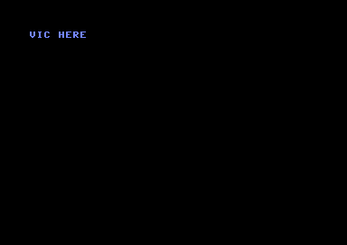
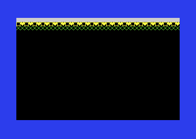
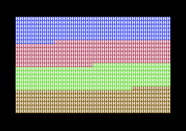
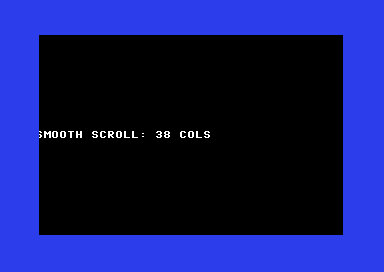

# Part III — VIC-II Graphics

The VIC-II up close — the chip that paints the screen and that the demoscene lives inside. This first half covers how the VIC sees memory and the display modes; sprites, multiplexing, badlines and the raster-effect cookbook follow in the second half.

**In this part (A):** 3.1 · 3.2 · 3.3 · 3.4 · 3.5

## 3.1 VIC memory: banks, screen, charset & bitmap pointers

**Objectives**
- Understand that the VIC-II only sees a 16 KB *bank* at a time, chosen by CIA #2 `$DD00`, and that the two bank bits are *inverted*.
- Point the *video matrix* (screen RAM) and the *character/bitmap* base within that bank using `$D018`.
- Know that Color RAM is fixed at `$D800` and that the character ROM image is a CPU-side detail, not a VIC fetch concern.

### The VIC sees 16 KB at a time

The 6510 can address the full 64 KB, but the VIC-II only has 14 address lines, so at any instant it can fetch graphics data from **one 16 KB window** of memory. There are four such windows ("banks"), and you choose which one the VIC reads from with the **low two bits of CIA #2 Port A, `$DD00`**.

Two things trip up newcomers:

1. **The bits are inverted.** The value you write is the *complement* of the bank number. `%11` selects bank 0, `%00` selects bank 3.
2. **You must make those bits outputs first.** The data-direction register `$DD02` controls this. The KERNAL already sets `$DD02 = $3F` (bits 0–5 outputs), so in a normal program the direction is fine — but if you reset `$DD02` yourself, set those bits to output before writing `$DD00`. Always read-modify-write `$DD00` so you don't disturb the serial bus bits in the upper nibble.

| `$DD00` bits 1–0 | VIC bank | VIC sees |
|------------------|----------|----------|
| `%11`            | Bank 0   | `$0000–$3FFF` (default) |
| `%10`            | Bank 1   | `$4000–$7FFF` |
| `%01`            | Bank 2   | `$8000–$BFFF` |
| `%00`            | Bank 3   | `$C000–$FFFF` |

See [Appendix E](appendix-e-cia-registers.md) for the full `$DD00` bit layout and bank table.

> Caution: banks 1 and 3 (`$4000` and `$C000`) do **not** expose the character ROM image to the VIC, and bank 3 overlaps the I/O and KERNAL area. For your first experiments stay in bank 0.

### `$D018` points the screen and characters *within* the bank

Once the bank is fixed, `$D018` says where, inside that 16 KB window, the VIC fetches:

- **Bits 7–4 (VM13–VM10)** — the **video matrix** (screen RAM) base, in units of `$0400` (1024 bytes) from the bank base. `%0001` → `$0400`, `%0011` → `$0C00`, etc.
- **Bits 3–1 (CB13–CB11)** — the **character generator** base (text modes), in units of `$0800` (2048 bytes). In bitmap mode only CB13 matters: `0` → `$0000`, `1` → `$2000` relative to the bank.
- **Bit 0** is unconnected and reads as 1.

These offsets are **relative to the current bank base**. In bank 0 the bank base is `$0000`, so the numbers are also the CPU addresses; in bank 1 you would add `$4000`, and so on. The default `$D018 = $15` gives screen at `$0400` and characters pointing at the `$1000` char-ROM image. The breakdown table, the worked example, and a within-bank quick reference are in [Appendix C](appendix-c-vic-registers.md) (`$D018 — Memory Pointers`).

### Color RAM is not in the bank

**Color RAM lives at `$D800–$DBE7` no matter which bank or `$D018` value you choose.** It is a separate 1000×4-bit chip wired permanently into that address range. Each screen cell's low nibble there selects the foreground color of the matching character. You never relocate it; you just write the same cell index in screen RAM and in `$D800`.

### Character ROM vs. what the VIC fetches

The 4 KB character ROM appears to the **CPU** at `$D000–$DFFF` only when you bank it in via the processor port `$01` (covered in Part I). That is purely a CPU-side view used for *copying* the font into RAM. Where the **VIC** fetches character bitmaps from is decided entirely by the bank + `$D018` CB bits. In banks 0 and 2 the VIC transparently sees a *shadow* of the char ROM when CB points at `$1000`/`$1800`; that is why the default screen shows letters without any font in RAM.

### Runnable example: move the screen matrix to `$0C00`

This complete program stays in bank 0 but relocates the **video matrix** from the default `$0400` to `$0C00` by setting the VM bits of `$D018` to `%0011`. It then writes characters directly to `$0C00` so you can see text at the new location. The character base is left at the ROM shadow (`$1000`) so the standard font is used.

```asm
            *=$0801
            BasicUpstart2(start)

            *=$0810

// ---- constants -------------------------------------------------
.const NEWSCREEN = $0c00      // new video-matrix base (bank 0)
.const COLORRAM  = $d800      // Color RAM is ALWAYS here

start:
            // 1) Make sure we are in VIC bank 0 (%11, inverted).
            //    DDRA bits 0-1 are already outputs (KERNAL $DD02=$3F),
            //    but we read-modify-write to be safe and tidy.
            lda $dd00
            and #%11111100        // clear the two bank bits
            ora #%00000011        // %11 -> bank 0 ($0000-$3FFF)
            sta $dd00

            // 2) Point the video matrix at $0C00, keep chars at $1000.
            //    VM13..VM10 = %0011 -> $0C00  (bits 7-4)
            //    CB13..CB11 = %010 -> $1000   (bits 3-1)
            //    bit0 reads as 1.
            lda #%00110101        // %0011 screen=$0C00, %010 char=$1000
            sta $d018

            // 3) Set colours and clear the NEW screen to spaces.
            lda #$00
            sta $d020             // border black
            sta $d021             // background black

            ldx #$00
clrloop:
            lda #$20              // PETSCII screen code for space
            sta NEWSCREEN,x
            sta NEWSCREEN+$100,x
            sta NEWSCREEN+$200,x
            sta NEWSCREEN+$2e8,x  // covers the last partial page (1000 cells)
            lda #$01              // white
            sta COLORRAM,x
            sta COLORRAM+$100,x
            sta COLORRAM+$200,x
            sta COLORRAM+$2e8,x
            inx
            bne clrloop

            // 4) Write a visible message at the top-left of the NEW screen.
            ldx #$00
msgloop:
            lda message,x
            beq done              // 0 terminator
            sta NEWSCREEN,x       // screen codes go straight to $0C00
            lda #$0e              // light blue
            sta COLORRAM,x
            inx
            jmp msgloop

done:
            jmp *                 // hold the picture for the screenshot

// Screen codes (NOT PETSCII): 'A'=$01 ... 'Z'=$1A, space=$20.
// "VIC HERE" :  V I C _ H E R E
message:
            .byte $16,$09,$03,$20,$08,$05,$12,$05
            .byte $00
```




**What you should see:** a black screen (black border and black background) with the white-on-black text `VIC HERE` in light blue at the very top-left, row 0. The text appears because the VIC is now fetching its screen codes from `$0C00` instead of `$0400`; the old `$0400` screen is no longer displayed. The `$0C00` cells we did not write hold `$20` (space), so the rest of the screen is blank. If you had forgotten to change `$D018`, the same bytes written to `$0C00` would be invisible (the VIC would still be reading `$0400`).

> Why screen codes, not PETSCII? Writing to screen RAM bypasses the KERNAL's character translation. `$01` is the screen code for `A`, `$16` for `V`, and `$20` for space — these are *not* the same as PETSCII values. See [Appendix G](appendix-g-petscii.md) for the screen-code table.

**Pitfalls**
- Forgetting the bank bits are **inverted** — writing `%00` selects bank 3, not bank 0, and your graphics vanish or land in I/O space.
- Writing `$DD00` without ensuring bits 0–1 are outputs in `$DD02`; if they are inputs, the bank does not change.
- Clobbering the serial-bus bits in `$DD00` by writing a raw value instead of read-modify-write; this can wedge disk/tape access.
- Treating `$D018` offsets as absolute addresses — they are **relative to the bank base**. In bank 1 the screen `%0001` is at `$4400`, not `$0400`.
- Trying to relocate Color RAM. It cannot move; it is hard-wired at `$D800`.
- Pointing the char base at `$1000`/`$1800` in **bank 1 or 3** and expecting the font — the char-ROM shadow is only visible in banks 0 and 2.
- Putting PETSCII codes into screen RAM and getting the wrong glyphs; screen RAM uses screen codes.

**Go deeper:** VIC-II memory access and the `$D018`/`$DD00` mechanics — [Appendix C](appendix-c-vic-registers.md) and [Appendix E](appendix-e-cia-registers.md); see also the [C64 memory map](appendix-b-memory-map.md) and the canonical reference at https://www.cebix.net/VIC-Article.txt.

## 3.2 Text mode & custom character sets

**Objectives**
- Explain how standard 40×25 text mode turns a byte in screen RAM plus a nibble in Color RAM into a coloured 8×8 glyph.
- Install a custom character set in RAM and point the VIC-II at it with `$D018`.
- Enable multicolor text mode (`$D016` MCM=1) and understand which cells become 2-bits-per-pixel.

### How standard text mode draws a cell

The default screen is a grid of **40 columns × 25 rows = 1000 cells**. For each cell the VIC-II fetches two things:

1. A **screen code** (1 byte) from the *video matrix* (screen RAM, default `$0400`–`$07E7`). This is the index 0–255 of an 8×8 glyph.
2. A **colour nibble** from Color RAM (fixed at `$D800`–`$DBE7`).

The screen code selects an 8-byte glyph in the **character generator base**. Each glyph is 8 bytes, one per pixel-row; within a byte, bit 7 is the leftmost pixel. A set bit draws the *foreground* colour (the cell's Color RAM nibble); a clear bit draws the *background* colour `$D021`. So one cell needs exactly 8 bytes of glyph data, and 256 glyphs × 8 = **2048 bytes** per charset.

Screen codes are **not** PETSCII. `A` is screen code 1, not 65; digits and most punctuation match, but letters do not. See [Appendix G](appendix-g-petscii.md) §G.2 for the full mapping and the PETSCII→screen-code conversion rules.

At power-on `$D018 = $15`: video matrix at `$0400`, character base at `$1000`. In VIC bank 0 the addresses `$1000`–`$1FFF` are a *special case* — the VIC sees the **character ROM** there even though the CPU sees RAM/IO. That is why the default font works without anyone copying it anywhere.

### Pointing the VIC at your own charset

To replace the ROM glyphs you put 2 KB of your own glyph data somewhere in the current 16 KB VIC bank and set the char-base bits **CB13–CB11** of `$D018` to point at it. Those three bits select the char base in `$0800` (2048-byte) steps *within the bank* — see [Appendix C](appendix-c-vic-registers.md) (`$D018` table and the quick-reference). The low bit of `$D018` is unconnected.

Worked example, bank 0, charset at `$3000`:

- We want char base `$3000`. Relative to the bank that is `$3000 / $0800 = %110`, so CB13–CB11 = `%110`.
- Keep the screen at `$0400`, which is VM13–VM10 = `%0001`.
- `$D018` = `%0001` `110` `_` = `%00011101` = `$1D`.

You do **not** have to define all 256 glyphs. The VIC reads 8 bytes per code regardless, so any code you never print can hold garbage — but the codes you *do* use must point at real glyph bytes you placed. A common, friendly approach is to copy the ROM font into RAM (so codes 0–255 still look normal) and then overwrite just the handful of glyphs you want to customise.

#### Reading the character ROM

The char ROM lives at `$D000`–`$DFFF` in the CPU map, *behind* the I/O block. To read it you bank I/O out via the 6510 port at `$0001` (clear bit 2, the CHAREN line), copy, then bank I/O back in. Disable interrupts while I/O is banked out, because the KERNAL IRQ handler needs I/O. (The processor port is covered in [Appendix B](appendix-b-memory-map.md).)

### A complete runnable program: a custom charset

This program copies the uppercase/graphics ROM font to `$3000`, then overwrites four screen codes with hand-drawn glyphs: a solid filled block (code 1), a hollow box (code 2), a heart (code 3) and a diagonal stripe (code 4). It points `$D018` at `$3000`, sets the border dark blue and the background black, and prints rows of these glyphs.

```asm
//----------------------------------------------------
// 3.2  Custom charset demo  (KickAssembler v5.x)
//----------------------------------------------------
            BasicUpstart2(main)

            .const SCREEN   = $0400
            .const COLRAM   = $d800
            .const CHARSET  = $3000     // our font, bank-0, char base %110

* = $0801 "Basic"
            // BasicUpstart2 emits the SYS line here

* = $1000 "Main"
main:
            sei                         // IRQ off while I/O is banked out

            // --- copy ROM font ($D000) to RAM ($3000) ---
            lda $01
            pha                         // save processor port
            lda #$33                    // %00110011: CHAREN=0 -> char ROM visible
            sta $01

            ldx #$00
copyloop:
            lda $d000,x                 // page 0 of ROM font
            sta CHARSET,x
            lda $d100,x
            sta CHARSET+$100,x
            lda $d200,x
            sta CHARSET+$200,x
            lda $d300,x
            sta CHARSET+$300,x
            lda $d400,x
            sta CHARSET+$400,x
            lda $d500,x
            sta CHARSET+$500,x
            lda $d600,x
            sta CHARSET+$600,x
            lda $d700,x                 // 8 pages = 2048 bytes = full font
            sta CHARSET+$700,x
            inx
            bne copyloop

            pla
            sta $01                     // restore port: I/O back in
            cli                         // IRQ on again

            // --- overwrite a few glyphs with our own designs ---
            // glyph 1 (8 bytes) <- solid block
            ldx #$00
glyphloop:
            lda glyphdata,x
            sta CHARSET + 1*8,x         // codes 1..4 are 4 glyphs = 32 bytes
            inx
            cpx #32
            bne glyphloop

            // --- point VIC at our charset, keep screen at $0400 ---
            lda #$1d                    // VM=%0001 ($0400), CB=%110 ($3000)
            sta $d018

            // --- colours: dark blue border/bg ---
            lda #$06
            sta $d020
            lda #$00
            sta $d021

            // --- clear the screen to spaces (code 32) ---
            lda #32
            ldx #$00
clrloop:
            sta SCREEN,x
            sta SCREEN+$100,x
            sta SCREEN+$200,x
            sta SCREEN+$2e8,x           // last partial page (1000 cells)
            inx
            bne clrloop

            // --- print rows of our 4 custom glyphs across the top ---
            // row 0: 40 solid blocks (code 1) in light grey
            ldx #$00
row0:
            lda #1
            sta SCREEN,x
            lda #15                     // light grey
            sta COLRAM,x
            inx
            cpx #40
            bne row0

            // row 1: alternating box/heart (codes 2,3) in yellow
            ldx #$00
row1:
            txa
            and #$01
            clc
            adc #2                      // -> 2 or 3
            sta SCREEN+40,x
            lda #7                      // yellow
            sta COLRAM+40,x
            inx
            cpx #40
            bne row1

            // row 2: 40 diagonal stripes (code 4) in green
            ldx #$00
row2:
            lda #4
            sta SCREEN+80,x
            lda #5                      // green
            sta COLRAM+80,x
            inx
            cpx #40
            bne row2

            jmp *                       // hold the picture for the screenshot

//----------------------------------------------------
// Glyph data: 8 bytes each, bit7 = leftmost pixel
//----------------------------------------------------
glyphdata:
            // code 1: solid filled block
            .byte %11111111, %11111111, %11111111, %11111111
            .byte %11111111, %11111111, %11111111, %11111111
            // code 2: hollow box (1px border)
            .byte %11111111, %10000001, %10000001, %10000001
            .byte %10000001, %10000001, %10000001, %11111111
            // code 3: heart
            .byte %01100110, %11111111, %11111111, %11111111
            .byte %01111110, %00111100, %00011000, %00000000
            // code 4: diagonal stripe
            .byte %10000001, %01000010, %00100100, %00011000
            .byte %00011000, %00100100, %01000010, %10000001
```




**What you should see:** a dark-blue border with a black screen interior. The top row is a solid bar of 40 **light-grey filled squares** (no gaps — they tile edge to edge). The second row alternates a **hollow box** and a **heart**, both **yellow**, across all 40 columns. The third row is 40 **green** glyphs each showing an X-shaped diagonal cross. All other lines are blank (black). The picture is static.

### Multicolor text mode

Setting **MCM=1** in `$D016` (bit 4) turns on multicolor *text*. It does not affect every cell — it works per-cell, keyed on **bit 3 of the Color RAM nibble**:

- If the cell's colour value is **0–7** (bit 3 clear): the cell stays **hi-res**, exactly as standard text, using colour 0–7 as foreground.
- If the cell's colour value is **8–15** (bit 3 set): the cell is drawn **multicolor**. The glyph's 8 bits per row are read as **four 2-bit pairs**, so horizontal resolution halves (logically 4 wide × 8 tall, each pixel doubled to fill the 8×8 cell — hence the "12×8 cell becomes coarser" feel). The four bit-pair values select:

| Bit pair | Colour source |
|---|---|
| `00` | Background `$D021` |
| `01` | Background 1 `$D022` |
| `10` | Background 2 `$D023` |
| `11` | the **low 3 bits** of the Color RAM nibble |

So `$D022` and `$D023` (see [Appendix C](appendix-c-vic-registers.md)) are *shared* across all multicolor cells, while pattern `11` gives each cell an individual colour (the low 3 bits of its nibble, i.e. colours 0–7). Enable with:

```asm
            lda $d016
            ora #%00010000      // set MCM (bit 4); leave CSEL/XSCROLL alone
            sta $d016
            lda #$02            // $D022 background 1 = red
            sta $d022
            lda #$07            // $D023 background 2 = yellow
            sta $d023
            // a cell with Color RAM = $0A (light red, bit3 set) is now multicolor;
            // its "11" pixels show colour (10 & %0111)=2 = red
```

Multicolor glyphs are normally **designed in pairs of bits** from the start — a font drawn for hi-res will look scrambled in multicolor because adjacent bits merge. That is why custom multicolor fonts are authored specifically for the mode.

**Pitfalls**
- **Screen codes ≠ PETSCII.** Writing `'A'` (65) into screen RAM shows a graphic glyph, not the letter. Convert per [Appendix G](appendix-g-petscii.md) §G.2 (uppercase PETSCII letter − 64 = screen code).
- **Forgetting interrupts when reading char ROM.** The KERNAL IRQ touches I/O; if you bank I/O out (`$01`) without `sei`, an interrupt mid-copy crashes. Always `sei`/`cli` around the `$01` change, and restore `$01` exactly.
- **`$D018` is bank-relative.** CB13–CB11 select the char base *within the current 16 KB VIC bank*, not an absolute address. In bank 0, only `%010` (`$1000`) and `%011` (`$1800`) see char ROM; any other value needs real RAM glyph data you placed there.
- **The charset must be inside the active VIC bank.** Putting glyphs at `$3000` only works while the VIC bank is bank 0 ($0000–$3FFF). Changing `$DD00` moves the whole window.
- **Multicolor is keyed on Color RAM bit 3.** Cells with colour 0–7 stay hi-res even when MCM=1; only colours 8–15 become multicolor. A hi-res-drawn glyph shown multicolor looks garbled because bit pairs merge.
- **Glyph 0 / unused codes.** The VIC always fetches 8 bytes per code; codes you never print can be garbage, but a stray screen-RAM byte will fetch whatever 8 bytes sit at that index — clear the screen first.

**Go deeper:** VIC-II text & character generation — https://www.cebix.net/VIC-Article.txt ; registers in [Appendix C](appendix-c-vic-registers.md), encodings in [Appendix G](appendix-g-petscii.md), memory map / `$01` port in [Appendix B](appendix-b-memory-map.md).

## 3.3 Bitmap mode (hi-res & multicolor)

**Objectives**
- Switch the VIC-II from text into **hi-res bitmap** mode (320×200) using BMM in `$D011` and the bitmap base in `$D018`.
- Understand how each 8×8 cell pulls its colours from screen RAM (hi-res) or from screen RAM + Color RAM (multicolor).
- Enable **multicolor bitmap** mode (160×200) with MCM in `$D016` and lay out the four colour sources per cell.
- Plot pixels into the 8 KB bitmap, remembering to clear it first.

### Two memory areas, not one

A character screen needs only 1000 bytes of screen RAM plus the charset. A bitmap needs much more, because every pixel is stored explicitly:

- **Bitmap data** — 8000 bytes (320×200 ÷ 8), holding one bit per pixel. Its base is `CB13 × $2000` relative to the current VIC bank, set by bit 3 of `$D018`. CB12/CB11 are *ignored* in bitmap mode.
- **Screen RAM (the colour map)** — the same 1000-byte video matrix as text mode, base `VM13–VM10 × $0400` (bits 4–7 of `$D018`). In bitmap mode it is reinterpreted as a per-cell colour map, **not** as character codes.

Both addresses are relative to the 16 KB VIC bank chosen by the low two (inverted) bits of CIA-2 `$DD00`. The default bank 0 ($0000–$3FFF) corresponds to `$DD00` low bits = `%11`. See [Appendix C](appendix-c-vic-registers.md) for the `$D018` and `$DD00` breakdowns and [Appendix B](appendix-b-memory-map.md) for the memory map.

### The bitmap byte layout (the part everyone trips on)

The bitmap is **not** a simple left-to-right, top-to-bottom array. It is organised as 8×8 *cells* in the same order as text cells (40 across, 25 down). Within a cell the 8 bytes are the 8 pixel rows, top to bottom; within a byte bit 7 is the leftmost pixel.

The byte holding pixel (x, y) for a hi-res bitmap at base `BMP` is:

```
cell    = (y / 8) * 320 + (x / 8) * 8     // start of the 8x8 cell
row     = y & 7                            // 0..7 within the cell
addr    = BMP + cell + row
bit     = 7 - (x & 7)                      // 7 = leftmost pixel
```

### Hi-res: two colours per cell

With BMM=1, MCM=0 (ECM=0) you get 320×200 with **1 bit per pixel**. Each 8×8 cell takes its two colours from that cell's **screen RAM byte**:

- bit = 1 → **foreground** = upper nibble of the screen byte
- bit = 0 → **background** = lower nibble of the screen byte

There is no global background register in hi-res; every cell carries its own pair. Color RAM `$D800` is unused in hi-res.

### A complete hi-res program: corner-to-corner diagonal

This program enables a hi-res bitmap at `$2000`, screen RAM at `$0400` (bank 0), clears the 8 KB bitmap, sets every cell to white-on-blue, then plots a diagonal line from the top-left corner to the bottom-right corner.

```asm
            BasicUpstart2(start)
*=$0801 "Basic"

            .const BITMAP = $2000   // bitmap base (CB13=1)
            .const SCREEN = $0400   // colour map / video matrix
            // pointer used by (zp),y must live in zero page:
            .label zplo   = $fb
            .label zphi   = $fc

*=$0810 "Main"
start:
            sei

            // --- $D018: screen at $0400 (VM=%0001), bitmap at $2000 (CB13=1) ---
            lda #%00011000          // VM bits=%0001 ($0400), CB13=1 ($2000)
            sta $d018

            // --- enable bitmap mode: $D011 bit5 (BMM)=1, keep DEN, RSEL, YSCROLL ---
            lda #%00111011          // RST8=0 ECM=0 BMM=1 DEN=1 RSEL=1 YSCROLL=3
            sta $d011
            lda #%00001000          // MCM=0, CSEL=1 (40 cols), XSCROLL=0
            sta $d016

            // --- clear the 8 KB bitmap (8192 bytes covers all 8000 in use) ---
            lda #$00
            ldx #$00
clrloop:
            sta BITMAP+$0000,x
            sta BITMAP+$0100,x
            sta BITMAP+$0200,x
            sta BITMAP+$0300,x
            sta BITMAP+$0400,x
            sta BITMAP+$0500,x
            sta BITMAP+$0600,x
            sta BITMAP+$0700,x
            sta BITMAP+$0800,x
            sta BITMAP+$0900,x
            sta BITMAP+$0a00,x
            sta BITMAP+$0b00,x
            sta BITMAP+$0c00,x
            sta BITMAP+$0d00,x
            sta BITMAP+$0e00,x
            sta BITMAP+$0f00,x
            sta BITMAP+$1000,x
            sta BITMAP+$1100,x
            sta BITMAP+$1200,x
            sta BITMAP+$1300,x
            sta BITMAP+$1400,x
            sta BITMAP+$1500,x
            sta BITMAP+$1600,x
            sta BITMAP+$1700,x
            sta BITMAP+$1800,x
            sta BITMAP+$1900,x
            sta BITMAP+$1a00,x
            sta BITMAP+$1b00,x
            sta BITMAP+$1c00,x
            sta BITMAP+$1d00,x
            sta BITMAP+$1e00,x
            sta BITMAP+$1f00,x
            inx
            bne clrloop

            // --- fill screen RAM: upper nibble=1 (white fg), lower nibble=6 (blue bg) ---
            lda #$16                // %0001 0110 -> fg=white(1), bg=blue(6)
            ldx #$00
colloop:
            sta SCREEN+$0000,x
            sta SCREEN+$0100,x
            sta SCREEN+$0200,x
            sta SCREEN+$02e8,x      // cover the last <256 of the 1000 cells
            inx
            bne colloop

            lda #$06                // border blue to frame the picture
            sta $d020

            // --- plot the diagonal: y from 0..199, x = y (we go 0..199 in x too) ---
            // For each y, plot pixel (y, y). That traces the main diagonal of a
            // 200x200 square in the top-left of the 320-wide screen.
            ldx #$00                // x acts as the loop counter / coordinate (0..199)
diag:
            // compute address for pixel (X, X)
            // cell = (X/8)*320 + (X/8)*8 = (X/8)*328 ... easier: build with helpers
            txa
            sta xcoord
            sta ycoord
            jsr plot
            inx
            cpx #200
            bne diag

            cli
hold:       jmp *                   // hold the picture for the screenshot

// ---- plot pixel (xcoord, ycoord) into the hi-res bitmap ----
xcoord:     .byte 0
ycoord:     .byte 0
plot:
            // row offset within cell = ycoord & 7
            lda ycoord
            and #$07
            sta zptmp               // save row

            // cell column = xcoord/8  -> *8 = (xcoord & $f8)
            lda xcoord
            and #$f8                // (xcoord/8)*8
            sta zplo
            lda #$00
            sta zphi

            // cell row = ycoord/8 ; *320 = *256 + *64
            lda ycoord
            lsr
            lsr
            lsr                     // ycoord/8 (0..24)
            sta cellrow
            // *256
            clc
            adc zphi
            sta zphi                // add (cellrow) to high byte  (= cellrow*256)
            // do a proper 16-bit cellrow*64:
            lda #$00
            sta tmp16hi
            lda cellrow
            sta tmp16lo
            ldy #$06
mul64:
            asl tmp16lo
            rol tmp16hi
            dey
            bne mul64
            // add cellrow*64 to zp pointer
            clc
            lda zplo
            adc tmp16lo
            sta zplo
            lda zphi
            adc tmp16hi
            sta zphi
            // add row offset within cell
            clc
            lda zplo
            adc zptmp
            sta zplo
            lda zphi
            adc #$00
            sta zphi
            // add bitmap base $2000
            clc
            lda zphi
            adc #>BITMAP
            sta zphi
            // set the bit: 7 - (xcoord & 7)
            lda xcoord
            and #$07
            tay
            lda bitmask,y
            ldy #$00
            ora (zplo),y
            sta (zplo),y
            rts

zptmp:      .byte 0
cellrow:    .byte 0
tmp16lo:    .byte 0
tmp16hi:    .byte 0
bitmask:    .byte $80,$40,$20,$10,$08,$04,$02,$01
```


> Note: `zplo/zphi` are used here with `(zplo),y` indirect addressing, which **requires** them to be in zero page. They are therefore declared as zero-page labels at the top (`.label zplo = $fb` / `.label zphi = $fc`); pointing them anywhere else assembles but reads/writes the wrong memory, so the picture comes out scrambled. The arithmetic above is what matters pedagogically.

**What you should see:** a **blue** screen and border. A single-pixel-wide **white diagonal line** runs from the very top-left corner down and to the right, ending at roughly the centre-left of the screen (it spans a 200×200 square, so it stops about two-thirds of the way across the 320-wide bitmap and at the very bottom row). The rest of the bitmap stays solid blue because every cleared bit reads the cell background (blue).

### Multicolor bitmap: four colours per cell

Add MCM=1 (`$D016` bit 4) on top of BMM. Now pixels are read **two bits at a time**, so horizontal resolution halves to **160×200** (each "fat pixel" is 2 hi-res pixels wide). The byte layout is identical — same 8×8 cells, same 8000 bytes — but each byte holds 4 two-bit pixels instead of 8 one-bit pixels.

Each 8×8 cell now offers **four** colours selected by the bit-pair:

| Bits | Colour source |
|------|---------------|
| `00` | Background — global `$D021` (B0C) |
| `01` | Upper nibble of the cell's **screen RAM** byte |
| `10` | Lower nibble of the cell's **screen RAM** byte |
| `11` | Low nibble of the cell's **Color RAM** byte at `$D800` |

So a multicolor bitmap uses *three* memory areas: the bitmap, screen RAM, and Color RAM. The trade-off versus hi-res is colour-for-resolution: 4 colours per cell but half the horizontal pixels, and adjacent fat pixels of different colour-pairs still share the cell's palette (the classic "colour clash" constraint).

To switch the program above into multicolor, change two lines and supply the extra colour sources:

```asm
            lda #%00111011          // $D011: BMM=1 (unchanged)
            sta $d011
            lda #%00011000          // $D016: MCM=1 now (bit4), CSEL=1, XSCROLL=0
            sta $d016
            lda #$00                // $D021 background = black -> bit-pair 00
            sta $d021
            // screen RAM upper nibble (01) and lower nibble (10) as before,
            // and fill Color RAM $D800 with a colour for bit-pair 11.
```

A bitmap byte of `%11100100` then paints four fat pixels using colour-pairs `11`, `10`, `01`, `00` left to right — Color RAM, screen-low-nibble, screen-upper-nibble, `$D021`.

### Returning to text mode

Bitmap mode leaves the KERNAL's text screen untouched in RAM but the VIC ignores it. To get a usable text screen back: clear BMM/MCM (`$D011=$1B`, `$D016=$C8`), restore `$D018=$15`, and either `jsr $E544` (clear screen) or RESET. For a static demo we simply `jmp *` and never return.

**Pitfalls**
- **Forgetting to clear the 8 KB bitmap.** Power-on/leftover bytes produce a screen full of random pixels. Always zero all 8000 (clearing 8192 is harmless and easier to loop).
- **Wrong `$D018`.** Bitmap base is set only by **bit 3 (CB13)**; bits 2–1 are ignored in bitmap mode. Mixing up the screen-base nibble and the char/bitmap nibble is the most common bug.
- **Linear addressing.** The bitmap is cell-organised, not row-linear. Plotting with `addr = base + y*40 + x/8` (the text formula) gives a scrambled image. Use `(y/8)*320 + (x/8)*8 + (y&7)`.
- **`(zp),y` needs zero page.** Indirect-indexed plotting requires the pointer in `$00–$FF`. Declaring it elsewhere assembles but reads the wrong memory.
- **MCM resolution.** In multicolor you have 160 fat pixels across, not 320. Treating x as 0–319 writes off the right edge of each cell.
- **ECM must stay 0.** Setting ECM with BMM/MCM is an "invalid" mode and blanks the screen black (see the mode table in [Appendix C](appendix-c-vic-registers.md)).
- **Color RAM high nibble is garbage.** Only the low 4 bits of `$D800` are meaningful for bit-pair `11`.

**Go deeper:** [Appendix C — VIC-II registers](appendix-c-vic-registers.md) ($D011 BMM, $D016 MCM, $D018 layout, the ECM/BMM/MCM mode table) and [Appendix B — memory map](appendix-b-memory-map.md) for bitmap/screen/Color-RAM placement; authoritative source: the [VIC-II article (Christian Bauer)](https://www.cebix.net/VIC-Article.txt).

## 3.4 Extended Background Colour Mode & the Mode Matrix

**Objectives**
- Understand how Extended Background Colour Mode (ECM) uses the top two bits of each character code to choose one of **four** background colours.
- See why ECM costs you all but **64** of the character shapes.
- Learn the complete VIC-II display **mode matrix**: how the ECM/BMM/MCM bits combine, and which combinations are valid versus the "illegal" black-screen ones.

### What ECM does

In standard text mode every on-screen character cell is just an 8x8 glyph drawn in the foreground colour (from Color RAM) over the single shared background colour in **$D021**. ECM keeps the text-mode glyph machinery but reinterprets the **two high bits** of each screen code as a *background selector*:

- Bits 0-5 of the screen code (0-63) still choose the glyph shape.
- Bit 6 and bit 7 together pick which of **four** background colour registers fills the cell behind the glyph:

| Screen code bit 7 | bit 6 | Background register |
|-------------------|-------|---------------------|
| 0 | 0 | **$D021** (B0C) |
| 0 | 1 | **$D022** (B1C) |
| 1 | 0 | **$D023** (B2C) |
| 1 | 1 | **$D024** (B3C) |

The foreground colour still comes from Color RAM ($D800-$DBE7) per cell, exactly as in standard text. So ECM gives you a *per-character* choice of one of four backgrounds, on top of the usual 16 foreground colours — useful for status bars, coloured text panels, and "windowed" layouts.

The price: because bits 6-7 are stolen for the background selector, only screen codes **0-63** address distinct glyphs. Codes 64-127 reuse glyphs 0-63 (with background $D022), 128-191 reuse them again (background $D023), and 192-255 once more (background $D024). In the uppercase/graphics charset that means you keep `@`, the letters `A`-`Z`, a few punctuation marks and some graphics — but you lose the reverse-video set and the upper graphics glyphs.

ECM is enabled by setting **bit 6 of $D011** while leaving BMM ($D011 bit 5) and MCM ($D016 bit 4) at 0. See [Appendix C](appendix-c-vic-registers.md) for the full $D011 / $D016 bit breakdowns and the colour-register list.

### The VIC-II mode matrix

The VIC-II's display mode is selected by three bits spread across two registers:

- **ECM** = $D011 bit 6
- **BMM** = $D011 bit 5
- **MCM** = $D016 bit 4

All eight combinations and their results:

| ECM | BMM | MCM | Mode | Notes |
|-----|-----|-----|------|-------|
| 0 | 0 | 0 | **Standard text** | Power-on default. Glyph + Color RAM fg + $D021 bg. |
| 0 | 0 | 1 | **Multicolor text** | Cells with Color RAM bit 3 set become 4x8 double-wide pixels using $D021/$D022/$D023 + Color RAM. |
| 0 | 1 | 0 | **Standard (hi-res) bitmap** | 320x200 mono; fg/bg per 8x8 cell from screen RAM. |
| 0 | 1 | 1 | **Multicolor bitmap** | 160x200; 4 colours per 8x8 cell ($D021 + screen-RAM nibbles + Color RAM). |
| 1 | 0 | 0 | **Extended background colour (ECM) text** | This lesson. 64 glyphs, 4 backgrounds $D021-$D024. |
| 1 | 0 | 1 | *Invalid* | "Illegal" combination — the VIC outputs **black** for the display area. |
| 1 | 1 | 0 | *Invalid* | "Illegal" combination — **black** display area. |
| 1 | 1 | 1 | *Invalid* | "Illegal" combination — **black** display area. |

The three combinations with **ECM=1 together with BMM=1 and/or MCM=1** are not real modes. The VIC still fetches data and clocks pixels, but the colour output for every foreground/background dot is forced to **black** (the border is unaffected). In demos these "illegal modes" are sometimes deliberately toggled mid-frame; for ordinary programming, treat any ECM-with-BMM/MCM combination as a bug. The rule of thumb: **only one of ECM, BMM, MCM (plus the BMM+MCM bitmap pair) should ever be set for a legitimate mode.**

### Runnable example: four background zones

The program below switches into ECM text mode and fills the screen so that the four background colours each occupy a horizontal band of rows. It does this by writing the **same** glyph data into Color RAM and the screen, but adding 0 / 64 / 128 / 192 to the screen codes in successive quarters of the screen so each quarter selects a different background register.

```asm
// ECM demo: four horizontal background zones, KickAssembler v5.x
                BasicUpstart2(start)

                * = $0801 "Basic"           // BasicUpstart2 sits here

                * = $0810 "Main"
.const SCREEN = $0400
.const COLRAM = $d800

start:
                sei

                // --- Set the four ECM background colours ---
                lda #6                      // B0C ($D021) = blue   -> top quarter
                sta $d021
                lda #2                      // B1C ($D022) = red
                sta $d022
                lda #5                      // B2C ($D023) = green
                sta $d023
                lda #9                      // B3C ($D024) = brown  -> bottom quarter
                sta $d024

                lda #0                      // border black, for clean banding
                sta $d020

                // --- Enable ECM text mode ---
                // $D011: take reset value $1B and set bit 6 (ECM).
                // BMM (bit5)=0, DEN (bit4)=1, RSEL=1, YSCROLL=3 stay as default.
                lda #%01011011              // = $1B | $40
                sta $d011
                // $D016: leave MCM=0 (bit4), CSEL=1, XSCROLL=0  -> standard text width
                lda #%00001000              // $08 (RES=0, MCM=0, CSEL=1, XSCROLL=0)
                sta $d016
                // $D018 stays at the KERNAL default ($15): screen $0400, chars = ROM
                // $DD00 (VIC bank) stays at default bank 0.

                // --- Fill the screen ---
                // 25 rows x 40 cols = 1000 cells. We fill 250 cells per quarter
                // and OR in the high bits that pick the background register:
                //   rows  0- 5 : +$00  -> $D021
                //   rows  6-11 : +$40  -> $D022
                //   rows 12-18 : +$80  -> $D023
                //   rows 19-24 : +$C0  -> $D024
                // For simplicity we drive the split purely by linear cell index:
                //   cells   0-249 -> $D021, 250-499 -> $D022,
                //   cells 500-749 -> $D023, 750-999 -> $D024.

                ldx #0
fill:
                // foreground colour: white everywhere
                lda #1
                sta COLRAM,x
                sta COLRAM+250,x
                sta COLRAM+500,x
                sta COLRAM+750,x

                // glyph: screen code 8 = letter 'H' (PETSCII 'H' 72 - 64).
                // Add the quarter's background-selector bits.
                lda #8 + $00                // 'H' on background $D021
                sta SCREEN,x
                lda #8 + $40                // 'H' on background $D022 (bit6 set)
                sta SCREEN+250,x
                lda #8 + $80                // 'H' on background $D023 (bit7 set)
                sta SCREEN+500,x
                lda #8 + $c0                // 'H' on background $D024 (bits6+7)
                sta SCREEN+750,x

                inx
                cpx #250
                bne fill

                cli
loop:           jmp loop                    // hold the picture for the screenshot
```




**What you should see:** four horizontal bands of white `H` characters covering the full 40x25 screen. From top to bottom the background colour of each band changes: the top quarter is **blue** ($D021=6), the next is **red** ($D022=2), the next is **green** ($D023=5) and the bottom quarter is **brown** ($D024=9). The glyph in every cell is identical — only the *background* differs between bands, which is the whole point of ECM. The border is black.

To prove the "illegal mode" entry of the matrix, change the `$D016` write to `lda #%00011000` (MCM=1) while keeping ECM on: the 40x25 character area collapses to **solid black**, while the black border is unchanged. Setting BMM instead ($D011 bit 5) does the same.

### Why the glyph is 'H' and not a letter you typed

Screen RAM holds **screen codes**, not PETSCII. In the uppercase/graphics charset the letters `A`-`Z` are screen codes 1-26, so `H` is code 8 (PETSCII 'H' is 72; 72 - 64 = 8). Adding $40/$80/$C0 only sets the two background-selector bits and leaves the low six bits (the glyph index 8) intact — exactly why ECM is restricted to codes 0-63 for distinct shapes. See [Appendix G](appendix-g-petscii.md) for the screen-code table and PETSCII-to-screen-code conversion.

**Pitfalls**
- **Forgetting BMM/MCM must be 0.** ECM is only valid with BMM=0 and MCM=0. Any other combination gives the black-screen "illegal" modes, not a fancier display.
- **Building $D011 from scratch and dropping DEN.** Always start from the reset value $1B (which keeps DEN=1, RSEL=1, YSCROLL=3) and OR in $40, rather than writing a value that accidentally clears DEN (bit 4) and blanks the screen to border colour.
- **Trying to use glyphs above code 63.** Codes 64-255 are *not* extra shapes in ECM — they are glyphs 0-63 again, just on a different background. The reverse-video set and upper graphics glyphs are unavailable.
- **Confusing PETSCII with screen codes.** Printing via the KERNAL writes PETSCII and may also emit control codes; for ECM banding you generally POKE screen codes directly so you control bits 6-7.
- **Expecting the foreground to change between bands.** ECM only switches the *background*; the foreground still comes from Color RAM per cell. Here it is white everywhere on purpose.

**Go deeper:** VIC-II display-mode bits and the four background registers are specified in [Appendix C](appendix-c-vic-registers.md) (see the $D011, $D016 "Display mode selection" table, and the $D021-$D024 colour registers); the authoritative source is the VIC-II article at https://www.cebix.net/VIC-Article.txt.

## 3.5 Smooth scrolling & the hard scroll

**Objectives**
- Use the VIC-II fine-scroll registers ($D016 bits 0-2 for X, $D011 bits 0-2 for Y) to shift the whole display 0-7 pixels.
- Understand why you must shrink the display to 38 columns / 24 rows so the incoming edge stays hidden in the border.
- Combine fine scrolling with a per-frame hard scroll (a character-matrix copy) to produce continuous, smooth motion.

### The two kinds of scroll

The VIC-II shows the screen RAM (the 40x25 character matrix) at a position that you can nudge by a few pixels in either axis:

- **$D016** (Control Register 2) bits 0-2 are **XSCROLL**, the horizontal fine offset, 0-7 pixels.
- **$D011** (Control Register 1) bits 0-2 are **YSCROLL**, the vertical fine offset, 0-7 pixels.

See [Appendix C](appendix-c-vic-registers.md) for the full bit breakdown of both registers. Increasing XSCROLL pushes the displayed characters to the **right**; decreasing it pushes them **left**. Each step is exactly 8 pixels of beam travel divided into one of 8 sub-positions, because the VIC emits 8 pixels per CPU cycle (see [Appendix H](appendix-h-timing.md) section H.4).

Fine scrolling alone only buys you 7 pixels of motion. A character is 8 pixels wide, so once you have shifted by a full 8 pixels you have to do a **hard scroll**: physically move every character in screen RAM by one cell (a copy loop) and snap the fine offset back to its starting value. Fine scroll handles the sub-character smoothness; the hard scroll handles the per-character bookkeeping. Together they give the illusion of continuous movement.

### Why you must shrink the display

There is a problem. As you decrement XSCROLL from 7 toward 0, the characters slide left and a new column of pixels appears on the **right** edge — and a column slides off the **left** edge. In the default **40-column** mode (CSEL=1) those edges are at the very edge of the displayable area, so the partial, garbage-looking incoming/outgoing characters are *visible*. That looks ugly.

The fix is to switch to **38-column mode** by clearing **CSEL** ($D016 bit 3). This widens the left and right borders by one character each, covering exactly the columns where the messy edge action happens. The visible window shrinks from 40 to 38 columns and the scrolling edges hide behind the border.

The vertical equivalent is **24-row mode**: clear **RSEL** ($D011 bit 3) to widen the top and bottom borders so vertical fine scrolling has somewhere to hide its incoming row.

> Important: do **not** read-modify-write $D016/$D011 carelessly. $D011 also holds RST8 (raster bit 8), ECM, BMM and DEN; $D016 holds MCM and the reserved RES bit. Mask only the bits you intend to change, or write a known full byte.

### The scroll cycle

A horizontal scroller that moves the screen left by one pixel per frame runs this loop, once per frame (typically inside a raster IRQ — see Part II):

1. Decrement the fine offset: `XSCROLL = XSCROLL - 1`.
2. If it was already 0, it wraps. On wrap:
   - Do a **hard scroll**: copy each character in screen RAM one cell to the left (`src = col+1` → `dst = col`), for every row you are scrolling.
   - Fill the now-empty rightmost column with the next incoming character.
   - Reset the fine offset to 7.
3. Otherwise just leave the matrix alone; the new XSCROLL value does the work.

So XSCROLL counts 7,6,5,4,3,2,1,0 (8 pixels of smooth slide), then the hard scroll happens and XSCROLL snaps back to 7. Net effect: 8 pixels of fine motion plus one character of hard motion = one whole character of seamless travel, repeated forever.

### A static frame to verify the principle

The program below is a single static frame: it prints a row of text, switches to 38-column mode, and sets a **fixed** fine X offset of 3. This isolates the two pieces you must get right — the mode switch and the offset — without the timing of an animated scroller. A full scroller would simply update `$D016` every frame and run the hard-scroll copy on wrap, as described above.

```asm
//-----------------------------------------------------------
// 3.5 Smooth scrolling demo - static frame, 38-column mode
// Shows a text row shifted left a few pixels with wide borders.
//-----------------------------------------------------------
            BasicUpstart2(start)        // SYS 2061 stub -> start
            *=$0801 "Basic"

            *=$0810 "Main"
start:
            // --- colours so the effect is easy to see ---
            lda #$06                    // blue
            sta $d020                   // border
            lda #$00                    // black
            sta $d021                   // background

            // --- clear screen to spaces, colour RAM to white ---
            ldx #$00
clrloop:
            lda #$20                    // PETSCII screen code for space
            sta $0400,x
            sta $0500,x
            sta $0600,x
            sta $0700,x
            lda #$01                    // white
            sta $d800,x
            sta $d900,x
            sta $da00,x
            sta $db00,x
            inx
            bne clrloop

            // --- write our message into screen row 12 ---
            // Row 12 starts at $0400 + 12*40 = $0400 + 480 = $05E0
            ldx #$00
msgloop:
            lda message,x
            beq msgdone                 // 0 terminator
            sta $05e0,x                 // screen RAM
            inx
            jmp msgloop
msgdone:

            // --- switch to 38-column mode and set fine X offset ---
            // $D016: clear CSEL (bit 3) -> 38 cols ; XSCROLL (bits 0-2) = 3
            // MCM (bit 4) = 0, RES (bit 5) = 0. Bits 6-7 read as 1 anyway.
            lda #%00000011              // CSEL=0, XSCROLL=3
            sta $d016

            // --- keep 25 rows (RSEL=1) and default YSCROLL=3 ---
            // Default $D011 = $1B already satisfies that; leave it.

            // --- hold the frame so the screenshot can capture it ---
hold:
            jmp hold

// Screen codes: 'S' = $13, etc. We embed a ready-made screen-code
// string. Use KickAss text helpers for screen codes:
message:
            .text "smooth scroll: 38 cols"   // KickAss emits screen codes
            .byte 0                            // terminator
```




What you should see on screen: a **blue border** that is noticeably **wider on the left and right** than normal (because the display is now 38 columns), a **black** screen interior, and a single row of **white** text reading `smooth scroll: 38 cols` roughly in the vertical middle. The whole text row (indeed the entire character display) is nudged a **few pixels to the left** compared with the default — that is the XSCROLL=3 setting at work. The wider side borders are the visual proof that 38-column mode is active and would hide a scroller's incoming edge.

> Note on `.text`: KickAssembler's `.text` directive emits screen codes (not PETSCII) by default in the standard encoding, which is exactly what writing directly into $0400 screen RAM expects. If your build uses a different default encoding, prefix with `.encoding "screencode_mixed"`.

### Turning it into a real scroller (sketch)

To animate, run the following each frame instead of holding:

```asm
            // per-frame, e.g. inside a raster IRQ at the bottom of screen
            lda $d016
            and #%11111000              // keep CSEL/MCM, clear XSCROLL
            sta scrollx_keep            // (or rebuild the byte yourself)
            dec fineX                   // fineX: a zero-page var, starts at 7
            bpl noWrap                  // still 0..7 ? just use it
            lda #7
            sta fineX                   // wrapped: reset offset
            jsr hardScrollLeft          // shift screen RAM one cell left,
                                        // feed next char into column 37
noWrap:
            lda fineX
            // OR in CSEL=0 etc., then:
            sta $d016
```

`hardScrollLeft` is a copy loop: for each scrolled row, `lda screen+1,x : sta screen,x` across the row, then place the next incoming character in the last column. Doing this once per 8 frames keeps the CPU cost low; the fine offset does the visible work on the other 7 frames.

**Pitfalls**
- Forgetting to clear CSEL (or RSEL) leaves you in 40-column (25-row) mode, so the messy incoming/outgoing edge characters are visible at the screen border. Always shrink the axis you scroll.
- Read-modify-writing $D011 without masking can clobber RST8/DEN/BMM/ECM. Mask to bits 0-2 (`and #%11111000` / `ora` your value) or write a deliberate full byte.
- $D016 bits 6-7 read back as 1 and bit 5 (RES) should stay 0; building the byte from a literal like `%00000011` is safe, but if you read-modify-write keep MCM (bit 4) intact.
- The hard scroll and the fine-offset reset must happen on the *same* frame as the wrap, or the display will jump by a character. Reset XSCROLL to 7 exactly when you do the copy.
- A wide hard-scroll copy of many rows can exceed the CPU budget on bad lines; do the copy during vertical blank or spread it out, and remember bad lines steal ~40 cycles (see [Appendix H](appendix-h-timing.md) H.2).
- The fine-scroll direction can feel inverted: decreasing XSCROLL moves content left, increasing moves it right.

**Go deeper:** Christian Bauer's VIC-II article (https://www.cebix.net/VIC-Article.txt) documents the scroll bits and display-window geometry; see [Appendix C](appendix-c-vic-registers.md) for the $D011/$D016 bit layouts and [Appendix H](appendix-h-timing.md) for the cycle budget that constrains the hard-scroll copy.


---

*Part III-B (sprites, multiplexing, bad lines, raster effects) is in progress.*
