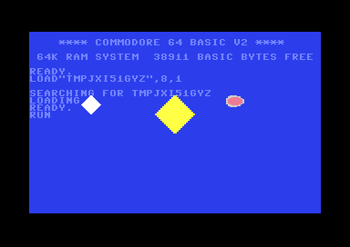
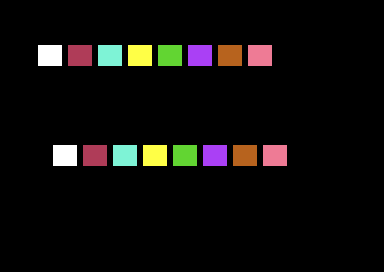
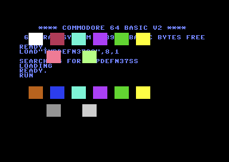
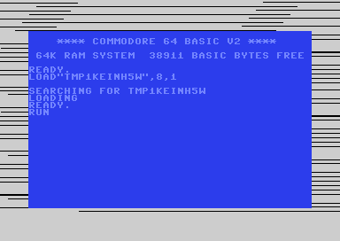
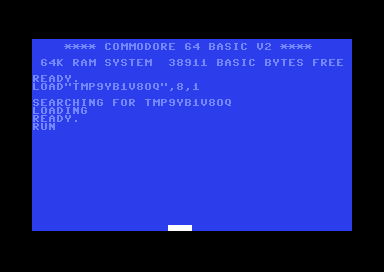

# Part III — VIC-II Graphics

The VIC-II up close — the chip that paints the screen and that the demoscene lives inside. This first half covers how the VIC sees memory and the display modes; sprites, multiplexing, badlines and the raster-effect cookbook follow in the second half.

**In this part:** 3.1 · 3.2 · 3.3 · 3.4 · 3.5 · 3.6 · 3.7 · 3.8 · 3.9 · 3.10 3.1 · 3.2 · 3.3 · 3.4 · 3.5

## 3.1 VIC memory: banks, screen, charset & bitmap pointers

**Objectives**
- Understand that the VIC-II only sees a 16 KB *bank* at a time, chosen by CIA #2 `$DD00`, and that the two bank bits are *inverted*.
- Point the *video matrix* (screen RAM) and the *character/bitmap* base within that bank using `$D018`.
- Know that Color RAM is fixed at `$D800` and that the character ROM image is a CPU-side detail, not a VIC fetch concern.

### The VIC sees 16 KB at a time

The 6510 can address the full 64 KB, but the VIC-II only has 14 address lines, so at any instant it can fetch graphics data from **one 16 KB window** of memory. There are four such windows ("banks"), and you choose which one the VIC reads from with the **low two bits of CIA #2 Port A, `$DD00`**.

Two things trip up newcomers:

1. **The bits are inverted.** The value you write is the *complement* of the bank number. `%11` selects bank 0, `%00` selects bank 3.
2. **You must make those bits outputs first.** The data-direction register `$DD02` controls this. The KERNAL already sets `$DD02 = $3F` (bits 0–5 outputs), so in a normal program the direction is fine — but if you reset `$DD02` yourself, set those bits to output before writing `$DD00`. Always read-modify-write `$DD00` so you don't disturb the serial bus bits in the upper nibble.

| `$DD00` bits 1–0 | VIC bank | VIC sees |
|------------------|----------|----------|
| `%11`            | Bank 0   | `$0000–$3FFF` (default) |
| `%10`            | Bank 1   | `$4000–$7FFF` |
| `%01`            | Bank 2   | `$8000–$BFFF` |
| `%00`            | Bank 3   | `$C000–$FFFF` |

See [Appendix E](appendix-e-cia-registers.md) for the full `$DD00` bit layout and bank table.

> Caution: banks 1 and 3 (`$4000` and `$C000`) do **not** expose the character ROM image to the VIC, and bank 3 overlaps the I/O and KERNAL area. For your first experiments stay in bank 0.

### `$D018` points the screen and characters *within* the bank

Once the bank is fixed, `$D018` says where, inside that 16 KB window, the VIC fetches:

- **Bits 7–4 (VM13–VM10)** — the **video matrix** (screen RAM) base, in units of `$0400` (1024 bytes) from the bank base. `%0001` → `$0400`, `%0011` → `$0C00`, etc.
- **Bits 3–1 (CB13–CB11)** — the **character generator** base (text modes), in units of `$0800` (2048 bytes). In bitmap mode only CB13 matters: `0` → `$0000`, `1` → `$2000` relative to the bank.
- **Bit 0** is unconnected and reads as 1.

These offsets are **relative to the current bank base**. In bank 0 the bank base is `$0000`, so the numbers are also the CPU addresses; in bank 1 you would add `$4000`, and so on. The default `$D018 = $15` gives screen at `$0400` and characters pointing at the `$1000` char-ROM image. The breakdown table, the worked example, and a within-bank quick reference are in [Appendix C](appendix-c-vic-registers.md) (`$D018 — Memory Pointers`).

### Color RAM is not in the bank

**Color RAM lives at `$D800–$DBE7` no matter which bank or `$D018` value you choose.** It is a separate 1000×4-bit chip wired permanently into that address range. Each screen cell's low nibble there selects the foreground color of the matching character. You never relocate it; you just write the same cell index in screen RAM and in `$D800`.

### Character ROM vs. what the VIC fetches

The 4 KB character ROM appears to the **CPU** at `$D000–$DFFF` only when you bank it in via the processor port `$01` (covered in Part I). That is purely a CPU-side view used for *copying* the font into RAM. Where the **VIC** fetches character bitmaps from is decided entirely by the bank + `$D018` CB bits. In banks 0 and 2 the VIC transparently sees a *shadow* of the char ROM when CB points at `$1000`/`$1800`; that is why the default screen shows letters without any font in RAM.

### Runnable example: move the screen matrix to `$0C00`

This complete program stays in bank 0 but relocates the **video matrix** from the default `$0400` to `$0C00` by setting the VM bits of `$D018` to `%0011`. It then writes characters directly to `$0C00` so you can see text at the new location. The character base is left at the ROM shadow (`$1000`) so the standard font is used.

```asm
            *=$0801
            BasicUpstart2(start)

            *=$0810

// ---- constants -------------------------------------------------
.const NEWSCREEN = $0c00      // new video-matrix base (bank 0)
.const COLORRAM  = $d800      // Color RAM is ALWAYS here

start:
            // 1) Make sure we are in VIC bank 0 (%11, inverted).
            //    DDRA bits 0-1 are already outputs (KERNAL $DD02=$3F),
            //    but we read-modify-write to be safe and tidy.
            lda $dd00
            and #%11111100        // clear the two bank bits
            ora #%00000011        // %11 -> bank 0 ($0000-$3FFF)
            sta $dd00

            // 2) Point the video matrix at $0C00, keep chars at $1000.
            //    VM13..VM10 = %0011 -> $0C00  (bits 7-4)
            //    CB13..CB11 = %010 -> $1000   (bits 3-1)
            //    bit0 reads as 1.
            lda #%00110101        // %0011 screen=$0C00, %010 char=$1000
            sta $d018

            // 3) Set colours and clear the NEW screen to spaces.
            lda #$00
            sta $d020             // border black
            sta $d021             // background black

            ldx #$00
clrloop:
            lda #$20              // PETSCII screen code for space
            sta NEWSCREEN,x
            sta NEWSCREEN+$100,x
            sta NEWSCREEN+$200,x
            sta NEWSCREEN+$2e8,x  // covers the last partial page (1000 cells)
            lda #$01              // white
            sta COLORRAM,x
            sta COLORRAM+$100,x
            sta COLORRAM+$200,x
            sta COLORRAM+$2e8,x
            inx
            bne clrloop

            // 4) Write a visible message at the top-left of the NEW screen.
            ldx #$00
msgloop:
            lda message,x
            beq done              // 0 terminator
            sta NEWSCREEN,x       // screen codes go straight to $0C00
            lda #$0e              // light blue
            sta COLORRAM,x
            inx
            jmp msgloop

done:
            jmp *                 // hold the picture for the screenshot

// Screen codes (NOT PETSCII): 'A'=$01 ... 'Z'=$1A, space=$20.
// "VIC HERE" :  V I C _ H E R E
message:
            .byte $16,$09,$03,$20,$08,$05,$12,$05
            .byte $00
```


**What you should see:** a black screen (black border and black background) with the white-on-black text `VIC HERE` in light blue at the very top-left, row 0. The text appears because the VIC is now fetching its screen codes from `$0C00` instead of `$0400`; the old `$0400` screen is no longer displayed. The `$0C00` cells we did not write hold `$20` (space), so the rest of the screen is blank. If you had forgotten to change `$D018`, the same bytes written to `$0C00` would be invisible (the VIC would still be reading `$0400`).

> Why screen codes, not PETSCII? Writing to screen RAM bypasses the KERNAL's character translation. `$01` is the screen code for `A`, `$16` for `V`, and `$20` for space — these are *not* the same as PETSCII values. See [Appendix G](appendix-g-petscii.md) for the screen-code table.

**Pitfalls**
- Forgetting the bank bits are **inverted** — writing `%00` selects bank 3, not bank 0, and your graphics vanish or land in I/O space.
- Writing `$DD00` without ensuring bits 0–1 are outputs in `$DD02`; if they are inputs, the bank does not change.
- Clobbering the serial-bus bits in `$DD00` by writing a raw value instead of read-modify-write; this can wedge disk/tape access.
- Treating `$D018` offsets as absolute addresses — they are **relative to the bank base**. In bank 1 the screen `%0001` is at `$4400`, not `$0400`.
- Trying to relocate Color RAM. It cannot move; it is hard-wired at `$D800`.
- Pointing the char base at `$1000`/`$1800` in **bank 1 or 3** and expecting the font — the char-ROM shadow is only visible in banks 0 and 2.
- Putting PETSCII codes into screen RAM and getting the wrong glyphs; screen RAM uses screen codes.

**Go deeper:** VIC-II memory access and the `$D018`/`$DD00` mechanics — [Appendix C](appendix-c-vic-registers.md) and [Appendix E](appendix-e-cia-registers.md); see also the [C64 memory map](appendix-b-memory-map.md) and the canonical reference at https://www.cebix.net/VIC-Article.txt.

## 3.2 Text mode & custom character sets

**Objectives**
- Explain how standard 40×25 text mode turns a byte in screen RAM plus a nibble in Color RAM into a coloured 8×8 glyph.
- Install a custom character set in RAM and point the VIC-II at it with `$D018`.
- Enable multicolor text mode (`$D016` MCM=1) and understand which cells become 2-bits-per-pixel.

### How standard text mode draws a cell

The default screen is a grid of **40 columns × 25 rows = 1000 cells**. For each cell the VIC-II fetches two things:

1. A **screen code** (1 byte) from the *video matrix* (screen RAM, default `$0400`–`$07E7`). This is the index 0–255 of an 8×8 glyph.
2. A **colour nibble** from Color RAM (fixed at `$D800`–`$DBE7`).

The screen code selects an 8-byte glyph in the **character generator base**. Each glyph is 8 bytes, one per pixel-row; within a byte, bit 7 is the leftmost pixel. A set bit draws the *foreground* colour (the cell's Color RAM nibble); a clear bit draws the *background* colour `$D021`. So one cell needs exactly 8 bytes of glyph data, and 256 glyphs × 8 = **2048 bytes** per charset.

Screen codes are **not** PETSCII. `A` is screen code 1, not 65; digits and most punctuation match, but letters do not. See [Appendix G](appendix-g-petscii.md) §G.2 for the full mapping and the PETSCII→screen-code conversion rules.

At power-on `$D018 = $15`: video matrix at `$0400`, character base at `$1000`. In VIC bank 0 the addresses `$1000`–`$1FFF` are a *special case* — the VIC sees the **character ROM** there even though the CPU sees RAM/IO. That is why the default font works without anyone copying it anywhere.

### Pointing the VIC at your own charset

To replace the ROM glyphs you put 2 KB of your own glyph data somewhere in the current 16 KB VIC bank and set the char-base bits **CB13–CB11** of `$D018` to point at it. Those three bits select the char base in `$0800` (2048-byte) steps *within the bank* — see [Appendix C](appendix-c-vic-registers.md) (`$D018` table and the quick-reference). The low bit of `$D018` is unconnected.

Worked example, bank 0, charset at `$3000`:

- We want char base `$3000`. Relative to the bank that is `$3000 / $0800 = %110`, so CB13–CB11 = `%110`.
- Keep the screen at `$0400`, which is VM13–VM10 = `%0001`.
- `$D018` = `%0001` `110` `_` = `%00011101` = `$1D`.

You do **not** have to define all 256 glyphs. The VIC reads 8 bytes per code regardless, so any code you never print can hold garbage — but the codes you *do* use must point at real glyph bytes you placed. A common, friendly approach is to copy the ROM font into RAM (so codes 0–255 still look normal) and then overwrite just the handful of glyphs you want to customise.

#### Reading the character ROM

The char ROM lives at `$D000`–`$DFFF` in the CPU map, *behind* the I/O block. To read it you bank I/O out via the 6510 port at `$0001` (clear bit 2, the CHAREN line), copy, then bank I/O back in. Disable interrupts while I/O is banked out, because the KERNAL IRQ handler needs I/O. (The processor port is covered in [Appendix B](appendix-b-memory-map.md).)

### A complete runnable program: a custom charset

This program copies the uppercase/graphics ROM font to `$3000`, then overwrites four screen codes with hand-drawn glyphs: a solid filled block (code 1), a hollow box (code 2), a heart (code 3) and a diagonal stripe (code 4). It points `$D018` at `$3000`, sets the border dark blue and the background black, and prints rows of these glyphs.

```asm
//----------------------------------------------------
// 3.2  Custom charset demo  (KickAssembler v5.x)
//----------------------------------------------------
            BasicUpstart2(main)

            .const SCREEN   = $0400
            .const COLRAM   = $d800
            .const CHARSET  = $3000     // our font, bank-0, char base %110

* = $0801 "Basic"
            // BasicUpstart2 emits the SYS line here

* = $1000 "Main"
main:
            sei                         // IRQ off while I/O is banked out

            // --- copy ROM font ($D000) to RAM ($3000) ---
            lda $01
            pha                         // save processor port
            lda #$33                    // %00110011: CHAREN=0 -> char ROM visible
            sta $01

            ldx #$00
copyloop:
            lda $d000,x                 // page 0 of ROM font
            sta CHARSET,x
            lda $d100,x
            sta CHARSET+$100,x
            lda $d200,x
            sta CHARSET+$200,x
            lda $d300,x
            sta CHARSET+$300,x
            lda $d400,x
            sta CHARSET+$400,x
            lda $d500,x
            sta CHARSET+$500,x
            lda $d600,x
            sta CHARSET+$600,x
            lda $d700,x                 // 8 pages = 2048 bytes = full font
            sta CHARSET+$700,x
            inx
            bne copyloop

            pla
            sta $01                     // restore port: I/O back in
            cli                         // IRQ on again

            // --- overwrite a few glyphs with our own designs ---
            // glyph 1 (8 bytes) <- solid block
            ldx #$00
glyphloop:
            lda glyphdata,x
            sta CHARSET + 1*8,x         // codes 1..4 are 4 glyphs = 32 bytes
            inx
            cpx #32
            bne glyphloop

            // --- point VIC at our charset, keep screen at $0400 ---
            lda #$1d                    // VM=%0001 ($0400), CB=%110 ($3000)
            sta $d018

            // --- colours: dark blue border/bg ---
            lda #$06
            sta $d020
            lda #$00
            sta $d021

            // --- clear the screen to spaces (code 32) ---
            lda #32
            ldx #$00
clrloop:
            sta SCREEN,x
            sta SCREEN+$100,x
            sta SCREEN+$200,x
            sta SCREEN+$2e8,x           // last partial page (1000 cells)
            inx
            bne clrloop

            // --- print rows of our 4 custom glyphs across the top ---
            // row 0: 40 solid blocks (code 1) in light grey
            ldx #$00
row0:
            lda #1
            sta SCREEN,x
            lda #15                     // light grey
            sta COLRAM,x
            inx
            cpx #40
            bne row0

            // row 1: alternating box/heart (codes 2,3) in yellow
            ldx #$00
row1:
            txa
            and #$01
            clc
            adc #2                      // -> 2 or 3
            sta SCREEN+40,x
            lda #7                      // yellow
            sta COLRAM+40,x
            inx
            cpx #40
            bne row1

            // row 2: 40 diagonal stripes (code 4) in green
            ldx #$00
row2:
            lda #4
            sta SCREEN+80,x
            lda #5                      // green
            sta COLRAM+80,x
            inx
            cpx #40
            bne row2

            jmp *                       // hold the picture for the screenshot

//----------------------------------------------------
// Glyph data: 8 bytes each, bit7 = leftmost pixel
//----------------------------------------------------
glyphdata:
            // code 1: solid filled block
            .byte %11111111, %11111111, %11111111, %11111111
            .byte %11111111, %11111111, %11111111, %11111111
            // code 2: hollow box (1px border)
            .byte %11111111, %10000001, %10000001, %10000001
            .byte %10000001, %10000001, %10000001, %11111111
            // code 3: heart
            .byte %01100110, %11111111, %11111111, %11111111
            .byte %01111110, %00111100, %00011000, %00000000
            // code 4: diagonal stripe
            .byte %10000001, %01000010, %00100100, %00011000
            .byte %00011000, %00100100, %01000010, %10000001
```


**What you should see:** a dark-blue border with a black screen interior. The top row is a solid bar of 40 **light-grey filled squares** (no gaps — they tile edge to edge). The second row alternates a **hollow box** and a **heart**, both **yellow**, across all 40 columns. The third row is 40 **green** glyphs each showing an X-shaped diagonal cross. All other lines are blank (black). The picture is static.

### Multicolor text mode

Setting **MCM=1** in `$D016` (bit 4) turns on multicolor *text*. It does not affect every cell — it works per-cell, keyed on **bit 3 of the Color RAM nibble**:

- If the cell's colour value is **0–7** (bit 3 clear): the cell stays **hi-res**, exactly as standard text, using colour 0–7 as foreground.
- If the cell's colour value is **8–15** (bit 3 set): the cell is drawn **multicolor**. The glyph's 8 bits per row are read as **four 2-bit pairs**, so horizontal resolution halves (logically 4 wide × 8 tall, each pixel doubled to fill the 8×8 cell — hence the "12×8 cell becomes coarser" feel). The four bit-pair values select:

| Bit pair | Colour source |
|---|---|
| `00` | Background `$D021` |
| `01` | Background 1 `$D022` |
| `10` | Background 2 `$D023` |
| `11` | the **low 3 bits** of the Color RAM nibble |

So `$D022` and `$D023` (see [Appendix C](appendix-c-vic-registers.md)) are *shared* across all multicolor cells, while pattern `11` gives each cell an individual colour (the low 3 bits of its nibble, i.e. colours 0–7). Enable with:

```asm
            lda $d016
            ora #%00010000      // set MCM (bit 4); leave CSEL/XSCROLL alone
            sta $d016
            lda #$02            // $D022 background 1 = red
            sta $d022
            lda #$07            // $D023 background 2 = yellow
            sta $d023
            // a cell with Color RAM = $0A (light red, bit3 set) is now multicolor;
            // its "11" pixels show colour (10 & %0111)=2 = red
```

Multicolor glyphs are normally **designed in pairs of bits** from the start — a font drawn for hi-res will look scrambled in multicolor because adjacent bits merge. That is why custom multicolor fonts are authored specifically for the mode.

**Pitfalls**
- **Screen codes ≠ PETSCII.** Writing `'A'` (65) into screen RAM shows a graphic glyph, not the letter. Convert per [Appendix G](appendix-g-petscii.md) §G.2 (uppercase PETSCII letter − 64 = screen code).
- **Forgetting interrupts when reading char ROM.** The KERNAL IRQ touches I/O; if you bank I/O out (`$01`) without `sei`, an interrupt mid-copy crashes. Always `sei`/`cli` around the `$01` change, and restore `$01` exactly.
- **`$D018` is bank-relative.** CB13–CB11 select the char base *within the current 16 KB VIC bank*, not an absolute address. In bank 0, only `%010` (`$1000`) and `%011` (`$1800`) see char ROM; any other value needs real RAM glyph data you placed there.
- **The charset must be inside the active VIC bank.** Putting glyphs at `$3000` only works while the VIC bank is bank 0 ($0000–$3FFF). Changing `$DD00` moves the whole window.
- **Multicolor is keyed on Color RAM bit 3.** Cells with colour 0–7 stay hi-res even when MCM=1; only colours 8–15 become multicolor. A hi-res-drawn glyph shown multicolor looks garbled because bit pairs merge.
- **Glyph 0 / unused codes.** The VIC always fetches 8 bytes per code; codes you never print can be garbage, but a stray screen-RAM byte will fetch whatever 8 bytes sit at that index — clear the screen first.

**Go deeper:** VIC-II text & character generation — https://www.cebix.net/VIC-Article.txt ; registers in [Appendix C](appendix-c-vic-registers.md), encodings in [Appendix G](appendix-g-petscii.md), memory map / `$01` port in [Appendix B](appendix-b-memory-map.md).

## 3.3 Bitmap mode (hi-res & multicolor)

**Objectives**
- Switch the VIC-II from text into **hi-res bitmap** mode (320×200) using BMM in `$D011` and the bitmap base in `$D018`.
- Understand how each 8×8 cell pulls its colours from screen RAM (hi-res) or from screen RAM + Color RAM (multicolor).
- Enable **multicolor bitmap** mode (160×200) with MCM in `$D016` and lay out the four colour sources per cell.
- Plot pixels into the 8 KB bitmap, remembering to clear it first.

### Two memory areas, not one

A character screen needs only 1000 bytes of screen RAM plus the charset. A bitmap needs much more, because every pixel is stored explicitly:

- **Bitmap data** — 8000 bytes (320×200 ÷ 8), holding one bit per pixel. Its base is `CB13 × $2000` relative to the current VIC bank, set by bit 3 of `$D018`. CB12/CB11 are *ignored* in bitmap mode.
- **Screen RAM (the colour map)** — the same 1000-byte video matrix as text mode, base `VM13–VM10 × $0400` (bits 4–7 of `$D018`). In bitmap mode it is reinterpreted as a per-cell colour map, **not** as character codes.

Both addresses are relative to the 16 KB VIC bank chosen by the low two (inverted) bits of CIA-2 `$DD00`. The default bank 0 ($0000–$3FFF) corresponds to `$DD00` low bits = `%11`. See [Appendix C](appendix-c-vic-registers.md) for the `$D018` and `$DD00` breakdowns and [Appendix B](appendix-b-memory-map.md) for the memory map.

### The bitmap byte layout (the part everyone trips on)

The bitmap is **not** a simple left-to-right, top-to-bottom array. It is organised as 8×8 *cells* in the same order as text cells (40 across, 25 down). Within a cell the 8 bytes are the 8 pixel rows, top to bottom; within a byte bit 7 is the leftmost pixel.

The byte holding pixel (x, y) for a hi-res bitmap at base `BMP` is:

```
cell    = (y / 8) * 320 + (x / 8) * 8     // start of the 8x8 cell
row     = y & 7                            // 0..7 within the cell
addr    = BMP + cell + row
bit     = 7 - (x & 7)                      // 7 = leftmost pixel
```

### Hi-res: two colours per cell

With BMM=1, MCM=0 (ECM=0) you get 320×200 with **1 bit per pixel**. Each 8×8 cell takes its two colours from that cell's **screen RAM byte**:

- bit = 1 → **foreground** = upper nibble of the screen byte
- bit = 0 → **background** = lower nibble of the screen byte

There is no global background register in hi-res; every cell carries its own pair. Color RAM `$D800` is unused in hi-res.

### A complete hi-res program: corner-to-corner diagonal

This program enables a hi-res bitmap at `$2000`, screen RAM at `$0400` (bank 0), clears the 8 KB bitmap, sets every cell to white-on-blue, then plots a diagonal line from the top-left corner to the bottom-right corner.

```asm
            BasicUpstart2(start)
*=$0801 "Basic"

            .const BITMAP = $2000   // bitmap base (CB13=1)
            .const SCREEN = $0400   // colour map / video matrix
            // pointer used by (zp),y must live in zero page:
            .label zplo   = $fb
            .label zphi   = $fc

*=$0810 "Main"
start:
            sei

            // --- $D018: screen at $0400 (VM=%0001), bitmap at $2000 (CB13=1) ---
            lda #%00011000          // VM bits=%0001 ($0400), CB13=1 ($2000)
            sta $d018

            // --- enable bitmap mode: $D011 bit5 (BMM)=1, keep DEN, RSEL, YSCROLL ---
            lda #%00111011          // RST8=0 ECM=0 BMM=1 DEN=1 RSEL=1 YSCROLL=3
            sta $d011
            lda #%00001000          // MCM=0, CSEL=1 (40 cols), XSCROLL=0
            sta $d016

            // --- clear the 8 KB bitmap (8192 bytes covers all 8000 in use) ---
            lda #$00
            ldx #$00
clrloop:
            sta BITMAP+$0000,x
            sta BITMAP+$0100,x
            sta BITMAP+$0200,x
            sta BITMAP+$0300,x
            sta BITMAP+$0400,x
            sta BITMAP+$0500,x
            sta BITMAP+$0600,x
            sta BITMAP+$0700,x
            sta BITMAP+$0800,x
            sta BITMAP+$0900,x
            sta BITMAP+$0a00,x
            sta BITMAP+$0b00,x
            sta BITMAP+$0c00,x
            sta BITMAP+$0d00,x
            sta BITMAP+$0e00,x
            sta BITMAP+$0f00,x
            sta BITMAP+$1000,x
            sta BITMAP+$1100,x
            sta BITMAP+$1200,x
            sta BITMAP+$1300,x
            sta BITMAP+$1400,x
            sta BITMAP+$1500,x
            sta BITMAP+$1600,x
            sta BITMAP+$1700,x
            sta BITMAP+$1800,x
            sta BITMAP+$1900,x
            sta BITMAP+$1a00,x
            sta BITMAP+$1b00,x
            sta BITMAP+$1c00,x
            sta BITMAP+$1d00,x
            sta BITMAP+$1e00,x
            sta BITMAP+$1f00,x
            inx
            bne clrloop

            // --- fill screen RAM: upper nibble=1 (white fg), lower nibble=6 (blue bg) ---
            lda #$16                // %0001 0110 -> fg=white(1), bg=blue(6)
            ldx #$00
colloop:
            sta SCREEN+$0000,x
            sta SCREEN+$0100,x
            sta SCREEN+$0200,x
            sta SCREEN+$02e8,x      // cover the last <256 of the 1000 cells
            inx
            bne colloop

            lda #$06                // border blue to frame the picture
            sta $d020

            // --- plot the diagonal: y from 0..199, x = y (we go 0..199 in x too) ---
            // For each y, plot pixel (y, y). That traces the main diagonal of a
            // 200x200 square in the top-left of the 320-wide screen.
            ldx #$00                // x acts as the loop counter / coordinate (0..199)
diag:
            // compute address for pixel (X, X)
            // cell = (X/8)*320 + (X/8)*8 = (X/8)*328 ... easier: build with helpers
            txa
            sta xcoord
            sta ycoord
            jsr plot
            inx
            cpx #200
            bne diag

            cli
hold:       jmp *                   // hold the picture for the screenshot

// ---- plot pixel (xcoord, ycoord) into the hi-res bitmap ----
xcoord:     .byte 0
ycoord:     .byte 0
plot:
            // row offset within cell = ycoord & 7
            lda ycoord
            and #$07
            sta zptmp               // save row

            // cell column = xcoord/8  -> *8 = (xcoord & $f8)
            lda xcoord
            and #$f8                // (xcoord/8)*8
            sta zplo
            lda #$00
            sta zphi

            // cell row = ycoord/8 ; *320 = *256 + *64
            lda ycoord
            lsr
            lsr
            lsr                     // ycoord/8 (0..24)
            sta cellrow
            // *256
            clc
            adc zphi
            sta zphi                // add (cellrow) to high byte  (= cellrow*256)
            // do a proper 16-bit cellrow*64:
            lda #$00
            sta tmp16hi
            lda cellrow
            sta tmp16lo
            ldy #$06
mul64:
            asl tmp16lo
            rol tmp16hi
            dey
            bne mul64
            // add cellrow*64 to zp pointer
            clc
            lda zplo
            adc tmp16lo
            sta zplo
            lda zphi
            adc tmp16hi
            sta zphi
            // add row offset within cell
            clc
            lda zplo
            adc zptmp
            sta zplo
            lda zphi
            adc #$00
            sta zphi
            // add bitmap base $2000
            clc
            lda zphi
            adc #>BITMAP
            sta zphi
            // set the bit: 7 - (xcoord & 7)
            lda xcoord
            and #$07
            tay
            lda bitmask,y
            ldy #$00
            ora (zplo),y
            sta (zplo),y
            rts

zptmp:      .byte 0
cellrow:    .byte 0
tmp16lo:    .byte 0
tmp16hi:    .byte 0
bitmask:    .byte $80,$40,$20,$10,$08,$04,$02,$01
```


> Note: `zplo/zphi` are used here with `(zplo),y` indirect addressing, which **requires** them to be in zero page. They are therefore declared as zero-page labels at the top (`.label zplo = $fb` / `.label zphi = $fc`); pointing them anywhere else assembles but reads/writes the wrong memory, so the picture comes out scrambled. The arithmetic above is what matters pedagogically.

**What you should see:** a **blue** screen and border. A single-pixel-wide **white diagonal line** runs from the very top-left corner down and to the right, ending at roughly the centre-left of the screen (it spans a 200×200 square, so it stops about two-thirds of the way across the 320-wide bitmap and at the very bottom row). The rest of the bitmap stays solid blue because every cleared bit reads the cell background (blue).

### Multicolor bitmap: four colours per cell

Add MCM=1 (`$D016` bit 4) on top of BMM. Now pixels are read **two bits at a time**, so horizontal resolution halves to **160×200** (each "fat pixel" is 2 hi-res pixels wide). The byte layout is identical — same 8×8 cells, same 8000 bytes — but each byte holds 4 two-bit pixels instead of 8 one-bit pixels.

Each 8×8 cell now offers **four** colours selected by the bit-pair:

| Bits | Colour source |
|------|---------------|
| `00` | Background — global `$D021` (B0C) |
| `01` | Upper nibble of the cell's **screen RAM** byte |
| `10` | Lower nibble of the cell's **screen RAM** byte |
| `11` | Low nibble of the cell's **Color RAM** byte at `$D800` |

So a multicolor bitmap uses *three* memory areas: the bitmap, screen RAM, and Color RAM. The trade-off versus hi-res is colour-for-resolution: 4 colours per cell but half the horizontal pixels, and adjacent fat pixels of different colour-pairs still share the cell's palette (the classic "colour clash" constraint).

To switch the program above into multicolor, change two lines and supply the extra colour sources:

```asm
            lda #%00111011          // $D011: BMM=1 (unchanged)
            sta $d011
            lda #%00011000          // $D016: MCM=1 now (bit4), CSEL=1, XSCROLL=0
            sta $d016
            lda #$00                // $D021 background = black -> bit-pair 00
            sta $d021
            // screen RAM upper nibble (01) and lower nibble (10) as before,
            // and fill Color RAM $D800 with a colour for bit-pair 11.
```

A bitmap byte of `%11100100` then paints four fat pixels using colour-pairs `11`, `10`, `01`, `00` left to right — Color RAM, screen-low-nibble, screen-upper-nibble, `$D021`.

### Returning to text mode

Bitmap mode leaves the KERNAL's text screen untouched in RAM but the VIC ignores it. To get a usable text screen back: clear BMM/MCM (`$D011=$1B`, `$D016=$C8`), restore `$D018=$15`, and either `jsr $E544` (clear screen) or RESET. For a static demo we simply `jmp *` and never return.

**Pitfalls**
- **Forgetting to clear the 8 KB bitmap.** Power-on/leftover bytes produce a screen full of random pixels. Always zero all 8000 (clearing 8192 is harmless and easier to loop).
- **Wrong `$D018`.** Bitmap base is set only by **bit 3 (CB13)**; bits 2–1 are ignored in bitmap mode. Mixing up the screen-base nibble and the char/bitmap nibble is the most common bug.
- **Linear addressing.** The bitmap is cell-organised, not row-linear. Plotting with `addr = base + y*40 + x/8` (the text formula) gives a scrambled image. Use `(y/8)*320 + (x/8)*8 + (y&7)`.
- **`(zp),y` needs zero page.** Indirect-indexed plotting requires the pointer in `$00–$FF`. Declaring it elsewhere assembles but reads the wrong memory.
- **MCM resolution.** In multicolor you have 160 fat pixels across, not 320. Treating x as 0–319 writes off the right edge of each cell.
- **ECM must stay 0.** Setting ECM with BMM/MCM is an "invalid" mode and blanks the screen black (see the mode table in [Appendix C](appendix-c-vic-registers.md)).
- **Color RAM high nibble is garbage.** Only the low 4 bits of `$D800` are meaningful for bit-pair `11`.

**Go deeper:** [Appendix C — VIC-II registers](appendix-c-vic-registers.md) ($D011 BMM, $D016 MCM, $D018 layout, the ECM/BMM/MCM mode table) and [Appendix B — memory map](appendix-b-memory-map.md) for bitmap/screen/Color-RAM placement; authoritative source: the [VIC-II article (Christian Bauer)](https://www.cebix.net/VIC-Article.txt).

## 3.4 Extended Background Colour Mode & the Mode Matrix

**Objectives**
- Understand how Extended Background Colour Mode (ECM) uses the top two bits of each character code to choose one of **four** background colours.
- See why ECM costs you all but **64** of the character shapes.
- Learn the complete VIC-II display **mode matrix**: how the ECM/BMM/MCM bits combine, and which combinations are valid versus the "illegal" black-screen ones.

### What ECM does

In standard text mode every on-screen character cell is just an 8x8 glyph drawn in the foreground colour (from Color RAM) over the single shared background colour in **$D021**. ECM keeps the text-mode glyph machinery but reinterprets the **two high bits** of each screen code as a *background selector*:

- Bits 0-5 of the screen code (0-63) still choose the glyph shape.
- Bit 6 and bit 7 together pick which of **four** background colour registers fills the cell behind the glyph:

| Screen code bit 7 | bit 6 | Background register |
|-------------------|-------|---------------------|
| 0 | 0 | **$D021** (B0C) |
| 0 | 1 | **$D022** (B1C) |
| 1 | 0 | **$D023** (B2C) |
| 1 | 1 | **$D024** (B3C) |

The foreground colour still comes from Color RAM ($D800-$DBE7) per cell, exactly as in standard text. So ECM gives you a *per-character* choice of one of four backgrounds, on top of the usual 16 foreground colours — useful for status bars, coloured text panels, and "windowed" layouts.

The price: because bits 6-7 are stolen for the background selector, only screen codes **0-63** address distinct glyphs. Codes 64-127 reuse glyphs 0-63 (with background $D022), 128-191 reuse them again (background $D023), and 192-255 once more (background $D024). In the uppercase/graphics charset that means you keep `@`, the letters `A`-`Z`, a few punctuation marks and some graphics — but you lose the reverse-video set and the upper graphics glyphs.

ECM is enabled by setting **bit 6 of $D011** while leaving BMM ($D011 bit 5) and MCM ($D016 bit 4) at 0. See [Appendix C](appendix-c-vic-registers.md) for the full $D011 / $D016 bit breakdowns and the colour-register list.

### The VIC-II mode matrix

The VIC-II's display mode is selected by three bits spread across two registers:

- **ECM** = $D011 bit 6
- **BMM** = $D011 bit 5
- **MCM** = $D016 bit 4

All eight combinations and their results:

| ECM | BMM | MCM | Mode | Notes |
|-----|-----|-----|------|-------|
| 0 | 0 | 0 | **Standard text** | Power-on default. Glyph + Color RAM fg + $D021 bg. |
| 0 | 0 | 1 | **Multicolor text** | Cells with Color RAM bit 3 set become 4x8 double-wide pixels using $D021/$D022/$D023 + Color RAM. |
| 0 | 1 | 0 | **Standard (hi-res) bitmap** | 320x200 mono; fg/bg per 8x8 cell from screen RAM. |
| 0 | 1 | 1 | **Multicolor bitmap** | 160x200; 4 colours per 8x8 cell ($D021 + screen-RAM nibbles + Color RAM). |
| 1 | 0 | 0 | **Extended background colour (ECM) text** | This lesson. 64 glyphs, 4 backgrounds $D021-$D024. |
| 1 | 0 | 1 | *Invalid* | "Illegal" combination — the VIC outputs **black** for the display area. |
| 1 | 1 | 0 | *Invalid* | "Illegal" combination — **black** display area. |
| 1 | 1 | 1 | *Invalid* | "Illegal" combination — **black** display area. |

The three combinations with **ECM=1 together with BMM=1 and/or MCM=1** are not real modes. The VIC still fetches data and clocks pixels, but the colour output for every foreground/background dot is forced to **black** (the border is unaffected). In demos these "illegal modes" are sometimes deliberately toggled mid-frame; for ordinary programming, treat any ECM-with-BMM/MCM combination as a bug. The rule of thumb: **only one of ECM, BMM, MCM (plus the BMM+MCM bitmap pair) should ever be set for a legitimate mode.**

### Runnable example: four background zones

The program below switches into ECM text mode and fills the screen so that the four background colours each occupy a horizontal band of rows. It does this by writing the **same** glyph data into Color RAM and the screen, but adding 0 / 64 / 128 / 192 to the screen codes in successive quarters of the screen so each quarter selects a different background register.

```asm
// ECM demo: four horizontal background zones, KickAssembler v5.x
                BasicUpstart2(start)

                * = $0801 "Basic"           // BasicUpstart2 sits here

                * = $0810 "Main"
.const SCREEN = $0400
.const COLRAM = $d800

start:
                sei

                // --- Set the four ECM background colours ---
                lda #6                      // B0C ($D021) = blue   -> top quarter
                sta $d021
                lda #2                      // B1C ($D022) = red
                sta $d022
                lda #5                      // B2C ($D023) = green
                sta $d023
                lda #9                      // B3C ($D024) = brown  -> bottom quarter
                sta $d024

                lda #0                      // border black, for clean banding
                sta $d020

                // --- Enable ECM text mode ---
                // $D011: take reset value $1B and set bit 6 (ECM).
                // BMM (bit5)=0, DEN (bit4)=1, RSEL=1, YSCROLL=3 stay as default.
                lda #%01011011              // = $1B | $40
                sta $d011
                // $D016: leave MCM=0 (bit4), CSEL=1, XSCROLL=0  -> standard text width
                lda #%00001000              // $08 (RES=0, MCM=0, CSEL=1, XSCROLL=0)
                sta $d016
                // $D018 stays at the KERNAL default ($15): screen $0400, chars = ROM
                // $DD00 (VIC bank) stays at default bank 0.

                // --- Fill the screen ---
                // 25 rows x 40 cols = 1000 cells. We fill 250 cells per quarter
                // and OR in the high bits that pick the background register:
                //   rows  0- 5 : +$00  -> $D021
                //   rows  6-11 : +$40  -> $D022
                //   rows 12-18 : +$80  -> $D023
                //   rows 19-24 : +$C0  -> $D024
                // For simplicity we drive the split purely by linear cell index:
                //   cells   0-249 -> $D021, 250-499 -> $D022,
                //   cells 500-749 -> $D023, 750-999 -> $D024.

                ldx #0
fill:
                // foreground colour: white everywhere
                lda #1
                sta COLRAM,x
                sta COLRAM+250,x
                sta COLRAM+500,x
                sta COLRAM+750,x

                // glyph: screen code 8 = letter 'H' (PETSCII 'H' 72 - 64).
                // Add the quarter's background-selector bits.
                lda #8 + $00                // 'H' on background $D021
                sta SCREEN,x
                lda #8 + $40                // 'H' on background $D022 (bit6 set)
                sta SCREEN+250,x
                lda #8 + $80                // 'H' on background $D023 (bit7 set)
                sta SCREEN+500,x
                lda #8 + $c0                // 'H' on background $D024 (bits6+7)
                sta SCREEN+750,x

                inx
                cpx #250
                bne fill

                cli
loop:           jmp loop                    // hold the picture for the screenshot
```


**What you should see:** four horizontal bands of white `H` characters covering the full 40x25 screen. From top to bottom the background colour of each band changes: the top quarter is **blue** ($D021=6), the next is **red** ($D022=2), the next is **green** ($D023=5) and the bottom quarter is **brown** ($D024=9). The glyph in every cell is identical — only the *background* differs between bands, which is the whole point of ECM. The border is black.

To prove the "illegal mode" entry of the matrix, change the `$D016` write to `lda #%00011000` (MCM=1) while keeping ECM on: the 40x25 character area collapses to **solid black**, while the black border is unchanged. Setting BMM instead ($D011 bit 5) does the same.

### Why the glyph is 'H' and not a letter you typed

Screen RAM holds **screen codes**, not PETSCII. In the uppercase/graphics charset the letters `A`-`Z` are screen codes 1-26, so `H` is code 8 (PETSCII 'H' is 72; 72 - 64 = 8). Adding $40/$80/$C0 only sets the two background-selector bits and leaves the low six bits (the glyph index 8) intact — exactly why ECM is restricted to codes 0-63 for distinct shapes. See [Appendix G](appendix-g-petscii.md) for the screen-code table and PETSCII-to-screen-code conversion.

**Pitfalls**
- **Forgetting BMM/MCM must be 0.** ECM is only valid with BMM=0 and MCM=0. Any other combination gives the black-screen "illegal" modes, not a fancier display.
- **Building $D011 from scratch and dropping DEN.** Always start from the reset value $1B (which keeps DEN=1, RSEL=1, YSCROLL=3) and OR in $40, rather than writing a value that accidentally clears DEN (bit 4) and blanks the screen to border colour.
- **Trying to use glyphs above code 63.** Codes 64-255 are *not* extra shapes in ECM — they are glyphs 0-63 again, just on a different background. The reverse-video set and upper graphics glyphs are unavailable.
- **Confusing PETSCII with screen codes.** Printing via the KERNAL writes PETSCII and may also emit control codes; for ECM banding you generally POKE screen codes directly so you control bits 6-7.
- **Expecting the foreground to change between bands.** ECM only switches the *background*; the foreground still comes from Color RAM per cell. Here it is white everywhere on purpose.

**Go deeper:** VIC-II display-mode bits and the four background registers are specified in [Appendix C](appendix-c-vic-registers.md) (see the $D011, $D016 "Display mode selection" table, and the $D021-$D024 colour registers); the authoritative source is the VIC-II article at https://www.cebix.net/VIC-Article.txt.

## 3.5 Smooth scrolling & the hard scroll

**Objectives**
- Use the VIC-II fine-scroll registers ($D016 bits 0-2 for X, $D011 bits 0-2 for Y) to shift the whole display 0-7 pixels.
- Understand why you must shrink the display to 38 columns / 24 rows so the incoming edge stays hidden in the border.
- Combine fine scrolling with a per-frame hard scroll (a character-matrix copy) to produce continuous, smooth motion.

### The two kinds of scroll

The VIC-II shows the screen RAM (the 40x25 character matrix) at a position that you can nudge by a few pixels in either axis:

- **$D016** (Control Register 2) bits 0-2 are **XSCROLL**, the horizontal fine offset, 0-7 pixels.
- **$D011** (Control Register 1) bits 0-2 are **YSCROLL**, the vertical fine offset, 0-7 pixels.

See [Appendix C](appendix-c-vic-registers.md) for the full bit breakdown of both registers. Increasing XSCROLL pushes the displayed characters to the **right**; decreasing it pushes them **left**. Each step is exactly 8 pixels of beam travel divided into one of 8 sub-positions, because the VIC emits 8 pixels per CPU cycle (see [Appendix H](appendix-h-timing.md) section H.4).

Fine scrolling alone only buys you 7 pixels of motion. A character is 8 pixels wide, so once you have shifted by a full 8 pixels you have to do a **hard scroll**: physically move every character in screen RAM by one cell (a copy loop) and snap the fine offset back to its starting value. Fine scroll handles the sub-character smoothness; the hard scroll handles the per-character bookkeeping. Together they give the illusion of continuous movement.

### Why you must shrink the display

There is a problem. As you decrement XSCROLL from 7 toward 0, the characters slide left and a new column of pixels appears on the **right** edge — and a column slides off the **left** edge. In the default **40-column** mode (CSEL=1) those edges are at the very edge of the displayable area, so the partial, garbage-looking incoming/outgoing characters are *visible*. That looks ugly.

The fix is to switch to **38-column mode** by clearing **CSEL** ($D016 bit 3). This widens the left and right borders by one character each, covering exactly the columns where the messy edge action happens. The visible window shrinks from 40 to 38 columns and the scrolling edges hide behind the border.

The vertical equivalent is **24-row mode**: clear **RSEL** ($D011 bit 3) to widen the top and bottom borders so vertical fine scrolling has somewhere to hide its incoming row.

> Important: do **not** read-modify-write $D016/$D011 carelessly. $D011 also holds RST8 (raster bit 8), ECM, BMM and DEN; $D016 holds MCM and the reserved RES bit. Mask only the bits you intend to change, or write a known full byte.

### The scroll cycle

A horizontal scroller that moves the screen left by one pixel per frame runs this loop, once per frame (typically inside a raster IRQ — see Part II):

1. Decrement the fine offset: `XSCROLL = XSCROLL - 1`.
2. If it was already 0, it wraps. On wrap:
   - Do a **hard scroll**: copy each character in screen RAM one cell to the left (`src = col+1` → `dst = col`), for every row you are scrolling.
   - Fill the now-empty rightmost column with the next incoming character.
   - Reset the fine offset to 7.
3. Otherwise just leave the matrix alone; the new XSCROLL value does the work.

So XSCROLL counts 7,6,5,4,3,2,1,0 (8 pixels of smooth slide), then the hard scroll happens and XSCROLL snaps back to 7. Net effect: 8 pixels of fine motion plus one character of hard motion = one whole character of seamless travel, repeated forever.

### A static frame to verify the principle

The program below is a single static frame: it prints a row of text, switches to 38-column mode, and sets a **fixed** fine X offset of 3. This isolates the two pieces you must get right — the mode switch and the offset — without the timing of an animated scroller. A full scroller would simply update `$D016` every frame and run the hard-scroll copy on wrap, as described above.

```asm
//-----------------------------------------------------------
// 3.5 Smooth scrolling demo - static frame, 38-column mode
// Shows a text row shifted left a few pixels with wide borders.
//-----------------------------------------------------------
            BasicUpstart2(start)        // SYS 2061 stub -> start
            *=$0801 "Basic"

            *=$0810 "Main"
start:
            // --- colours so the effect is easy to see ---
            lda #$06                    // blue
            sta $d020                   // border
            lda #$00                    // black
            sta $d021                   // background

            // --- clear screen to spaces, colour RAM to white ---
            ldx #$00
clrloop:
            lda #$20                    // PETSCII screen code for space
            sta $0400,x
            sta $0500,x
            sta $0600,x
            sta $0700,x
            lda #$01                    // white
            sta $d800,x
            sta $d900,x
            sta $da00,x
            sta $db00,x
            inx
            bne clrloop

            // --- write our message into screen row 12 ---
            // Row 12 starts at $0400 + 12*40 = $0400 + 480 = $05E0
            ldx #$00
msgloop:
            lda message,x
            beq msgdone                 // 0 terminator
            sta $05e0,x                 // screen RAM
            inx
            jmp msgloop
msgdone:

            // --- switch to 38-column mode and set fine X offset ---
            // $D016: clear CSEL (bit 3) -> 38 cols ; XSCROLL (bits 0-2) = 3
            // MCM (bit 4) = 0, RES (bit 5) = 0. Bits 6-7 read as 1 anyway.
            lda #%00000011              // CSEL=0, XSCROLL=3
            sta $d016

            // --- keep 25 rows (RSEL=1) and default YSCROLL=3 ---
            // Default $D011 = $1B already satisfies that; leave it.

            // --- hold the frame so the screenshot can capture it ---
hold:
            jmp hold

// Screen codes: 'S' = $13, etc. We embed a ready-made screen-code
// string. Use KickAss text helpers for screen codes:
message:
            .text "smooth scroll: 38 cols"   // KickAss emits screen codes
            .byte 0                            // terminator
```


What you should see on screen: a **blue border** that is noticeably **wider on the left and right** than normal (because the display is now 38 columns), a **black** screen interior, and a single row of **white** text reading `smooth scroll: 38 cols` roughly in the vertical middle. The whole text row (indeed the entire character display) is nudged a **few pixels to the left** compared with the default — that is the XSCROLL=3 setting at work. The wider side borders are the visual proof that 38-column mode is active and would hide a scroller's incoming edge.

> Note on `.text`: KickAssembler's `.text` directive emits screen codes (not PETSCII) by default in the standard encoding, which is exactly what writing directly into $0400 screen RAM expects. If your build uses a different default encoding, prefix with `.encoding "screencode_mixed"`.

### Turning it into a real scroller (sketch)

To animate, run the following each frame instead of holding:

```asm
            // per-frame, e.g. inside a raster IRQ at the bottom of screen
            lda $d016
            and #%11111000              // keep CSEL/MCM, clear XSCROLL
            sta scrollx_keep            // (or rebuild the byte yourself)
            dec fineX                   // fineX: a zero-page var, starts at 7
            bpl noWrap                  // still 0..7 ? just use it
            lda #7
            sta fineX                   // wrapped: reset offset
            jsr hardScrollLeft          // shift screen RAM one cell left,
                                        // feed next char into column 37
noWrap:
            lda fineX
            // OR in CSEL=0 etc., then:
            sta $d016
```

`hardScrollLeft` is a copy loop: for each scrolled row, `lda screen+1,x : sta screen,x` across the row, then place the next incoming character in the last column. Doing this once per 8 frames keeps the CPU cost low; the fine offset does the visible work on the other 7 frames.

**Pitfalls**
- Forgetting to clear CSEL (or RSEL) leaves you in 40-column (25-row) mode, so the messy incoming/outgoing edge characters are visible at the screen border. Always shrink the axis you scroll.
- Read-modify-writing $D011 without masking can clobber RST8/DEN/BMM/ECM. Mask to bits 0-2 (`and #%11111000` / `ora` your value) or write a deliberate full byte.
- $D016 bits 6-7 read back as 1 and bit 5 (RES) should stay 0; building the byte from a literal like `%00000011` is safe, but if you read-modify-write keep MCM (bit 4) intact.
- The hard scroll and the fine-offset reset must happen on the *same* frame as the wrap, or the display will jump by a character. Reset XSCROLL to 7 exactly when you do the copy.
- A wide hard-scroll copy of many rows can exceed the CPU budget on bad lines; do the copy during vertical blank or spread it out, and remember bad lines steal ~40 cycles (see [Appendix H](appendix-h-timing.md) H.2).
- The fine-scroll direction can feel inverted: decreasing XSCROLL moves content left, increasing moves it right.

**Go deeper:** Christian Bauer's VIC-II article (https://www.cebix.net/VIC-Article.txt) documents the scroll bits and display-window geometry; see [Appendix C](appendix-c-vic-registers.md) for the $D011/$D016 bit layouts and [Appendix H](appendix-h-timing.md) for the cycle budget that constrains the hard-scroll copy.

## 3.6 Sprites: the movable object blocks

**Objectives**
- Enable hardware sprites and aim their pointers at 63-byte shape definitions.
- Position sprites with the 9-bit X coordinate and per-sprite colour, and apply X/Y expansion.
- Use multicolor sprites, sprite/background priority, and the read-and-clear collision registers.

### What a sprite is

A *sprite* (the VIC-II datasheet calls them **MOBs** — Movable Object Blocks) is a small hardware-drawn bitmap that the VIC composites over the background every frame, independent of screen RAM. The C64 has **8 sprites**, numbered 0–7. Each one is:

- **24 pixels wide by 21 pixels tall** in standard (hires) mode — exactly **3 bytes per row × 21 rows = 63 bytes**. The 64th byte of each block is unused (so data is conveniently aligned to 64-byte boundaries).
- Positioned by a single X/Y pair, drawn anywhere on (or partly off) the screen.
- Given one colour from the 16-colour palette, optionally with shared multicolor extras.

Everything about sprites lives in the VIC register block $D000–$D02E. See [Appendix C](appendix-c-vic-registers.md) for the full map; this lesson walks the sprite-specific registers.

### Sprite data and the 8 pointers

Sprite shape bytes can sit anywhere in the current 16K VIC bank. The VIC finds them through **8 sprite pointers**, the last 8 bytes of the 1K screen matrix, at **SCREENBASE + $3F8**. With the default screen at $0400 the pointers are at **$07F8–$07FF** (one byte per sprite, sprite 0 at $07F8).

A pointer is a *block number*: the VIC reads sprite data from `pointer × 64` (relative to the VIC bank). So if your data is at $2000 in bank 0, the pointer value is `$2000 / 64 = $80`.

```
pointer value  = data_address / 64
data_address   = pointer value * 64
```

Each block holds 63 used bytes laid out **row by row**, 3 bytes per row, MSB on the left:

```
row 0:  byte0 byte1 byte2     <- bits 7..0 of byte0 are the leftmost 8 pixels
row 1:  byte3 byte4 byte5
...
row 20: byte60 byte61 byte62
```

In hires mode a set bit = the sprite's colour, a clear bit = transparent (background shows through).

### Enabling, position, and colour

| Register | Purpose |
|----------|---------|
| **$D015** | Sprite enable. Bit *n* = 1 displays sprite *n*. |
| **$D000–$D00F** | X (even addresses) and Y (odd) for sprites 0–7: $D000=M0X, $D001=M0Y, … |
| **$D010** | MSB of X. Bit *n* is X bit 8 of sprite *n* (X coordinates run 0–511). |
| **$D027–$D02E** | Per-sprite colour, low nibble. $D027=sprite 0 … $D02E=sprite 7. |

The X register is only 8 bits, but the visible screen needs X up to 320+, so the **9th X bit** lives in $D010. To put a sprite past X=255 you set the matching bit in $D010. The coordinate space includes the border: roughly **X≈24 and Y≈50** put the top-left of an *un-expanded* sprite at the top-left of the 40×25 text area; the right/bottom visible edges are near X≈320, Y≈229.

### Expansion: $D01D (X) and $D017 (Y)

Setting bit *n* of **$D01D** doubles sprite *n*'s width; bit *n* of **$D017** doubles its height. The pixels are simply stretched 2×; you do not get more detail, just a bigger blob (a 24×21 shape becomes 48×42). Expansion does not move the top-left anchor.

### Multicolor sprites: $D01C + $D025/$D026

Setting bit *n* of **$D01C** makes sprite *n* multicolor. Now pixels are read in **bit-pairs**, so horizontal resolution halves to **12 double-wide pixels × 21 rows** (the sprite still occupies 24 screen pixels wide). Each pair selects a colour:

| Bit-pair | Colour source |
|----------|---------------|
| 00 | transparent (background) |
| 01 | **$D025** — shared sprite multicolor 0 (MM0) |
| 10 | **$D027+n** — that sprite's own colour |
| 11 | **$D026** — shared sprite multicolor 1 (MM1) |

$D025 and $D026 are shared across *all* multicolor sprites; only the "10" colour is per-sprite. So a multicolor sprite shows up to 3 visible colours + transparency, but two of them are common to every multicolor sprite on screen.

### Priority and collisions

- **$D01B — sprite/background priority.** Bit *n* = 0 (default) draws sprite *n* **in front of** foreground graphics; bit *n* = 1 draws it **behind** the foreground (but still in front of the background colour).
- **$D01E — sprite-to-sprite collision.** Bit *n* = 1 means sprite *n* overlapped another sprite (on a non-transparent pixel) since the last read. **Reading $D01E clears it.**
- **$D01F — sprite-to-background collision.** Bit *n* = 1 means sprite *n* overlapped foreground graphics. Also **read-and-clear.**

Because these registers are cleared on read, read each one **once per frame** into a variable and test that copy; reading twice loses the result. Collisions can also raise an IRQ (bits IMMC/IMBC in $D019, enabled via EMMC/EMBC in $D01A — see [Appendix C](appendix-c-vic-registers.md)), but the simplest games just poll them.

### Complete runnable demo

This program defines two shapes — a filled diamond and a solid ball — and shows three sprites:

- **Sprite 0:** hires white diamond on the left.
- **Sprite 1:** hires yellow diamond, **Y- and X-expanded** (double size) in the centre.
- **Sprite 2:** **multicolor** ball on the right (its own colour light red, plus the two shared multicolor colours).

```asm
// 3.6 sprites.asm  --  KickAssembler v5.x
// Three hardware sprites: hires, expanded, and multicolor.

BasicUpstart2(start)

            * = $0810 "Main"
start:
            // --- screen colours so the sprites stand out ---
            lda #$06                 // blue background
            sta $d021
            lda #$00                 // black border
            sta $d020

            // --- sprite data pointers (screen at $0400 -> pointers $07f8..) ---
            // diamond block at $2000 -> $2000/64 = $80 ; ball at $2040 -> $81
            lda #$80
            sta $07f8                // sprite 0 -> diamond
            sta $07f9                // sprite 1 -> diamond
            lda #$81
            sta $07fa                // sprite 2 -> ball

            // --- enable sprites 0,1,2 ---
            lda #%00000111
            sta $d015

            // --- positions (X in $D000.., Y in $D001..; MSB X in $D010) ---
            lda #80
            sta $d000                // S0 X = 80
            lda #120
            sta $d001                // S0 Y = 120

            lda #160
            sta $d002                // S1 X = 160
            lda #120
            sta $d003                // S1 Y = 120

            lda #240
            sta $d004                // S2 X = 240
            lda #120
            sta $d005                // S2 Y = 120

            lda #$00                 // all X high bits clear (X < 256)
            sta $d010

            // --- per-sprite colours ---
            lda #$01                 // white
            sta $d027                // S0 colour
            lda #$07                 // yellow
            sta $d028                // S1 colour
            lda #$0a                 // light red  (the "10" pair colour for S2)
            sta $d029                // S2 colour

            // --- sprite 1: X+Y expansion (double size) ---
            lda #%00000010
            sta $d017                // Y expand sprite 1
            lda #%00000010
            sta $d01d                // X expand sprite 1

            // --- sprite 2: multicolor + shared colours ---
            lda #%00000100
            sta $d01c                // multicolor enable for sprite 2
            lda #$0f                 // light grey  -> bit-pair 01 (MM0)
            sta $d025
            lda #$00                 // black       -> bit-pair 11 (MM1)
            sta $d026

            // hold the frame
hold:       jmp hold

// ---------------------------------------------------------------
// Sprite data. Must be 64-byte aligned so pointer = addr/64.
// ---------------------------------------------------------------
            * = $2000 "Diamond sprite"
diamond:
            // 24x21 hires filled diamond (set bit = white pixel)
            .byte %00000000,%00011000,%00000000
            .byte %00000000,%00111100,%00000000
            .byte %00000000,%01111110,%00000000
            .byte %00000000,%11111111,%00000000
            .byte %00000001,%11111111,%10000000
            .byte %00000011,%11111111,%11000000
            .byte %00000111,%11111111,%11100000
            .byte %00001111,%11111111,%11110000
            .byte %00011111,%11111111,%11111000
            .byte %00111111,%11111111,%11111100
            .byte %01111111,%11111111,%11111110
            .byte %00111111,%11111111,%11111100
            .byte %00011111,%11111111,%11111000
            .byte %00001111,%11111111,%11110000
            .byte %00000111,%11111111,%11100000
            .byte %00000011,%11111111,%11000000
            .byte %00000001,%11111111,%10000000
            .byte %00000000,%11111111,%00000000
            .byte %00000000,%01111110,%00000000
            .byte %00000000,%00111100,%00000000
            .byte %00000000,%00011000,%00000000
            .byte 0                  // pad to 64 bytes

            * = $2040 "Ball sprite"
ball:
            // multicolor ball. In multicolor mode bits are read in PAIRS:
            // 00=transparent 01=$D025 10=$D027+n 11=$D026
            // Each %xx pattern below is one double-wide pixel.
            .byte %00000101,%01010000,%00000000
            .byte %00010101,%01010101,%00000000
            .byte %00010110,%10101001,%00000000
            .byte %01011010,%10101010,%01000000
            .byte %01101010,%10101010,%10010000
            .byte %01101010,%10101010,%10010000
            .byte %01101010,%10101010,%10010000
            .byte %01101010,%10101010,%10010000
            .byte %01101010,%10101010,%10010000
            .byte %01011010,%10101010,%01000000
            .byte %00010110,%10101001,%00000000
            .byte %00010101,%01010101,%00000000
            .byte %00000101,%01010000,%00000000
            .byte 0,0,0
            .byte 0,0,0
            .byte 0,0,0
            .byte 0,0,0
            .byte 0,0,0
            .byte 0,0,0
            .byte 0,0,0
            .byte 0,0,0
            .byte 0                  // pad to 64 bytes
```




**What you should see:** a black border around a solid blue screen. Three shapes sit on a horizontal line in the upper-middle of the screen. On the **left**, a small crisp **white diamond**. In the **centre**, a **yellow diamond at double size** (twice as wide and twice as tall as the white one, because of X+Y expansion). On the **right**, a **multicolor ball**: a roughly round blob shaded with light grey (the shared MM0 highlight), light red (its own colour), and black (the shared MM1 shadow). The frame is static and held by `jmp hold`.

To try collisions, move sprite 1 to overlap sprite 0 (e.g. set $D002 to 95), then read $D01E once after a frame: bits 0 and 1 would be set.

**Pitfalls**
- **Forgetting the 9th X bit.** Writing only $D000.. limits X to 0–255; to reach the right side of the screen you must also set the matching bit in **$D010**, and clear it again when the sprite comes back. A sprite that "teleports" left at X=256 is an un-handled MSB.
- **Wrong pointer arithmetic.** The pointer is `address / 64`, not the address itself, and it is **relative to the current VIC bank**. Data at $2000 in bank 0 → pointer $80. Mis-set pointers show garbage (often the character ROM).
- **Pointers clobbered by the screen.** The pointers live inside screen RAM at $07F8–$07FF. Clearing or scrolling the screen, or a KERNAL `CLR`, can overwrite them — re-write them after any screen wipe.
- **Reading collision registers twice.** $D01E and $D01F clear on read. Read each once per frame into a variable; a second read returns 0.
- **Multicolor bit-pairs, not bits.** In multicolor mode horizontal resolution is halved and pixels are colour *pairs*. Designing a multicolor sprite with single-bit thinking gives the wrong colours; remember 01→$D025, 10→per-sprite, 11→$D026.
- **Expansion stretches, never sharpens.** X/Y expand double existing pixels; they add size, not detail.

**Go deeper:** VIC-II MOB behaviour and register semantics — [Appendix C](appendix-c-vic-registers.md) for the register map and palette, and [Appendix H](appendix-h-timing.md) §H.3 for the ~2 cycles/sprite/line DMA cost that matters once you animate or multiplex sprites.

## 3.7 Sprite multiplexing

**Objectives**
- Understand why the VIC-II shows only **8 hardware sprites** at once, and how to display many more by **re-using** each hardware sprite further down the screen.
- Build the standard multiplexer: a list of *virtual* sprites sorted by Y, re-armed inside a **raster IRQ** the moment a hardware sprite finishes displaying.
- Know the **timing constraint** — a hardware sprite can only be re-pointed a few lines after its last displayed line, so two virtual sprites too close in Y cannot share one hardware sprite.

### Why only eight?

The VIC-II has exactly **8 sprite "channels"**. Each channel has its own X/Y position (`$D000`–`$D00F`, MSB in `$D010`), data pointer (the 8 bytes at the *end* of screen RAM, `$07F8`–`$07FF` in the default bank), colour (`$D027`–`$D02E`) and enable bit (`$D015`). Sprite n is fetched and drawn by DMA on every raster line where the beam is inside its 21-pixel-tall body (42 if Y-expanded). There is no register that lets a ninth sprite exist.

But the eight channels are *time-shared*: a sprite at Y=50 has finished drawing by line ~71, and lines below that are free as far as that channel is concerned. If we **reprogram** channel 0's position, pointer and colour after line 71, the *same* hardware sprite paints a second, different object lower on the screen. Do this for all eight channels, several times per frame, and you can show dozens of objects. This is **sprite multiplexing**, and it is how C64 games put 16+ moving objects on screen.

### The data model: virtual sprites

We keep a list of *virtual* sprites, each with four properties stored in parallel arrays:

- **Y** — vertical position (the sort key)
- **X** — horizontal low byte (we keep this simple and stay under 256, so no MSB juggling)
- **ptr** — sprite data pointer (which 64-byte shape block)
- **colour** — `$D027`-style colour value

Every frame we **sort** this list by ascending Y. Sorting is what makes the multiplexer correct: the raster interrupts then walk the list top-to-bottom, handing each virtual sprite to the next free hardware channel in order. (Production code uses an insertion sort because the list is *nearly* sorted from frame to frame — objects rarely jump far in Y — so insertion sort runs in near-O(n).)

### The mechanism, frame by frame

1. **Sort** the virtual list by Y (in the main loop, not in the IRQ).
2. Set the **first** raster IRQ at (or just above) the Y of the first virtual sprite.
3. Inside each raster IRQ: write the next batch of up to 8 virtual sprites into the 8 hardware channels, then set the **next** raster IRQ a few lines below the *lowest* of those sprites, so the channel has finished drawing before we re-arm it.

The subtle part is step 3's "few lines below". You cannot change a sprite's Y the instant the beam leaves its last line — the VIC has already begun the DMA bookkeeping for the next sprite block. The safe rule of thumb: **re-arm a hardware sprite only once the raster has passed its bottom (its Y + 21) by a small margin.** That margin is the source of the central constraint:

### The timing constraint

Two virtual sprites that are within ~21 lines of each other in Y **cannot be carried by the same hardware channel** — the first hasn't finished drawing when the second needs to start. Multiplexers solve this by spreading objects across the *eight* channels: as long as no more than 8 objects overlap any given raster line, every object gets a free channel. If a ninth object overlaps the same band of lines, something must give (flicker, or that object is dropped). So the real limit is "**no more than 8 sprites on any one scanline**", not "8 sprites total".

Each active sprite also **steals bus cycles** on the lines it covers (~2 cycles/sprite/line — see [Appendix H §H.3](appendix-h-timing.md)), and the IRQ handler itself must finish its register writes within the few lines of slack between one sprite band and the next. Keep the handler short and avoid bad lines inside the critical window where you can.

### A complete, static multiplexer

The program below defines **16 virtual sprites** spread down the screen and multiplexes them through the 8 hardware channels using a raster IRQ. It holds a static arrangement so a screenshot captures them all. We take over the IRQ exactly as taught in Part II 2.3: `sei`, disable CIA IRQ via `$DC0D`, point `$0314/$0315` at our handler, enable the raster IRQ in `$D01A`, and acknowledge `$D019` in the handler.

To keep the arithmetic obvious, the 16 sprites are arranged in **8 vertical pairs**: sprites 0–7 occupy a top band, sprites 8–15 a lower band, each lower sprite far enough below its partner (well over 21 lines) that one hardware channel can carry both. The first raster IRQ arms the top 8; a second raster IRQ, set below the top band, arms the bottom 8.

```asm
//============================================================
// 3.7 Sprite multiplexing - 16 sprites via 8 hardware channels
//   Two raster IRQs: the top handler places the 8 hardware
//   sprites as the upper 8 objects; the bottom handler reuses
//   the same 8 as the lower 8 objects. 16 visible from 8.
//============================================================
            BasicUpstart2(main)
*=$0801 "Basic"

*=$0820
.const topLine = 30          // arm the upper row well before it is drawn
.const botLine = 120         // arm the lower row after the upper finished

main:
            sei
            // clear screen RAM to spaces so only the sprites show
            ldx #$00
            lda #$20
clrscr:     sta $0400,x
            sta $0500,x
            sta $0600,x
            sta $0700,x
            inx
            bne clrscr
            // one solid 24x21 shape at $2000 (block $80 = $2000/64)
            ldx #$00
            lda #$ff
fill:       sta $2000,x
            inx
            cpx #63
            bne fill
            // all 8 sprite pointers -> $80
            ldx #$00
            lda #$80
sptr:       sta $07f8,x
            inx
            cpx #8
            bne sptr
            // distinct colour per hardware sprite
            ldx #$00
setcol:     lda colours,x
            sta $d027,x
            inx
            cpx #8
            bne setcol

            lda #$00
            sta $d020                 // black border + screen
            sta $d021
            sta $d010                 // X MSB clear (all X < 256)
            sta $d017                 // no Y-expand
            sta $d01d                 // no X-expand
            sta $d01c                 // hi-res sprites
            lda #$ff
            sta $d015                 // enable all 8

            // raster IRQ (Part II 2.3 recipe)
            lda #$7f
            sta $dc0d
            lda $dc0d
            lda #<irqTop
            sta $0314
            lda #>irqTop
            sta $0315
            lda #topLine
            sta $d012
            lda $d011
            and #$7f
            sta $d011
            lda #$01
            sta $d01a
            sta $d019
            cli
loop:       jmp loop

// place 8 sprites from a coordinate table (X reg via Y-index 0,2,..,14)
irqTop:     lda #$01
            sta $d019
            ldx #$00
            ldy #$00
pt:         lda topX,x
            sta $d000,y
            lda topY,x
            sta $d001,y
            iny
            iny
            inx
            cpx #8
            bne pt
            lda #<irqBot
            sta $0314
            lda #>irqBot
            sta $0315
            lda #botLine
            sta $d012
            jmp $ea81

irqBot:     lda #$01
            sta $d019
            ldx #$00
            ldy #$00
pb:         lda botX,x
            sta $d000,y
            lda botY,x
            sta $d001,y
            iny
            iny
            inx
            cpx #8
            bne pb
            lda #<irqTop
            sta $0314
            lda #>irqTop
            sta $0315
            lda #topLine
            sta $d012
            jmp $ea81

topX:    .byte 30,60,90,120,150,180,210,240
topY:    .byte 60,60,60,60,60,60,60,60
botX:    .byte 45,75,105,135,165,195,225,255
botY:    .byte 160,160,160,160,160,160,160,160
colours: .byte 1,2,3,7,5,4,8,10

```



That inner copy loop is fiddly because each hardware sprite uses two adjacent registers (`$D000`+`$D001`, `$D002`+`$D003`, ...). The clean way is to index the VIC sprite registers with `x` stepping by 2. Here is the **full, assemblable** program with both handlers written out correctly:

```asm
//============================================================
// 3.7 Sprite multiplexing - 16 sprites, static, screenshot-stable
//============================================================
            BasicUpstart2(main)
*=$0801 "Basic"

// NOTE: KickAssembler resolves a forward-referenced .const used in an
// immediate operand (lda #topLine) too late, so declare the layout
// constants BEFORE their first use in main.
.const topLine = 60          // arm top 8 just before they appear (Y~70)
.const botLine = 150         // arm bottom 8 after top band has finished

*=$0900
main:
            sei

            // one solid shape at $2000 (block $80), used by all sprites
            ldx #$00
            lda #$ff
!fill:      sta $2000,x
            inx
            cpx #63
            bne !fill-

            lda #$00
            sta $d020                     // black border
            sta $d021                     // black background
            sta $d010                     // X MSB all clear (all X < 256)
            sta $d017                     // no Y-expand
            sta $d01d                     // no X-expand
            sta $d01c                     // hi-res sprites (no multicolor)

            lda #$ff
            sta $d015                     // enable all 8 hardware channels

            // raster IRQ install (Part II 2.3)
            lda #$7f
            sta $dc0d                     // kill CIA #1 IRQs
            lda $dc0d                     // clear pending CIA flags

            lda #<irqTop
            sta $0314
            lda #>irqTop
            sta $0315

            lda #topLine
            sta $d012
            lda $d011
            and #$7f                      // RST8=0, line < 256
            sta $d011

            lda #$01
            sta $d01a                     // enable raster compare IRQ
            sta $d019                     // ack stale flag

            cli
loop:       jmp loop                      // static frame

//------------------------------------------------------------
// Generic "arm 8 sprites from a record set" via X stepping by 2.
//   X = 0,2,4..14 indexes $D000..$D00F ; X/2 indexes the tables.
//------------------------------------------------------------

irqTop:
            lda #$01
            sta $d019                     // ack
            ldx #$00                      // VIC reg pair index
            ldy #$00                      // table index
!arm:       lda topX,y
            sta $d000,x                   // sprite X
            lda topY,y
            sta $d001,x                   // sprite Y
            lda topC,y
            sta $d027,y                   // sprite colour (1 reg/sprite)
            lda topP,y
            sta $07f8,y                   // sprite data pointer
            inx
            inx
            iny
            cpy #8
            bne !arm-

            // chain to the bottom-band IRQ
            lda #<irqBot
            sta $0314
            lda #>irqBot
            sta $0315
            lda #botLine
            sta $d012

            jmp $ea81                     // pull regs + RTI

irqBot:
            lda #$01
            sta $d019                     // ack
            ldx #$00
            ldy #$00
!arm:       lda botX,y
            sta $d000,x
            lda botY,y
            sta $d001,x
            lda botC,y
            sta $d027,y
            lda botP,y
            sta $07f8,y
            inx
            inx
            iny
            cpy #8
            bne !arm-

            // re-arm the top-band IRQ for the next frame
            lda #<irqTop
            sta $0314
            lda #>irqTop
            sta $0315
            lda #topLine
            sta $d012

            jmp $ea81

//------------------------------------------------------------
// Layout constants and virtual-sprite tables
//------------------------------------------------------------

// --- TOP band: 8 sprites across, Y around 70 ---
topX:  .byte 40, 76, 112, 148, 184, 220, 70, 130
topY:  .byte 70, 70,  70,  70,  70,  70, 100, 100
topC:  .byte 1,  2,   3,   4,   5,   7,  10,  13   // white..light green
topP:  .byte $80,$80,$80,$80,$80,$80,$80,$80       // all = $2000/64

// --- BOTTOM band: 8 sprites across, Y around 160 ---
botX:  .byte 40, 76, 112, 148, 184, 220, 70, 130
botY:  .byte 160,160,160,160,160,160,190,190
botC:  .byte 8,  6,   3,   4,   5,   7,  12,  15
botP:  .byte $80,$80,$80,$80,$80,$80,$80,$80
```




**What you should see:** a fully black screen and border. **Sixteen** solid square sprite blocks arranged in clearly separated horizontal rows: a top band of 6 blocks across near the top, then 2 more blocks just below it (8 in the top group); then, lower down, another 6-across row and 2 more below it (8 in the bottom group). The blocks show a spread of colours — white, red, cyan, purple, green, yellow, light-red, light-green in the top group and orange, blue, cyan, purple, green, yellow, grey, light-grey in the bottom group. The arrangement is static. **The key observation: there are more than 8 distinct sprite blocks on screen at once** — proof the 8 hardware channels were each re-used twice down the frame.

### Scaling up to a real multiplexer

The two-IRQ version above hard-codes the split. A general multiplexer replaces it with a single handler driven by the **sorted** virtual list and a running index:

1. Main loop: insertion-sort the virtual sprites by `Y`.
2. The handler reads the next virtual sprite from the sorted list, finds a hardware channel that has finished drawing, writes Y/X/ptr/colour/MSB into it, and programs `$D012` to the next sprite's arm line.
3. When the list is exhausted, it resets the index and points `$D012` back at the first sprite's line for the next frame.

The hardware-channel bookkeeping (which of the 8 is free) and the MSB X handling (`$D010`) are the extra accounting you add; the *idea* — sort by Y, re-arm a finished channel lower down via raster IRQ — is exactly what the static demo shows.

**Pitfalls**
- **Re-arming too early.** Change a sprite's Y before the beam has cleared its previous body (Y+21) and the VIC shows a torn or duplicated sprite. Always set the *next* compare line a few lines **below** the lowest sprite you just armed.
- **More than 8 sprites overlapping one scanline.** No amount of multiplexing beats the per-line limit of 8. Spread objects in Y; if two are within ~21 lines they must use *different* hardware channels.
- **Forgetting `$D010` (X MSB).** Any virtual sprite with X ≥ 256 needs its MSB bit set/cleared in `$D010` *as part of arming it*. The demo sidesteps this by keeping all X < 256.
- **Sorting inside the IRQ.** Sort in the main loop. The IRQ must be short — it runs in the few lines of slack between sprite bands and competes with sprite DMA for cycles ([Appendix H §H.3](appendix-h-timing.md)).
- **Wrong `$D019` ack semantics.** Clear the raster flag by **writing a 1** to bit 0 of `$D019`, not a 0; otherwise the IRQ re-fires forever (Part II 2.3).
- **Sprite pointers are bank-relative.** The 8 pointers live at the end of the active screen RAM (`$07F8`–`$07FF` in the default bank); move the VIC bank or screen base and the pointer location moves with it.

**Go deeper:** Christian Bauer, "The MOS 6567/6569 VIC-II" — https://www.cebix.net/VIC-Article.txt (sprite DMA and display timing). Sprite registers and the IRQ latch/enable bits in [Appendix C](appendix-c-vic-registers.md); per-sprite DMA cost, raster-compare mechanics and the cycle budget in [Appendix H](appendix-h-timing.md).

## 3.8 Bad lines & the per-line cycle budget

**Objectives**
- State the **Bad Line Condition** exactly and know which `$D011` bits ($D011 = 53265) control it.
- Understand *why* a bad line steals ~40 CPU cycles, so your per-raster-line cycle budget is **not constant**.
- Observe bad lines directly with a busy-wait/border-flash program, and learn two ways to keep raster timing stable.

So far your raster splits have probably "just worked": you trigger on a raster compare, burn a fixed number of cycles, and store a colour. That works *as long as every line gives you the same number of CPU cycles*. It does not. On certain rows the VIC-II stops the CPU dead for most of the line to fetch the screen. Those rows are **bad lines**, and they are the single biggest reason cycle-exact code drifts.

### What a bad line is

The VIC-II displays 25 rows of 8-pixel-tall characters. To draw a row of text it needs the 40 screen-RAM bytes (the *video matrix*, the character codes) plus the 40 colour-RAM nibbles for that row. It fetches all 40 of those character pointers on the **first** pixel-row of each text line — the so-called *c-accesses*. There is not enough idle bus time in a normal line to do this, so the VIC asserts the BA (Bus Available) line, **stuns the 6510**, and takes the bus for itself. That row is a bad line.

The exact rule from [Appendix H](appendix-h-timing.md) §H.2 — all three must hold, tested at the start of the line:

1. `RASTER` is in `$30`–`$F7` (48–247) inclusive.
2. `(RASTER & 7) == (YSCROLL)`, where YSCROLL is the low 3 bits of `$D011`.
3. The DEN bit (`$D011` bit 4, display enable) was set at some point during raster line `$30`.

Condition 2 is the interesting one. YSCROLL ($D011 bits 0–2) is the vertical fine-scroll. Its default value is **3** (the reset value of $D011 is `$1B`; see [Appendix C](appendix-c-vic-registers.md)). So with a normal screen the bad lines are the rows where `(RASTER & 7) == 3`: raster `$33`, `$3B`, `$43`, … every 8th line, starting at `$33`. Each of those rows begins a new text line on screen.

### Why it wrecks your cycle budget

On PAL a raster line is **63 CPU cycles** ([Appendix H](appendix-h-timing.md) §H.1). On a normal, sprite-free line you get essentially all 63 to yourself. On a **bad line** the VIC takes the bus for roughly **40–43 cycles** (40 c-accesses plus the BA setup), leaving the CPU only about **23 cycles** ([Appendix H](appendix-h-timing.md) §H.2). On NTSC (65 cycles/line) the residue is similarly small.

So your per-line budget is one of two very different numbers:

| Line type (PAL, 63 cyc) | VIC steals | CPU gets |
|---|---:|---:|
| Normal line | 0 | ~63 |
| Bad line | ~40 | ~23 |

The consequence: a busy-wait calibrated for 63 cycles does not finish at the same point on a bad line. The CPU is frozen for the first ~40 cycles of the bad line, then runs the *remainder* of your code, so any register write you make lands ~40 cycles (≈ 320 pixels — more than a screen width) later in beam-time than on a normal line. If your raster split happens to fall on a bad line, the split tears. If a *stable raster* routine doesn't account for the difference, it jitters by exactly that amount on every 8th line.

### Observing it: the comb pattern

The clearest demo: every raster line, flash the border to one colour, burn a **fixed** busy-wait, then flash it back. Because the busy-wait runs from a fixed cycle offset after the raster IRQ, the colour-change point lands at the same X position on every *normal* line — a straight vertical edge down the left border. But on each bad line the CPU is stunned at the top of the line, so the same instruction stream finishes ~40 cycles later, and the edge jumps ~320 pixels to the right. The result is a **stepped comb**: a vertical bar that kicks outward once every 8 rows.

```asm
// 3.8 Bad-line observer: a comb in the left border.
// PAL. Border flips colour at a fixed cycle offset each line; the flip
// point shifts right on every 8th (bad) line.
                BasicUpstart2(start)        // SYS 2064 stub at $0801
*=$0801 "Basic"

*=$0810 "Main"
start:
                sei                         // block IRQs while we rewire
                lda #$7f
                sta $dc0d                   // disable all CIA #1 IRQs
                lda $dc0d                   // read ICR to clear pending CIA flags

                lda #$01
                sta $d01a                   // enable VIC raster IRQ (ERST)

                lda #$00
                sta $d012                   // compare line = 0 ...
                lda $d011
                and #$7f                    // ... with RST8 (bit 8) = 0
                sta $d011

                lda #<irq
                sta $0314                   // CINV low  (KERNAL banked in)
                lda #>irq
                sta $0315                   // CINV high

                lda #$01
                sta $d019                   // ack any already-latched raster IRQ
                cli
loop:           jmp loop                    // foreground does nothing

irq:
                lda #$01
                sta $d019                   // ack the raster IRQ (write 1 to IRST)

                // --- begin per-line timing window ---
                lda #BLACK
                sta $d020                   // border -> black (left edge of the bar)

                ldx #$06                    // fixed busy-wait: same every line
wait:           dex
                bne wait                     // ~5*X cycles, identical code path

                lda #LIGHT_GREY
                sta $d020                   // border -> light grey
                // --- end timing window ---

                // re-arm for the NEXT line so the IRQ fires every raster line
                lda $d012
                clc
                adc #$01
                sta $d012                   // next line = current + 1 (low 8 bits)

                jmp $ea31                   // chain to KERNAL (jiffy/keyboard) + RTI
```




**What you should see:** the whole screen border is split horizontally into a left band of **black** and a right band of **light grey**, the boundary running top-to-bottom. On most rows the boundary is a clean vertical line. But every 8th row the black band suddenly gets **wider** (the boundary jumps right by about a third of the screen) for that one row, then snaps back — producing a regular **comb / sawtooth** down the left side of the screen. Those wide notches are the bad lines, where the VIC stole ~40 cycles before the `bne wait` loop could finish and write light grey. Counting them, the notches are 8 rasters apart, inside the `$30`–`$F7` band, exactly as §H.2 predicts. (The text/background area is the normal blue-on-black power-up screen; the effect is in the border.)

> Re-arming `$D012` with `current + 1` is a deliberately simple way to get an IRQ on (almost) every visible line. It is not cycle-stable — that is the point. We *want* to see the jitter the bad lines cause.

### Fixing it: two strategies

There are two standard ways to stop bad lines from ruining a split.

**1. Move the split off a bad line.** If your effect only needs *one* split (e.g. change background colour at a specific row), just pick a raster value where `(RASTER & 7) != YSCROLL`. With the default YSCROLL=3, any line whose low 3 bits aren't 3 is a normal line and gives you the full 63 cycles. Trigger one or two lines early/late and you sidestep the problem entirely.

**2. Account for the lost cycles.** When the split *must* sit on a bad line (multi-split rasters, FLI, full-screen colour washes), budget for ~23 cycles on that line instead of ~63, or pad differently on bad vs normal lines. The cycle-counting recipe in [Appendix H](appendix-h-timing.md) §H.4 still applies — you just have fewer cycles to spend, and the first ~40 are gone before your handler resumes.

**3. (Advanced) Suppress or force bad lines via YSCROLL.** Because condition 2 is `(RASTER & 7) == YSCROLL`, you can *change* which rows are bad by writing `$D011`'s low 3 bits mid-frame. Writing a YSCROLL that no longer matches the current line *before the VIC tests the condition* suppresses the bad line on that row (used by stable-raster setups). Writing YSCROLL to match on consecutive lines forces extra bad lines on every row — that is the mechanism behind **FLI** ([Appendix H](appendix-h-timing.md) §H.2). Both are timing-critical: the write must land in the right cycle window, which is why FLI is so finicky.

### Sprites stack on top

Bad lines are not the only thief. Each *enabled* sprite displayed on a line costs about **2 more cycles** ([Appendix H](appendix-h-timing.md) §H.3). A line that is both a bad line and has 8 sprites is the worst case — ~40 + ~16 = ~56 cycles gone, leaving a handful. When you start multiplexing sprites over a raster effect, add the sprite cost to the bad-line cost on the overlapping rows.

**Pitfalls**
- **Assuming a constant 63 (or 65) cycles per line.** A busy-wait tuned on a normal line overshoots by ~40 cycles on a bad line. Always ask whether your target raster is a bad line: `(RASTER & 7) == (D011 & 7)` and in `$30`–`$F7` with DEN set.
- **Forgetting YSCROLL moved the bad lines.** If you fine-scroll the screen (change `$D011` low 3 bits), the bad-line rows shift with it. Code that split cleanly at YSCROLL=3 may suddenly hit a bad line at YSCROLL=0.
- **Bad lines only exist when DEN=1.** Blank the screen (`$D011` bit 4 = 0, before/at line `$30`) and there are no bad lines at all — handy for loaders, but then you have no text display either.
- **Bad lines vanish outside `$30`–`$F7`.** Splits in the upper/lower border region get the full cycle budget; don't "correct" for a bad line that isn't there.
- **Sprite DMA adds on top.** A line can be slow because it is bad, because sprites overlap it, or both. Budget for the sum.

**Go deeper:** Christian Bauer's VIC-II article is the authoritative source on the Bad Line Condition and bus timing (https://www.cebix.net/VIC-Article.txt); see [Appendix H](appendix-h-timing.md) for the cycle figures and [Appendix C](appendix-c-vic-registers.md) for the `$D011` / `$D012` / `$D019` / `$D01A` register layout.

## 3.9 Opening the borders & FLD

**Objectives**

- Understand the VIC-II *vertical-border flip-flop* and *main-border flip-flop*, and how a single well-timed register write defeats each of them.
- Open the top/bottom border by switching to 24-row mode at the exact line the VIC tests the bottom comparison, and display a sprite where the screen is normally solid black.
- Open the left/right borders by toggling 38-column mode (`$D016` CSEL) at the right cycle each line.
- Implement FLD (Flexible Line Distance) by holding off bad lines through continuous `YSCROLL` changes.

### The two flip-flops

The border you see is not a fixed frame. Internally the VIC keeps two latches:

- The **vertical border flip-flop** — when set, the whole line is forced to border colour. The VIC *sets* it when the raster reaches the bottom-border comparison line, and *clears* it when the raster reaches the top-border comparison line (provided the display is enabled).
- The **main (side) border flip-flop** — set at the right-border comparison X position each line, cleared at the left-border comparison X position.

The comparison values depend on the screen-size bits:

| Latch | Set at | Cleared at | Selected by |
|---|---|---|---|
| Vertical (top/bottom) | raster **251** (RSEL=1) / **247** (RSEL=0) | raster **51** (RSEL=1) / **55** (RSEL=0) | `$D011` bit 3 RSEL |
| Main (left/right) | cycle of right edge: col **40** (CSEL=1) / **38** (CSEL=0) | left edge: col **24** (CSEL=1) / **31** (CSEL=0) | `$D016` bit 3 CSEL |

See the `$D011`/`$D016` bit breakdowns in [Appendix C](appendix-c-vic-registers.md).

The exploit: the VIC only *compares* against the value that matches the **current** RSEL/CSEL bit. If, on the line where the bottom comparison (251) is about to be tested, the bit already says 24 rows (so the VIC is looking for 247, which has long passed), then **the set never happens** — the vertical flip-flop stays clear and the border below the text area is never turned on. The same logic applied per-line to the side comparison keeps the main flip-flop clear.

### Opening the top/bottom border

The recipe:

1. Run a stable raster IRQ (Part II 2.3). Trigger it on a line *near* the bottom comparison.
2. On that line, **before** the VIC tests raster 251, clear RSEL (`$D011` bit 3 → 0, i.e. 24-row mode). The VIC's bottom comparison was 247; that line is gone, so it never sets the vertical flip-flop.
3. The top/bottom border is now open for the rest of the frame. Anything drawn there — sprites, raster colour changes — is visible in what is normally solid black.
4. Restore 25-row mode next frame (re-arm), so the timing is identical every frame.

Because the bottom comparison sits below the bad-line range (`$30`–`$F7`, see [Appendix H §H.2](appendix-h-timing.md)), there are no bad lines stealing cycles around line 251 — the timing is forgiving and this effect verifies reliably headless.

### Runnable demo — sprite in the lower border

```asm
// ============================================================
// 3.9a  Open the top & bottom border, show a sprite in the
//       lower border (normally solid black).
// ============================================================
            *=$0801
            BasicUpstart2(main)         // SYS 2064 -> main

            *=$0810
main:
            sei

            // ---- build a solid 24x21 sprite block at $2000 ----
            lda #$ff
            ldx #$00
!fill:      sta $2000,x                 // 63 bytes of $ff = solid box
            inx
            cpx #63
            bne !fill-

            // sprite 0 data pointer.  Screen RAM = $0400, pointers at $07F8.
            // $2000 / 64 = $80
            lda #$80
            sta $07f8

            // enable sprite 0, white, position it low on screen so it
            // straddles the bottom edge of the text window.
            lda #%00000001
            sta $d015                   // enable sprite 0
            lda #$01
            sta $d027                   // sprite 0 = white
            lda #160
            sta $d000                   // sprite 0 X
            lda #240
            sta $d001                   // sprite 0 Y (down in the lower area)
            lda #$00
            sta $d010                   // X MSB clear
            sta $d017                   // no Y-expand
            sta $d01d                   // no X-expand

            lda #$00
            sta $d020                   // black border
            lda #$06
            sta $d021                   // blue background (so the open
                                        // border, being border colour,
                                        // stays black and contrasts)

            // ---- install raster IRQ (Part II 2.3 pattern) ----
            lda #$7f
            sta $dc0d                   // disable all CIA#1 IRQ sources
            lda $dc0d                   // ack any pending CIA flag

            lda #<irq
            sta $0314
            lda #>irq
            sta $0315

            lda #$01
            sta $d01a                   // enable raster compare IRQ (ERST)

            lda #250
            sta $d012                   // fire just before the bottom compare
            lda $d011
            and #$7f                    // RST8=0 (line 250 < 256); keep DEN/RSEL etc.
            sta $d011

            lda #$01
            sta $d019                   // ack stale raster flag
            cli
loop:       jmp loop                    // idle forever; screen holds

// ---- IRQ at line 250: drop to 24-row mode to defeat the
//      bottom-border comparison (251).  Installed via the KERNAL
//      CINV vector ($0314), which already pushed A/X/Y for us, so
//      we exit through $EA31 (KERNAL restore-regs + RTI). ----
irq:
            lda $d011
            and #%11110111              // RSEL = 0 -> 24-row mode
            sta $d011                   // VIC now looks for 247, already passed

            lda #$01
            sta $d019                   // ACK raster IRQ
            jmp $ea31                   // KERNAL pulls A/X/Y and does the RTI
```




**What you should see:** a blue screen with the normal black border on all four sides at the top, but the **bottom border is open** — the black band below the text area is gone and replaced by more of the screen, and a **solid white square (sprite 0) is visible sitting in the lower area where the border is normally solid black**. The top and side borders look ordinary; only the bottom is opened by this single-bit trick.

> Note on the IRQ exit: because we hook the **KERNAL CINV vector at `$0314`**, the KERNAL's own IRQ entry has *already* pushed A/X/Y before jumping to us. The correct exit is therefore `jmp $ea31`, which lets the KERNAL pull those saved registers and execute the `RTI`. Do **not** save and restore A/X/Y yourself here and then `RTI` — that double-balances the stack and the `RTI` ends up popping the KERNAL's pushed registers instead of the status/PC, corrupting execution. RSEL stays 0 across frames (nothing re-sets bit 3), which is exactly what we want for a steady open bottom border. (If you wanted alternating open/closed frames you would re-set RSEL=1 in a second IRQ above the top of the screen.)

### Opening the left/right borders

The side borders need work on **every visible line**, not once per frame, because the main flip-flop is set and cleared once per raster line at fixed X positions. The technique:

1. Each line, let the VIC reach the right-border comparison while CSEL=1 (40 columns) so the main flip-flop *is* set as usual — then immediately switch to CSEL=0 (38 columns) so that when the VIC tests the right comparison it sees the 38-column value (already passed) and the flip-flop is never set; or, more precisely, you toggle CSEL right at cycle ~57 (PAL) so the right-edge set is skipped.
2. Because this must be cycle-exact and repeated per line, you drive it from a tight per-line raster loop or a chain of IRQs, padding with `NOP`/`BIT` to land the `STA $D016` at the correct cycle (the cycle-counting method is [Appendix H §H.4](appendix-h-timing.md): 8 pixels per ϕ2 cycle).

```asm
// Sketch of the per-line side-border open (inside a stable, cycle-exact
// per-line handler).  Land these stores at the right cycle for your system
// (PAL ~cycle 57).  Pad with NOP/BIT per Appendix H.4.
            lda #%00000111              // CSEL=0 (38 col), XSCROLL kept = 7? -> use your scroll
            // ... cycle padding to reach the right-edge comparison cycle ...
            sta $d016                   // toggle to 38 col: right set is skipped
            // ... a few cycles later ...
            lda #%00001000              // CSEL=1 again for next line's geometry
            sta $d016
```

Combine top/bottom + side opening and you get the classic *all-border* (full-screen) display where sprites can roam everywhere — this is fiddly and PAL/NTSC-specific (different cycles/line, see [Appendix H §H.1](appendix-h-timing.md)), so verify on the exact machine you target.

### FLD — Flexible Line Distance

A bad line happens when `RASTER` is in `$30`–`$F7` **and** `(RASTER & 7) == (D011 & 7)` (the `YSCROLL` low bits) — see [Appendix H §H.2](appendix-h-timing.md). On a bad line the VIC fetches a fresh row of character pointers and advances the display down by one text line.

FLD **suppresses** the bad line: if, just before each potential bad line, you change `YSCROLL` so that condition 2 no longer matches, the VIC never starts a new row fetch. The video matrix counter does not advance, so the same blank gap keeps extending downward and the screen contents are pushed down the display by however many lines you hold off.

The loop (driven once per raster line, or from a tight stable loop):

```asm
// FLD core: each line, set YSCROLL to a value that does NOT equal
// (current raster & 7), so no bad line triggers and the screen is
// pushed down.  A common trick is to track the raster and write
// YSCROLL = (raster+1)&7 ... or simply cycle a value that never matches.
fldLine:
            lda $d012                   // current raster low byte
            // compute a YSCROLL that differs from (raster & 7)
            and #$07
            eor #$07                    // force a different low-3-bit pattern
            sta scratch
            lda $d011
            and #%11111000              // clear YSCROLL bits
            ora scratch                 // ... and set the non-matching value
            sta $d011
            // (timed once per line; for a fixed push, just hold YSCROLL
            //  != raster&7 across the rows you want to delay)
scratch:    .byte 0
```

In practice FLD is implemented as a stable per-line raster routine that writes a chosen `YSCROLL` value at the start of each line for the duration of the push; the exact value matters only in that it must not equal the line's low 3 bits at the moment the VIC tests the bad-line condition.

**Pitfalls**

- **Wrong trigger line.** For the bottom border you must change RSEL *before* the VIC tests raster 251 (25-row) — trigger your IRQ a few lines early (e.g. line 250) so the store lands in time. Too late and the border closes as normal.
- **Editing `$D011` non-atomically.** Always read-modify-write `$D011`: it also holds RST8, DEN, ECM, BMM and YSCROLL. Blindly writing a constant changes the display mode or the raster MSB. Use `lda $d011 / and / ora / sta`.
- **Forgetting it is RSEL-relative, not absolute.** The VIC compares against 251 *or* 247 depending on the *current* RSEL bit. The effect comes from changing which value is being compared, between the two comparison lines — not from disabling the border directly.
- **Mismatched IRQ exit.** When you hook the KERNAL CINV vector at `$0314`, the KERNAL already pushed A/X/Y on entry. Exit with `jmp $ea31` (or `jmp $ea81` if you do not want the KERNAL's keyboard/clock work) — do *not* push A/X/Y again and then `RTI`, or you desynchronise the stack and crash. Only hand-roll your own push/pull/`RTI` when you take over the hardware vector at `$FFFE` directly.
- **Side borders are per-line and cycle-exact.** A once-per-frame write does nothing for the left/right borders; you need a per-line, cycle-aligned `STA $D016`. PAL (63 cyc/line) and NTSC (65 cyc/line) need different padding — see [Appendix H §H.1](appendix-h-timing.md).
- **FLD without a stable raster.** If your per-line timing jitters, you will occasionally let a bad line through and the picture will jump. FLD needs the stable raster from Part II 2.3.
- **Sprites in the opened border still obey their Y range.** A sprite only generates DMA on the lines its Y position covers; place it (`$D001`) so it actually overlaps the now-open border region, or you will see nothing there.

**Go deeper:** Christian Bauer's VIC-II article (vertical/main border flip-flops and the exact comparison cycles): https://www.cebix.net/VIC-Article.txt — and [Appendix C](appendix-c-vic-registers.md) (`$D011`/`$D016` bits) plus [Appendix H](appendix-h-timing.md) (bad-line condition §H.2, cycle counting §H.4, per-system line lengths §H.1).

## 3.10 FLI, sprite stretching & wavy text (DYPP)

**Objectives**
- Understand how forcing bad lines (FLI) lifts the one-colour-per-8×8 limit of bitmap mode, and why it costs almost the entire raster line.
- Stretch a 21-pixel sprite over most of the screen by stalling its internal line counter.
- Build a runnable **DYPP / DYCP** "wavy text" effect by offsetting each character column vertically from a sine table.

These three effects are demoscene staples, and all of them are built on the **stable raster interrupt** from [Part II 2.3](part-2-interrupts.md). You should already be comfortable with: taking over `$0314/$0315`, disabling the CIA timer IRQ (`$DC0D = $7F`), enabling the raster IRQ (`$D01A = $01`), comparing on `$D012`/`$D011` bit 7, and acknowledging with `$D019 = $01`. This lesson treats the new tricks as a **cookbook**: concept, sketch, then at least one complete program you can assemble and run.

> A warning up front, repeated in the prose below: **FLI and cycle-exact border tricks are timing-fragile.** They depend on landing register writes on an exact CPU cycle within a line (see [Appendix H](appendix-h-timing.md) §H.4). Bad lines and sprite DMA steal cycles and add jitter, so you generally need the double-IRQ stabiliser from Part II 2.3 before FLI will hold still. The easiest effect to verify here — and the one given as a full runnable program — is the wavy DYCP text, because it is driven by an ordinary once-per-frame interrupt and is not cycle-exact.

---

### Background: where the colour limits come from

In **standard bitmap mode** (`BMM=1`, [Appendix C](appendix-c-vic-registers.md) `$D011` breakdown) every 8×8 cell can show only **two** colours. Those two colours come from the **video matrix** (screen RAM) for that cell: the high nibble is the "1" pixel colour, the low nibble is the "0" pixel colour. The VIC only re-reads the video matrix on a **bad line** — the first pixel-row of each text row, where `(RASTER & 7) == YSCROLL` ([Appendix H](appendix-h-timing.md) §H.2). So across the 8 rows of a cell the colour pair is fixed: that is the famous "attribute clash" of bitmap pictures.

FLI breaks this by making **every** line a bad line.

---

### FLI — Flexible Line Interpretation

**The idea.** A bad line happens when the low 3 bits of the raster equal the YSCROLL field (`$D011` bits 0–2). Normally that is true once every 8 lines. If, on **each** raster line, you rewrite `$D011` so that `YSCROLL` matches the *current* line, you force a bad line on every line. On each forced bad line the VIC re-fetches the video matrix — which means you can change `$D018` (the video-matrix base, [Appendix C](appendix-c-vic-registers.md) `$D018` breakdown) **per line** and point it at a *different* screen-RAM page for every one of the 8 rows in a cell. The result: an independent colour pair on every single scanline, i.e. true per-scanline colour in bitmap mode.

**The cost.** Each forced bad line steals ~40–43 cycles ([Appendix H](appendix-h-timing.md) §H.2), leaving the CPU only ~23 cycles per line on PAL. Because you must also *do* the per-line work (rewrite `$D011` and `$D018`) inside that tiny budget, an FLI display consumes almost the whole frame's CPU. There is essentially no time left for anything else while FLI is on screen.

**The FLI bug (left edge).** Forcing the bad line late on the line means the VIC's video-matrix counter is in an undefined state for the first few cells, so the leftmost 24 pixels (3 cells) of each FLI line show garbage colour — the "FLI bug". Real productions either cover it with a sprite stack or simply accept a 24-pixel-wide stripe of colour on the left.

**Code sketch** (per-line work inside a *stable* raster IRQ — this is a sketch, not a runnable program; the surrounding stabiliser is Part II 2.3):

```asm
// Sketch only. Runs once per FLI line; requires a cycle-stable entry.
// d018table / d011table are precomputed for each of the 8 sub-rows.
fliLine:
        ldx  lineCounter        // 0..7 within the current char cell
        lda  d011table,x        // YSCROLL value that matches THIS line
        sta  $d011              // -> forces a bad line on this line
        lda  d018table,x        // point video matrix at this row's screen page
        sta  $d018              // -> new colour pair source for the cell
        // ... only ~23 cycles available; keep this lean ...

// The two tables cycle YSCROLL 0..7 and step the VM base by $0400 each line:
d011table: .byte $18,$19,$1a,$1b,$1c,$1d,$1e,$1f   // BMM=1, YSCROLL 0..7
d018table: .byte $18,$28,$38,$48,$58,$68,$78,$08   // VM base steps per row
```

> Building a full, stable FLI picture is a chapter on its own. The point for this lesson is the **mechanism**: per-line `$D011` (force bad line) + per-line `$D018` (re-point colour source). When you attempt it, expect to fight jitter and to lose the left 24 pixels to the FLI bug.

---

### Sprite stretching (vertical)

**The idea.** A sprite is 21 pixels tall. Internally the VIC walks a per-sprite line counter (the "sprite sequencer") that advances once per displayed line and reads the next 3 bytes of sprite data. The hardware Y-expand bit in `$D017` ([Appendix C](appendix-c-vic-registers.md)) doubles each sprite line to 42 pixels by holding the counter for one extra line. **Software stretching** generalises this: if you keep the sprite's data fetch on the *same* sprite-line for many raster lines, that one 1-pixel-tall strip of the sprite is repeated down the screen, stretching a 21-pixel sprite to fill most of the visible area.

**How you stall the counter.** On real hardware the practical technique is to toggle the **Y-expand bit** (`$D017`) for that sprite at a precise point each line via a raster interrupt. Forcing the expansion flag to re-evaluate at the right cycle makes the VIC re-read (or fail to advance past) the current sprite line, so the same row of sprite data is shown repeatedly. By choosing *when* to release the stall you control how many screen lines each sprite row covers. (A simpler, non-cycle-exact cousin: just set the Y-expand bit in `$D017` for a 42-pixel sprite — that is "stretch ×2" and needs no interrupt. The unlimited software stretch is the cycle-tricky version.)

**Code sketch** (toggling Y-expand from a per-line raster IRQ — sketch; needs a stable raster):

```asm
// Sketch: re-arm Y-expand for sprite 0 each line to keep its line counter stalled.
stretchIrq:
        lda  $d017
        eor  #%00000001     // flip sprite 0 Y-expand at the critical cycle
        sta  $d017          // -> VIC re-reads the same sprite line
        // set $d012 to the next line, ack $d019, exit
```

Because the toggle must hit a specific cycle of the line, this is firmly in "timing-fragile" territory. We will *demonstrate* the easy, reliable form (hardware Y-expand) inside the runnable program below.

---

### DYPP / DYCP — wavy text (the runnable effect)

**DYPP** = "different Y-position per pixel", **DYCP** = "...per char". The idea is simple and robust: take a row of characters (or sprites) and give **each column its own vertical offset**, read from a **sine table**. Animate by advancing where each column reads into the table every frame. The text appears to ripple up and down like a wave.

The cleanest reliable way to do this in character mode is a **custom charset**: define one tall "glyph strip" as a column of 8×8 tiles, then for each screen column choose *which tile* and place it at a Y derived from the sine table. But the very simplest verifiable version — and the one below — keeps the text on a fixed row and instead **scrolls each column with YSCROLL-style offset by selecting characters from a vertically-shifted custom font**. To keep this lesson self-contained and assemblable in one file, the runnable program builds a small custom charset where each of 8 characters is the same solid block shifted down by 0..7 pixels, then writes a wave of those characters across one text row so the top edge of the "bar" follows a sine.

**What this proves on screen:** a horizontal bar made of a custom character, whose top edge ripples up and down in a smooth sine wave across the 40 columns, animating left over time.

#### Complete runnable program — DYCP "wavy bar"

```asm
// dycp-wave.asm  --  wavy bar via per-column vertical offset from a sine table
// Custom charset: char $00 = empty, chars $01..$08 = a solid block whose
// TOP edge sits at pixel-row 7..0 (i.e. the block grows upward as the index rises).
// Each screen column picks one of those chars from a sine table -> a wave.

*=$0801
BasicUpstart2(main)             // SYS 2064 -> main

*=$0810
main:
        sei
        // --- point VIC at our custom charset at $3000 (bank 0) ---
        // $D018: VM=%0001 (screen $0400), CB=%110 (char base $3000)
        lda #%00011100
        sta $d018               // screen $0400, charset $3000  (see Appendix C $D018)

        // --- clear the screen to spaces (char $00) and set colour ---
        ldx #$00
        lda #$00
clrlp:
        sta $0400,x
        sta $0500,x
        sta $0600,x
        sta $06e8,x             // covers all 1000 cells
        inx
        bne clrlp

        ldx #$00
        lda #$01                // white text
colp:
        sta $d800,x
        sta $d900,x
        sta $da00,x
        sta $dae8,x
        inx
        bne colp

        // --- install once-per-frame raster IRQ at line 250 (below the bar) ---
        lda #$7f
        sta $dc0d               // disable CIA#1 timer IRQ
        lda $dc0d               // clear any pending CIA flag

        lda #<irq
        sta $0314
        lda #>irq
        sta $0315

        lda #$01
        sta $d01a               // enable raster compare IRQ (ERST)
        lda #250
        sta $d012               // compare line 250 (in lower border, stable)
        lda $d011
        and #$7f
        sta $d011               // RST8 = 0 (line < 256)
        lda #$01
        sta $d019               // ack stale flag

        cli
hold:   jmp hold                // idle; the IRQ does all the work

// ---------------------------------------------------------------
// IRQ: once per frame, paint the wave across text row 12 ($0400+12*40)
// ---------------------------------------------------------------
irq:
        pha
        txa
        pha
        tya
        pha

        ldx #$00                // screen column 0..39
        ldy phase               // start index into the sine table
paint:
        lda sine,y              // 0..7 vertical offset for this column
        // map offset 0..7 to character $01..$08 (solid block, top row 7..0)
        clc
        adc #$01
        sta $0400 + 12*40, x    // write into row 12 of the screen
        iny                     // next sine sample for next column
        inx
        cpx #40
        bne paint

        inc phase               // advance the wave (scrolls the pattern left)

        lda #$01
        sta $d019               // ACK raster IRQ
        pla
        tay
        pla
        tax
        pla
        jmp $ea81               // pull regs + RTI (we saved them ourselves)

// ---------------------------------------------------------------
// Data
// ---------------------------------------------------------------
phase:  .byte 0

// 256-entry sine, range 0..7 (each value selects one of 8 shifted blocks)
sine:
        .fill 256, 3.5 + 3.4 * sin(toRadians(i*360/256))
        // KickAss evaluates this at assemble time -> values 0..7

// ---------------------------------------------------------------
// Custom charset at $3000.
// Char $00 = blank. Chars $01..$08 = solid block whose filled region
// starts at pixel-row (8-index) and runs to the bottom -> the bar's
// TOP edge moves up as the char index rises.
// ---------------------------------------------------------------
*=$3000
charset:
        // char $00: empty
        .byte 0,0,0,0,0,0,0,0
        // char $01: only bottom row filled  (top edge lowest)
        .byte 0,0,0,0,0,0,0,$ff
        // char $02
        .byte 0,0,0,0,0,0,$ff,$ff
        // char $03
        .byte 0,0,0,0,0,$ff,$ff,$ff
        // char $04
        .byte 0,0,0,0,$ff,$ff,$ff,$ff
        // char $05
        .byte 0,0,0,$ff,$ff,$ff,$ff,$ff
        // char $06
        .byte 0,0,$ff,$ff,$ff,$ff,$ff,$ff
        // char $07
        .byte 0,$ff,$ff,$ff,$ff,$ff,$ff,$ff
        // char $08: fully filled  (top edge highest)
        .byte $ff,$ff,$ff,$ff,$ff,$ff,$ff,$ff
```


**On screen you should see:** a single horizontal **white bar** spanning the middle text row (row 12) over the default blue screen. The **top edge of the bar undulates up and down in a smooth sine wave** across the 40 columns — a ripple of about one full wave-cycle, since 40 columns sample roughly a sixth of the 256-entry table per frame's column span. Frame by frame the wave **slides to the left** as `phase` advances. (The amplitude is gentle — at most 7 pixels, the height of one character row — so the ripple is subtle rather than dramatic.) The display holds because the program idles in `jmp hold` while the per-frame IRQ repaints the row.

> To turn this into classic *wavy text*, replace the solid-block charset with a custom font where each glyph is rendered into the 8 vertical sub-positions, and store the message in a small string table that the paint loop indexes alongside the sine offset. The structure (per-column sine lookup → per-column character choice) is identical; only the glyph data changes.

---

### Choosing the wave: building sine tables in KickAssembler

All three effects lean on **precomputed tables** built at assemble time. KickAssembler's `.fill n, expr` evaluates `expr` for `i = 0..n-1`, and `sin()` works in radians, so `toRadians()` converts degrees. The pattern used above scales and biases a sine into an integer range:

```asm
// 256 entries, integer 0..7:
.fill 256, 3.5 + 3.4 * sin(toRadians(i*360/256))

// A signed-ish offset table 0..40 for a sprite/char Y wave:
yoffsets:
        .fill 64, 20 + 20 * sin(toRadians(i*360/64))
```

Keep tables **page-aligned** if a timing-critical loop indexes them, so an `abs,X`/`abs,Y` read never crosses a page boundary and costs an extra cycle ([Appendix H](appendix-h-timing.md) §H.6).

---

**Pitfalls**
- **FLI eats the CPU.** Forcing a bad line on every line leaves ~23 cycles/line on PAL ([Appendix H](appendix-h-timing.md) §H.2). Do *only* the `$D011`/`$D018` writes there; everything else must happen off-screen.
- **The FLI left-edge bug is real and unavoidable** without covering it — expect the leftmost 3 cells (24 px) of each FLI line to show garbage colour.
- **Timing fragility.** FLI and software sprite-stretch require landing writes on an exact cycle within the line. Without the double-IRQ stabiliser (Part II 2.3) they jitter. Sprite DMA and bad lines on the same line steal cycles ([Appendix H](appendix-h-timing.md) §H.2–H.3) and shift your timing — account for them.
- **`$D018` vs `$DD00` confusion.** `$D018` addresses are relative to the current 16K VIC bank; the runnable demo uses bank 0, so charset base `$3000` needs CB=%110 ([Appendix C](appendix-c-vic-registers.md) `$D018`). If you change the CIA-2 bank, the same nibble points elsewhere.
- **Hardware Y-expand (`$D017`) only doubles** a sprite (42 px). Filling the whole screen with one sprite needs the per-line software stretch, which is the timing-fragile version.
- **Always acknowledge the raster IRQ** (`$D019 = $01`) or it re-fires immediately — exactly as in Part II 2.3.

**Go deeper:** Christian Bauer's [VIC-II article](https://www.cebix.net/VIC-Article.txt) (bad-line / FLI mechanics) and the [c64os.com FLI timing series](https://c64os.com/post/flitiming1); cross-reference [Appendix C](appendix-c-vic-registers.md) (VIC registers: `$D011`, `$D017`, `$D018`, `$D01A`/`$D019`) and [Appendix H](appendix-h-timing.md) (§H.2 bad lines, §H.3 sprite DMA, §H.4 counting cycles to an X position).

---

*Next: Part IV — SID Sound (coming next)*
