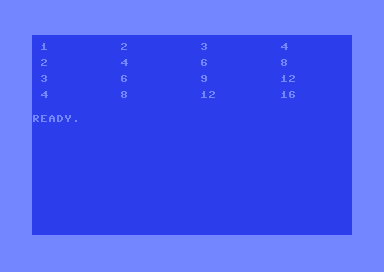
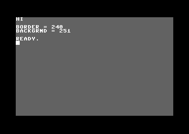

# Part V — BASIC V2

Commodore BASIC V2 — the language baked into ROM, and how to escape its limits by reaching the hardware and machine code directly. Four lessons: the language itself, PEEK/POKE/SYS/USR, BASIC+ML hybrids, and the limits & tricks. Programs here are tokenised with petcat and run in VICE (see the repo's basic/ workspace).

**In this part:** 5.1 · 5.2 · 5.3 · 5.4

## 5.1 BASIC V2: the language

**Objectives**
- Read and write the line-numbered structure of a Commodore BASIC V2 program.
- Use its variables, operators, and the control-flow it *does* have — and know what it lacks.
- Recognise that BASIC V2 has no graphics or sound keywords, motivating the PEEK/POKE lesson that follows.

Commodore BASIC V2.0 lives in ROM at `$A000–$BFFF` and is what greets you at power-on. It is a small, unstructured, interpreted BASIC — famously bare (no `SOUND`, `SPRITE`, `CIRCLE`, `ELSE`, or named procedures). This lesson is a working reference to the language itself; the next two show how to reach the hardware and machine code from it.

### Program structure

A program is a list of **numbered lines** executed in ascending order. You enter a line by typing its number followed by statements; typing a line number alone deletes that line. Several statements can share a line, separated by colons:

```basic
10 print "hello" : print "world"
20 goto 10
```

Line numbers also serve as the only labels — `GOTO`/`GOSUB` target them. Leave gaps (10, 20, 30…) so you can insert lines later. There is no block structure and no multi-line editor; you edit a line by retyping it (or `LIST` it, move the cursor onto it, change it, and press RETURN).

### Variables

Variables are created on first use; there is no declaration. Three types:

| Suffix | Type | Example | Notes |
|--------|------|---------|-------|
| (none) | floating point | `X`, `SCORE` | the default; ~9 significant digits |
| `%` | 16-bit integer | `I%`, `N%` | slower in practice (BASIC converts to float for most math) |
| `$` | string | `A$`, `NM$` | up to 255 chars |

Only the **first two characters** of a name are significant, so `SCORE` and `SCOREBOARD` are the *same* variable — and a name may not contain a reserved word (`TON$` is illegal because it contains `ON`). Arrays are created with `DIM A(20)` (or `DIM G$(9,9)` for 2-D); un-`DIM`med arrays default to 11 elements (0–10). `FRE(0)` reports free BASIC RAM (add 65536 if it reads negative).

### Operators

- **Arithmetic:** `+ - * /`, `^` (power), and unary `-`. Float math throughout.
- **Relational:** `= <> < > <= >=` — they yield `-1` for true and `0` for false.
- **Logical / bitwise:** `AND OR NOT` operate bit-by-bit on integers, so they double as both boolean and bit operators: `IF A AND 16 THEN…` tests a bit, and `POKE V,P AND 254` clears a bit.

### Control flow

What you have:

- `GOTO n` — jump to line *n*.
- `GOSUB n` … `RETURN` — call/return a subroutine (the return stack is small; don't recurse deeply).
- `FOR v = a TO b [STEP s]` … `NEXT [v]` — counted loop; `STEP` may be negative or fractional.
- `IF cond THEN …` — runs the rest of the line (statements or a line number to `GOTO`) when *cond* is non-zero. `IF A=1 THEN 100` jumps to 100; `IF A=1 THEN PRINT"YES":B=2` runs both statements.
- `ON x GOTO n1,n2,…` / `ON x GOSUB …` — multi-way branch on an index.
- `END` / `STOP` halt; `CONT` resumes after `STOP`.

What you **don't** have — and the usual workaround:

| Missing | Work around with |
|---------|------------------|
| `ELSE` | a second `IF`, or `ON` |
| `WHILE`/`REPEAT`/`DO` | `IF…GOTO` loops |
| named procedures | `GOSUB` to line numbers |
| `SELECT`/`CASE` | `ON x GOTO` |

### Input and output

- **`PRINT`** (abbreviation `?`): items separated by `;` print adjacent, by `,` tab to the next 10-column field. A trailing `;` suppresses the newline. Embed control via `CHR$()` or quoted control codes — `PRINT CHR$(147)` clears the screen; `PRINT "{down}"` moves the cursor.
- **`INPUT "PROMPT";A$`** reads a line (waits for RETURN). **`GET A$`** reads a single keypress without waiting (returns `""` if no key) — the building block of real-time input.
- **`READ`** pulls successive constants from **`DATA`** statements; **`RESTORE`** rewinds to the first `DATA`. This is how BASIC programs carry tables (and machine code — see 5.3).

```basic
10 read n$ : if n$="end" then end
20 print n$ : goto 10
30 data alice, bob, carol, end
```

### Built-in functions (selection)

| Strings | Math |
|---------|------|
| `LEN(A$)`, `LEFT$(A$,n)`, `MID$(A$,p,n)`, `RIGHT$(A$,n)` | `ABS INT SGN SQR` |
| `CHR$(n)` (code→char), `ASC(A$)` (char→code) | `RND(x)`, `SIN COS TAN ATN`, `EXP LOG` |
| `STR$(n)` (num→string), `VAL(A$)` (string→num) | `PEEK(a)`, and `TI`/`TI$` (jiffy clock) |

### What BASIC V2 cannot do

There is **no keyword for graphics or sound**. To draw, make sprites, or play notes you write directly to the VIC-II/SID registers with `POKE`, and call machine code with `SYS`. That bridge — `PEEK`, `POKE`, `SYS`, `USR` — is [the next lesson](#52-peek-poke-sys--usr--reaching-the-hardware).

### A complete program

A 5×5 multiplication table — exercising `FOR/NEXT` nesting, `PRINT` formatting, and screen clear:

```basic
10 rem 4x4 multiplication table
20 print chr$(147)
30 for r=1 to 4
40 for c=1 to 4
50 print r*c,
60 next c
70 print
80 next r
90 end
```




**What you should see:** a cleared screen with a 4-row grid of products in tab-aligned columns (the `,` in `PRINT` tabs to the next 10-column field, and four columns fit a 40-column line) — the first row reads `1  2  3  4`, the third row `3  6  9  12`, and the last row `4  8  12  16`, followed by `READY.`

**Pitfalls**
- Only the first two characters of a variable name matter — `TOTAL` and `TOTUP` collide.
- A variable name can't contain a keyword (`SCORE` is fine, but `GOSCORE` contains `OR`-adjacent issues; classic trap is `FORM` containing `FOR`).
- `=` is both assignment and comparison depending on context; there is no `==`.
- Integer (`%`) variables are usually *not* faster — BASIC converts to float for most operations.
- Deeply nested `GOSUB`/`FOR` without matching `RETURN`/`NEXT` overflows the small BASIC stack.

**Go deeper:** the [C64 Programmer's Reference Guide](reference/c64-programmers-reference-guide.pdf) is the authoritative BASIC V2 manual (every keyword + error messages); see also [Appendix G](appendix-g-petscii.md) for PETSCII/control codes and the repo's `basic/` workspace for the petcat build/run loop.

## 5.2 PEEK, POKE, SYS & USR — reaching the hardware

**Objectives**
- Read and write any byte of the 64 KB address space from BASIC with `PEEK` and `POKE`.
- Drive the VIC-II, SID, screen RAM and colour RAM directly through their decimal addresses.
- Call machine-code routines from BASIC with `SYS` (passing registers via 780-783) and `USR`.

BASIC V2 has no `BORDER`, `SOUND`, `SPRITE` or `PLOT` keyword. The chips are just memory-mapped registers, so everything the hardware can do is reachable with two primitives — `POKE addr,value` to write a byte and `PEEK(addr)` to read one — plus `SYS`/`USR` to hand control to machine code. This lesson is the bridge between "BASIC the language" and "the C64 the machine".

### POKE and PEEK

`POKE addr,value` stores one byte. `addr` is `0`-`65535` and `value` is `0`-`255`; either out of range gives `?ILLEGAL QUANTITY ERROR`. `PEEK(addr)` returns the byte (0-255) at `addr` as a number you can use in an expression.

```basic
10 print peek(53280)
20 poke 53280,2
30 print peek(53280)
```

Line 10 prints what is in the border-colour register; line 20 sets the border to red (colour code 2); line 30 reads it back. Beware a hardware wrinkle: the VIC-II border register `$D020` only wires up its low 4 bits, and the unused top 4 bits always read back as 1s. So `PEEK(53280)` does **not** return a clean `0`-`15` — at power-on it prints `254` (`$FE`, low nibble `14` = light blue) and after the POKE it prints `242` (`$F2`, low nibble `2` = red). The *colour* is in the low nibble; mask with `AND 15` if you want the bare colour code. On screen you see two numbers and the border turns red.

Because BASIC only accepts decimal, you carry a hex-to-decimal map in your head (or in REM comments). The addresses you reach for constantly:

| Decimal | Hex | What it controls |
|---|---|---|
| `53280` | `$D020` | Border colour (low nibble, 0-15) |
| `53281` | `$D021` | Background colour 0 (low nibble, 0-15) |
| `646` | `$028E` | Current text/cursor colour used by `PRINT` |
| `53272` | `$D018` | VIC memory pointers: video-matrix base + char base |
| `53265` | `$D011` | VIC control register 1 (screen on/off, raster MSB, scroll) |
| `54296` | `$D418` | SID master volume (low nibble) + filter mode |
| `1024` | `$0400` | Start of default screen RAM (40x25 = 1000 bytes) |
| `55296` | `$D800` | Start of colour RAM (1000 nybbles, low 4 bits only) |

Reading the register reference: border/background are [Appendix C](appendix-c-vic-registers.md) `$D020`/`$D021`; the memory map for screen and colour RAM is [Appendix B](appendix-b-memory-map.md).

### Writing characters and colours straight to the screen

`PRINT` is the polite way to put text on screen, but you can also write bytes directly into the 1000-byte **screen RAM** at `1024` and the 1000-nybble **colour RAM** at `55296`. The two arrays are parallel: position `row*40+col` in each. Screen RAM holds **screen codes** (not PETSCII — `A` is screen code 1, not 65); colour RAM holds a colour code 0-15. See [Appendix G](appendix-g-petscii.md) for the full screen-code table.

```basic
10 print chr$(147)
20 poke 1024,8 : poke 1025,9
30 poke 55296,1 : poke 55297,1
```

`CHR$(147)` clears the screen. Screen code 8 is `H`, 9 is `I` (uppercase PETSCII letter minus 64). The word `HI` appears white in the very top-left two cells. Note: a cell only shows its character once its colour nibble is set; that is why line 30 matters. If you POKE a character but leave colour RAM dark (matching the background), the glyph is invisible.

### Complete program: set colours and paint the screen

This is the canonical "I can reach the hardware from BASIC" program. It runs end to end and leaves a stable screen for a screenshot.

```basic
10 rem --- reach the hardware from basic v2 ---
20 print chr$(147)
30 poke 53280,0 : rem border black ($d020 = 0)
40 poke 53281,11 : rem background dark grey ($d021 = 11)
50 rem write "hi" into screen ram at top-left
60 poke 1024,8 : rem screen code 8 = h, at row 0 col 0
70 poke 1025,9 : rem screen code 9 = i, at row 0 col 1
80 rem colour those two cells white (colour code 1)
90 poke 55296,1
100 poke 55297,1
110 rem prove peek reads back what we wrote
120 print "{home}{down}{down}{wht}border ="; peek(53280)
130 print "backgrnd ="; peek(53281)
140 end
```




What appears on screen:
- The **border is black** and the **background (screen interior) is dark grey**.
- The word `HI` is shown in **white** in the top-left two character cells (row 0, columns 0-1).
- A few lines down, in white, two lines read `border = 240` and `backgrnd = 251`. Those are the raw register bytes: `$D020`/`$D021` leave their top 4 bits floating high, so `PEEK` returns `240` (`$F0`, low nibble `0` = black) and `251` (`$FB`, low nibble `11` = dark grey). The values you *wrote* are in the low nibble — `peek(53280) and 15` gives back `0`, and `peek(53281) and 15` gives back `11`.

For a screenshot assertion: the **low nibble** of `$D020` (53280) must be `0` and the low nibble of `$D021` (53281) must be `11` (the registers read back as `$F0`/`$FB` because of their unconnected high bits); the bytes at `1024`/`1025` are `8`/`9` and at colour RAM `55296`/`55297` the low nibble is `1`.

### SYS — call machine code like a subroutine

`SYS addr` jumps to machine code at `addr` (decimal, 0-65535), exactly like a `JSR`; the routine returns to BASIC when it hits `RTS`. Classic launch lines are `SYS 2064` (`$0810`) or `SYS 49152` (`$C000`, the 4 KB of free RAM at `$C000-$CFFF` that BASIC and the KERNAL never touch — see [Appendix B](appendix-b-memory-map.md)).

`SYS` also passes CPU registers through four RAM locations. **Before** the jump BASIC loads the 6510 registers from them, and **after** the `RTS` it stores them back, so BASIC can both send and receive values:

| Decimal | Hex | Register |
|---|---|---|
| `780` | `$030C` | `.A` (accumulator) |
| `781` | `$030D` | `.X` |
| `782` | `$030E` | `.Y` |
| `783` | `$030F` | processor status (flags) |

So `POKE 780,5 : SYS 65490` calls the KERNAL `CHROUT` routine (`$FFD2`, 65490) with `.A = 5`, which sets the text colour to white. After any `SYS` you can read results with `PEEK(780)`/`PEEK(781)`/`PEEK(782)`. The KERNAL jump table addresses are in [Appendix F](appendix-f-kernal-basic.md).

```basic
10 rem call kernal plot ($fff0) to move the cursor, then print
20 poke 781,10 : rem .x = row 10
30 poke 782,5  : rem .y = col 5
40 poke 783,0  : rem status: clear carry (c=0 means SET cursor)
50 sys 65520   : rem PLOT ($fff0)
60 print "here";
```

The word `here` prints at row 10, column 5 instead of at the cursor's old position. (Clearing the carry bit in the status byte selects PLOT's "set" mode; with carry set it would read the cursor instead.)

### USR — call machine code as a function

`USR(x)` calls the routine whose address you place in the vector at `785`/`786` (`$0311`/`$0312`, lo byte then hi byte). The float argument `x` is delivered in the floating-point accumulator (FAC), and whatever the routine leaves in FAC becomes the value of `USR(x)`. It is the function-shaped sibling of `SYS`; most code uses `SYS` because passing plain bytes through 780-782 is simpler than dealing with the FAC. Set the vector with two POKEs:

```basic
10 rem point USR at a routine living at $c000 (49152)
20 poke 785,0   : rem lo byte of $c000
30 poke 786,192 : rem hi byte ($c0 = 192)
40 rem x=usr(3) would now run that routine with 3.0 in the FAC
```

(With no routine actually installed at `$C000`, calling `USR` here would crash — the lines only show how the vector is set: `49152 = 192*256 + 0`.)

### The DATA-poke-SYS idiom

Since BASIC cannot assemble, the standard way to ship machine code inside a BASIC program is to `READ` bytes from `DATA` lines, `POKE` them into free RAM (`$C000`/49152 is ideal), then `SYS` the start address:

```basic
10 for i=0 to 5
20 read b : poke 49152+i,b
30 next i
40 sys 49152
50 data 169,1,141,32,208,96
```

The six DATA bytes are `LDA #1 / STA $D020 / RTS` — i.e. set the border to white and return. Running it turns the **border white** and comes straight back to `READY.`. This is exactly how type-in magazine games loaded their machine-code core from BASIC.

**Pitfalls**
- `POKE addr,value` rejects `value` outside `0`-`255` and `addr` outside `0`-`65535` with `?ILLEGAL QUANTITY ERROR`. Mask with `AND 255` if a computed value might overflow.
- Screen RAM uses **screen codes**, not PETSCII — `POKE 1024,1` shows `A`, not `Ctrl-A`. Don't reuse `CHR$`/`ASC` values there ([Appendix G](appendix-g-petscii.md)).
- A character POKEd to screen RAM is invisible until its colour-RAM nybble differs from the background; always set colour RAM too.
- Colour RAM only honours the **low 4 bits** (0-15); reading it back through `PEEK` returns the high nibble as 1s, so `PEEK(55296)` may return values above 15. The VIC colour registers `$D020`/`$D021` behave the same way — `PEEK(53280)` returns `$F0`-`$FF`, not `0`-`15`, so mask with `AND 15` to recover the colour code.
- `SYS`ing a wrong or uninitialised address (or a routine that doesn't end in `RTS`) hangs or crashes the machine. With `$D000-$DFFF` banked as I/O by default (`$01 = $37`), POKEs there hit chip registers, not RAM.
- Don't confuse the SYS register block (`780`-`783`, `$030C`-`$030F`) with the USR vector (`785`/`786`, `$0311`/`$0312`) — different locations, different purpose.

**Go deeper:** [C64 Programmer's Reference Guide](https://archive.org/details/c64-programmer-ref) (BASIC commands `PEEK`/`POKE`/`SYS`/`USR` and the "BASIC to Machine Language" chapter); see [Appendix B](appendix-b-memory-map.md) for the memory map, [Appendix C](appendix-c-vic-registers.md) for VIC registers, [Appendix F](appendix-f-kernal-basic.md) for the KERNAL jump table, and [Appendix G](appendix-g-petscii.md) for screen and colour codes.

## 5.3 BASIC + machine code: loaders and hybrids

**Objectives**
- Pick a safe place in RAM for a machine-code (ML) routine that BASIC will never overwrite.
- Carry ML bytes in `DATA` statements, `READ` them, and `POKE` them into memory.
- Call the routine with `SYS`, understand the `SYS 2064`-style launcher, and how assembled programs ship a BASIC stub.

BASIC V2 is great glue but slow (a few thousand statements/second). The classic escape hatch is the *hybrid*: a BASIC program that contains a small machine-code routine as numbers in `DATA`, copies those numbers into memory with `POKE`, and then runs them with `SYS`. This is how thousands of type-in magazine programs delivered fast scrolls, sound, and graphics from a listing you could type by hand.

### Where to put the machine code

You cannot just `POKE` bytes anywhere. A running BASIC program occupies memory and will happily clobber (or be clobbered by) bytes you drop in the wrong place. The memory map (see [Appendix B](appendix-b-memory-map.md)) gives you the layout:

- `$0800-$9FFF` (2048-40959) holds BASIC program text, then its variables, arrays, and strings. Putting ML here is possible but fragile: as variables grow upward they can overwrite it.
- `$C000-$CFFF` (49152-53247) is a **free 4 KB block that neither BASIC nor the KERNAL ever touches**. This is the standard home for a BASIC-loaded ML routine. It needs no banking tricks: it is plain RAM that is always visible.

So the conventional address is **`$C000` = 49152**. You have 4096 bytes there, which is plenty for the kind of routine BASIC hands off to.

### A tiny routine to understand byte-for-byte

We want something visibly verifiable: set the border colour to black and return. The border colour register is `$D020` = 53280. In assembly:

```
        lda #$00        ; A = 0 (black)
        sta $d020       ; store A into border colour register ($D020 = 53280)
        rts             ; return to BASIC (SYS behaves like JSR)
```

Assembling those three instructions gives six bytes. Decimal opcodes/operands:

| Assembly | Hex bytes | Decimal bytes |
|----------|-----------|---------------|
| `lda #$00` | `A9 00` | `169, 0` |
| `sta $d020` | `8D 20 D0` | `141, 32, 208` |
| `rts` | `60` | `96` |

So the whole routine is the decimal sequence `169, 0, 141, 32, 208, 96`. Note `$D020` is stored low-byte-first (32 then 208) because the 6510 is little-endian: `32 + 208*256 = 53280`. The `rts` at the end is essential. `SYS` jumps in like a `JSR`, so the routine must `rts` to hand control back to BASIC, otherwise the machine wanders off.

### The READ/DATA/POKE loop

The idiom is a `FOR` loop that `READ`s one byte per iteration and `POKE`s it to consecutive addresses starting at the target:

```basic
10 rem --- poke the ml routine to $c000 = 49152 ---
20 for i = 0 to 5
30 read b
40 poke 49152 + i, b
50 next i
60 data 169, 0, 141, 32, 208, 96
```

Line 60's bytes are exactly the routine from the table. After this loop, addresses 49152..49157 contain the routine.

### Calling it with SYS

`SYS addr` jumps to machine code at `addr`. Before jumping, BASIC loads the CPU registers `A/X/Y/status` from `$030C-$030F` (780-783) and stores them back on return, which is how `SYS` can pass and receive register values (see [Appendix F](appendix-f-kernal-basic.md) and `docs/basic-v2.md`). For our routine we just need the jump:

```basic
70 sys 49152
```

### The complete runnable program

```basic
10 rem === basic + ml hybrid: black border ===
20 print "{clr}poking ml to $c000..."
30 for i = 0 to 5
40 read b
50 poke 49152 + i, b
60 next i
70 rem data = lda #0 / sta $d020 / rts
80 data 169, 0, 141, 32, 208, 96
90 sys 49152
100 print "border is now black."
110 print "peek($d020) ="; peek(53280)
```

**What appears on screen:** the screen clears, prints `poking ml to $c000...`, the **border turns black** (the rest of the screen keeps the default light-blue background and the default light-blue text colour). Then it prints `border is now black.` and `peek($d020) = 240`. For verification: after the run, the border is black. Note that `PEEK(53280)` returns `240` (`$F0`), not `0`: the VIC-II colour registers only use the low 4 bits, and the unconnected upper 4 bits read back as `1`. So although you wrote `0` to `$D020` (low nibble `0` = black, which is what controls the border), reading the register back yields `0 OR $F0 = 240`. If you want just the colour, mask with `PEEK(53280) AND 15`, which gives `0`.

### The SYS 2064 / SYS 2061 launcher

You will constantly see a one-line BASIC program like:

```basic
10 sys 2064
```

This is a **launcher stub**: a tiny BASIC program whose only job is to `SYS` into a machine-code program that was loaded right after it. `$0801` (2049) is where BASIC text starts. A program assembled to begin at `$0810` = 2064 puts a BASIC line `10 SYS 2064` at `$0801` and the actual ML at `$0810`, so typing `RUN` (or autostart) jumps straight into the machine code. The exact entry number depends on how big the stub is; `2061` (`$080D`) is the value the KickAssembler `BasicUpstart2` macro produces, and `2064` is another common choice. Either way the principle is identical: a minimal BASIC line that immediately `SYS`es the real program. See the assembled-program stubs in [Appendix F](appendix-f-kernal-basic.md).

This is also how cross-assembled and compiled programs ship as a single `.prg`: the assembler emits the `SYS` stub at `$0801` followed by the code, the file loads at `$0801`, and `RUN` (or `-autostart`) launches it. The DATA-loader in this lesson is the hand-typed cousin of that same trick: it gets machine code into memory and runs it without an assembler.

### Building and running it

Save the complete program as a `.bas` file in the repo's `basic/` workspace and use the existing build loop (`make run SRC=hybrid.bas`), which tokenises with `petcat` and autostarts `x64sc`. Keep the source lowercase and ASCII, and write control codes as brace-escapes (the program above uses `{clr}`). See `basic/README.md` for the full workflow.

**Pitfalls**
- Forgetting the final `rts` (`96`). Without it, `SYS` never returns and the machine crashes or hangs.
- Off-by-one in the loop bounds: 6 bytes means `for i = 0 to 5`, not `1 to 6`. The count of `DATA` items must match the loop, or `READ` raises `?OUT OF DATA ERROR`.
- `POKE` values must be 0-255 and addresses 0-65535, in **decimal**. A negative or >255 value raises `?ILLEGAL QUANTITY ERROR`.
- Little-endian operands: `sta $d020` is `141, 32, 208` (low byte first), not `141, 208, 32`.
- Storing ML inside `$0800-$9FFF` risks BASIC's variables growing over it. Prefer `$C000` (49152) for BASIC-loaded routines.
- `RUN` resets BASIC's variable pointers but does not clear `$C000`. Re-running re-POKEs the bytes (fine), but do not rely on leftover ML from a previous, different program.
- Reading back a VIC-II colour register does not return just the value you wrote. `$D020`/`$D021` (and the other colour registers) only implement the low 4 bits; the top 4 bits are unconnected and read as `1`, so `PEEK` reports your colour `+ 240`. Mask with `AND 15` to recover the colour number.

**Go deeper:** [C64 Programmer's Reference Guide](https://archive.org/details/c64-programmer-ref) (BASIC `SYS`/`POKE`/`READ`-`DATA`); see [Appendix B](appendix-b-memory-map.md) for the free `$C000` block, [Appendix F](appendix-f-kernal-basic.md) for the `SYS` register-passing convention and BASIC launcher stubs, and the repo's `basic/` workspace plus `docs/basic-v2.md` for the build/run loop.

## 5.4 Limits, speed & tricks

**Objectives**
- Understand why BASIC V2 is slow and what it genuinely cannot do, so you know when to drop to machine code.
- Master the standard idioms: PRINT control codes, the keyboard buffer, WAIT, the jiffy clock, and reading the joystick from BASIC.
- Write speed-conscious BASIC and protect (or deliberately disable) RUN/STOP-RESTORE.

Commodore BASIC V2 lives in ROM at `$A000-$BFFF` and is the same interpreter Commodore shipped on the PET in 1977, ported with almost no additions. That history is the whole story: it is small, slow, and missing nearly every convenience a modern programmer expects. Knowing exactly where the walls are is what lets you use it well, and a handful of well-worn tricks paper over the worst of the gaps.

### The honest limits

**It is interpreted and SLOW.** Every time the interpreter reaches a line it re-parses tokens, looks variables up by linear search through the variable table, and does all arithmetic in floating point. Realistic throughput is only a few thousand BASIC statements per second. There are 50 (PAL) or 60 (NTSC) frames per second, so a BASIC loop manages only a few dozen statements per frame. Anything that must run every frame -- scrolling, sprite multiplexing, music players -- belongs in machine code called via `SYS` (see [docs/basic-v2.md](basic-v2.md) on SYS/USR). BASIC's job is setup, menus, level scripting, and prototyping.

**Math is float-only and slow.** Numbers are stored as 5-byte floats. Integer variables (`A%`) exist, but the interpreter converts them *to* float for almost every operation and back again, so `A%` is often slower than a plain float variable, not faster -- its real value is saving memory in large arrays. There is no fast integer path the way a compiled language has.

**No structured control flow.** There is no `ELSE`, no `WHILE`, no `REPEAT`, no `DO`, no named procedures, no block `IF`. You get `IF...THEN`, `FOR...NEXT`, `GOTO`, `GOSUB...RETURN`, and `ON...GOTO/GOSUB`. Multi-statement lines (colon-separated) and `GOTO` are how you build everything else.

**Variable names are significant to only 2 characters.** `SCORE` and `SCREEN` and `SCALE` are *the same variable* `SC`. Worse, you cannot use a name that contains a reserved word: `TIME` is illegal because it contains `TI`, and `FORM` starts with `FOR`. Pick short, distinct two-letter names and keep a list.

**Editing is by line number.** There is no text editor; you retype a whole line to change it, and you renumber by hand. On Linux you sidestep this entirely by writing ASCII source in a real editor and tokenising with `petcat` (see [basic/README.md](../basic/README.md)).

**String handling causes "garbage collection" pauses.** Every string operation (`A$ = B$ + C$`, `MID$`, etc.) allocates a fresh copy at the top of memory. When that region fills, BASIC stops dead and compacts it -- a pause that can last *seconds* in a string-heavy program. `?FRE(0)` forces (and times) a collection.

### Speed-ups that actually help

You cannot make the interpreter fast, but you can make it do less work:

- **Precompute everything.** Pull constant sub-expressions out of loops. Replace `POKE 1024+I` arithmetic with a variable you increment. Build lookup tables in arrays once, then index them.
- **Use variables, not literal constants, inside hot loops.** `POKE V,0` is faster than `POKE 53280,0` because the interpreter parses the literal `53280` every pass but reads `V` from the variable table. Assign `V=53280` once up front.
- **Declare your most-used variables first.** The variable table is searched linearly from the start, so the first variables you assign are found fastest. A common idiom is a throwaway first line like `0 ZZ=0:I=0:J=0` to seat the loop counters at the front.
- **Avoid string building in loops.** Concatenation is the main cause of GC stalls. Pre-split text into an array of single characters, or POKE screen codes directly.
- **`FOR/NEXT` beats `GOTO` for counted loops**, and a bare `NEXT` (no variable) is slightly faster than `NEXT I`.
- **`REM` and spaces cost time** -- the interpreter skips over them on every pass. For a genuinely tight loop, strip comments (keep a commented master copy in your editor).

### PRINT control codes (colour & cursor)

BASIC has no graphics commands, so you steer colour and the cursor by printing PETSCII *control codes* -- non-printing bytes that perform an action. You either embed them with `CHR$(n)` or, in petcat source, write them as `{...}` escapes. The decimal values are authoritative; see [Appendix G](appendix-g-petscii.md).

```basic
10 rem clear, white text, then home and a reversed banner
20 print chr$(147);chr$(5);"plain white text"
30 print "{home}{down}{down}{rvon}reversed{rvof} normal"
40 print chr$(28);"this line is red";chr$(5)
```

What you see: the screen clears; `plain white text` prints at the top-left in white; two lines down, the word `reversed` appears in reverse video (light character on a coloured block) followed by ` normal`; then a red line `this line is red`. `{rvon}`/`{rvof}` are CHR$(18)/CHR$(146), the colour names map to the table in Appendix G (white=5, red=28).

### Auto-typing via the keyboard buffer

The KERNAL keeps a 10-byte keyboard queue at 631-640 (`$0277-$0280`, "KEYD") and a count of pending keys at 198 (`$00C6`, "NDX"); see [Appendix B](appendix-b-memory-map.md). If you POKE PETSCII codes into the buffer and set the count, BASIC reads them as if they had been typed. The classic use is to make a program "type" commands into itself after it ends -- including a `RUN` so it relists or restarts.

```basic
10 rem auto-type "list" + return after the program ends
20 print chr$(147);"the program will now type for you."
30 poke 631,76 : rem petscii 'l'
40 poke 632,73 : rem 'i'
50 poke 633,83 : rem 's'
60 poke 634,84 : rem 't'
70 poke 635,13 : rem return
80 poke 198,5  : rem 5 chars waiting in the buffer
```

What happens: the screen clears, the message prints, the program ends to `READY.`, and then `LIST` appears on the screen as though typed, executes, and lists the program -- all with no keypress. (PETSCII letters are their ASCII values: `L`=76, `I`=73, `S`=83, `T`=84; RETURN=13.)

### Waiting: WAIT, the STOP key, and a key press

`WAIT addr, mask [, xor]` halts until `(PEEK(addr) AND mask) XOR xor` is non-zero. It is the one BASIC statement that busy-waits efficiently. A common pattern is waiting for the raster to pass line 256:

```basic
10 wait 53265,128 : rem wait until VIC $D011 bit7 set (raster >= 256)
```

But `WAIT` is dangerous: if the condition never becomes true, only RUN/STOP-RESTORE gets you out. To wait for *any* keypress, the safe and idiomatic way is `GET`, which returns the empty string when no key is queued:

```basic
10 print "press a key.."
20 get k$ : if k$="" then 20
30 print "you pressed ";k$
```

### Reading the jiffy clock and TI / TI$

The KERNAL increments a 24-bit "jiffy" counter 60 times a second (once per IRQ) at 160-162 (`$A0-$A2`). BASIC exposes it as the read-only pseudo-variables `TI` (jiffies since power-on/last set) and `TI$` (a `"HHMMSS"` clock string you can both read and set). One jiffy is 1/60 s on both PAL and NTSC -- the KERNAL counts IRQs, not real time, so a PAL machine's `TI` clock actually runs slightly slow, a classic gotcha.

```basic
10 rem time a loop with the jiffy clock
20 ti$="000000" : rem reset clock to zero
30 for i=1 to 1000 : x=sin(i) : next
40 print "1000 sin() calls took";ti;"jiffies"
50 print "that is";ti/60;"seconds"
```

What you see: a line like `1000 sin() calls took 142 jiffies` followed by `that is 2.36666667 seconds` (your numbers vary). Resetting via `TI$="000000"` is the standard stopwatch idiom; you can also read the raw bytes with `PEEK(160)*65536+PEEK(161)*256+PEEK(162)`.

### Reading the joystick from BASIC

Joystick port 2 is CIA #1 port A at 56320 (`$DC00`); port 1 is port B at 56321 (`$DC01`). All signals are **active-low**: a bit reads 0 when that direction or fire is engaged. The bits are UP=1, DOWN=2, LEFT=4, RIGHT=8, FIRE=16 (see [Appendix E](appendix-e-cia-registers.md)). Because the byte's idle state is all-ones, you test with `AND` and compare against the mask.

```basic
10 rem move a ball with joystick in port 2; q quits
20 print chr$(147);
30 x=20 : y=12 : v=56320
40 rem draw ball (screen code 81 = filled circle) at x,y
50 poke 1024+y*40+x,81 : poke 55296+y*40+x,7
60 j=peek(v)
70 if (j and 1)=0 and y>0 then poke 1024+y*40+x,32:y=y-1
80 if (j and 2)=0 and y<24 then poke 1024+y*40+x,32:y=y+1
90 if (j and 4)=0 and x>0 then poke 1024+y*40+x,32:x=x-1
100 if (j and 8)=0 and x<39 then poke 1024+y*40+x,32:x=x+1
110 get k$ : if k$="q" then end
120 goto 50
```

What you see: the screen clears and a yellow filled circle (screen code 81, colour 7) sits near the centre. Pushing the joystick in port 2 moves it; old positions are cleared to space (32). Pressing `q` ends the program. This visibly demonstrates the per-statement slowness -- the ball lags the stick, which is exactly why real games poll the joystick in an ML IRQ instead.

### An animated colour border (a complete trick program)

The shortest demonstration that POKE talks straight to hardware is cycling the border colour at 53280 (`$D020`). The `WAIT 53265,128` line paces it to roughly one change per raster wrap so the cycling is visible rather than a blur.

```basic
10 rem animated rainbow border; runstop to quit
20 print chr$(147);chr$(154);"watch the border cycle colours"
30 b=53280
40 for c=0 to 15
50 poke b,c
60 wait 53265,128 : rem pace one colour per frame-ish
70 for d=1 to 40 : next d : rem small delay so each colour shows
80 next c
90 goto 40
```

What you see: the screen clears, a light-blue message `watch the border cycle colours` prints, and the screen border cycles smoothly through all 16 C64 colours (black, white, red, cyan, ... light grey) and repeats forever. RUN/STOP halts it. Swap `b=53280` for `b=53281` to cycle the background instead.

### RUN/STOP-RESTORE: defeating and disabling it

RUN/STOP-RESTORE is the user's escape hatch: RUN/STOP is polled by the IRQ and RESTORE triggers an NMI that warm-starts BASIC. Two locations matter:

- **808/809** (`$0328/$0329`) hold the vector the STOP-key check jumps through. The well-known "list protect" trick `POKE 808,225` makes RUN/STOP (and LIST) misbehave, so casual users cannot break or list a running program. It is fragile and reversible (`POKE 808,237` restores normal), so treat it as obfuscation, not security.
- **Disabling STOP cleanly** is better done by patching the STOP-key vector at 808 or, more robustly, by handling it in your own IRQ from machine code. From pure BASIC the common approach is `POKE 788,52`: this lowers the IRQ-vector low byte so the KERNAL skips its STOP-key scan. To restore: `POKE 788,49`.

```basic
10 rem disable runstop by skipping the kernal stop-key scan
20 poke 788,52 : rem $0314 lo: 49->52 skips stop check
30 print "runstop is now ignored. counting.."
40 for i=1 to 30000 : next
50 poke 788,49 : rem restore normal irq vector low byte
60 print "stop re-enabled. done."
```

What you see: the message prints, a long count runs during which RUN/STOP does nothing, then STOP is restored and `stop re-enabled. done.` prints. Note RESTORE (the NMI) is *not* disabled by this -- pressing RUN/STOP-RESTORE together still recovers the machine, which is a deliberate safety valve. Fully trapping RESTORE means hooking the NMI vector at 792/793 (`$0318`), which is ML territory.

**Pitfalls**
- BASIC's slowness is structural, not a tuning problem: if you need it per-frame, it must be ML. Do not try to "optimise" your way to 50 fps in BASIC.
- Two-character variable significance silently merges names, and names containing reserved words (`TI`, `FOR`, `TO`, `IF`...) are rejected or mis-parsed. Use distinct short names.
- String concatenation in loops triggers garbage-collection stalls that can freeze the program for seconds; precompute strings or POKE screen codes instead.
- `WAIT` with a condition that never comes true hangs the machine -- only RUN/STOP-RESTORE escapes. Prefer `GET` loops when you can.
- Joystick bits are active-low (0 = pressed) and reading the port disturbs keyboard scanning; test with `AND` against the masks, and expect noticeable input lag from BASIC.
- The jiffy clock counts IRQs (1/60 s each), so `TI`/`TI$` drift on PAL machines and stop advancing if you disable or hijack the IRQ.
- Border/background/STOP pokes use *decimal* in BASIC (53280, 808, 788); the hex names ($D020 etc.) are for reference only.

**Go deeper** -- [C64 Programmer's Reference Guide](https://archive.org/details/c64-programmer-ref) (BASIC V2 language reference and the keyboard-buffer / jiffy-clock locations); cross-references in [docs/basic-v2.md](basic-v2.md), [Appendix B](appendix-b-memory-map.md), [Appendix E](appendix-e-cia-registers.md), and [Appendix G](appendix-g-petscii.md).


---

*Next: Part VI — Capstone: a game (coming next)*
