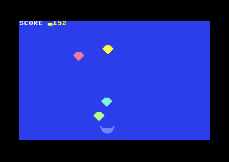

# Part VI — Capstone: Build a Game

You have spent five parts assembling the toolkit. Part I gave you the 6502 itself — registers, addressing modes, tables, and the indexed-loop / 16-bit-math idioms. Part II turned the machine into a *clock* with the raster interrupt. Part III put hardware sprites and colour RAM on the screen. Part IV made the SID sing. Part V drew directly into screen and colour memory.

A game is just those five things wired together around one idea: **once per frame, read the world, update the world, draw the world.** This capstone builds a complete, playable game — **Gem Catcher** — that does exactly that, on a single PAL screen, with nothing left out. Every line assembles in KickAssembler v5.x and runs on a real (or emulated) C64.

> The game was assembled and run headless under VICE for ~40M cycles. The screenshot shows the basket near the bottom, four gems caught mid-fall at staggered heights, and a live "SCORE" readout at the top — proof the per-frame loop, sprites, collision, and direct screen writes all work together.

---

## Design & memory map

### The concept

A **basket** (sprite 0) sits near the bottom and slides left/right under joystick control (port 2). **Four gems** (sprites 1–4) fall from the top, each at its own speed. Catch a gem in the basket and you score a point and hear a blip; let it fall past the bottom and it respawns at a new random column. That's the whole loop — small enough to read in one sitting, complete enough to actually play.

### Why this shape

Everything hangs off a single **once-per-frame heartbeat**. A raster interrupt fires near the bottom of the visible screen and increments a counter, `frametick`. The main loop spins until that counter changes, then runs exactly one tick of game logic. This keeps the game at a steady 50 Hz (PAL) and means we never tear sprites or race the raster — the IRQ is the metronome, the main loop is the band.

```
        ┌─────────────────────────────────────────────┐
  IRQ → │ inc frametick ; ack ; chain to KERNAL ($ea31)│   (50×/sec, PAL)
        └─────────────────────────────────────────────┘
                              │
        ┌─────────────────────▼─────────────────────────┐
  main: │ wait until frametick != lastframe              │
        │   readJoystick   → move basket (clamped)       │
        │   moveGems       → fall / respawn / collide    │
        │   updateSpriteRegs → push X,Y to $D000..$D009  │
        │   serviceSfx     → age the blip envelope       │
        └────────────────────────────────────────────────┘
```

### Memory map

| Region | Address | Purpose |
|---|---|---|
| BASIC stub | `$0801` | `SYS 2064` autostart |
| Program / code | `$0810`+ | entry, main loop, IRQ, subroutines |
| Screen RAM | `$0400`–`$07E7` | text ("SCORE 0000") + playfield |
| Sprite pointers | `$07F8`–`$07FF` | 8 bytes at the tail of screen RAM |
| Colour RAM | `$D800`+ | per-cell text colour |
| Sprite shapes | `$2000` (basket), `$2040` (gem) | 64-byte aligned shape blocks |
| Game state | `$0334`–`$0340` | gem X/Y arrays, score digits, SFX timer |
| Scratch | `$F7`,`$FB`–`$FE` | playerX, RNG seed, frametick, lastframe |

The sprite shapes live at `$2000`. Because the VIC sees screen RAM at `$0400`, the sprite *pointer* for a shape at `$2000` is `$2000 / 64 = 128 ($80)`; the gem at `$2040` is pointer `129 ($81)`. Those pointers are written into the last 8 bytes of screen RAM (`$07F8`).

A subtle but important detail: the game-state variables at `$0334` are declared with `.label`, **not** `.byte`/`.fill`. If we emitted bytes there, the assembler would set the PRG's load address to `$0334` and the file would no longer autostart cleanly from the BASIC stub at `$0801`. Declaring them as bare labels reserves the addresses without writing anything to the PRG, so the lowest emitted byte stays at `$0801`. (This bit me during development — the first build booted to `READY.` and a `?SYNTAX ERROR` because the load address was wrong.)

---

## Building it

We develop the game in stages. Each excerpt below is lifted from the complete program in the next section; here we just zoom in on one idea at a time.

### Sprite setup (Part III 3.6)

Five sprites: one basket, four gems. We point all five pointers, enable bits 0–4, clear the X-MSB register (every sprite lives in X 0–255 so we never need bit 8), and hand each sprite a distinct colour.

```asm
initSprites:
        lda #SHAPE_BASKET     // $2000/64 = 128
        sta SPR_PTR+0         // sprite 0 -> basket shape
        lda #SHAPE_GEM        // $2040/64 = 129
        sta SPR_PTR+1         // sprites 1..4 all share the gem shape
        sta SPR_PTR+2
        sta SPR_PTR+3
        sta SPR_PTR+4

        lda #%00011111        // enable sprites 0,1,2,3,4
        sta SPR_ENABLE

        lda #$00
        sta SPR_MSB           // clear X bit-8 for all sprites

        lda #$0e              // light blue basket
        sta SPR0_COL+0
        lda #$03              // cyan / red / yellow / green gems
        sta SPR0_COL+1
        // ... SPR0_COL+2..+4 ...
```

The shapes themselves are plain `.byte` bitmaps — 24×21 pixels, 3 bytes per row, 21 rows plus one padding byte = 64 bytes each. The basket is a wide bowl; the gem is a faceted diamond. (Full bitmaps are in the complete listing.)

### The raster-IRQ heartbeat (Part II 2.3)

This is the standard recipe: silence the CIA timer IRQs, vector `$0314/$0315` at our handler, set a raster compare line, enable the raster IRQ source, and `cli`. Our handler does the absolute minimum — acknowledge, bump the heartbeat, and chain to the KERNAL's own IRQ (`$ea31`) so the keyboard scan and clock keep working.

```asm
        lda #$7f
        sta CIA1_ICR          // disable CIA timer IRQs
        lda CIA1_ICR          // ack any pending CIA IRQ

        lda #<irq             // point the CPU IRQ vector at us
        sta CPU_IRQ_LO
        lda #>irq
        sta CPU_IRQ_HI

        lda #$1b              // SCROLY: raster bit-8 = 0 (line < 256)
        sta SCROLY
        lda #250              // fire near the bottom of the visible frame
        sta RASTER

        lda #$01
        sta VIC_IRQ_MASK      // enable raster as an IRQ source
        sta VIC_IRQ           // ack any pending VIC IRQ
        cli

// ... later ...
irq:
        lda #$01
        sta VIC_IRQ           // ack the VIC raster IRQ
        inc frametick         // <-- the 50 Hz heartbeat
        jmp $ea31             // chain to KERNAL IRQ
```

The main loop turns that heartbeat into a frame gate:

```asm
mainloop:
        lda frametick
        cmp lastframe
        beq mainloop          // spin until the IRQ ticked
        sta lastframe         // consume this frame
        jsr readJoystick
        jsr moveGems
        jsr updateSpriteRegs
        jsr serviceSfx
        jmp mainloop
```

### Reading the joystick & moving the player

Joystick port 2 is `$DC00`. Directions are **active low** — a pressed direction reads `0`. Left is bit 2, right is bit 3. We read once into `X`, test each bit, and adjust `playerX`, clamping to the play area so the basket can't leave the screen.

```asm
readJoystick:
        lda CIA1_PRA
        tax

        txa
        and #%00000100        // LEFT (bit 2)
        bne checkRight        // bit set = not pressed
        lda playerX
        sec
        sbc #PLAYER_SPEED
        cmp #PLAYER_MINX      // clamp at left edge
        bcs storeLeft
        lda #PLAYER_MINX
storeLeft:
        sta playerX

checkRight:
        txa
        and #%00001000        // RIGHT (bit 3)
        bne joyDone
        lda playerX
        clc
        adc #PLAYER_SPEED
        cmp #PLAYER_MAXX      // clamp at right edge
        bcc storeRight
        lda #PLAYER_MAXX
storeRight:
        sta playerX
joyDone:
        rts
```

> Headless verification can't press a joystick, so the basket stays at its start X (160) in the screenshot. Run it on a C64 / VICE with a joystick in port 2 to drive it — the clamp logic is exercised by review.

### Falling gems & respawn (Part I tables + PRNG)

`gemX`, `gemY`, and `gemSpeed` are parallel 4-element tables indexed by `X`. Each frame every gem's Y grows by its speed. If a gem falls past the bottom it's *missed* and respawns at the top with a fresh pseudo-random column. The randomness is a classic 8-bit EOR-feedback shift — cheap, deterministic, good enough for spawn spread.

```asm
moveGems:
        ldx #0
gemLoop:
        lda gemY,x
        clc
        adc gemSpeed,x        // Y += per-gem speed
        sta gemY,x
        cmp #GEM_BOTTOM        // fell off the bottom?
        bcc checkCatch
        jsr respawnGem        // missed -> back to the top
        jmp nextGem
checkCatch:
        // ... collision test (next section) ...
nextGem:
        inx
        cpx #4
        bne gemLoop
        rts

respawnGem:                   // X = gem index
        lda #GEM_TOP
        sta gemY,x
        jsr nextRandom        // advance the PRNG
        and #$7f              // 0..127
        clc
        adc #40               // map into the play area: 40..167
        sta gemX,x
        rts

nextRandom:                   // 8-bit EOR-feedback PRNG -> A and seed
        lda rngseed
        asl
        bcc nr_nofeed
        eor #$2d              // feedback tap
nr_nofeed:
        sta rngseed
        rts
```

### Collision & scoring

Collision is a bounding-box test in code: a gem is caught when it is *vertically* near the basket **and** *horizontally* inside the basket's width. We compute `|gemY − PLAYER_Y|` and `|gemX − playerX|` with a subtract-then-conditional-negate (the standard 6502 absolute-value idiom) and compare each against a window constant.

```asm
checkCatch:
        lda gemY,x            // |gemY - PLAYER_Y| < CATCH_Y ?
        sec
        sbc #PLAYER_Y
        bcs cy_pos
        eor #$ff
        adc #1                // negate (abs)
cy_pos:
        cmp #CATCH_Y
        bcs nextGem           // too far vertically -> not caught

        lda gemX,x            // |gemX - playerX| < CATCH_X ?
        sec
        sbc playerX
        bcs cx_pos
        eor #$ff
        adc #1
cx_pos:
        cmp #CATCH_X
        bcs nextGem           // too far horizontally -> not caught

        jsr addScore          // CAUGHT!
        jsr playBlip
        jsr respawnGem
```

The score is four decimal digits in `scoreBCD` (thousands…ones). `addScore` does a tiny BCD-style carry ripple: bump the ones digit, and while a digit hits 10 reset it to 0 and carry into the next. Then we redraw by writing the digits straight into screen RAM (Part III/V), adding `$30` to turn a value 0–9 into the screen code for `'0'`–`'9'`.

```asm
addScore:
        ldx #3                // ones digit
addLoop:
        inc scoreBCD,x
        lda scoreBCD,x
        cmp #10
        bcc addDone
        lda #0
        sta scoreBCD,x        // wrap and carry left
        dex
        bpl addLoop
addDone:
        jsr drawScore
        rts

drawScore:                    // write 4 digits at SCREEN+6
        ldx #0
ds_loop:
        lda scoreBCD,x
        clc
        adc #$30              // value -> '0'..'9' screen code
        sta SCREEN+6,x
        lda #$07
        sta COLOR_RAM+6,x     // yellow digits
        inx
        cpx #4
        bne ds_loop
        rts
```

`updateSpriteRegs` is where the table-driven model meets the VIC. Sprite *n*'s X/Y registers are at `$D000 + 2n` / `$D001 + 2n`, so for gem `x` (sprites 1–4) we use index `2x` into `$D002`/`$D003`:

```asm
updateSpriteRegs:
        lda playerX
        sta SPR0_X            // sprite 0 = basket
        lda #PLAYER_Y
        sta SPR0_Y
        ldx #0
usrLoop:
        txa
        asl                   // 2*x
        tay
        lda gemX,x
        sta SPR0_X+2,y        // $D002 + 2x  (gem sprite X)
        lda gemY,x
        sta SPR0_Y+2,y        // $D003 + 2x  (gem sprite Y)
        inx
        cpx #4
        bne usrLoop
        rts
```

### The catch SFX (Part IV 4.8)

A short blip on voice 1: a fast attack and short release so it's a clean "ping," not a drone. `playBlip` loads a frequency, sets a square wave with the gate **on**, and arms a small countdown (`sfxTimer`). Each frame `serviceSfx` ages that timer; when it expires it clears the gate bit, which starts the envelope's release phase. The note dies on its own — no busy-waiting in the audio path.

```asm
initSid:
        lda #$0f
        sta SID_VOL
        lda #$09              // attack=0 (fast), decay=9
        sta SID_AD
        lda #$04              // sustain=0, release=4 (short)
        sta SID_SR
        rts

playBlip:
        lda #$30
        sta SID_FREQ_LO
        lda #$30
        sta SID_FREQ_HI
        lda #%00010001        // square wave + GATE on
        sta SID_CTRL
        lda #8
        sta sfxTimer          // hold the gate for 8 frames
        rts

serviceSfx:
        lda sfxTimer
        beq sfxDone
        dec sfxTimer
        bne sfxDone
        lda #%00010000        // square, GATE off -> release
        sta SID_CTRL
sfxDone:
        rts
```

---

## The complete program

This is the entire, self-contained game. Save it as `gemcatcher.asm` and assemble with `kickass gemcatcher.asm -o gemcatcher.prg`.

```asm
//============================================================
// GEM CATCHER — C64 game capstone (KickAssembler v5.x, PAL)
//============================================================

// ---- Hardware registers ----------------------------------
.const VIC          = $d000
.const SPR0_X       = $d000     // sprite 0 X
.const SPR0_Y       = $d001     // sprite 0 Y
.const SPR_MSB      = $d010     // X bit 8 for all sprites
.const SPR_ENABLE   = $d015     // sprite enable bits
.const RASTER       = $d012
.const SCROLY       = $d011     // raster bit 8 + display ctrl
.const VIC_IRQ      = $d019     // IRQ latch
.const VIC_IRQ_MASK = $d01a     // IRQ enable
.const SPR0_COL     = $d027     // per-sprite colour base
.const BORDER       = $d020
.const BACKGND      = $d021

.const CIA1_PRA     = $dc00     // joystick port 2
.const CIA1_ICR     = $dc0d
.const CPU_IRQ_LO   = $0314
.const CPU_IRQ_HI   = $0315

// ---- SID ---------------------------------------------------
.const SID          = $d400
.const SID_FREQ_LO  = $d400
.const SID_FREQ_HI  = $d401
.const SID_CTRL     = $d404
.const SID_AD       = $d405     // attack/decay
.const SID_SR       = $d406     // sustain/release
.const SID_VOL      = $d418

// ---- Memory map -------------------------------------------
.const SCREEN       = $0400     // screen RAM
.const COLOR_RAM    = $d800
.const SPRITE_BASE  = $2000     // sprite shape data (64-byte aligned)
.const SPR_PTR      = SCREEN + $03f8  // 8 sprite pointers at end of screen

// Sprite shape slot indices ( shape addr / 64 )
.const SHAPE_BASKET = SPRITE_BASE / 64       // = 128 ($80)
.const SHAPE_GEM    = (SPRITE_BASE+64) / 64  // = 129 ($81)

// ---- Game constants ---------------------------------------
.const PLAYER_Y     = 220       // basket Y (near the bottom)
.const PLAYER_MINX  = 24        // left clamp (screen-space)
.const PLAYER_MAXX  = 255       // right clamp (we keep X in 0..255, MSB=0)
.const PLAYER_SPEED = 2
.const GEM_TOP      = 50        // Y where gems respawn
.const GEM_BOTTOM   = 240       // past this = missed
.const CATCH_X      = 24        // half-width window for catch (X distance)
.const CATCH_Y      = 18        // vertical window for catch

// ---- Zero-page / RAM variables ----------------------------
.const playerX      = $f7       // player X (8-bit)
.const rngseed      = $fb       // LCG/EOR seed
.const tmp          = $fc
.const frametick    = $fd       // bumped each frame by the IRQ
.const lastframe    = $fe       // main-loop's copy of frametick

// Game state lives in free RAM at $0334 (cassette buffer area).
// We use .label (not .byte) so no bytes are emitted here — this keeps
// the PRG's load address at the BASIC stub ($0801) for clean autostart.
.label gemX     = $0334     // 4 bytes: X positions of the 4 gems
.label gemY     = $0338     // 4 bytes: Y positions of the 4 gems
.label scoreBCD = $033c     // 4 bytes: decimal digits (thousands..ones)
.label sfxTimer = $0340     // 1 byte: counts down while a blip plays

//============================================================
// BASIC stub: SYS 2064
//============================================================
* = $0801 "basic"
        .byte $0c,$08,$0a,$00,$9e,$32,$30,$36,$34,$00,$00,$00

//============================================================
// MAIN ENTRY
//============================================================
* = $0810 "main"
start:
        sei

        // black border + dark background
        lda #$00
        sta BORDER
        lda #$06
        sta BACKGND

        jsr clearScreen
        jsr initSprites
        jsr initGems
        jsr initSid
        jsr drawScoreLabel
        jsr drawScore

        // seed the RNG
        lda #$a5
        sta rngseed

        lda #$00
        sta frametick
        sta lastframe

        // ---- install raster IRQ (Part II 2.3 recipe) ----
        lda #$7f
        sta CIA1_ICR          // disable CIA timer IRQs
        lda CIA1_ICR          // ack any pending

        lda #<irq
        sta CPU_IRQ_LO
        lda #>irq
        sta CPU_IRQ_HI

        lda #$1b              // clear raster MSB (raster line < 256)
        sta SCROLY
        lda #250              // trigger near bottom of visible area
        sta RASTER

        lda #$01
        sta VIC_IRQ_MASK      // enable raster IRQ
        lda #$01
        sta VIC_IRQ           // ack VIC IRQ

        cli

//============================================================
// MAIN LOOP — runs game logic once per frame
//============================================================
mainloop:
        // wait for the IRQ to bump frametick
        lda frametick
        cmp lastframe
        beq mainloop
        sta lastframe

        jsr readJoystick
        jsr moveGems
        jsr updateSpriteRegs
        jsr serviceSfx
        jmp mainloop

//============================================================
// RASTER IRQ — once-per-frame heartbeat
//============================================================
irq:
        // ack VIC raster IRQ
        lda #$01
        sta VIC_IRQ
        // heartbeat for the main loop
        inc frametick
        jmp $ea31             // chain to KERNAL IRQ handler

//============================================================
// readJoystick — port 2 ($DC00), bit2=left bit3=right (active low)
//============================================================
readJoystick:
        lda CIA1_PRA
        tax

        // LEFT (bit 2 = 0)
        txa
        and #%00000100
        bne checkRight
        lda playerX
        sec
        sbc #PLAYER_SPEED
        cmp #PLAYER_MINX
        bcs storeLeft
        lda #PLAYER_MINX
storeLeft:
        sta playerX

checkRight:
        txa
        and #%00001000
        bne joyDone
        lda playerX
        clc
        adc #PLAYER_SPEED
        cmp #PLAYER_MAXX
        bcc storeRight
        lda #PLAYER_MAXX
storeRight:
        sta playerX
joyDone:
        rts

//============================================================
// moveGems — fall, respawn, and collision/scoring
//============================================================
moveGems:
        ldx #0
gemLoop:
        // Y += speed
        lda gemY,x
        clc
        adc gemSpeed,x
        sta gemY,x

        // off the bottom? -> missed, respawn
        cmp #GEM_BOTTOM
        bcc checkCatch
        jsr respawnGem
        jmp nextGem

checkCatch:
        // vertical proximity: |gemY - PLAYER_Y| < CATCH_Y
        lda gemY,x
        sec
        sbc #PLAYER_Y
        bcs cy_pos            // gemY >= PLAYER_Y
        eor #$ff
        adc #1                // negate -> abs (carry clear here)
cy_pos:
        cmp #CATCH_Y
        bcs nextGem           // too far vertically

        // horizontal proximity: |gemX - playerX| < CATCH_X
        lda gemX,x
        sec
        sbc playerX
        bcs cx_pos
        eor #$ff
        adc #1
cx_pos:
        cmp #CATCH_X
        bcs nextGem           // too far horizontally

        // CAUGHT!
        jsr addScore
        jsr playBlip
        jsr respawnGem

nextGem:
        inx
        cpx #4
        bne gemLoop
        rts

//============================================================
// respawnGem — put gem X at top with a fresh pseudo-random X
//  X register = gem index
//============================================================
respawnGem:
        lda #GEM_TOP
        sta gemY,x
        // advance LCG-ish RNG: seed = seed*type EOR + const
        jsr nextRandom
        // map 0..255 into roughly 30..230 play area
        and #$7f              // 0..127
        clc
        adc #40               // 40..167
        sta gemX,x
        rts

//============================================================
// nextRandom — simple 8-bit EOR-feedback PRNG, result in A & seed
//============================================================
nextRandom:
        lda rngseed
        asl
        bcc nr_nofeed
        eor #$2d              // feedback polynomial
nr_nofeed:
        sta rngseed
        rts

//============================================================
// addScore — increment BCD score, redraw digits
//============================================================
addScore:
        ldx #3                // start at ones digit
addLoop:
        inc scoreBCD,x
        lda scoreBCD,x
        cmp #10
        bcc addDone
        lda #0
        sta scoreBCD,x
        dex
        bpl addLoop
addDone:
        jsr drawScore
        rts

//============================================================
// updateSpriteRegs — push player + gem X/Y to VIC registers
//============================================================
updateSpriteRegs:
        // sprite 0 = player
        lda playerX
        sta SPR0_X
        lda #PLAYER_Y
        sta SPR0_Y

        // sprites 1..4 = gems
        ldx #0
usrLoop:
        // VIC X reg for sprite (x+1) = $d000 + 2*(x+1)
        txa
        asl                   // 2*x
        tay                   // Y = 2*x
        lda gemX,x
        sta SPR0_X+2,y        // = $d002 + 2*x  (sprite 1..4 X)
        lda gemY,x
        sta SPR0_Y+2,y        // = $d003 + 2*x  (sprite 1..4 Y)
        inx
        cpx #4
        bne usrLoop

        // all gem X values fit in 0..255 (MSB cleared in initSprites)
        rts

//============================================================
// SID setup + blip SFX (Part IV 4.8)
//============================================================
initSid:
        lda #$0f
        sta SID_VOL           // max volume
        // voice 1 envelope: fast attack, short release
        lda #$09              // attack=0 (fast), decay=9
        sta SID_AD
        lda #$04              // sustain=0, release=4 (short)
        sta SID_SR
        lda #$00
        sta sfxTimer
        rts

playBlip:
        // high-ish square tone
        lda #$30
        sta SID_FREQ_LO
        lda #$30
        sta SID_FREQ_HI
        lda #%00010001        // square wave + gate on
        sta SID_CTRL
        lda #8
        sta sfxTimer
        rts

serviceSfx:
        lda sfxTimer
        beq sfxIdle
        dec sfxTimer
        bne sfxDone
        // timer hit 0 -> gate off (start release)
        lda #%00010000        // square, gate off
        sta SID_CTRL
sfxIdle:
sfxDone:
        rts

//============================================================
// Screen helpers
//============================================================
clearScreen:
        ldx #0
        lda #$20              // space
cs_loop:
        sta SCREEN,x
        sta SCREEN+$100,x
        sta SCREEN+$200,x
        sta SCREEN+$300,x
        inx
        bne cs_loop
        // colour RAM = white for text area
        ldx #0
        lda #$01
cs_col:
        sta COLOR_RAM,x
        sta COLOR_RAM+$100,x
        sta COLOR_RAM+$200,x
        sta COLOR_RAM+$300,x
        inx
        bne cs_col
        rts

drawScoreLabel:
        ldx #0
dsl_loop:
        lda scoreText,x
        beq dsl_done
        sta SCREEN,x
        lda #$01              // white
        sta COLOR_RAM,x
        inx
        bne dsl_loop
dsl_done:
        rts

// write the 4 score digits at screen offset 6 ("SCORE 0000")
drawScore:
        ldx #0
ds_loop:
        lda scoreBCD,x
        clc
        adc #$30              // screen code for '0'
        sta SCREEN+6,x
        lda #$07              // yellow
        sta COLOR_RAM+6,x
        inx
        cpx #4
        bne ds_loop
        rts

//============================================================
// Sprite + gem initialisation
//============================================================
initSprites:
        // set sprite shape pointers
        lda #SHAPE_BASKET
        sta SPR_PTR+0         // sprite 0 -> basket
        lda #SHAPE_GEM
        sta SPR_PTR+1
        sta SPR_PTR+2
        sta SPR_PTR+3
        sta SPR_PTR+4

        // enable sprites 0..4
        lda #%00011111
        sta SPR_ENABLE

        // clear all X-MSB bits (everything in 0..255)
        lda #$00
        sta SPR_MSB

        // colours
        lda #$0e              // light blue basket
        sta SPR0_COL+0
        lda #$03              // cyan gem
        sta SPR0_COL+1
        lda #$0a              // light red gem
        sta SPR0_COL+2
        lda #$07              // yellow gem
        sta SPR0_COL+3
        lda #$0d              // light green gem
        sta SPR0_COL+4

        // initial player position
        lda #160
        sta playerX
        rts

initGems:
        // staggered start positions
        lda #60
        sta gemX+0
        lda #110
        sta gemX+1
        lda #160
        sta gemX+2
        lda #210
        sta gemX+3

        lda #50
        sta gemY+0
        lda #20
        sta gemY+1
        lda #90
        sta gemY+2
        lda #5
        sta gemY+3

        // zero the BCD score digits (RAM is uninitialised)
        lda #0
        sta scoreBCD+0
        sta scoreBCD+1
        sta scoreBCD+2
        sta scoreBCD+3
        rts

//============================================================
// Data
//============================================================
scoreText:
        // "SCORE " in screen codes, 0-terminated
        .byte $13,$03,$0f,$12,$05,$20,$30,$30,$30,$30,$00

gemSpeed:
        // per-gem fall speed (pixels/frame)
        .byte 2, 3, 2, 4

//============================================================
// Sprite shapes (24x21, 3 bytes/row, 21 rows + 1 pad = 64 bytes)
//============================================================
* = SPRITE_BASE "sprites"
// --- BASKET (shape 0) ---
basket:
        .byte %00000000,%00000000,%00000000
        .byte %00000000,%00000000,%00000000
        .byte %00000000,%00000000,%00000000
        .byte %00000000,%00000000,%00000000
        .byte %00000000,%00000000,%00000000
        .byte %00000000,%00000000,%00000000
        .byte %11000000,%00000000,%00000011
        .byte %11000000,%00000000,%00000011
        .byte %11100000,%00000000,%00000111
        .byte %01110000,%00000000,%00001110
        .byte %01111111,%11111111,%11111110
        .byte %01111111,%11111111,%11111110
        .byte %00111111,%11111111,%11111100
        .byte %00111111,%11111111,%11111100
        .byte %00011111,%11111111,%11111000
        .byte %00001111,%11111111,%11110000
        .byte %00000111,%11111111,%11100000
        .byte %00000011,%11111111,%11000000
        .byte %00000000,%11111111,%00000000
        .byte %00000000,%00000000,%00000000
        .byte %00000000,%00000000,%00000000
        .byte $00

// --- GEM (shape 1) ---
gem:
        .byte %00000000,%00000000,%00000000
        .byte %00000000,%11111111,%00000000
        .byte %00000001,%11111111,%10000000
        .byte %00000011,%11111111,%11000000
        .byte %00000111,%11111111,%11100000
        .byte %00001111,%11111111,%11110000
        .byte %00011111,%11111111,%11111000
        .byte %00011111,%11111111,%11111000
        .byte %00001111,%11111111,%11110000
        .byte %00000111,%11111111,%11100000
        .byte %00000011,%11111111,%11000000
        .byte %00000001,%11111111,%10000000
        .byte %00000000,%11111111,%00000000
        .byte %00000000,%01111110,%00000000
        .byte %00000000,%00111100,%00000000
        .byte %00000000,%00011000,%00000000
        .byte %00000000,%00000000,%00000000
        .byte %00000000,%00000000,%00000000
        .byte %00000000,%00000000,%00000000
        .byte %00000000,%00000000,%00000000
        .byte %00000000,%00000000,%00000000
        .byte $00
```




---

## Playing it / extending it

### Running it

```sh
# assemble
kickass gemcatcher.asm -o gemcatcher.prg

# play in VICE (joystick in port 2)
x64sc gemcatcher.prg

# or verify headless (boots, runs, screenshots, reports JAM)
python3 vice_run.py run gemcatcher.asm --screenshot shot.png
```

Plug a joystick into **port 2** and push left/right to slide the basket. Catch the falling gems for points; each catch chirps and the gem respawns at the top in a new column. Missed gems respawn too — you just don't score them.

> Because a headless run has no joystick, the basket stays put and gems happen to be caught wherever they overlap its resting X — which is *why* the verification screenshot already shows a non-zero score. That non-zero score is itself proof that the fall loop, the bounding-box collision, the BCD score ripple, and the direct screen-RAM digit drawing are all running. To actually steer, run it interactively.

### Where to take it next

- **More gems via sprite multiplexing.** Eight hardware sprites is the ceiling, but you can show far more by repositioning sprites *between* raster lines — split the screen into bands and reuse the same physical sprite at several Y positions per frame. (This builds directly on the Part II raster-IRQ technique, just with multiple compares.)
- **Lives & misses.** Track a "lives" counter; subtract one when a gem reaches the bottom uncaught, and show a "GAME OVER" banner via the same direct-screen-write routine you used for the score.
- **Levels & difficulty.** Bump every entry in `gemSpeed` after each N points, or shrink `CATCH_X` to demand more precision. A level number can ride alongside the score in screen RAM.
- **Music.** Voice 1 is busy with the catch blip, but voices 2 and 3 are free — drive a small note table from the same `frametick` heartbeat for a background tune, exactly like the SFX envelope is serviced here.
- **Polish.** Multicolour sprites (Part III) for prettier gems, a sprite-to-background collision check via `$D01F` as a cross-check on the code-based test, or a flashing border on each catch for game feel.

You now have the full arc: CPU, interrupts, sprites, sound, and screen memory, assembled into something you can actually play. Everything past here is just more of the same loop — read, update, draw, once per frame.
