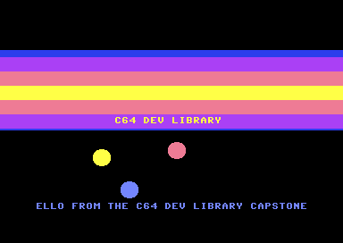

# Part VII — Capstone: Build a Demo

Welcome to the capstone. Across Parts I–IV you built up every piece you need to make a real C64 *intro*: precomputed tables and the BASIC-upstart launcher (Part I), the stable raster IRQ and screen control (Part II), hardware sprites (Part III), and a table-driven SID player (Part IV). This part puts all of it together into one self-contained, never-ending PAL intro — the kind of thing that would scroll a greeting before a cracked game in 1987.

When it runs you get: **scrolling horizontal colour bars**, a **centred, colour-cycling title** reading `C64 DEV LIBRARY`, a **bouncing trio of sprite balls** riding a sine path, a **fine-scrolling message** along the bottom, and a little **tune** playing on SID voice 1 — all of it driven from chained raster interrupts — a double-IRQ stabiliser that gives the bars a steady entry, plus a tiny third IRQ that scopes the scroll to the bottom row — with `main` doing nothing but `jmp *`.

Here is the finished frame, captured headless from VICE:



---

## Design & the frame budget

A C64 intro is a **soft real-time program**. There is exactly one thing that happens 50 times a second on a PAL machine — the video chip (VIC-II) draws a frame — and everything you see has to be produced in lock-step with that beam. We hang all of our work off a **single raster interrupt** and let the main program idle.

### How the parts share one frame

The VIC-II raster counter (`$D012`) ticks from line 0 to line 311 every PAL frame. We program the VIC to fire an IRQ two lines above the bar zone (`SETUPLINE = $3E`); that IRQ is **stage 1 of a double-IRQ stabiliser** (Part II 2.3) whose only job is to make the *real* handler enter on-cycle at `FIRSTBAR = $40`. The stabilised handler then runs *once per frame* and does, in order:

1. **Colour bars** — busy-wait the raster down the screen, slamming a new colour into `$D021`/`$D020` at each band boundary. This is the only part that must be cycle-aware, because it races the beam in real time — which is why it gets the stabilised entry.
2. **Logo colour cycle** — rewrite the 15 title characters' colour RAM entries with a rotating colour.
3. **Music** — call the player once (one "tick").
4. **Sprites** — recompute the three balls' X/Y from the sine table.
5. **Scroller bookkeeping** — advance the fine X-scroll counter and, every 8 pixels, hard-scroll the bottom row. The handler then arms a **second, tiny IRQ** at line `$F0`.
6. **Scroller IRQ** (line `$F0`, two lines above the scroller row) — write the fine X-scroll into `$D016` so it affects *only* the bottom row, then re-arm stage 1 for the next frame.

Steps 2–5 don't care exactly *where* the beam is; they just need to run once per frame, so we do them *after* the bar zone is finished. Step 1 races the beam; step 6 exists *because* `$D016` affects every row drawn after it — set it at the top of the frame and the logo (and everything else) wobbles along with the scroller (see *The scroller*).

```
 line $00  ┌─ top border
 line $3e  ├─ IRQ: stabiliser stage 1 ──► re-vector, cli, NOP stream
 line $40  ├─ IRQ: stage 2 (stable) ────► restore $D016, then run handler
 line $46  │   ╮
   ...     │   │  bar busy-wait zone: write $D021 at each
 line $a0  │   ╯  barRaster boundary  (step 1)
 line $a0  │   then: logo / music / sprites / scroll work (steps 2-5)
 line $f0  ├─ IRQ: scroller ────────────► $D016 = fine X (scroller row only)
 line $f2  │   row 24 (the scroller) is drawn with the new fine X
 line $137 └─ bottom border, frame ends, repeat
```

### The IRQ-driven structure

The classic "take over the machine" sequence (Part II 2.3):

- `SEI` to mask interrupts while we rewire vectors,
- point the KERNAL's RAM IRQ vector `$0314/$0315` at our handler,
- silence the CIA timer interrupts (`$DC0D`/`$DD0D`) so *only* the raster fires,
- enable the VIC raster IRQ (`$D01A` bit 0) and choose the line (`$D012`, plus the high bit in `$D011`),
- acknowledge any pending raster latch (`ASL $D019`),
- `CLI` and drop into `jmp *`.

One important banking note that bit us during development: we **leave the KERNAL ROM mapped in** (the default `$01 = $37`). The `$0314/$0315` vector is only consulted by the KERNAL's own IRQ dispatcher at `$FF48`. If you bank the KERNAL *out* (`$01 = $35`) the CPU jumps through the hardware vector at `$FFFE/$FFFF` instead, which now points at RAM — and your `$0314` handler never runs. Keeping the KERNAL in lets us also exit cleanly through `jmp $EA31` (the standard handler tail that restores registers and `RTI`s).

### The memory map

```
$0801  BASIC upstart stub  (10 SYS 2064)
$0810  init + IRQ handler + all subroutines + data tables
$0bb0  a handful of 1-byte state variables (barScroll, phases, etc.)
$0400  screen RAM   (title at row 12, scroller at row 24)
$07f8  sprite pointers (3 of the 8 used -> block $80)
$2000  the 64-byte "ball" sprite shape  (block $80 = $2000)
$d800  colour RAM
$d000  VIC-II registers
$d400  SID registers
```

Sprite data lives at `$2000` — well clear of our code at `$0810` and our screen at `$0400`. Sprite **block $80** is simply `$80 * $40 = $2000`, which is why the pointer byte we write into `$07f8` is `$80`.

---

## Building it

Each subsection below is an annotated excerpt. The one assembled, verified program follows in **The complete program** — these excerpts are taken verbatim from it.

### Stable raster + colourwash

A raster IRQ does not arrive on a fixed cycle: the CPU finishes its current instruction first, so the handler enters with a few cycles of frame-to-frame **jitter**, and every colour write inside it wobbles horizontally in sympathy — the bar boundaries shimmer. Part II 2.3 fixed this with the **double-IRQ stabiliser**, and the intro uses the same trick, adapted to the KERNAL-vector world:

- **Stage 1** (`irq`) fires **two lines early**, at `SETUPLINE = FIRSTBAR-2`. Two, not one: entry through the KERNAL dispatcher (`$FF48`'s register saves + the `$0314` indirection, ~36 cycles) plus re-vectoring costs more than one 63-cycle PAL line, so a one-line-early stage 1 would still be re-vectoring when the target line arrived. Stage 1 points `$0314` at stage 2, sets `$D012 = FIRSTBAR`, acknowledges, remembers the stack pointer, then `cli`s into a stream of 2-cycle `NOP`s.
- **Stage 2** (`irqStable`) interrupts that stream. Since every instruction under it is exactly 2 cycles, it enters with at most **1 cycle** of jitter — and because the first IRQ never finishes, stage 2 starts by collapsing the stack (`ldx saveSP / txs`) so its single `jmp $EA31` exit returns straight to `main`, discarding the nested frame (the 2.3 stack trick, KERNAL-flavoured).

- **Stage 2 then kills the last cycle.** One residual cycle would still let every write wobble 8 pixels — worse, the bar loop *samples* `$D012` on a 7-cycle grid (`cmp $d012 / bcs` is 7 cycles around), so a 1-cycle entry shift can alias into a whole extra poll iteration. Stage 2 therefore finishes with the `$D012`-straddle sync from 2.3: a small calibrated delay (`4 × NOP + bit $00` — tuned for the KERNAL entry overhead) lands a `lda $d012 / cmp $d012` pair across the line boundary, and `beq *+2` converts "did the line tick between the reads?" into the missing cycle. We *verified* the entry is cycle-exact by timestamping the handler with CIA-1 Timer A — writing `$7F` to `$DC0D` masks its interrupt but the timer keeps free-running, a perfect cycle ruler — and checking the frame-to-frame deltas were constant.

From the stabilised entry we walk a table of raster line boundaries (`barRaster`), busy-waiting for the beam to reach each one and writing the next colour from `colTab` into both the background (`$D021`) and the border (`$D020`) so the bands span the whole width.

```asm
irq:        // ---- Stage 1: fires at SETUPLINE, just re-vectors and waits ----
            lda #<irqStable
            sta $0314
            lda #>irqStable
            sta $0315
            lda #FIRSTBAR
            sta $d012            // stage 2 fires at the bar line itself
            asl $d019            // ack THIS raster latch
            tsx
            stx saveSP           // stage 2 will discard our stack frame
            cli                  // let stage 2 interrupt the NOP stream
            .fill 40, $ea        // 40x NOP (2 cycles each): stage 2 always
                                 //   lands in here, <= 1 cycle of jitter

irqStable:  // ---- Stage 2: stabilised — runs the whole frame's work ----
            ldx saveSP
            txs                  // drop the nested frame: one exit serves both

            // Kill the last cycle: timed $D012 read pair (Part II 2.3).
            // The pad is calibrated for the KERNAL IRQ entry overhead.
            .fill 4, $ea
            bit $00
            lda $d012            // reads just before the line boundary...
            cmp $d012            // ...and just after it
            beq *+2              // equalise the final cycle -> cycle-exact

            // Reset $D016 for the upper screen: 40 columns, no fine scroll,
            // hires text. The scroller IRQ below switches it back for row 24.
            lda #$c8
            sta $d016

            // -------- 1. COLOURWASH: horizontal colour bars --------
            ldx barScroll        // frame-animated start index into the table
            ldy #0               // band counter
barLoop:
            lda barRaster,y
            cmp #$ff
            beq barsDone
            // Wait until the raster has REACHED (>=) this band line. Using
            // bcs (not bne) is robust: a plain '==' compare can miss the exact
            // value if the beam advances between our reads and hang the IRQ.
!rl:        cmp $d012
            bcs !rl-             // loop while target >= current raster
            // The poll exits 3..9 cycles into the band line — inside the
            // left border, where a colour switch draws a visible step.
            // Burn ~51 cycles so the writes land in the HORIZONTAL BLANK
            // instead: the edge comes out razor straight, border included.
            pha; pla; pha; pla; pha; pla; pha; pla   // 4 x 7 cycles
            pha; pla; pha; pla; pha; pla; nop        // + 3 x 7 + 2 = 51
            lda colTab,x         // colour for this band
            sta $d021            // background
            sta $d020            // border (bars span the whole screen)
            inx
            txa
            and #$1f             // wrap the 32-entry colour table
            tax
            iny
            jmp barLoop
```

The single most important detail here — and a real bug we hit and fixed during the build — is the raster wait. The naive idiom `cmp $d012 / bne` waits for the beam to be at *exactly* that line. But between the `lda` of the target and the `cmp`, and across the several `sta`s per band, the beam keeps moving; it is easy to **miss the exact value**, in which case `bne` spins forever and the whole IRQ hangs (you get a black screen with nothing but the static logo). The fix is to wait for "beam has reached *or passed* the line" with `cmp $d012 / bcs` — `bcs` loops while `target >= raster`, so it can never miss, and if the line is already gone it falls straight through.

The second detail is the **`pha`/`pla` pad before each write**. The poll exits a few cycles into the band line — inside the left border — and `$D020`/`$D021` take effect the moment they are written, so an unpadded write paints the boundary row in two colours: old on the left, new from the write onward. A visible **step**, not a straight line. Burning ~51 cycles first pushes both writes into the **horizontal blank**, where no pixels are being drawn; the new colour then starts at the left edge of the next line and every edge is razor straight across the full width, border included. This only works because the entry is cycle-exact: the poll's exit cycle is the same every frame, so one fixed pad serves every band. `barsDone` hides its black restore the same way (sync to the line, pad, write), or the wash's *bottom* edge would step too.

One placement rule makes the pad reliable: **no write-line may be a badline**. The write happens on `boundary+1`, and on a badline the VIC steals ~40 cycles mid-pad, displacing the write deep into the visible next line. Badlines fall on raster lines ≡ `YSCROLL` (= 3) mod 8, so `barRaster` spaces the boundaries **8 lines apart at residue 6** — every write-line is residue 7, permanently clear. (Our first table used 6-line spacing; every fourth boundary stepped, in a neat mod-8 pattern that named the culprit instantly.)

Animation is free: `barScroll` is incremented (mod 32) every 2nd frame — gated by a `barDelay` counter exactly like the logo colours — and used as the starting index into `colTab`, so the whole colour ramp rolls vertically at a calm 25 steps per second. Note the table contains **no black**: a black band melts into the black backdrop, so as the ramp rolls, the wash's top edge would appear to jump up and down by a band as the black pair passed through — easily mistaken for raster jitter even when the timing is perfect.

### The logo

`drawLogo` (called once at init) pokes the 15 screen codes of `C64 DEV LIBRARY` into the middle of row 12, centred by writing at column `(40-15)/2 ≈ 12`. The text is stored as **screen codes**, not PETSCII — e.g. `C` is `$03`, `6` is `$36`, space is `$20` — and `$ff` terminates the string.

```asm
            // -------- 2. LOGO colour cycle --------
            inc logoColDelay
            lda logoColDelay
            and #$03             // slow it down (every 4th frame)
            bne logoSkip
            inc logoCol
logoSkip:
            ldx #0
            lda logoCol
            and #$0f
            tax
            ldy #0
!cl:        lda logoColors,x     // bright cycling colour
            sta COLRAM + TITLEROW*40 + 12, y   // colour the 15 title chars
            iny
            cpy #15
            bne !cl-
```

The characters never change once drawn; only their **colour RAM** is rewritten each frame, stepping through a small `logoColors` table. We gate the advance with `logoColDelay & $03` so the colour changes every 4th frame rather than blindingly fast.

### The music player

A minimal table-driven SID player (Part IV 4.6). `initMusic` sets the global volume to max and programs voice 1's envelope once; `playMusic` is called every frame and steps a note table every ~8 frames, retriggering the gate on each new note.

```asm
initMusic:
            lda #$0f
            sta $d418            // master volume = max
            lda #$09
            sta $d405            // attack/decay
            lda #$00
            sta $d406            // sustain/release
            ...

playMusic:
            dec musicTimer
            bpl mDone            // only advance every ~8 frames
            lda #$08
            sta musicTimer
            ldx musicPos
            lda noteTab,x
            cmp #$ff
            bne mPlay
            ldx #0               // loop the tune
            stx musicPos
            lda noteTab
mPlay:
            tax                  // X = note index into freq table
            lda #$10             // triangle, gate OFF (retrigger)
            sta $d404
            lda freqLo,x
            sta $d400
            lda freqHi,x
            sta $d401
            lda #$11             // triangle waveform + gate ON
            sta $d404
            inc musicPos
mDone:
            rts
```

`noteTab` holds indices into two parallel frequency tables (`freqLo`/`freqHi`); `$ff` loops the tune. Each note we write `$10` (gate off) then `$11` (triangle + gate on) so the ADSR envelope retriggers — that "gate down then up" is what makes successive notes audible rather than one held tone.

Headless VICE produces no audio, so we verify the player by **reading SID registers back** after the program has been running (see *Running it*). The readback confirms `$D418=$0F`, `$D405=$09`, and the live `$D404=$11` (triangle + gate on).

### Sine sprites

Three sprites share two 256-entry sine tables built at assemble time with KickAssembler's `.fill` and `sin()`:

```asm
sineTab:
            .fill 256, 110 + 70*sin(toRadians(i*360/256))
sineTabY:
            .fill 256, 192 + 27*sin(toRadians(i*360/256))
```

Each line evaluates its expression 256 times with `i = 0..255`. The X table is centred on 110 with amplitude 70 — a full-width 40..180 sweep. The Y table is deliberately tighter: 165..219, a band **below the colour bars and above the scroller row**. That placement is load-bearing, not cosmetic: a displayed sprite steals cycles from the CPU via DMA on every line it covers, so a ball drifting across the stabiliser lines or a polled band boundary shoves the bar timing around in a way **no stabiliser can absorb** — we measured exactly that during the build (see *Bugs worth remembering*). Below `$A0` (bars end) and with `Y+21` clear of row 24's badline, the DMA never touches anything cycle-critical. `moveSprites` reads X at a per-sprite phase and Y at double-rate, so each ball traces a smooth bobbing path with the three offset from each other:

```asm
moveSprites:
            inc spritePhase
            ldx #0               // sprite index 0..2
msLoop:
            lda spritePhase
            clc
            adc sprXoff,x        // per-sprite X phase
            tay
            lda sineTab,y
            ldy sprXreg,x        // 0/2/4  -> $D000/$D002/$D004
            sta $d000,y          // sprite X

            lda spritePhase
            asl                  // double rate
            clc
            adc sprYoff,x        // per-sprite Y phase
            tay
            lda sineTabY,y       // 165..219: clear of all raced lines
            ldy sprYreg,x        // 1/3/5  -> $D001/$D003/$D005
            sta $d000,y          // sprite Y
            inx
            cpx #3
            bne msLoop
            rts
```

The `sprXreg`/`sprYreg` tables hold the VIC register *offsets* (0,2,4 and 1,3,5) so the same loop body services all three sprites by indexing `$d000,y`. All three sprites point at the same ball shape (`SPRPTR = $80`) but get distinct colours (yellow/light-red/light-blue) via `$D027`–`$D029`. We keep them under X=256, so `$D010` (the X high-bit register) stays clear.

### The scroller

The bottom text row (row 24) scrolls left smoothly using the VIC's **fine X-scroll** (`$D016` lower 3 bits) for the 0–7 pixel sub-steps, and a **hard scroll** — physically shifting the 40 characters of that row one cell left and pulling in the next message byte — every time the fine counter wraps from 0 back to 7.

Three hard-won rules shape this part (all three bit us — the original build had a striped, shimmering "multicolour" font and a scroller that slid back and forth, only crawling one character every 40 frames):

1. **Registers don't survive a `jsr` — reload them *after* the call.** Our first version did `ldx #7 / jsr hardScroll / stx scrollX`. But `hardScroll`'s copy loop counts X up to **39** and leaves it there, so `stx` stored 39, not 7, and `scrollX` counted 39→0 instead of 7→0. The hard scroll fired once per 40 frames instead of once per 8, while the displayed fine X (`scrollX & 7`) wrapped five times in between — so the text slid 8 pixels left, snapped 8 pixels back, four times over, before finally advancing one character. One misplaced instruction, and the scroll turns into a see-saw.
2. **Write `$D016` as a whole constant — never `ora` an unchecked value into it.** The same bug fed `$D016` through `lda $d016 / and #$f0 / ora scrollX`. With `scrollX` running up to 39 (`%100111`), the `ora` pushed garbage into bits 3–5: bit 4 is **multicolour text mode** — every character with colour RAM ≥ 8 (our light-blue scroller, half the logo's cycling colours) renders as 2-pixel-wide bit *pairs* coloured from `$D022`/`$D023`, white and red stripes through every glyph — plus bit 5 (RES) and a flapping bit 3 (CSEL). Worse, the `and #$f0` read-modify-write *preserved* every bit once set, so the corruption accumulated and never healed. Store an explicit, known value (here simply `scrollX`, a clean 0–7).
3. **`$D016` is global — confine it with a second IRQ.** Fine X-scroll shifts *every* text row drawn after the write. Set it once per frame at the top and the title row saw-tooths 8 pixels sideways every 8 frames along with the scroller. So the main IRQ parks `$D016` at `$C8` (40 columns, no scroll) for the upper screen, does the scroll *bookkeeping* (counter + hard scroll, far above row 24), and arms a second IRQ at line `$F0` — two lines above the scroller row's badline — which flips `$D016` to the fine-scroll value just in time for row 24 and re-arms the main IRQ:

```asm
doScroll:
            ldx scrollX
            dex
            bpl sx_ok
            jsr hardScroll       // !! clobbers X (its copy loop ends at 39)
            ldx #7               // so reset fine X to 7 AFTER the call
sx_ok:
            stx scrollX          // displayed by the scroller IRQ at line $F0
            rts

// The second raster IRQ: line $F0, just above the scroller row.
irq2:
            lda scrollX          // 0..7 fine X; bit 3 = 0 -> 38-column mode
            sta $d016            //   takes effect for row 24 only
            lda #<irq            // re-arm stage 1 for the next frame
            sta $0314
            lda #>irq
            sta $0315
            lda #SETUPLINE
            sta $d012
            asl $d019            // ack
            jmp $ea31

hardScroll:
            ldx #0
!hs:        lda SCREEN + SCROLLROW*40 + 1, x
            sta SCREEN + SCROLLROW*40, x      // shift row left by one cell
            inx
            cpx #39
            bne !hs-
            ldy scrollPos                     // pull in next message char
            lda message,y
            cmp #$ff
            bne !ok+
            ldy #0                            // loop the message
            lda message
!ok:        sta SCREEN + SCROLLROW*40 + 39
            iny
            sty scrollPos
            rts
```

Writing `scrollX` (0–7) straight into `$D016` also clears bit 3 (CSEL): bit 3 = 0 selects **38-column mode**, which narrows the visible window so characters slide in and out of view behind the border instead of popping at the screen edge. The hard scroll runs in the *main* IRQ around line `$A5` — shifting the row takes ~400 cycles (6+ raster lines), so doing it from the line-`$F0` handler would still be running while the beam fetches row 24, tearing the text. Line `$F0` is also chosen to be **badline-safe**: it isn't a badline itself (`$F0 & 7 = 0`, YSCROLL = 3) and sits above row 24's badline at line `$F3`, so the `$D016` write never lands mid-fetch. `message` is a screen-code string ending in `$ff` that loops forever.

---

## The complete program

This is the exact, verified intro. It assembles cleanly under KickAssembler v5.25, runs without jamming, and produces the screenshot described above (colour bands + the `C64 DEV LIBRARY` title + three sprite balls + the bottom scroller). Save it as `demo.asm`.

```asm
//============================================================================
// Part VII Capstone — "C64 DEV LIBRARY" intro  (PAL, KickAssembler v5.x)
//
// A classic single-part intro driven by chained raster IRQs — a double-IRQ
// stabiliser for the bars (Part II 2.3) plus a scroller IRQ at line $F0:
//   * scrolling horizontal colour bars (colourwash on $D021)
//   * a centred, colour-cycled title          ("C64 DEV LIBRARY")
//   * a tiny table-driven SID player          (one note table, voice 1)
//   * three hardware sprites on a sine path    (bouncing balls)
//   * a fine-X scroller along the bottom row   ($D016 + hard scroll,
//     scoped to row 24 by a second IRQ at line $F0)
//
// All per-frame work lives in IRQ #1. Main just sets things up and spins.
//============================================================================

            * = $0801 "Basic Upstart"
            // 10 SYS 2064  -> BASIC stub that runs our code at $0810
            .byte $0c,$08,$0a,$00,$9e,$32,$30,$36,$34,$00,$00,$00

//----------------------------------------------------------------------------
// Constants
//----------------------------------------------------------------------------
.const SCREEN   = $0400          // default screen RAM
.const COLRAM   = $d800          // colour RAM
.const SPRPTR   = $0400+$3f8     // sprite pointers (last 8 bytes of screen)

.const TITLEROW = 12             // logo on text row 12 (mid screen)
.const SCROLLROW= 24             // scroller on the bottom text row
.const FIRSTBAR = $40            // raster line where the colour bars start
.const SETUPLINE= FIRSTBAR - 2   // stabiliser stage 1 fires 2 lines earlier
.const SCROLLIRQ= $f0            // scroller IRQ: 2 lines above row 24's badline

//----------------------------------------------------------------------------
// Entry point — set everything up, then take over the IRQ
//----------------------------------------------------------------------------
            * = $0810 "Main"
init:
            sei                  // no interrupts while we re-wire the machine

            // We keep the KERNAL ROM mapped in (the default $01=$37) so the
            // CPU's hardware IRQ handler at $FF48 keeps reading our RAM vector
            // at $0314/$0315. (If you bank the KERNAL OUT with $01=$35 you must
            // instead point $FFFE/$FFFF at your handler — a later exercise.)

            jsr clearScreen      // blank screen, set colour RAM
            jsr drawLogo         // paint the centred title
            jsr initScroll       // prime the scroller text row
            jsr initSprites      // VIC sprite setup
            jsr initMusic        // SID voice/ADSR/volume

            // --- Install the raster IRQ (Part II 2.3) ---
            lda #<irq
            sta $0314
            lda #>irq
            sta $0315

            lda #$7f
            sta $dc0d            // disable CIA-1 timer IRQs
            sta $dd0d            // disable CIA-2 timer IRQs
            lda $dc0d            // ack any pending CIA IRQ
            lda $dd0d

            lda #$01
            sta $d01a            // enable VIC raster interrupt

            lda #SETUPLINE
            sta $d012            // first IRQ: stabiliser stage 1, 2 lines early
            lda $d011
            and #$7f             // clear raster high bit (raster < 256)
            sta $d011

            asl $d019            // ack any pending raster IRQ
            cli                  // interrupts on — the IRQ now drives the intro
main:
            jmp *                // everything happens in the IRQ from here

//============================================================================
// THE RASTER IRQ — double-IRQ stabiliser (Part II 2.3, KERNAL-vector style).
// Stage 1 fires at SETUPLINE (= FIRSTBAR-2: the KERNAL dispatch + re-vector
// cost more than one 63-cycle line, hence TWO lines early, not one), points
// the vector at stage 2 and cli's into a NOP stream. Stage 2 then enters
// with <= 1 cycle of jitter and does the whole frame's work.
//============================================================================
irq:        // ---- Stage 1: re-vector and wait ----
            lda #<irqStable
            sta $0314
            lda #>irqStable
            sta $0315
            lda #FIRSTBAR
            sta $d012            // stage 2 fires at the bar line itself
            asl $d019            // ack THIS raster latch
            tsx
            stx saveSP           // stage 2 will discard our stack frame
            cli                  // let stage 2 interrupt the NOP stream
            .fill 40, $ea        // 40x NOP: stage 2 always lands in here

irqStable:  // ---- Stage 2: stabilised — runs once per frame ----
            ldx saveSP
            txs                  // drop the nested frame: one exit serves both

            // Kill the last cycle: timed $D012 read pair (Part II 2.3).
            // The pad is calibrated for the KERNAL IRQ entry overhead.
            .fill 4, $ea
            bit $00
            lda $d012            // reads just before the line boundary...
            cmp $d012            // ...and just after it
            beq *+2              // equalise the final cycle -> cycle-exact

            // Reset $D016 for the upper screen: 40 columns, no fine scroll,
            // hires text. The scroller IRQ below switches it back for row 24.
            // (Always write $D016 as a whole constant — see doScroll/irq2.)
            lda #$c8
            sta $d016

            // -------- 1. COLOURWASH: horizontal colour bars --------
            // Walk a colour table and slam $D021 on successive raster bands.
            // 'barScroll' offsets the starting index each frame so bars roll.
            ldx barScroll        // frame-animated start index into the table
            ldy #0               // band counter
barLoop:
            // Wait until the raster reaches the next band boundary.
            lda barRaster,y
            cmp #$ff
            beq barsDone
            // Wait until the raster has REACHED (>=) this band line. Using
            // bcs (not bne) is robust: a plain '==' compare can miss the exact
            // value if the beam advances between our reads and hang the IRQ.
!rl:        cmp $d012
            bcs !rl-             // loop while target >= current raster
            // The poll exits 3..9 cycles into the band line — inside the
            // left border, where a colour switch draws a visible step.
            // Burn ~51 cycles so the writes land in the HORIZONTAL BLANK
            // instead: the edge comes out razor straight, border included.
            pha; pla; pha; pla; pha; pla; pha; pla   // 4 x 7 cycles
            pha; pla; pha; pla; pha; pla; nop        // + 3 x 7 + 2 = 51
            lda colTab,x         // colour for this band
            sta $d021            // background
            sta $d020            // border (bars span the whole screen)
            inx
            txa
            and #$1f             // wrap the 32-entry colour table
            tax
            iny
            jmp barLoop
barsDone:
            // Restore the black backdrop the same careful way: sync to the
            // next line, then hide the writes in the blank — otherwise the
            // BOTTOM edge of the wash gets a mid-line step too.
            lda $d012
!bw:        cmp $d012
            beq !bw-             // wait for the line counter to tick...
            pha; pla; pha; pla; pha; pla; pha; pla
            pha; pla; pha; pla; pha; pla; nop        // ...then the same pad
            lda #$00
            sta $d021
            sta $d020

            // Advance the colourwash one step every 2nd frame — a full-rate
            // roll at 50 Hz reads as flicker rather than motion.
            inc barDelay
            lda barDelay
            and #$01
            bne barHold
            inc barScroll
            lda barScroll
            and #$1f
            sta barScroll
barHold:

            // -------- 2. LOGO colour cycle --------
            // Re-colour the title characters from a rotating colour each frame.
            inc logoColDelay
            lda logoColDelay
            and #$03             // slow it down (every 4th frame)
            bne logoSkip
            inc logoCol
logoSkip:
            ldx #0
            lda logoCol
            and #$0f
            tax
            ldy #0
!cl:        lda logoColors,x     // bright cycling colour
            sta COLRAM + TITLEROW*40 + 12, y   // colour the 15 title chars
            iny
            cpy #15
            bne !cl-

            // -------- 3. MUSIC: step the note table once per frame --------
            jsr playMusic

            // -------- 4. SPRITES: move balls along the sine path --------
            jsr moveSprites

            // -------- 5. SCROLLER bookkeeping: counter + hard scroll ------
            jsr doScroll

            // -------- arm the scroller IRQ (line $F0, above row 24) -------
            lda #<irq2
            sta $0314
            lda #>irq2
            sta $0315
            lda #SCROLLIRQ
            sta $d012

            asl $d019            // ack the raster IRQ
            jmp $ea31            // KERNAL-style IRQ exit (restore regs, RTI)

//============================================================================
// SUBROUTINES
//============================================================================

//----------------------------------------------------------------------------
// clearScreen — fill screen with spaces, colour RAM with grey, set $D020/21
//----------------------------------------------------------------------------
clearScreen:
            lda #$00
            sta $d020
            sta $d021
            ldx #0
            lda #$20             // space
!sc:        sta SCREEN,      x
            sta SCREEN+$100, x
            sta SCREEN+$200, x
            sta SCREEN+$2e8, x
            inx
            bne !sc-
            ldx #0
            lda #$0b             // dark grey for colour RAM baseline
!cc:        sta COLRAM,      x
            sta COLRAM+$100, x
            sta COLRAM+$200, x
            sta COLRAM+$2e8, x
            inx
            bne !cc-
            rts

//----------------------------------------------------------------------------
// drawLogo — write the centred title into screen RAM at TITLEROW
//----------------------------------------------------------------------------
drawLogo:
            ldx #0
!dl:        lda titleText,x
            cmp #$ff
            beq !done+
            sta SCREEN + TITLEROW*40 + 12, x   // centred: (40-15)/2 ~= 12
            lda #$01                            // start white; cycled later
            sta COLRAM + TITLEROW*40 + 12, x
            inx
            jmp !dl-
!done:      rts

//----------------------------------------------------------------------------
// initScroll — copy the start of the message into the scroller row
//----------------------------------------------------------------------------
initScroll:
            ldx #0
!is:        lda #$20             // start with a blank row; doScroll fills it
            sta SCREEN + SCROLLROW*40, x
            lda #$0e             // light blue
            sta COLRAM + SCROLLROW*40, x
            inx
            cpx #40
            bne !is-
            rts

//----------------------------------------------------------------------------
// initSprites — three sprites as our "balls", multicolour off, expanded off
//----------------------------------------------------------------------------
initSprites:
            // Point sprites 0..2 at the ball shape at $2000 (block $80).
            lda #$80
            sta SPRPTR+0
            sta SPRPTR+1
            sta SPRPTR+2
            lda #$07
            sta $d015            // enable sprites 0,1,2
            lda #$00
            sta $d017            // no Y expand
            sta $d01d            // no X expand
            sta $d01c            // no multicolour (hi-res sprites)
            sta $d010            // X high bits clear (all X < 256)
            // Distinct ball colours.
            lda #$07
            sta $d027            // yellow
            lda #$0a
            sta $d028            // light red
            lda #$0e
            sta $d029            // light blue
            rts

//----------------------------------------------------------------------------
// moveSprites — three balls bouncing on the sine table (Part I tables)
//   Each sprite reads the sine table at its own phase; X advances linearly,
//   Y follows the sine -> classic bobbing motion.
//----------------------------------------------------------------------------
moveSprites:
            inc spritePhase      // global animation phase
            ldx #0               // sprite index 0..2
msLoop:
            // ---- X position: a sine sweep, phase-offset per sprite ----
            // index = spritePhase + sprXoff[x]  -> reuse sine for smooth bounce
            lda spritePhase
            clc
            adc sprXoff,x
            tay
            lda sineTab,y        // 40..180 range -> on-screen X
            ldy sprXreg,x        // register index 0/2/4
            sta $d000,y          // write sprite X

            // ---- Y position: sine indexed by (phase*2 + sprYoff[x]) ----
            lda spritePhase
            asl
            clc
            adc sprYoff,x
            tay
            lda sineTabY,y       // 165..219: below the bars, above the scroller
            ldy sprYreg,x        // register index 1/3/5
            sta $d000,y          // write sprite Y

            inx
            cpx #3
            bne msLoop
            rts

//----------------------------------------------------------------------------
// playMusic — minimal table-driven SID player (Part IV 4.6)
//   Sets volume + instrument once (initMusic), then steps a note table,
//   gating the voice on each new note.
//----------------------------------------------------------------------------
initMusic:
            lda #$0f
            sta $d418            // master volume = max
            // Voice 1 ADSR: a punchy lead.
            lda #$09
            sta $d405            // attack/decay
            lda #$00
            sta $d406            // sustain/release
            lda #$00
            sta musicTimer
            sta musicPos
            rts

playMusic:
            dec musicTimer
            bpl mDone            // only advance every musicSpeed frames
            lda #$08             // ~8 frames per note
            sta musicTimer

            ldx musicPos
            lda noteTab,x
            cmp #$ff
            bne mPlay
            ldx #0               // loop the tune
            stx musicPos
            lda noteTab
mPlay:
            tax                  // X = note index into freq table
            // gate off briefly so each note retriggers
            lda #$10             // triangle, gate off
            sta $d404
            lda freqLo,x
            sta $d400
            lda freqHi,x
            sta $d401
            lda #$11             // triangle waveform + gate ON
            sta $d404
            inc musicPos
mDone:
            rts

//----------------------------------------------------------------------------
// doScroll — advance the fine-X counter, hard-scroll every 8 pixels
//   The $D016 write itself happens in irq2 so it hits ONLY the scroller row.
//   38-column mode hides the edges so characters appear/disappear cleanly.
//----------------------------------------------------------------------------
doScroll:
            ldx scrollX
            dex
            bpl sx_ok
            // wrapped past 0: one hard scroll left, then reset fine X to 7.
            // ORDER MATTERS: hardScroll's copy loop leaves X = 39, so the
            // ldx #7 must come AFTER the jsr (see Bugs worth remembering).
            jsr hardScroll
            ldx #7
sx_ok:
            stx scrollX          // displayed by irq2 at line SCROLLIRQ
            rts

//----------------------------------------------------------------------------
// irq2 — the scroller IRQ at line SCROLLIRQ ($F0), just above row 24.
//   Writes $D016 as a whole constant: fine X in bits 0-2, bit 3 (CSEL) = 0
//   for 38-column mode, bit 4 (multicolour) = 0 for a clean hires font.
//   NEVER ora an unchecked value into $D016: an oversized scrollX once set
//   bits 3-5 (multicolour mode!) here, and a read-modify-write preserved
//   the damage forever. Real bug in this demo's first build — write whole,
//   known constants only.
//----------------------------------------------------------------------------
irq2:
            lda scrollX          // 0..7 fine X, 38-col, hires
            sta $d016            //   takes effect for row 24 only
            // re-arm stage 1 of the stabiliser for the next frame
            lda #<irq
            sta $0314
            lda #>irq
            sta $0315
            lda #SETUPLINE
            sta $d012
            asl $d019            // ack
            jmp $ea31

// hardScroll — shift the visible row one char to the left, pull in next char
hardScroll:
            ldx #0
!hs:        lda SCREEN + SCROLLROW*40 + 1, x
            sta SCREEN + SCROLLROW*40, x
            inx
            cpx #39
            bne !hs-
            // fetch next message char into the rightmost column
            ldy scrollPos
            lda message,y
            cmp #$ff
            bne !ok+
            ldy #0               // loop the message
            lda message
!ok:        sta SCREEN + SCROLLROW*40 + 39
            iny
            sty scrollPos
            rts

//============================================================================
// DATA
//============================================================================

// ---- Title text (screen codes). $ff terminates. "C64 DEV LIBRARY" ----
titleText:
            .byte $03,$36,$34,$20,$04,$05,$16,$20
            .byte $0c,$09,$02,$12,$01,$12,$19,$ff   // C64 DEV LIBRARY

// ---- Scroller message (screen codes); $ff loops ----
message:
            // "HELLO FROM THE C64 DEV LIBRARY CAPSTONE ... "
            .byte $08,$05,$0c,$0c,$0f,$20            // HELLO
            .byte $06,$12,$0f,$0d,$20                // FROM
            .byte $14,$08,$05,$20                    // THE
            .byte $03,$36,$34,$20                    // C64
            .byte $04,$05,$16,$20                    // DEV
            .byte $0c,$09,$02,$12,$01,$12,$19,$20    // LIBRARY
            .byte $03,$01,$10,$13,$14,$0f,$0e,$05,$20 // CAPSTONE
            .byte $2e,$2e,$2e,$20,$20,$20,$20,$20    // ...
            .byte $ff

// ---- Colourwash table (32 entries) — a smooth-ish ramp of C64 colours.
//      No black entries: a black band melts into the backdrop, so the
//      wash's top edge would visibly jump as the ramp rolls through it. ----
colTab:
            .byte $06,$06,$0e,$0e,$03,$03,$0d,$0d
            .byte $01,$01,$0d,$0d,$03,$03,$0e,$0e
            .byte $06,$06,$04,$04,$0a,$0a,$07,$07
            .byte $0a,$0a,$04,$04,$06,$06,$0b,$0b

// ---- Raster band boundaries for the bars; $ff ends the band loop ----
// One entry every 8 raster lines, so every boundary shares the same
// mod-8 residue (6): the write happens on boundary+1, and residue 7 is
// never a badline (YSCROLL=3 -> badlines are residue 3). With 6-line
// spacing every 4th boundary's write-line WAS a badline: the VIC stole
// ~40 cycles mid-pad and shoved the write into the visible line below.
barRaster:
            .byte $46,$4e,$56,$5e,$66,$6e
            .byte $76,$7e,$86,$8e,$96,$9e
            .byte $ff

// ---- Logo cycling colours (bright) ----
logoColors:
            .byte $01,$07,$0d,$0e,$03,$05,$0a,$0f
            .byte $01,$07,$0d,$0e,$03,$05,$0a,$0f

// ---- Sine tables (256 entries each). X sweeps the full screen width.
//      Y is confined to 165..219: BELOW the colour bars and ABOVE the
//      scroller row, so sprite DMA never steals cycles on a raced line. ----
sineTab:
            .fill 256, 110 + 70*sin(toRadians(i*360/256))
sineTabY:
            .fill 256, 192 + 27*sin(toRadians(i*360/256))

// ---- Sprite per-index data ----
// X register offsets so balls spread out; XYreg map register indices.
sprXoff:    .byte $30,$70,$b0          // base X spread
sprYoff:    .byte $00,$55,$aa          // sine phase offsets
sprXreg:    .byte $00,$02,$04          // $D000,$D002,$D004 (X regs)
sprYreg:    .byte $01,$03,$05          // $D001,$D003,$D005 (Y regs)

// ---- Music: note indices into freq tables; $ff loops. (C-major-ish run) ----
noteTab:
            .byte $00,$02,$04,$05,$07,$05,$04,$02
            .byte $00,$04,$07,$04,$00,$02,$04,$07
            .byte $ff
// 8 note frequencies (PAL), index 0..7  (C D E F G A B C5 region)
freqLo:     .byte $25,$96,$1d,$8f,$2b,$11,$ee,$1d
freqHi:     .byte $11,$13,$16,$17,$1b,$1e,$21,$23

//----------------------------------------------------------------------------
// Zero-page-ish state (placed in RAM, not ZP — fine for our purposes)
//----------------------------------------------------------------------------
barScroll:     .byte 0
barDelay:      .byte 0
logoCol:       .byte 0
logoColDelay:  .byte 0
spritePhase:   .byte 0
musicTimer:    .byte 0
musicPos:      .byte 0
scrollX:       .byte 7
saveSP:        .byte 0
scrollPos:     .byte 0

//----------------------------------------------------------------------------
// Sprite shape — a filled "ball" (24x21). Block $80 => $2000.
//----------------------------------------------------------------------------
            * = $2000 "Sprite ball"
ballSprite:
            .byte $00,$7e,$00
            .byte $03,$ff,$c0
            .byte $07,$ff,$e0
            .byte $0f,$ff,$f0
            .byte $1f,$ff,$f8
            .byte $1f,$ff,$f8
            .byte $3f,$ff,$fc
            .byte $3f,$ff,$fc
            .byte $3f,$ff,$fc
            .byte $3f,$ff,$fc
            .byte $3f,$ff,$fc
            .byte $3f,$ff,$fc
            .byte $3f,$ff,$fc
            .byte $1f,$ff,$f8
            .byte $1f,$ff,$f8
            .byte $0f,$ff,$f0
            .byte $07,$ff,$e0
            .byte $03,$ff,$c0
            .byte $00,$7e,$00
            .byte $00,$00,$00
            .byte $00,$00,$00
            .byte $00
```

---

## Running it / extending it

**Assemble:**

```
tools/kickass demo.asm -o /tmp/out.prg
```

**Run it headless and grab a screenshot** (the intro runs forever, so we cap the cycle count):

```
python3 tools/vice_run.py run demo.asm --screenshot /tmp/shot.png
```

The JSON line reports `"jam": false`, and `/tmp/shot.png` shows the colour bands, the centred `C64 DEV LIBRARY` title, the three sprite balls, and the bottom scroller. On a real machine (or VICE with a display) just load the `.prg` and `RUN`.

**Verify the music**, which is silent under headless VICE, by reading the SID registers back after it has settled:

```
python3 tools/vice_run.py check demo.asm --port 6595 \
    --assert '$d418=$0f' --assert '$d404=$11' --assert '$d405=$09'
```

All three pass: `$D418=$0F` (volume), `$D404=$11` (voice 1 triangle + gate on, i.e. a note is actively playing), `$D405=$09` (attack/decay). (Note the assert parser treats a bare `11` as *decimal*; always write SID values as `$11` so they're read as hex.)

### Bugs worth remembering

Five issues bit us while building this, all instructive:

1. **The raster wait must use `bcs`, not `bne`.** Waiting for an *exact* `$D012` value can miss and hang the entire IRQ — a black screen with only the static logo. Waiting for "beam has reached or passed the line" is robust.
2. **Don't bank out the KERNAL if you use the `$0314` vector.** The `$0314/$0315` vector is only honoured by the KERNAL's IRQ dispatcher; with the KERNAL banked out the CPU uses `$FFFE/$FFFF` and your handler never runs. We left `$01` at its default `$37`.
3. **A `jsr` clobbered the register we had just loaded.** `ldx #7 / jsr hardScroll / stx scrollX` stored hardScroll's leftover loop counter (39) instead of 7, so `scrollX` counted 39→0: the hard scroll fired every 40 frames instead of every 8, and the scroller see-sawed instead of gliding. Diagnosed by watching `scrollX` frame-by-frame through the VICE binary monitor — the register-level truth (`…9, 8, 7…1, 0, 39!`) named the culprit instantly. Reload constants *after* a call, or make subroutines save what they touch.
4. **`ora`-ing an unchecked value into `$D016` corrupted the mode bits.** The oversized `scrollX` then flowed into `lda $d016 / and #$f0 / ora scrollX`: values 8–39 set bits 3–5 — bit 4 is **multicolour text mode**, hence the striped, shimmering "weird font" (characters with colour RAM ≥ 8 render as fat bit-pairs coloured from `$D022`/`$D023`) — and the read-modify-write preserved every corrupted bit forever after. Write `$D016` as a whole, known constant. The split-IRQ rewrite also keeps the fine scroll scoped to row 24, so the title no longer wobbles in sympathy.
5. **Sprite DMA re-introduced the jitter the stabiliser had just removed.** With a cycle-exact entry, the bar boundaries *still* wobbled — but only on lines a bouncing ball happened to cross that frame: a displayed sprite steals bus cycles on every raster line it covers, shifting the band poll mid-race. No NOP stream or `$D012` sync can absorb DMA stalls. Diagnosed by timestamping the handler with the free-running CIA-1 Timer A (masking `$DC0D` stops the *interrupt*, not the counter — it makes a perfect cycle ruler) and by comparing band-edge pixels across independent emulator boots. The fix: give Y its own sine table whose range (165–219) keeps the balls out of every cycle-critical region. Stable raster code is a *scheduling* problem — you place not just your writes but everything that steals the bus.

### Where to take it next

- **More split IRQs:** we already run two (bars + scroller); add more — e.g. one per effect — so each part gets a tighter cycle budget and you can place colour splits anywhere.
- **Sprite multiplexing:** reuse the 8 hardware sprites multiple times per frame to show many more balls.
- **A real tune:** swap the toy `noteTab` player for a SID file exported from GoatTracker, calling its `play` entry once per frame from the IRQ.
- **A logo from a custom charset:** point the VIC's character base at a redefined charset and build a multi-colour pixel logo instead of plain text.
- **Race inside the window:** the entry is now cycle-exact, so you can attack effects that change registers mid-line — FLI, opening the side borders, per-line `$D016` wiggles. Budget for badlines and sprite DMA explicitly (see bug #5).
