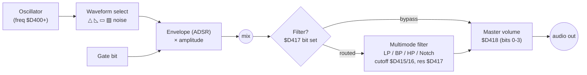

# The SID Sound Chip (6581 / 8580)

The **MOS 6581** (and later **8580**) Sound Interface Device is a 3-voice analog
synthesizer on a chip — the reason C64 music is a genre of its own. It's
**29 registers at `$D400–$D41C`** (write-only for the synth params, two read-only
at the top). You program it by setting oscillator frequency, waveform, and an
ADSR envelope per voice, optionally routing voices through one shared
multimode filter.

## Starter notes

### Signal chain per voice



There are **3 of these voices**, each occupying 7 registers:

| Offset (per voice) | Register |
|--------------------|----------|
| `+0/+1` | Frequency lo/hi (16-bit) |
| `+2/+3` | Pulse width lo/hi (12-bit; for pulse waveform) |
| `+4` | **Control**: gate(0), sync(1), ring-mod(2), test(3), then waveform bits triangle(4)/sawtooth(5)/pulse(6)/noise(7) |
| `+5` | Attack (hi nybble) / Decay (lo nybble) |
| `+6` | Sustain (hi nybble) / Release (lo nybble) |

Voice 1 = `$D400–$D406`, voice 2 = `$D407–$D40D`, voice 3 = `$D40E–$D414`.

### Frequency

`Fout = Fn × Fclk / 16777216` Hz — at ~1 MHz that's **`Fn × 0.0596 Hz`**. In
practice you use a precomputed note→freq table (one per octave/semitone). The
16-bit value goes in `+0/+1`.

### Waveforms

Four per oscillator — **triangle, sawtooth, variable pulse, noise** — selectable
*and combinable* (combined waveforms produce the chip's characteristic gritty
timbres, and behave differently between 6581 and 8580). Plus three modifiers:

- **Pulse width** (`+2/+3`) shapes the pulse duty cycle; sweeping it is the
  classic PWM "fat" lead.
- **Ring modulation** (control bit 2) multiplies this voice's triangle with the
  previous voice — metallic/bell tones.
- **Hard sync** (control bit 1) syncs this oscillator to the previous — tearing
  sync leads.

### ADSR envelope

Each voice has an envelope generator: **16 attack rates** (2 ms–8 s), **16
decay/release rates** (6 ms–24 s), and **16 linear sustain levels** (`0` = silent,
`$F` = peak). Setting the **gate** bit (control bit 0) starts attack→decay→sustain;
clearing it starts release.

```
 amp
  ^        /\
  |       /  \____________        <- sustain level
  |      /                \
  |     /                  \
  +----+----+----+---------+----> time
     attack decay  sustain  release
   (gate=1)              (gate=0)
```

> **Gotcha:** the 6581's envelope has the infamous "ADSR bug" / delay quirks;
> drivers handle it with a hard-restart (a 2-frame gate-off + test-bit reset
> before each note). This is why you use a driver, not raw pokes, for music.

### The filter

One **multimode filter** shared by all voices: **Low-pass, Band-pass, High-pass,
Notch** outputs, cutoff ~30 Hz–12 kHz (11-bit cutoff across `$D415` lo / `$D416`
hi), **16 resonance settings** in `$D417` (which also routes each voice + external
in through the filter). `$D418` sets the **output filter mode + master volume**
(bits 0–3); its top bits also pick LP/BP/HP. The filter is the most
chip-to-chip-variable part of SID — see below.

### Digi / sample playback

Writing the volume nybble of `$D418` rapidly produces a crude DAC — the basis of
**4-bit digi samples** (and the "volume register" digi trick). More advanced
**pulse-width / combined-waveform digi** methods get cleaner playback. CPU-heavy
(you feed samples in a tight raster-timed loop), so games use it sparingly.

### 6581 vs 8580

Same register API; **different analog behavior**:

- **Filter:** the 6581's filter cutoff curve varies *between individual chips*
  and opens differently; the 8580's was re-engineered to behave consistently and
  "ideally." Music tuned on one can sound wrong on the other.
- **Combined waveforms** are stronger/louder on the 6581; quieter on the 8580.
- The **8580 needs the test bit / a tiny DC offset trick** to do volume-register
  digis that the 6581 does for free.
- General feel: **6581 = warmer/dirtier**, **8580 = cleaner/more consistent**.

Pick a target chip (or test on both) and configure your tracker/emulator's SID
model accordingly.

## Annotated resources

### Primary

- **[MOS 6581 SID datasheet (PDF)](http://archive.6502.org/datasheets/mos_6581_sid.pdf)**
  *(primary)*. The chip manual: 3 voices, 4 waveforms, the `Fout` formula, ADSR
  rate tables, filter spec. Start here for register-level truth.
- **[C64-Wiki: SID](https://www.c64-wiki.com/wiki/SID)** and
  **[register map](https://www.c64-wiki.com/wiki/SID-register)** *(quick lookup)*.
- **[Wikipedia: MOS Technology 6581](https://en.wikipedia.org/wiki/MOS_Technology_6581)**
  *(secondary overview)*. Good on 6581/8580 history and differences.

### Programming & drivers

- **[Codebase64 — sound / SID section](https://codebase64.c64.org/doku.php?id=base:sound)**
  *(community)*. Playroutines, the ADSR hard-restart, digi techniques, SFX
  routines for games.
- **[reSID (Wikipedia)](https://en.wikipedia.org/wiki/ReSID)** *(reference)*. The
  emulation library inside VICE/GoatTracker; explains why emulated SID can match
  6581/8580 so closely.

### Trackers & tools

- **[GoatTracker 2](https://sourceforge.net/projects/goattracker2/)** *(cross-platform tracker)*.
  The most popular modern SID tracker (Win/Mac/Linux). Emulates 6581 **and** 8580
  via reSID; exports `.SID` and **assembly source** to drop into your game/demo.
  By Lasse "Cadaver" Oorni.
- **[SID-Wizard](https://csdb.dk/release/?id=125146)** *(native C64 tracker)*.
  Runs on the real machine; configurable engine footprint; exports `.SID`. Great
  if you want to compose on hardware.
- **[SID Factory II](https://blog.chordian.net/sf2/)** *(modern cross-platform)*.
  A newer editor (Win/Mac) with a driver-based workflow; increasingly popular.
- **[Comparison of C64 music editors (Chordian)](https://blog.chordian.net/2018/02/24/comparison-of-c64-music-editors/)**
  *(overview)*. Helps you pick between GoatTracker / SID-Wizard / SID Factory /
  CheeseCutter etc.
- **[High Voltage SID Collection (HVSC)](https://www.hvsc.c64.org/)** *(archive)*.
  ~50,000 SID tunes — the reference corpus for studying drivers and styles, and
  for testing your player.
