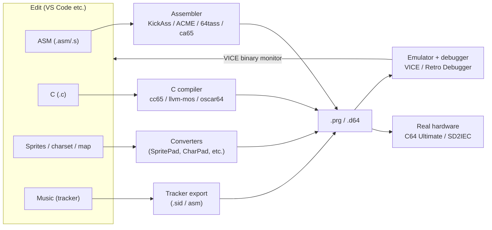

# Modern Cross-Development Toolchain

Nobody develops *on* the C64 anymore (except by choice). The modern workflow:
**write code on your PC → cross-assemble/compile → run in an emulator with a
source-level debugger → deploy to real hardware** (often a C64 Ultimate or
SD2IEC). This file maps the tools.

## Cross-assemblers

| Tool | Notes |
|------|-------|
| **[KickAssembler](https://theweb.dk/KickAssembler/Main.html)** | *(primary, demoscene favorite)*. Java-based; a full scripting language inside the assembler (loops, functions, math, importing & converting graphics/SID at assemble time). Generates VICE debug symbols. The de-facto standard for modern C64 demos/games; best VS Code support. |
| **[ACME](https://sourceforge.net/projects/acme-crossass/)** | *(primary)*. Lightweight, fast, cross-platform, used heavily on Codebase64 (most example code is ACME or KickAss). Great first assembler. |
| **[64tass](https://sourceforge.net/projects/tass64/)** | *(primary)*. Turbo-Assembler-compatible syntax, very capable macros/segments; popular for larger projects. |
| **[ca65 (part of cc65)](https://cc65.github.io/doc/ca65.html)** | *(primary)*. The assembler in the cc65 suite; powerful macro/linker model (`ld65`), good if you mix C and asm. |

If you're starting fresh and want the demoscene mainstream: **KickAssembler**.
If you want minimal and match Codebase64 examples: **ACME**.

## C compilers

| Tool | Notes |
|------|-------|
| **[cc65](https://cc65.github.io/)** | *(primary, mature)*. The classic 6502 C compiler + assembler + linker + C library, with C64 targets and headers. Decent code, huge ecosystem, very stable. The safe default for C. |
| **[llvm-mos](https://github.com/llvm-mos/llvm-mos-sdk)** | *(primary, modern)*. A full LLVM backend for 6502; modern C/C++ (even some C++ features), aggressive optimization, far better codegen than cc65 in many cases. SDK has C64 support. |
| **[oscar64](https://github.com/drmortalwombat/oscar64)** | *(primary, impressive)*. A C compiler purpose-built for C64/6502 with surprisingly tight output and even floating point; actively developed, popular for games where you want C ergonomics close to asm speed. |

C is viable for whole games now (especially llvm-mos/oscar64); time-critical
inner loops still get hand-written asm.

## Emulators & debuggers

| Tool | Notes |
|------|-------|
| **[VICE](https://vice-emu.sourceforge.io/)** | *(primary, the standard)*. Accurate C64 (and other CBM) emulator. Cycle-accurate VIC-II/SID (reSID), built-in **monitor/debugger** and a **binary monitor** remote protocol that IDEs hook for source-level debugging. What you test against by default. |
| **[Retro Debugger](https://github.com/slajerek/RetroDebugger)** | *(specialized)*. A visual debugger (wraps VICE) showing live VIC raster position, memory, sprites, breakpoints on the screen — invaluable for *timing* demo effects. |
| **[ICU64 / C64 Debugger (samar)](https://csdb.dk/release/?id=156016)** | *(specialized)*. Real-time visual memory/VIC inspection; great for understanding what an effect touches. |

VICE's `x64sc` (the "single-cycle" accurate build) is the one to use for demo
timing work; `x64` is faster but less precise.

## Graphics & charset tools

- **SpritePad / CharPad / Multipaint** (by Subchrist Software / community) —
  editors for sprites, custom charsets, and char-based maps; export raw data or
  assembler includes. **[Spritemate](https://www.spritemate.com/)** is a
  browser-based sprite editor (no install).
- **[PETSCII editors (e.g. petmate)](https://nurpax.github.io/petmate/)** — for
  PETSCII-art screens and intros.

## Music tools

See [sid.md](sid.md) for detail: **GoatTracker 2** (cross-platform, exports asm),
**SID-Wizard** (native), **SID Factory II** (modern). All integrate by exporting a
player + data you `.import`/`incbin` into your build.

## A typical build workflow

1. Write `main.asm` in VS Code (KickAssembler extension for syntax + build tasks).
2. Build: `java -jar KickAss.jar main.asm -o game.prg` → also emits a `.vs` symbol
   file.
3. Auto-launch VICE with the symbols for source-level breakpoints, or load the
   `.prg`/`.d64` on a C64 Ultimate over the network (see
   [c64-ultimate.md](c64-ultimate.md)) to test on real silicon.
4. Iterate. Convert graphics/music as part of the assemble step (KickAss can
   import PNG/SID at build time) so there's one command.

A minimal `Makefile`/VS Code task that does *assemble → launch x64sc with
symbols* is the core of a tight edit-run loop; see the starter guide in
[`00-getting-started.md`](00-getting-started.md).

### Live reload via VICE's binary monitor

VICE's **binary monitor** (`x64sc -binarymonitor`, TCP port 6502) lets an external
tool drive a *running* emulator — autostart a fresh build (live reload, resets the
machine) or write memory in place (state-preserving **asset hot-swap**: drop a new
charset/sprite/level into the running program). The repo's `tools/vice_reload.py`
implements this and `basic/watch.sh` (`make watch`) wires it into a save-triggered
loop. The same mechanism works for assembly builds. It's the nearest C64 equivalent
to web HMR — full code-HMR with state preservation isn't possible (no module
system; a program is one blob at a fixed load address).

## Annotated resources

- **[KickAssembler manual](https://theweb.dk/KickAssembler/Main.html)** *(primary)* — the
  reference + scripting guide; the "Getting Started" and "Import" chapters matter most.
- **[cc65 documentation](https://cc65.github.io/)** *(primary)* — compiler, library,
  and C64-specific notes.
- **[llvm-mos-sdk](https://github.com/llvm-mos/llvm-mos-sdk)** /
  **[oscar64](https://github.com/drmortalwombat/oscar64)** *(primary)* — READMEs cover
  install, C64 target, and examples.
- **[VICE manual](https://vice-emu.sourceforge.io/vice_toc.html)** *(primary)* — the
  monitor commands and binary-monitor protocol used by IDE debuggers.
- **[Codebase64 — tools & cross-development](https://codebase64.c64.org/doku.php?id=base:crossdev)**
  *(community)* — setup recipes and converter scripts.
