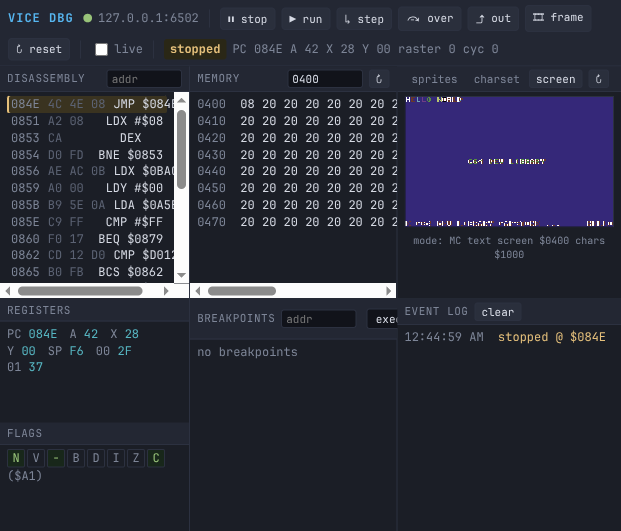

# VICE Web Debugger

A browser-based GUI debugger for the [VICE](https://vice-emu.sourceforge.io/)
C64 emulator. A small Node.js + TypeScript server relays JSON over a WebSocket to
VICE's **binary monitor** (the binary remote-monitor protocol on TCP), so you get
a live, scriptable debugger. Zero runtime dependencies — Node built-ins only —
and no build step: the server runs straight from TypeScript via Node's
type-stripping (Node ≥ 22.6).

```
browser  ⇄  WebSocket (JSON)  ⇄  server.ts (node)  ⇄  TCP (binary)  ⇄  x64sc -binarymonitor
```



## Features

- **Execution control** — run, stop, single-step, step-over, step-out,
  step-one-frame (breaks at the active IRQ handler), and soft reset.
- **Registers** — live PC / A / X / Y / SP / SP-stack / processor flags, plus
  zero-page `$00`/`$01`. Click any value to poke a new one.
- **Disassembly** — a full 6502/6510 disassembler in JS (all 256 opcodes incl.
  illegals). The current PC is highlighted; click a line to toggle an exec
  breakpoint; type an address to jump.
- **Memory** — hex + ASCII view; click a cell to poke a byte; jump to any address.
- **Breakpoints / watchpoints** — exec / load / store checkpoints with live hit
  events streamed back to the UI.
- **Live visual panels** — render straight from emulator memory:
  - **Sprites** — all 8, hi-res or multicolour, with per-sprite colours/enable.
  - **Charset** — the active character generator (RAM, or the embedded chargen
    ROM when the char base points at a ROM image window).
  - **Screen** — text (std / multicolour / ECM) and bitmap (hi-res / multicolour)
    modes, decoded from screen RAM, colour RAM and the char/bitmap base.
- **Event log** — stopped / resumed / checkpoint / JAM events as they happen.

## Running

1. Start VICE with the binary monitor enabled and load your program:

   ```sh
   x64sc -binarymonitor -binarymonitoraddress ip4://127.0.0.1:6502 -autostart yourprog.prg
   ```

   Headless (no X server) works too:

   ```sh
   xvfb-run -a x64sc -binarymonitor -binarymonitoraddress ip4://127.0.0.1:6502 -autostart yourprog.prg
   ```

2. Start the relay server (Node ≥ 22.6, no install needed):

   ```sh
   node tools/debugger/src/server.ts [http_port=8080] [vice_port=6502] [vice_host=127.0.0.1]
   # or, from this directory:  npm start
   ```

3. Open <http://localhost:8080/>.

Type-checking is optional and the only thing that needs `npm install`
(TypeScript + `@types/node`, both dev-only):

```sh
cd tools/debugger && npm install && npm run typecheck
```

VICE accepts a single binary-monitor connection at a time, so run one server per
emulator instance. If VICE is restarted, restart the server to reconnect.

## Files

| File | Purpose |
|------|---------|
| `src/server.ts` | HTTP + WebSocket server and the VICE binary-monitor bridge. |
| `package.json` / `tsconfig.json` | npm scripts and (optional) type-check config. |
| `web/index.html` | Panel layout. |
| `web/app.js` | Front end: WebSocket RPC, panels, visual renderers. |
| `web/disasm.js` | 6502/6510 disassembler (data table + linear decoder). |
| `web/charrom.js` | Embedded C64 chargen ROM, for ROM-window charset/screen views. |
| `web/style.css` | Dense IDE theme. |

## Notes / limitations

- The visual panels read live RAM via the monitor. For the standard character
  set (char base in a ROM image window) the VIC fetches the chargen ROM, which a
  RAM read can't see — the embedded `charrom.js` is substituted there and the
  panel notes "chargen ROM view".
- Sprite/screen rendering reflects the current VIC register state at the moment
  of the read; it is not a cycle-exact frame (no raster splits / mid-frame
  register changes).
